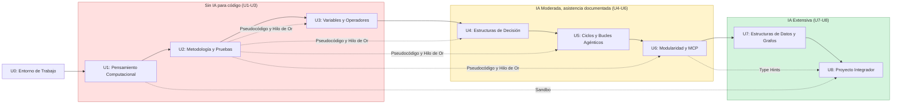

# Curso: Lógica de Programación y Desarrollo Agéntico con IA
## Especialización en Nanotecnología - UCEMICH

Este repositorio contiene los materiales de clase, lecciones en Markdown, Jupyter Notebooks interactivos, prácticas de laboratorio y scripts de automatización pedagógica para la asignatura.

---

## 🚀 Configuración del Entorno de Trabajo

El proyecto requiere el entorno conda `ia_logprog` configurado con dependencias de Python 3.11, testing con pytest, modelado de grafos y frameworks de desarrollo agéntico.

### 1. Crear / Actualizar el Entorno Conda
En tu terminal de línea de comandos (Bash, Zsh o PowerShell), ejecuta:
```bash
conda env update -f environment.yml
```

### 2. Activar el Entorno
```bash
conda activate ia_logprog
```

### 3. Registrar el Kernel en Jupyter
Para poder abrir y ejecutar los notebooks utilizando este entorno:
```bash
python -m ipykernel install --user --name=ia_logprog --display-name "Python 3.11 (ia_logprog)"
```

### 4. Instalar Node.js (requerido para diagramas Mermaid)

Los diagramas de flujo del curso se renderizan como imágenes SVG estáticas
(para verse igual en VS Code, GitHub y Google Colab), usando
`@mermaid-js/mermaid-cli` vía `npx`. Esto requiere Node.js instalado en el
sistema — no es un paquete de Python, no se instala vía conda/pip:

```bash
winget install OpenJS.NodeJS
```

O descárgalo desde [nodejs.org](https://nodejs.org). `convert_to_notebooks_smart.py`
verifica automáticamente si Node.js está disponible al iniciar y muestra
instrucciones si falta.

---

## 🛠️ Guía de Herramientas: Cuándo Usar Cada Una

| Herramienta | Cuándo usarla | Unidades |
| :--- | :--- | :--- |
| **IDLE** | Primer contacto con Python. Interfaz mínima, ideal para los primeros programas de una sola línea. | U0, primeras sesiones de U1 |
| **Visual Studio Code** | Desarrollo del curso completo: editor principal con terminal integrada y Git. | U1–U8 |
| **Google Colab** | Modalidad híbrida/online o para ejecutar notebooks sin instalar nada localmente. Cada notebook incluye badge "Open in Colab" y celda de instalación automática. | Todas (opcional/respaldo) |
| **Antigravity IDE** | Práctica estructurada del flujo de trabajo con asistentes de IA, a partir de la Unidad 4. | U4–U8 |

Detalle completo (instalación de Python en Windows, primer programa en IDLE, checklist de verificación) en [`UNIDAD_0_ENTORNO_Y_PRIMER_PROGRAMA.md`](lecciones/UNIDAD_0_ENTORNO_Y_PRIMER_PROGRAMA.md).

---

## 🐙 GitHub Education y Copilot

Todos los estudiantes tienen acceso gratuito a GitHub Copilot mediante GitHub Education:

1. Ir a [education.github.com/students](https://education.github.com/students) e iniciar sesión con una cuenta de GitHub.
2. Solicitar el "Student Developer Pack" verificando la inscripción a la UCEMICH.
3. Una vez aprobado, instalar la extensión de GitHub Copilot en Visual Studio Code.

Este acceso se activa **antes** de llegar a la Unidad 4, cuando la política de IA del curso habilita su uso (ver tabla de política de IA en `UNIDAD_0_ENTORNO_Y_PRIMER_PROGRAMA.md`, sección 0.5).

---

## 🤖 Sistema de Agentes Pedagógicos

El proyecto incluye 9 agentes en `src/multiagent_core/`, invocables desde terminal o importándolos en un script/notebook:

| Agente | Propósito | Uso típico desde terminal |
| :--- | :--- | :--- |
| `CodeAuditorAgent` | Audita estilo (PEP 8) y seguridad (OWASP, credenciales expuestas, `eval`/`exec`) del código de un estudiante. | `python -m src.multiagent_core.code_auditor_agent` |
| `FlowchartAgent` | Genera un diagrama de flujo Mermaid a partir del AST de una función Python. | `python -m src.multiagent_core.flowchart_agent` |
| `PseudocodeAgent` | Traduce entre pseudocódigo UCEMICH, diagramas Mermaid y esqueletos Python. | `python -m src.multiagent_core.pseudocode_agent` |
| `EvaluatorAgent` | Califica código de un estudiante contra la Rúbrica Genérica de Laboratorio (`RUBRICA_GENERAL.md`). | `python -m src.multiagent_core.evaluator_agent` |
| `OrchestratorAgent` | Coordina Auditor + Flowchart + Evaluator y produce un reporte pedagógico Markdown unificado. | `python -m src.multiagent_core.orchestrator_agent` |
| `TutorAgent` | Responde dudas del curso vía RAG semántico (ChromaDB) sobre los MDs de las unidades + Gemini, con debugger socrático y memoria episódica. | `python -m src.multiagent_core.tutor_agent` |
| `ContentAuditorAgent` | Audita el contenido pedagógico de los MDs de unidad en 5 dimensiones: LaTeX, ciclo Hilo de Oro, código de ejemplo, alineación curricular contra el programa oficial, e invariantes estructurales (consistencia de auto-evaluación y de la sección de prerequisitos, fences balanceados, celda de setup). | `python -m src.multiagent_core.content_auditor_agent` |
| `CurriculumMapAgent` | Sugiere candidatos de relación de concepto entre unidades (para aprobación humana) y renderiza el diagrama Mermaid de dependencias del curso a partir de relaciones ya aprobadas. | `python -m src.multiagent_core.curriculum_map_agent` |
| `NotebookCompilerAgent` | Convierte los MDs de las unidades en notebooks `.ipynb` (usado por `convert_to_notebooks_smart.py`). | `python convert_to_notebooks_smart.py` |

Ejemplo de uso programático (equivalente a lo que hace cada bloque `if __name__ == "__main__":` de los agentes):
```python
from pathlib import Path
from src.multiagent_core.orchestrator_agent import OrchestratorAgent

orchestrator = OrchestratorAgent()
reporte = orchestrator.generate_pedagogical_report(codigo_estudiante, unit_number=2)
print(reporte)
```

Suite de pruebas de los 9 agentes (`tests/`, 179 tests):
```bash
pytest tests/ -v --tb=short
```

---

## 🧠 TutorAgent: Sistema Propio de Tutoría RAG Multiagente

`TutorAgent` no es un wrapper delgado sobre una API de LLM — es un sistema de
recuperación aumentada (RAG) construido específicamente para este curso, con
varias decisiones de diseño no triviales:

- **Índice semántico propio, no búsqueda por palabra clave.** Cada unidad se
  parte por sección (`##`/`###`) y se indexa en ChromaDB con
  `paraphrase-multilingual-MiniLM-L12-v2` en vez del embedding por defecto
  de ChromaDB (`all-MiniLM-L6-v2`, entrenado casi exclusivamente en inglés)
  — el default daba resultados de RAG muy pobres en español para preguntas
  conceptuales del curso.
- **Cada respuesta cita su fuente exacta** (archivo + título de sección), no
  solo "según el curso" — el alumno puede verificar contra el material
  original en `lecciones/`.
- **Debugger socrático.** Si la pregunta incluye un traceback de Python
  (`ZeroDivisionError`, `IndexError`, `KeyError`), el agente no da la
  respuesta directa primero: hace una pregunta guía conectada a un ejemplo ya
  visto en el curso, antes de resolver — mismo espíritu pedagógico que la
  Política de IA progresiva de la Unidad 0.
- **Memoria episódica local.** Guarda las últimas 50 preguntas de cada
  alumno (`.tutor_memory.json`, por máquina) y las reutiliza como contexto
  si detecta una pregunta relacionada — sin depender de un servicio externo
  de persistencia.
- **Recuperación resiliente ante conflictos de índice.** Si el índice local
  fue construido con una versión anterior del embedding (p. ej. una sesión
  de Colab previa), el agente detecta el conflicto y reconstruye el índice
  automáticamente en vez de fallar.
- **Enriquecido con literatura científica real.** Además del contenido de las lecciones, el índice incluye el abstract público (vía la API gratuita de Crossref) de cada paper citado con DOI en el curso — el tutor puede fundamentar sus respuestas citando el estudio real detrás de una fórmula, no solo repetir el resumen pedagógico del `.md`. Deduplicado entre unidades: un DOI citado en más de un archivo se consulta e indexa una sola vez.

Es, en esencia, un sistema de tutoría multiagente propio (RAG + debugger
socrático + memoria episódica) construido para un curso de primer semestre —
no una integración genérica de chatbot. Código fuente completo y comentado
en `src/multiagent_core/tutor_agent.py`; su suite de tests
(`tests/test_tutor_agent.py`) documenta el comportamiento esperado de cada
pieza con casos reales, incluyendo la reproducción del problema de
embeddings en español antes del fix.

---

## 🧪 Auto-evaluación Ejecutable por Unidad

Las unidades 2, 3, 4, 5, 6 y 7 incluyen una o más celdas de auto-evaluación al final del notebook: el alumno las corre para recibir retroalimentación automática e inmediata sobre su entrega, calificada contra la Rúbrica Genérica del curso (`RUBRICA_GENERAL.md`), sin depender de revisión manual del profesor. Las unidades 5 y 7 tienen dos módulos de producción cada una, así que incluyen dos celdas de auto-evaluación independientes en vez de una sola.

- Reutiliza el `OrchestratorAgent`/`EvaluatorAgent` existentes — cero infraestructura nueva, mismo motor que evalúa entregas manualmente.
- Dos mecanismos según cómo cada unidad enseña pruebas: descubrimiento automático vía `globals()` (Unidad 2, funciones puras) o persistencia a disco vía `%%writefile` (Unidades 3, 4, 5, 6, 7 — módulos con dependencias de nivel de módulo, como constantes físicas o clases con estado).
- Feedback efímero de sesión: la calificación no se guarda ni se reporta automáticamente al profesor, es solo para que el alumno itere antes de entregar.

> 🎓 **Instrucciones para el alumno:** la explicación paso a paso de cómo usar la auto-evaluación en cada unidad está en `lecciones/UNIDAD_0_ENTORNO_Y_PRIMER_PROGRAMA.md`, sección **0.10**.

---

## 🗺️ Mapa del Curso: Dependencias entre Unidades

El orden del curso es estrictamente secuencial (U0→U8), pero dos capas de información quedaban solo en prosa dispersa: cuándo cambia el nivel de asistencia de IA permitido, y qué unidades reutilizan explícitamente un concepto ya introducido antes. `CurriculumMapAgent` hace ambas visibles.



- Cada unidad documenta sus propios prerequisitos en su sección `## 📚 Prerequisitos de esta unidad` — este diagrama es la vista consolidada, generada por `CurriculumMapAgent.render_dag()` a partir de esas secciones ya aprobadas.
- `CurriculumMapAgent.suggest_prerequisites()` es la heurística de sugerencia (un solo uso, nunca escribe a disco) que propuso los candidatos revisados manualmente antes de escribir las secciones — ver `python -m src.multiagent_core.curriculum_map_agent`.

> 🎓 **Para el alumno:** la vista pedagógica de este mismo mapa está en `lecciones/UNIDAD_0_ENTORNO_Y_PRIMER_PROGRAMA.md`, sección **0.11**.

---

## 🏗️ Estructura del Repositorio

- **`lecciones/`**: los 12 archivos Markdown fuente (9 `UNIDAD_*.md` + 3 `EXTRA_PYTHON_IA_NANOTECNOLOGIA_PARTE*.md`) — nunca se editan los notebooks a mano, cualquier cambio de contenido va aquí y se regenera.
- **`notebooks/`**: Jupyter Notebooks (`.ipynb`) generados a partir de los MDs de `lecciones/`, con badge de Colab y celda de instalación automática.
- **`src/multiagent_core/`**: Los 9 agentes pedagógicos (ver tabla arriba).
- **`tests/`**: Suite pytest de los 9 agentes.
- **`data/`**: Datasets de nanotecnología de ejemplo (`nanoparticulas_ejemplo.csv`, `molecula_agua.json`, `red_cristalina_Au.json`) usados en U3, U5 y U7.
- **`convert_to_notebooks_smart.py`**: Convierte las lecciones Markdown (`.md`) a notebooks ejecutables (`.ipynb`), usando `NotebookCompilerAgent`.
- **`RUBRICA_GENERAL.md`**: Ponderación del semestre y rúbricas genéricas de laboratorio y defensa oral.
- **`CHEATSHEET_PYTHON_LOGPROG.md`**: Referencia rápida de sintaxis Python y comandos PowerShell.

---

## 🐍 Material Complementario: Python + IA en Nanotecnología

Además de las 9 unidades principales, el repositorio incluye una pieza opcional
en 3 partes (`lecciones/EXTRA_PYTHON_IA_NANOTECNOLOGIA_PARTE{1,2,3}_*.md`), adaptada del
curso público ["AI Python for Beginners"](https://www.deeplearning.ai/courses/ai-python-for-beginners)
de DeepLearning.AI. Refuerza el patrón "Python como orquestador de llamadas a un
LLM" con ejemplos 100% de nanotecnología, en español, usando Gemini. No forma
parte de la secuencia evaluada del semestre — es material de práctica libre.

---

## 🔄 Pipeline de Conversión de Notebooks

Si realizas cambios en los archivos teóricos Markdown de las unidades (por ejemplo, `UNIDAD_1_PENSAMIENTO_COMPUTACIONAL_CLI.md`), puedes regenerar los notebooks ejecutando:
```bash
python convert_to_notebooks_smart.py
```
El script generará el notebook equivalente dentro del directorio `notebooks/` de manera automática, aplicando análisis estático de código para detallar el flujo y estructurando las fórmulas matemáticas en LaTeX. Cualquier contenido nuevo del MD (links, rúbricas, badges) se traslada automáticamente al notebook en la siguiente conversión.

---

## 📅 Mapa del Semestre

| Semana(s) | Unidad | Tema | Laboratorio / Entregable principal |
| :--- | :--- | :--- | :--- |
| 0 (previa) | U0 | Entorno de trabajo y primer programa | Checklist de verificación del entorno |
| 1 | U1 | Pensamiento computacional, CLI y flujos de IA agéntica | Terminal virtual segura + auditoría de tokenización |
| 2 | U2 | Metodología para problemas computables y pruebas unitarias | Pseudocódigo → Mermaid → Python → pytest (volumen de nanopartícula) |
| 3–4 | U3 | Variables, tipos de datos y operadores | Simulación de mutabilidad + cálculos de física atómica |
| 5 | U4 | Estructuras de decisión (`if/elif/else`, `match/case`) | Clasificador morfológico de nanopartículas |
| 6 | U5 | Ciclos, bucles y estructuras agénticas de autorreparación | Simulación de crecimiento de nanopartículas + Agentic Loop |
| 7 | U6 | Modularidad, MCP y Function Calling | Servidor MCP con herramientas de nanotecnología |
| 8 | U7 | Estructuras de datos complejas y grafos | Modelado de redes cristalinas con NetworkX |
| 9–10 | U8 | Proyecto integrador (MAEC) | Mini-Agente de Evaluación de Código + defensa oral |

La ponderación completa (35% labs, 25% exámenes, 20% defensa, 10%+10%) y las rúbricas de cada entregable están en [`RUBRICA_GENERAL.md`](RUBRICA_GENERAL.md).
