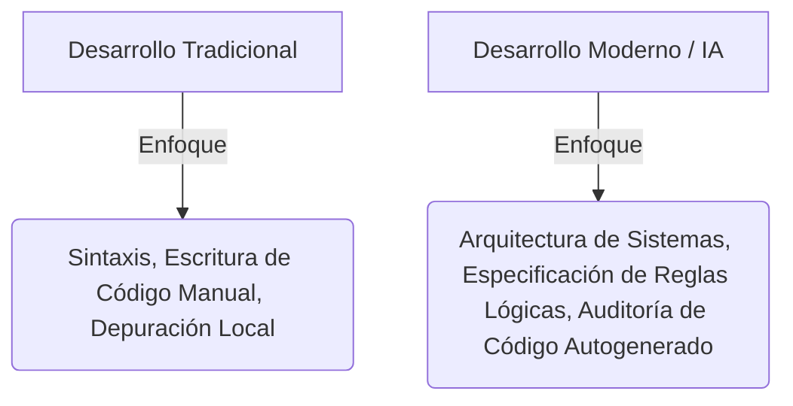
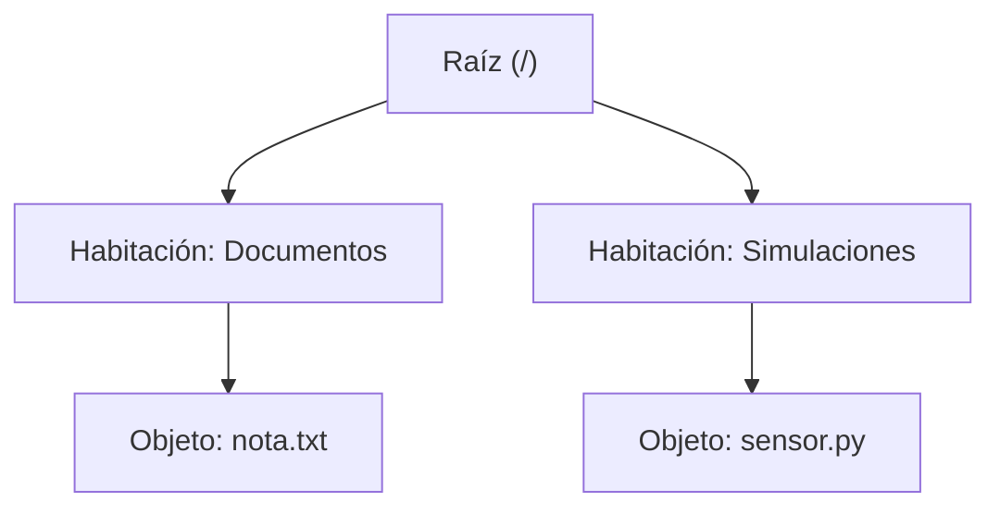
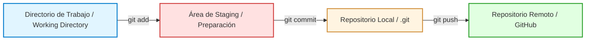

# UNIDAD 1: Pensamiento Computacional, CLI y Flujos de IA Agéntica
**Duración:** 1 semana (6 horas presenciales + 6 horas de estudio independiente)  
**Curso:** Lógica de Programación y Desarrollo Agéntico con IA  
**Institución:** Universidad de la Ciénega del Estado de Michoacán de Ocampo (UCEMICH)  
**Carrera:** Ingeniería en Inteligencia Artificial y Nanotecnología  
**Nivel:** Primer Semestre  

<!-- Reemplaza <org>/<repo> por la ruta real del repositorio en GitHub al publicarlo -->
[](https://colab.research.google.com/github/<org>/<repo>/blob/main/notebooks/UNIDAD_1_PENSAMIENTO_COMPUTACIONAL_CLI.ipynb)

```python
import sys
if 'google.colab' in sys.modules:
    %pip install -q mcp fastmcp chromadb rich
```

---

## 📚 OBJETIVOS DE APRENDIZAJE

Al finalizar esta unidad académica, el estudiante de ingeniería será capaz de:
1. **Diferenciar con precisión** el flujo de codificación tradicional (manual/imperativa) de la metodología contemporánea asistida por modelos de lenguaje de gran escala (Vibe Coding), identificando las responsabilidades de auditoría y validación lógica del ingeniero.
2. **Navegar y manipular** con solvencia el sistema de archivos del sistema operativo mediante la interfaz de línea de comandos (CLI) utilizando comandos nativos, comprendiendo el mapeo lógico y la resolución de rutas relativas y absolutas.
3. **Estructurar y gestionar** repositorios de control de versiones locales y remotos empleando Git y GitHub, aplicando el flujo de trabajo estándar (Working Directory, Staging Area, Local Repository y Remote Repository) basado en grafos de cambios.
4. **Formular prompts de ingeniería** estructurados bajo parámetros de especificidad lógica, reconociendo matemáticamente la naturaleza probabilística de los modelos de lenguaje (LLM), la segmentación de texto en tokens, el cálculo del límite de la ventana de contexto y los costos computacionales y financieros asociados.

---

# 1.1 Del Código Manual al Vibe Coding

## El Rol del Ingeniero en la Era de la Inteligencia Artificial

La ingeniería moderna en Inteligencia Artificial y Nanotecnología se enfrenta a un cambio de paradigma instrumental. Tradicionalmente, aprender a programar requería concentrar un esfuerzo cognitivo masivo en memorizar la sintaxis estricta de un lenguaje de programación (paréntesis, puntos y comas, indentaciones). En este modelo tradicional, el programador actuaba como un transcriptor de instrucciones de bajo y medio nivel.

Con la madurez de los Modelos de Lenguaje de Gran Escala (LLMs) y los sistemas agénticos de desarrollo de software, la escritura de código sintáctico ha sido parcialmente democratizada y acelerada. No obstante, esto no reduce el rigor intelectual de la ingeniería; al contrario, eleva la responsabilidad del desarrollador:



En la era del desarrollo asistido por IA, el ingeniero de la UCEMICH asume dos roles primordiales:
*   **Director de Arquitectura**: Su tarea fundamental ya no es redactar bucles `for` simples, sino diseñar la topología y modularidad del sistema. Es decir, cómo interactúan la interfaz de usuario, las bases de datos, las simulaciones físicas y los modelos matemáticos complejos.
*   **Auditor y Validador de Código**: Los sistemas generativos basados en aprendizaje estadístico pueden producir código sintácticamente correcto pero lógicamente erróneo o físicamente inconsistente (por ejemplo, violando leyes termodinámicas en una simulación de nanotransporte de fármacos). El ingeniero debe auditar de manera rigurosa la salida de los modelos, garantizando la seguridad, eficiencia y corrección científica del programa.

## ¿Qué es el Vibe Coding?

El término **Vibe Coding** describe el flujo de desarrollo donde la programación se traslada desde la codificación de bajo nivel hacia una conversación guiada en lenguaje natural de alto nivel con un asistente de inteligencia artificial. En este flujo, el desarrollador "transmite la vibración" o la intención conceptual del software, mientras que la IA ejecuta la redacción e integración de los archivos.

Sin embargo, para los ingenieros en IA y Nanotecnología de la UCEMICH, delegar la lógica de programación a ciegas representa un riesgo inaceptable. Para modelar el comportamiento de nanopartículas, el autoensamblaje molecular o la optimización de hiperparámetros en redes neuronales, se requiere precisión matemática absoluta. Un pequeño error generado por la IA en un integrador numérico (como Runge-Kutta) puede desestabilizar por completo una simulación física.

Por ende, **el Vibe Coding no sustituye al Pensamiento Computacional**. El pensamiento computacional (descomposición, reconocimiento de patrones, abstracción y diseño algorítmico) es el lenguaje mental en el que el ingeniero estructura el problema antes de comunicárselo a la IA. La habilidad para auditar el código autogenerado depende directamente del dominio de la lógica manual y el entendimiento profundo de la arquitectura de la computadora.

> [!IMPORTANT]
> **Política de IA — Unidades 1, 2 y 3: SIN IA para escribir código.**
> Todo el código que entregues en estas tres unidades debe ser escrito manualmente por ti. Puedes usar IA únicamente para resolver dudas conceptuales (p. ej. "¿qué es una variable?"), nunca para generar o corregir código. Esta política se relaja progresivamente a partir de la Unidad 4. Ver la tabla completa en `UNIDAD_0_ENTORNO_Y_PRIMER_PROGRAMA.md`, sección 0.5.

### 💡 Analogía Didáctica: El Piloto Automático y el Ingeniero de Vuelo

Imagine que está a bordo de una aeronave experimental de última generación encargada de sobrevolar una zona montañosa compleja. 

*   **El Piloto Automático (Herramientas de IA / Vibe Coding)**: Es un sistema sumamente sofisticado capaz de mantener la velocidad de crucero, equilibrar las alas y ajustar el rumbo según las coordenadas proporcionadas. Hace el trabajo rutinario y pesado de sostener los mandos durante horas, reduciendo la fatiga.
*   **El Ingeniero de Vuelo (El Programador Humano)**: Es la persona que comprende las leyes de la física aerodinámica, sabe interpretar las fluctuaciones de presión del motor, entiende el funcionamiento del sistema de combustible y conoce la ruta exacta.

Si una turbulencia severa golpea al avión y los sensores de viento se congelan, el piloto automático fallará o tomará decisiones erráticas basadas en datos corruptos. Si el ingeniero de vuelo no sabe volar la aeronave manualmente ni comprende la física de la sustentación, el avión inevitablemente se estrellará. 

En la ingeniería de software asistida por IA ocurre lo mismo: la IA es el piloto automático que genera código rápidamente, pero el ingeniero es el profesional que debe tomar los controles manuales cuando el sistema genera soluciones inviables o alucinadas.

---

# 1.2 Dominio del Entorno de Trabajo: Terminal de Línea de Comandos (CLI)

En los entornos industriales de computación científica e inteligencia artificial, el desarrollo de software raramente se realiza a través de interfaces gráficas (GUI). Las supercomputadoras de cálculo numérico, los clústeres de GPUs en la nube y los microcontroladores embebidos en sensores nanotecnológicos suelen operarse en modo desatendido o sin cabeza (*headless*). La interfaz de línea de comandos (CLI, *Command Line Interface*) es el canal más eficiente y potente para controlar estos sistemas.

## Comandos Esenciales de Navegación y Gestión de Archivos

A diferencia de una interfaz gráfica donde el usuario hace clic en carpetas tridimensionales, en la terminal nos comunicamos mediante comandos textuales estructurados.

| Comando | Descripción | Ejemplo de Uso | Propósito Académico |
| :--- | :--- | :--- | :--- |
| `pwd` | *Print Working Directory*. Devuelve la ruta absoluta del directorio donde se está posicionado actualmente. | `pwd` | Ubicación espacial en el almacenamiento. |
| `ls` | *List*. Muestra el contenido del directorio actual o de una ruta especificada. Permite banderas como `-la` para ver archivos ocultos y detalles. | `ls -la` | Inspección de archivos e información de permisos. |
| `cd` | *Change Directory*. Cambia el directorio de trabajo actual a la ruta provista. | `cd simulaciones` | Desplazamiento por el árbol de directorios. |
| `mkdir` | *Make Directory*. Crea una carpeta nueva en la ruta especificada. | `mkdir resultados_nano` | Organización estructural del proyecto. |
| `touch` | Crea un archivo de texto vacío o actualiza su estampa de tiempo de modificación. | `touch main.py` | Inicialización de archivos de código fuente. |
| `cat` | *Concatenate*. Imprime el contenido de uno o más archivos de texto en la terminal. | `cat config.json` | Inspección rápida del contenido de archivos. |

### 💡 Analogía Didáctica: El Sistema de Archivos como una Mansión

Para comprender el funcionamiento de la terminal (CLI) y la organización del disco duro, podemos visualizar todo el sistema de almacenamiento de la computadora como una **mansión gigante**.



*   **La Mansión**: Es el disco duro de la computadora.
*   **Las Habitaciones**: Representan los **directorios (o carpetas)**. Cada habitación puede albergar objetos y también puede tener puertas internas que conducen a habitaciones más pequeñas (subdirectorios).
*   **Los Objetos**: Son los **archivos** (documentos de texto, imágenes, scripts de Python). No puedes "entrar" a un objeto, pero sí puedes abrirlo para ver qué contiene.
*   **Comando `pwd`**: Equivale a mirar a su alrededor y preguntarse: *"¿En qué habitación de la mansión estoy parado en este momento?"*. El sistema responderá detallando la secuencia de habitaciones desde la puerta principal (raíz) hasta su posición actual (ej: `/Mansión/SegundoPiso/Estudio`).
*   **Comando `cd`**: Es la acción física de **caminar** hacia otra habitación.
    *   `cd cocina`: Camina hacia la puerta que lleva a la cocina. (Ruta relativa).
    *   `cd ..`: Da un paso hacia atrás para salir de la habitación actual y regresar a la habitación que la contiene (el pasillo o directorio padre).
    *   `cd /`: Regresa inmediatamente al vestíbulo principal de entrada de la mansión (el directorio raíz del sistema de archivos).
*   **Comando `ls`**: Equivale a encender la luz de la habitación y **hacer una lista** de todo lo que hay allí: qué puertas a otras habitaciones hay y qué objetos físicos están sobre las mesas.
*   **Comando `mkdir`**: Es construir una nueva pared en la habitación actual para crear un nuevo clóset o cuarto dentro de ella.
*   **Comando `touch`**: Coloca una caja de cartón o una hoja de papel en blanco sobre una mesa para que posteriormente podamos guardar información en ella.
*   **Comando `cat`**: Abre una de las hojas de papel que están en la habitación y lee en voz alta lo que tiene escrito.

### Rutas Absolutas frente a Rutas Relativas

Comprender la diferencia entre rutas absolutas y relativas es crucial para escribir scripts portables que no fallen al cambiar de computadora.

1.  **Rutas Absolutas**: Describen la trayectoria completa desde el origen más primitivo del disco duro (el directorio raíz `/` en Unix/Linux o `C:\` en Windows). No importa en qué parte de la mansión esté parado, una ruta absoluta siempre comenzará desde el vestíbulo principal.
    *   *Ejemplo en Unix*: `/home/estudiante/documentos/proyecto/codigo.py`
    *   *Ejemplo en Windows*: `C:\Users\estudiante\documentos\proyecto\codigo.py`
2.  **Rutas Relativas**: Describen la ubicación de un archivo o carpeta **a partir de la posición donde se encuentra parado actualmente**.
    *   Si está en `/home/estudiante` y quiere acceder a `codigo.py`, la ruta relativa es `documentos/proyecto/codigo.py`.
    *   Si está en `/home/estudiante/descargas` y quiere retroceder un nivel y luego entrar a documentos, la ruta relativa es `../documentos`.

---

# 1.3 Implementación de una Terminal Virtual Segura (`VirtualTerminal`)

Para ilustrar de forma práctica cómo los sistemas operativos y los entornos de ejecución (como los contenedores Docker o los sandboxes de ejecución de agentes de IA) procesan las rutas y gestionan los archivos, implementamos una clase interactiva en Python llamada `VirtualTerminal`.

Esta simulación funciona mediante la creación de un entorno aislado de manera física en el almacenamiento del sistema operativo (un directorio llamado `sandbox_cli`), controlando rigurosamente que las peticiones del usuario no escapen del espacio educativo delimitado.

## Concepto de Sandboxing y Seguridad frente al Path Traversal

Cuando un programador o un agente de IA ejecuta comandos en un sistema, existe el peligro latente de que realice un ataque de **Path Traversal** (o salto de directorio). Este exploit consiste en usar secuencias especiales como `../` repetidamente para retroceder más allá del directorio permitido y acceder a archivos sensibles del sistema operativo (como contraseñas o llaves criptográficas).

Para mitigar esto, nuestra clase `VirtualTerminal` implementa una validación matemática de las rutas basada en la resolución de enlaces simbólicos mediante el método `.resolve()` y la verificación lógica de pertenencia con `.is_relative_to()`.

### Explicación Lógica de la Validación de Rutas

Definamos formalmente las variables involucradas en la validación:
*   Sea $B$ el directorio base del sandbox resuelto a su ruta física absoluta e inequívoca en el almacenamiento.
*   Sea $P_u$ la ruta proporcionada por el usuario (la cual puede contener comodines, rutas relativas con `..` o rutas absolutas simuladas).
*   Sea $P_r$ la ruta resultante al concatenar el directorio actual con $P_u$ y resolver su ubicación física final en el disco:
    $$P_r = \text{resolve}(C_{dir} \cup P_u)$$
    donde $C_{dir}$ es el directorio actual de la terminal virtual.

El sistema de seguridad de la terminal virtual evalúa la siguiente proposición lógica:
$$\text{Acceso Permitido} \iff P_r \subseteq B$$

Es decir, la ruta física resuelta $P_r$ debe existir dentro del subárbol de directorios de la base del sandbox $B$. Si la ruta resuelta viola esta condición (por ejemplo, si contiene suficientes retrocesos `../../` como para situarse a un nivel superior al sandbox), el sistema lanza una excepción de permisos (`PermissionError`) y bloquea la operación.

---

### Desglose Paso a Paso del Código de la Terminal Virtual

1.  **Constructor `__init__`**: Define el directorio base del sandbox en la carpeta de ejecución actual del script de Python. Resuelve el path absoluto y coloca el cursor de posición (`self.current_dir`) al inicio del sandbox. Invoca a `_setup_sandbox` para crear la infraestructura inicial.
2.  **Inicializador `_setup_sandbox`**: Crea físicamente el directorio base y subdirectorios educativos predeterminados (`documentos`, `simulaciones_nano`). Además, crea un archivo de texto de muestra (`nota.txt`) simulando datos de nanotecnología.
3.  **Método de Resolución `_resolve_path`**: Es el núcleo de seguridad.
    *   Toma la ruta provista por el usuario.
    *   Si el usuario ingresa una ruta que empieza con `/`, la terminal virtual la interpreta como absoluta dentro de los límites del sandbox (eliminando barras diagonales al inicio).
    *   Si es relativa, la concatena con `self.current_dir`.
    *   Llama a `.resolve()` para colapsar todos los segmentos `..` y enlaces simbólicos.
    *   Compara si el resultado sigue perteneciendo a la raíz del sandbox usando `is_relative_to()`.
4.  **Métodos de Comandos (`pwd`, `ls`, `cd`, `mkdir`, `touch`, `cat`)**:
    *   `pwd` calcula la diferencia de ruta entre el directorio actual y el sandbox base para representarla como una ruta limpia iniciada con `/`.
    *   `ls` lista de forma formateada el tipo (`[DIR]` o `[FIL]`), nombre y tamaño en bytes de los elementos dentro del directorio objetivo.
    *   `cd` actualiza el puntero del directorio actual si la ruta resuelta existe y es efectivamente un directorio.
    *   `mkdir`, `touch` y `cat` operan directamente sobre la biblioteca nativa `pathlib.Path` una vez que la ruta ha sido validada y aprobada por `_resolve_path`.
5.  **Limpiador `clean_sandbox`**: Elimina físicamente toda la estructura creada para no dejar archivos residuales en la computadora del usuario tras finalizar la simulación.

---

### Código Completo: `VirtualTerminal`

El siguiente código contiene la implementación completa de la terminal virtual interactiva.

```python
import os
import shutil
from pathlib import Path
from typing import List

class VirtualTerminal:
    """Simulador interactivo de terminal (CLI) con entorno sandbox controlado.
    
    Permite experimentar con comandos esenciales de navegación y manipulación de
    archivos (pwd, cd, ls, mkdir, touch, cat) de forma segura y educativa.
    """
    
    def __init__(self, sandbox_name: str = "sandbox_cli") -> None:
        """Inicializa la terminal virtual y crea la estructura inicial en el sandbox.
        
        Args:
            sandbox_name: Nombre de la carpeta que servirá de sandbox en el directorio actual.
        """
        self.base_dir: Path = Path.cwd().resolve() / sandbox_name
        self.current_dir: Path = self.base_dir
        self._setup_sandbox()

    def _setup_sandbox(self) -> None:
        """Crea el directorio raíz del sandbox y algunos archivos/directorios de prueba."""
        self.base_dir.mkdir(parents=True, exist_ok=True)
        # Crear estructura de ejemplo didáctica
        (self.base_dir / "documentos").mkdir(exist_ok=True)
        (self.base_dir / "simulaciones_nano").mkdir(exist_ok=True)
        
        archivo_ejemplo = self.base_dir / "documentos" / "nota.txt"
        if not archivo_ejemplo.exists():
            archivo_ejemplo.write_text(
                "Simulación de Nanotubos de Carbono - Versión 1.0\n"
                "Propiedades mecánicas calculadas: Módulo de Young = 1 TPa\n", 
                encoding="utf-8"
            )

    def _resolve_path(self, target_path: str) -> Path:
        """Resuelve una ruta de forma segura y restringe su salida fuera del sandbox.
        
        Args:
            target_path: La ruta relativa o absoluta que se desea resolver.
            
        Returns:
            La ruta absoluta resuelta dentro del sandbox.
            
        Raises:
            PermissionError: Si la ruta intenta navegar fuera de la base del sandbox.
        """
        raw_path = Path(target_path)
        
        if raw_path.is_absolute():
            # Interpretar rutas absolutas relativas al directorio base del sandbox
            # Se limpia la barra inicial para evitar que se interprete como la raíz real del OS
            path_str = target_path.replace("\\", "/").lstrip("/")
            resolved = (self.base_dir / path_str).resolve()
        else:
            resolved = (self.current_dir / raw_path).resolve()
            
        # Comprobar si la ruta se mantiene dentro de los límites del sandbox
        if not resolved.is_relative_to(self.base_dir):
            raise PermissionError("Acceso denegado: No se permite salir de la raíz del sandbox.")
        return resolved

    def pwd(self) -> str:
        """Devuelve la ruta del directorio actual relativa al sandbox.
        
        Returns:
            Ruta del directorio actual simulado.
        """
        if self.current_dir == self.base_dir:
            return "/"
        return "/" + self.current_dir.relative_to(self.base_dir).as_posix()

    def ls(self, target: str = ".") -> List[str]:
        """Obtiene la lista de elementos en el directorio indicado.
        
        Args:
            target: Directorio que se listará (por defecto el actual).
            
        Returns:
            Lista formateada de archivos y carpetas del directorio.
            
        Raises:
            FileNotFoundError: Si el directorio destino no existe.
            NotADirectoryError: Si el elemento no es un directorio.
        """
        path = self._resolve_path(target)
        if not path.exists():
            raise FileNotFoundError(f"ls: '{target}': No existe el archivo o el directorio")
        if not path.is_dir():
            raise NotADirectoryError(f"ls: '{target}': No es un directorio")
            
        elementos = []
        for p in path.iterdir():
            tipo = "[DIR]" if p.is_dir() else "[FIL]"
            tamano = f"{p.stat().st_size} B"
            elementos.append(f"{tipo:<6} {p.name:<25} {tamano:>10}")
        return elementos

    def cd(self, target: str) -> None:
        """Cambia el directorio actual hacia la ruta especificada.
        
        Args:
            target: Ruta destino del cambio.
            
        Raises:
            FileNotFoundError: Si el directorio destino no existe.
            NotADirectoryError: Si el elemento no es un directorio.
        """
        path = self._resolve_path(target)
        if not path.exists():
            raise FileNotFoundError(f"cd: '{target}': No existe el archivo o el directorio")
        if not path.is_dir():
            raise NotADirectoryError(f"cd: '{target}': No es un directorio")
        self.current_dir = path

    def mkdir(self, name: str) -> None:
        """Crea una carpeta en el directorio actual.
        
        Args:
            name: Nombre de la carpeta a crear.
            
        Raises:
            FileExistsError: Si la carpeta o archivo ya existe en esa ruta.
        """
        path = self._resolve_path(name)
        if path.exists():
            raise FileExistsError(f"mkdir: '{name}': El archivo o carpeta ya existe")
        path.mkdir(parents=True)

    def touch(self, name: str, content: str = "") -> None:
        """Crea un archivo de texto con contenido inicial opcional.
        
        Args:
            name: Nombre del archivo a crear.
            content: Contenido inicial del archivo.
        """
        path = self._resolve_path(name)
        path.parent.mkdir(parents=True, exist_ok=True)
        path.write_text(content, encoding="utf-8")

    def cat(self, name: str) -> str:
        """Lee y retorna el contenido del archivo especificado.
        
        Args:
            name: Nombre del archivo a leer.
            
        Returns:
            Contenido de texto del archivo.
            
        Raises:
            FileNotFoundError: Si el archivo no existe.
            IsADirectoryError: Si es un directorio en lugar de un archivo.
        """
        path = self._resolve_path(name)
        if not path.exists():
            raise FileNotFoundError(f"cat: '{name}': No existe el archivo o el directorio")
        if path.is_dir():
            raise IsADirectoryError(f"cat: '{name}': Es un directorio")
        return path.read_text(encoding="utf-8")

    def clean_sandbox(self) -> None:
        """Limpia todo el entorno del sandbox eliminando su directorio físico."""
        if self.base_dir.exists():
            shutil.rmtree(self.base_dir)

def run_cli_simulation() -> None:
    """Ejecuta el bucle de ejecución (REPL) del simulador de comandos CLI en terminal."""
    terminal = VirtualTerminal()
    print("=" * 65)
    print("     SIMULADOR INTERACTIVO DE TERMINAL CLI (Entorno Sandbox)    ")
    print("=" * 65)
    print("Comandos: pwd, ls [ruta], cd <ruta>, mkdir <nombre>, touch <nombre>,")
    print("          cat <nombre>, clear, exit")
    print("-" * 65)

    try:
        while True:
            prompt = f"estudiante@ucemich-cli:{terminal.pwd()}$ "
            try:
                linea = input(prompt).strip()
            except (KeyboardInterrupt, EOFError):
                print("\nSaliendo de la terminal virtual...")
                break
                
            if not linea:
                continue
                
            partes = linea.split(maxsplit=1)
            comando = partes[0].lower()
            argumento = partes[1] if len(partes) > 1 else ""
            
            try:
                if comando == "exit":
                    print("Cerrando sesión de terminal simulada. ¡Éxito!")
                    break
                elif comando == "clear":
                    os.system("cls" if os.name == "nt" else "clear")
                elif comando == "pwd":
                    print(terminal.pwd())
                elif comando == "ls":
                    elementos = terminal.ls(argumento if argumento else ".")
                    if elementos:
                        for elem in elementos:
                            print(elem)
                    else:
                        print("[Directorio vacío]")
                elif comando == "cd":
                    if not argumento:
                        terminal.cd(".")
                    else:
                        terminal.cd(argumento)
                elif comando == "mkdir":
                    if not argumento:
                        print("mkdir: falta el operando con el nombre de carpeta")
                    else:
                        terminal.mkdir(argumento)
                        print(f"Carpeta '{argumento}' creada.")
                elif comando == "touch":
                    if not argumento:
                        print("touch: falta el operando con el nombre de archivo")
                    else:
                        terminal.touch(argumento)
                        print(f"Archivo '{argumento}' creado.")
                elif comando == "cat":
                    if not argumento:
                        print("cat: falta el operando con el nombre de archivo")
                    else:
                        print(terminal.cat(argumento))
                else:
                    print(f"Comando no reconocido: '{comando}'. Escribe 'exit' para salir.")
            except Exception as e:
                print(f"Error: {e}")
    finally:
        # Se conserva el sandbox para que el estudiante pueda ver los archivos creados
        # Si desea limpiarlo, puede invocar terminal.clean_sandbox() de forma explícita
        pass

if __name__ == "__main__":
    run_cli_simulation()
```

---

# 1.4 Control de Versiones Esencial con Git y GitHub

El control de versiones es una disciplina fundamental de la ingeniería de software que permite registrar el historial de modificaciones realizadas sobre un conjunto de archivos. Sin herramientas como Git, los desarrolladores caen en la mala práctica de duplicar directorios de manera desordenada para mantener respaldos (por ejemplo, `simulacion_v1.py`, `simulacion_final.py`, `simulacion_final_v2_comentarios.py`).

## El Flujo de Trabajo en Git

Git no se limita a guardar archivos sueltos; gestiona los cambios a través de una estructura matemática conocida como **Grafo Dirigido Acíclico (DAG)**. En este grafo, cada nodo representa una instantánea (*commit*) del estado del código y apunta de forma retrospectiva hacia su nodo predecesor.

El flujo de trabajo estándar en una computadora local consta de tres áreas lógicas:



1.  **Directorio de Trabajo (*Working Directory*)**: Es la carpeta física en su disco duro donde edita los archivos activamente. Los cambios realizados aquí son inestables y Git los considera "no registrados" (*untracked* o *modified*).
2.  **Área de Staging / Preparación**: Es una zona intermedia de control de calidad. Aquí se seleccionan con precisión qué cambios específicos del directorio de trabajo formarán parte del próximo registro histórico. Permite hacer commits atómicos y limpios.
3.  **Repositorio Local (*Local Repository*)**: Es la base de datos interna de Git almacenada en la carpeta oculta `.git`. Al hacer un *commit*, el estado actual del área de staging se consolida de manera permanente con un identificador criptográfico único (hash SHA-1 o SHA-256).

### 💡 Analogía Didáctica: Git como un Álbum Fotográfico Histórico

Para comprender conceptualmente cómo funciona el flujo de Git, imagine que está armando un álbum fotográfico físico para documentar la construcción de un modelo de laboratorio de nanotecnología.

*   **El Directorio de Trabajo (La Mesa de Trabajo)**: Es la superficie física donde tiene las piezas esparcidas, el pegamento, las pinzas y los nanotubos reales. Puede agregar componentes, quitarlos, equivocarse, lijar una pieza o desechar otra. Todo está en desorden y nada se ha registrado formalmente.
*   **El Área de Staging (El Escenario de la Foto / `git add`)**: Decide que la estructura actual del modelo es óptima. Limpia la mesa, coloca únicamente las piezas terminadas en el centro de la escena y ajusta la iluminación. Aún no ha tomado la fotografía; simplemente ha colocado a los actores en su posición definitiva para la sesión. Si nota un defecto de último minuto, puede retirar una pieza del escenario para volver a trabajar en ella sin deshacer la escena principal.
*   **El Repositorio Local (El Álbum de Fotos de la Cámara / `git commit`)**: Presiona el botón del obturador de su cámara. En ese milisegundo, la cámara captura de forma inmutable la escena del escenario de staging y la guarda en la tarjeta de memoria (su repositorio `.git` local) asignándole un número de fotografía consecutivo y único. Además, escribe una nota adhesiva debajo de la foto: *"Fotografía 12: Integración del sensor piezoeléctrico al chasis molecular"*.
*   **El Repositorio Remoto (La Nube / `git push`)**: Conecta su cámara a Internet y sube todo su álbum de fotografías a una plataforma en la nube (como GitHub) para que otros investigadores del consorcio internacional puedan descargar el álbum completo, analizar el progreso histórico y verificar el ensamblaje en sus propios laboratorios.
*   **Las Ramas (`git branch`)**: Es como crear un set de rodaje paralelo en una habitación contigua. En ese set alterno puede intentar pintar el modelo de color fosforescente para probar su luminiscencia. Si el experimento fracasa, simplemente destruye ese set y su escenario principal permanece intacto. Si funciona, puede fusionar las decoraciones en la sala principal.

---

# 1.5 Los Modelos de Lenguaje como Motores de Predicción de Tokens

Los Modelos de Lenguaje de Gran Escala (LLMs) son herramientas valiosas en el desarrollo de software y la simulación científica. Sin embargo, para utilizarlos de manera efectiva en la ingeniería, es indispensable desmitificar su funcionamiento. Un LLM no tiene conciencia, no "comprende" los conceptos físicos que describe, ni posee un acceso directo a la verdad empírica. 

Funcionalmente, un LLM es un **predictor estadístico autorregresivo** entrenado sobre corpus textuales masivos para estimar la probabilidad de que una palabra o fragmento de palabra (token) continúe una secuencia de texto previa.

## Formulación Matemática de la Generación de Texto

Matemáticamente, la generación de texto en un LLM es un proceso estocástico (probabilístico) que sigue una cadena de Markov de orden variable. Dado un conjunto de tokens de entrada (el prompt) representado por la secuencia $W = (w_1, w_2, \dots, w_t)$, el modelo calcula una distribución de probabilidad sobre todo su vocabulario $V$ para determinar el siguiente elemento $w_{t+1}$:

$$P(w_{t+1} \mid w_1, w_2, \dots, w_t) = \text{Softmax}\left(\frac{\mathbf{z}_{t+1}}{T}\right)$$

Donde:
*   $\mathbf{z}_{t+1}$ es el vector de puntuaciones brutas (logits) de salida de la red neuronal del transformador para cada palabra del vocabulario en la posición de tiempo $t+1$.
*   $T \in [0, \infty)$ representa la **Temperatura de Muestreo**. Es un hiperparámetro de escala que controla la entropía de la distribución probabilística:
    *   Si $T \to 0$ (Temperatura baja), la distribución de probabilidad se concentra masivamente en el token con la puntuación bruta más alta, volviendo la generación **determinista** y repetitiva.
    *   Si $T > 1$ (Temperatura alta), la distribución de probabilidad se aplana (se vuelve más uniforme), permitiendo que tokens con menor probabilidad inicial sean seleccionados, aumentando la "creatividad" y diversidad del texto generado a costa de un incremento en la tasa de alucinaciones lógicas.

---

## ¿Qué es un Token?

Los computadores y las redes neuronales no procesan texto en lenguaje natural de forma directa. Las palabras deben convertirse en vectores numéricos. El primer paso de este procesamiento es la **tokenización**, que consiste en dividir una cadena de texto en fragmentos atómicos llamados **tokens**.

Los tokens no coinciden necesariamente con palabras enteras. Los tokenizadores modernos utilizan algoritmos como *Byte Pair Encoding (BPE)* o *WordPiece* para segmentar el texto eficientemente. Las palabras comunes se codifican como un solo token, mientras que las palabras complejas o compuestas (muy frecuentes en español y en el lenguaje científico) se dividen en prefijos, raíces y sufijos.

### 💡 Analogía Didáctica: Los Tokens como Piezas de LEGO

Imagine que tiene que construir una réplica de una mansión y otros objetos empleando piezas de **LEGO**.

```
Texto original: "desarmadamente"
Tokenización:  [ "des" ] [ "##arma" ] [ "##damente" ]
```

*   **Palabras Completas (Juguetes Preensamblados)**: Si el fabricante de juguetes le diera un coche de plástico prefabricado, solo podría usarlo como un carro. En lenguaje, una palabra completa como "nanotecnología" es un juguete preensamblado. Es útil, pero ocupa mucho espacio de memoria en el catálogo de palabras si tuviera que aprender cada conjugación y declinación como un objeto único.
*   **Tokens (Bloques de LEGO)**: En su lugar, el fabricante le provee bloques básicos de diferentes formas y tamaños (piezas de 2x4, bloques con conectores, rampas). 
    *   Para construir la palabra "desarmadamente", el tokenizador no busca la palabra completa. Toma la pieza de LEGO "des" (prefijo de negación), la pieza "arma" (raíz nominal) y la pieza "mente" (sufijo adverbial). 
    *   Uniendo estos tres bloques elementales de manera secuencial, construye el significado exacto de la palabra.
*   **Vocabulario eficiente**: Este enfoque permite que con un conjunto limitado de bloques básicos (por ejemplo, 100,000 tokens en GPT-4), el modelo pueda construir e interpretar miles de millones de combinaciones de palabras en múltiples idiomas, incluyendo neologismos científicos que nunca vio en su entrenamiento.

## Ventana de Contexto y el Fenómeno de la Alucinación

El procesamiento de los LLMs está limitado por restricciones físicas de hardware y por la complejidad algorítmica de la arquitectura Transformer (cuya atención autoincremental escala de forma cuadrática $O(N^2)$ respecto a la longitud de la secuencia).

1.  **Ventana de Contexto**: Es el buffer de memoria activa del modelo. Define el número máximo de tokens (tanto de entrada del prompt como generados de salida en la respuesta) que el transformador puede evaluar simultáneamente en sus capas de atención. Si una conversación de ingeniería acumula 130,000 tokens y el modelo posee un límite físico de 128,000 tokens (como GPT-4o), el modelo ejecutará un **truncamiento de contexto**. Esto significa que descartará silenciosamente los tokens más antiguos del chat para dar cabida a las nuevas entradas, perdiendo así la memoria de las instrucciones iniciales.
2.  **Alucinaciones**: Ocurren cuando la red neuronal genera secuencias de texto gramaticalmente correctas y convincentes, pero carentes de veracidad factual o lógica. Esto no se debe a que la IA intente mentir, sino a que su objetivo de optimización matemática es únicamente **minimizar la pérdida de perplejidad** en la predicción del siguiente token. Si la información correcta sobre una constante física de un nanomaterial no se encuentra explícitamente en los pesos del modelo, el sistema completará la secuencia basándose en la asociación estadística de términos más cercana, inventando un valor físicamente imposible.

---

# 1.6 Implementación del Tokenizador y Analizador (`TokenizerAnalyzer`)

Para comprender con exactitud el impacto del consumo de tokens en los costos operativos y el comportamiento de la ventana de contexto al interactuar con APIs de inteligencia artificial, utilizaremos una clase educativa de Python llamada `TokenizerAnalyzer`.

Esta clase simula un tokenizador con lógica de subpalabras adaptado al español científico y calcula el presupuesto de llamadas a modelos líderes de la industria (GPT-4o, Claude 3.5 Sonnet, DeepSeek Chat).

## Desglose Paso a Paso de la Clase `TokenizerAnalyzer`

1.  **Tarifas del Modelo (`MODEL_TARIFFS`)**: Es un diccionario estático que mapea identificadores de modelos con sus costos reales (en USD por cada 1,000,000 de tokens procesados de entrada y de salida) y sus límites físicos de ventana de contexto.
2.  **Aproximación de Subpalabras (`tokenize`)**: Emplea una expresión regular (`re.findall`) para separar palabras de signos de puntuación. Para simular el algoritmo BPE:
    *   Si una palabra supera los 8 caracteres, busca sufijos españoles comunes como `"mente"`, `"ciones"`, o `"miento"` y los separa, marcando el segundo componente con el prefijo `##` (indicativo estándar en tokenizadores como BERT para denotar que el token no es el inicio de una palabra).
    *   Si empieza con prefijos de uso común como `"des"`, `"con"`, `"pre"`, `"sub"`, los segmenta como una pieza independiente.
3.  **Cálculo de Costo de API (`calculate_cost`)**: Aplica las tasas de cobro lineal basadas en la cantidad de tokens, permitiendo prever la viabilidad financiera de automatizar procesos de análisis nanotecnológico a gran escala.
4.  **Simulador de Truncamiento (`simulate_context_window`)**: Modela el desbordamiento de memoria. Si el volumen total de tokens supera el límite asignado para la simulación, realiza un rebanado de la lista (`slice`), conservando los tokens más recientes y enviando los más antiguos al conjunto de elementos "olvidados".

---

### Código Completo: `TokenizerAnalyzer`

```python
import re
from typing import Dict, List, Tuple

class TokenizerAnalyzer:
    """Analizador y tokenizador interactivo para la enseñanza de límites en LLMs.
    
    Permite estimar el número de tokens, calcular costos de API y simular el
    comportamiento del truncamiento del contexto de un LLM.
    """
    
    # Tarifas estimadas por 1,000,000 de tokens (1M tokens) en USD al 2026
    # Estructura de la tupla: (Costo Entrada 1M, Costo Salida 1M, Ventana Contexto Máxima)
    MODEL_TARIFFS: Dict[str, Tuple[float, float, int]] = {
        "gpt-4o": (2.50, 10.00, 128000),
        "gpt-3.5-turbo": (0.50, 1.50, 16385),
        "claude-3-5-sonnet": (3.00, 15.00, 200000),
        "deepseek-chat": (0.14, 0.28, 64000)
    }
    
    def __init__(self, default_model: str = "gpt-4o") -> None:
        """Inicializa el analizador con un modelo predeterminado.
        
        Args:
            default_model: Nombre del modelo inicial. Debe estar en MODEL_TARIFFS.
        """
        self.current_model: str = default_model if default_model in self.MODEL_TARIFFS else "gpt-4o"

    def set_model(self, model_name: str) -> bool:
        """Cambia el modelo actual para el análisis de costos y contexto.
        
        Args:
            model_name: Nombre del modelo destino.
            
        Returns:
            True si se cambió con éxito, False de lo contrario.
        """
        if model_name in self.MODEL_TARIFFS:
            self.current_model = model_name
            return True
        return False

    def tokenize(self, text: str) -> List[str]:
        """Tokeniza el texto utilizando una aproximación avanzada de subpalabras (simulando BPE).
        
        Divide palabras en prefijos, raíces y sufijos mediante expresiones regulares
        para simular cómo un tokenizador divide palabras complejas en español.
        
        Args:
            text: El texto de entrada a tokenizar.
            
        Returns:
            Una lista de tokens representados como strings.
        """
        if not text:
            return []
            
        # Expresión regular para separar palabras y caracteres especiales, preservando codificación UTF-8
        words = re.findall(r"\w+|[^\w\s]", text, re.UNICODE)
        tokens: List[str] = []
        
        for word in words:
            if not word.isalnum():
                tokens.append(word)
                continue
                
            longitud = len(word)
            if longitud > 8:
                # Reglas didácticas de división para simular subpalabras
                if word.endswith("mente"):
                    tokens.extend([word[:-5], "##mente"])
                elif word.endswith("ciones") or word.endswith("ción"):
                    corte = -6 if word.endswith("ciones") else -4
                    tokens.extend([word[:corte], "##" + word[corte:]])
                elif word.endswith("miento") or word.endswith("mientos"):
                    corte = -7 if word.endswith("mientos") else -6
                    tokens.extend([word[:corte], "##" + word[corte:]])
                else:
                    mitad = longitud // 2
                    tokens.extend([word[:mitad], "##" + word[mitad:]])
            elif longitud > 4 and word.startswith(("des", "con", "pre", "sub")):
                prefijo = 3
                tokens.extend([word[:prefijo], "##" + word[prefijo:]])
            else:
                tokens.append(word)
                
        return tokens

    def calculate_cost(self, num_tokens: int) -> Dict[str, float]:
        """Calcula el costo estimado de procesamiento para tokens de entrada y salida.
        
        Args:
            num_tokens: Cantidad de tokens para calcular el costo.
            
        Returns:
            Diccionario con las estimaciones de costo de entrada y salida en USD.
        """
        input_rate, output_rate, _ = self.MODEL_TARIFFS[self.current_model]
        cost_input = (num_tokens / 1_000_000) * input_rate
        cost_output = (num_tokens / 1_000_000) * output_rate
        return {
            "input_usd": cost_input,
            "output_usd": cost_output
        }

    def simulate_context_window(self, tokens: List[str], limit: int) -> Tuple[List[str], List[str]]:
        """Simula qué tokens quedan dentro de la ventana de contexto y cuáles se truncan.
        
        Asume que los tokens más antiguos (el principio de la lista) se descartan,
        manteniendo los últimos tokens dentro del límite de contexto.
        
        Args:
            tokens: Lista completa de tokens de la conversación.
            limit: Límite máximo de tokens de la ventana de contexto simulada.
            
        Returns:
            Una tupla con (tokens_activos, tokens_olvidados).
        """
        if len(tokens) <= limit:
            return tokens, []
        activos = tokens[-limit:]
        olvidados = tokens[:-limit]
        return activos, olvidados

def run_tokenization_simulation() -> None:
    """Ejecuta el bucle de interacción de la demostración de tokenización en consola."""
    analyzer = TokenizerAnalyzer()
    
    print("=" * 65)
    print("    SIMULADOR DE TOKENIZACIÓN Y LÍMITES DE CONTEXTO DE LLM   ")
    print("=" * 65)
    print(f"Modelo activo por defecto: {analyzer.current_model.upper()}")
    print("-" * 65)
    
    while True:
        print("\nMenú de opciones:")
        print("1. Analizar texto y simular contexto")
        print("2. Cambiar de modelo de lenguaje")
        print("3. Salir")
        
        opcion = input("Seleccione opción (1-3): ").strip()
        
        if opcion == "3":
            print("Cerrando el simulador de tokenización. ¡Hasta luego!")
            break
            
        elif opcion == "2":
            print("\nModelos disponibles:")
            for idx, model in enumerate(analyzer.MODEL_TARIFFS.keys(), 1):
                tarifa_in, tarifa_out, ctx = analyzer.MODEL_TARIFFS[model]
                print(f"{idx}. {model.upper()} (Contexto: {ctx:,} tokens | Entrada 1M: ${tarifa_in:.2f} USD)")
            
            seleccion = input("Seleccione número o nombre del modelo: ").strip()
            model_keys = list(analyzer.MODEL_TARIFFS.keys())
            
            if seleccion.isdigit():
                idx = int(seleccion) - 1
                if 0 <= idx < len(model_keys):
                    target_model = model_keys[idx]
                else:
                    print("Opción inválida.")
                    continue
            else:
                target_model = seleccion.lower()
                
            if analyzer.set_model(target_model):
                print(f"Modelo cambiado exitosamente a {analyzer.current_model.upper()}")
            else:
                print(f"Modelo no reconocido. Permaneciendo en {analyzer.current_model.upper()}")
                
        elif opcion == "1":
            texto = input("\nIngrese el texto a procesar:\n> ").strip()
            if not texto:
                print("El texto no puede estar vacío.")
                continue
                
            limite_entrada = input("Ingrese límite de contexto simulado (por defecto 15 tokens para visualizar): ").strip()
            limite = int(limite_entrada) if limite_entrada.isdigit() else 15
            
            tokens = analyzer.tokenize(texto)
            num_palabras = len(texto.split()) if texto.split() else 1
            num_tokens = len(tokens)
            costos = analyzer.calculate_cost(num_tokens)
            
            activos, olvidados = analyzer.simulate_context_window(tokens, limite)
            
            print("\n" + "-"*50)
            print("📊 RESULTADOS DEL ANÁLISIS DE TOKENIZACIÓN")
            print("-"*50)
            print(f"Palabras detectadas: {num_palabras}")
            print(f"Tokens generados  : {num_tokens}")
            print(f"Proporción promedio: {num_tokens / num_palabras:.2f} tokens por palabra")
            print(f"Lista de tokens   : {tokens}")
            
            print(f"\n💸 ESTIMACIÓN DE COSTOS DE API (Modelo: {analyzer.current_model.upper()}):")
            print(f" - Prompt de Entrada (Input):  ${costos['input_usd']:.8f} USD")
            print(f" - Respuesta de Salida (Output): ${costos['output_usd']:.8f} USD")
            
            print(f"\n🧠 COMPORTAMIENTO DE CONTEXTO (Límite: {limite} tokens):")
            if olvidados:
                print(f"⚠️ ¡Se ha excedido el límite por {len(olvidados)} tokens!")
                print(f"🔴 OLVIDADO (Truncado): {olvidados}")
                print(f"🟢 ACTIVO (Memoria)   : {activos}")
            else:
                print(f"🟢 Todos los tokens caben en el contexto ({num_tokens}/{limite} tokens).")
                print(f"🟢 ACTIVO (Memoria)   : {activos}")
            print("-" * 50)
        else:
            print("Opción no válida. Intente de nuevo.")

if __name__ == "__main__":
    run_tokenization_simulation()
```

---

# 1.7 Pruebas Unitarias Robustas en Python

Una parte clave del desarrollo formal de software consiste en la verificación automática de que el comportamiento del código cumple con los requerimientos lógicos establecidos. A continuación se presenta un suite de pruebas unitarias implementado mediante el módulo estándar `unittest` de Python. 

Estas pruebas verifican la funcionalidad del sandbox de la terminal virtual (incluyendo la prevención del Path Traversal) y las transformaciones del tokenizador.

```python
import unittest
from pathlib import Path
import shutil

class TestVirtualTerminal(unittest.TestCase):
    """Suite de pruebas unitarias para validar la seguridad y funcionalidad de VirtualTerminal."""
    
    def setUp(self) -> None:
        """Inicializa una instancia limpia de la terminal virtual antes de cada test."""
        self.terminal = VirtualTerminal(sandbox_name="test_sandbox_cli")

    def tearDown(self) -> None:
        """Remueve todos los directorios temporales creados para la prueba."""
        self.terminal.clean_sandbox()

    def test_setup_sandbox_creates_directories(self) -> None:
        """Verifica que la inicialización del sandbox cree las carpetas escolares requeridas."""
        self.assertTrue(self.terminal.base_dir.exists())
        self.assertTrue((self.terminal.base_dir / "documentos").is_dir())
        self.assertTrue((self.terminal.base_dir / "simulaciones_nano").is_dir())

    def test_pwd_returns_correct_relative_root(self) -> None:
        """Verifica que pwd devuelva '/' al estar posicionado en la raíz del sandbox."""
        self.assertEqual(self.terminal.pwd(), "/")

    def test_mkdir_and_cd(self) -> None:
        """Prueba la creación de un directorio y el desplazamiento hacia él."""
        self.terminal.mkdir("pruebas")
        self.terminal.cd("pruebas")
        self.assertEqual(self.terminal.pwd(), "/pruebas")

    def test_touch_and_cat(self) -> None:
        """Prueba la escritura de archivos y su posterior lectura en texto plano."""
        nombre_archivo = "simulacion_sensor.txt"
        contenido = "Densidad de corriente J = 1.2 A/cm^2"
        self.terminal.touch(nombre_archivo, contenido)
        self.assertEqual(self.terminal.cat(nombre_archivo), contenido)

    def test_security_path_traversal_prevention(self) -> None:
        """Verifica que intentar escapar del sandbox mediante '..' lance un PermissionError."""
        # Intentar acceder a un directorio externo por encima del sandbox
        with self.assertRaises(PermissionError):
            self.terminal._resolve_path("../../../etc/passwd")
            
        with self.assertRaises(PermissionError):
            self.terminal.cd("..")
            # En la raíz del sandbox, retroceder un paso más debe ser capturado o limitado
            self.terminal.cd("..")
            # El resolve del sandbox valida contra self.base_dir
            self.terminal._resolve_path("../fuera_de_limites")


class TestTokenizerAnalyzer(unittest.TestCase):
    """Suite de pruebas unitarias para validar el cálculo de tokens, costos y desbordamiento de contexto."""
    
    def setUp(self) -> None:
        """Instancia el analizador de tokens con el modelo predeterminado."""
        self.analyzer = TokenizerAnalyzer()

    def test_tokenize_split_rules(self) -> None:
        """Verifica que las palabras compuestas en español científico se dividan correctamente."""
        # Palabra que termina en 'mente'
        tokens_mente = self.analyzer.tokenize("analíticamente")
        self.assertIn("##mente", tokens_mente)
        
        # Palabra que termina en 'ciones'
        tokens_ciones = self.analyzer.tokenize("simulaciones")
        self.assertIn("##ciones", tokens_ciones)

    def test_calculate_cost(self) -> None:
        """Verifica el cálculo aritmético exacto del consumo financiero de la API."""
        self.analyzer.set_model("gpt-4o")
        # Costo de entrada para 1M tokens es $2.50 USD. Para 10,000 tokens debe ser $0.025 USD
        costos = self.analyzer.calculate_cost(10000)
        self.assertAlmostEqual(costos["input_usd"], 0.025, places=5)

    def test_simulate_context_window_truncation(self) -> None:
        """Valida que la ventana de contexto recorte los tokens antiguos correctamente."""
        tokens_ejemplo = ["El", "nanotubo", "tiene", "propiedades", "de", "conductividad", "alta"]
        limite_simulado = 4
        activos, olvidados = self.analyzer.simulate_context_window(tokens_ejemplo, limite_simulado)
        
        # Deben conservarse únicamente los últimos 4 tokens
        self.assertEqual(len(activos), 4)
        self.assertEqual(activos, ["propiedades", "de", "conductividad", "alta"])
        # Los primeros 3 tokens debieron olvidarse
        self.assertEqual(len(olvidados), 3)
        self.assertEqual(olvidados, ["El", "nanotubo", "tiene"])

if __name__ == "__main__":
    unittest.main()
```

---

# 1.8 Preguntas de Examen y Autoevaluación

Las siguientes preguntas y problemas lógicos están diseñados para verificar de forma integral la asimilación conceptual de los estudiantes en los campos de Control de Versiones, Sistemas de Archivos CLI y Procesamiento de Lenguaje Natural en Inteligencia Artificial.

## Sección A: Opción Múltiple (Con Justificación Requerida)

1.  **Si usted se encuentra situado en el directorio `/home/estudiante/proyecto/simulacion` y ejecuta el comando `cd ../../documentos`, ¿cuál será su directorio de trabajo resultante?**
    *   a) `/home/estudiante/proyecto/documentos`
    *   b) `/home/estudiante/documentos`
    *   c) `/home/estudiante/proyecto/simulacion/documentos`
    *   d) El comando producirá un error de sintaxis en la terminal.
    *   *Justificación*: Cada símbolo `..` representa retroceder un nivel en la jerarquía del sistema de archivos. Al ejecutar el primer `..`, se pasa de `simulacion` a `proyecto`. El segundo `..` traslada el cursor a `estudiante`. Posteriormente, la ruta desciende al directorio `documentos`. Por ende, la ruta resultante es `/home/estudiante/documentos` (Opción **b**).

2.  **¿Cuál es la función específica del Área de Staging en el control de versiones con Git?**
    *   a) Subir de forma automática los archivos modificados a GitHub a través de HTTPS.
    *   b) Almacenar el historial definitivo del proyecto con firmas digitales de todos los colaboradores.
    *   c) Permitir al programador seleccionar y agrupar de manera atómica qué modificaciones formarán parte del próximo *commit* antes de registrarlo en la base de datos local.
    *   d) Comprimir los archivos binarios pesados para que no ocupen espacio físico en la computadora.
    *   *Justificación*: El área de staging actúa como una mesa de preparación intermedia donde se consolidan solo las modificaciones terminadas mediante `git add`, permitiendo que los commits representen unidades de trabajo lógicas y limpias (Opción **c**).

3.  **Si un modelo de lenguaje de gran escala (LLM) posee una ventana de contexto de 8,000 tokens y el historial actual del chat del usuario ya suma 8,500 tokens, ¿cuál será el comportamiento esperado en la siguiente respuesta del modelo?**
    *   a) El modelo generará un error de red HTTP 500 y se detendrá permanentemente.
    *   b) El modelo truncará (olvidará) los tokens más antiguos de la conversación correspondientes a los primeros mensajes para ajustarse al buffer de entrada de los últimos 8,000 tokens.
    *   c) El modelo mantendrá la memoria completa comprimiendo semánticamente el texto sin perder precisión factual en variables antiguas.
    *   d) La precisión matemática del modelo se incrementará automáticamente al tener más variables disponibles en el vector latente.
    *   *Justificación*: La ventana de contexto representa la memoria máxima computable. Al desbordarse, el mecanismo de atención del transformador realiza un desplazamiento de ventana descartando las partes iniciales (Opción **b**).

---

## Sección B: Ejercicios de Desarrollo y Cálculo Numérico

### Problema 1: Estimación Financiera y Selección de Proveedores de Modelos de IA
Imagine que su equipo de investigación en la UCEMICH está desarrollando un agente inteligente que analiza bitácoras de sensores de laboratorio para predecir la tasa de degradación de polímeros nanoestructurados. 
*   Cada ejecución del prompt de análisis requiere procesar un promedio de **120,000 tokens de entrada**.
*   El modelo genera un reporte sintético de salida que consume en promedio **5,000 tokens de salida**.
*   El laboratorio planea realizar este análisis **2,000 veces al mes**.

Utilizando los costos reales descritos en la clase `TokenizerAnalyzer`:
*   `gpt-4o`: Entrada $2.50 USD / 1M tokens; Salida $10.00 USD / 1M tokens.
*   `deepseek-chat`: Entrada $0.14 USD / 1M tokens; Salida $0.28 USD / 1M tokens.

**Se solicita:**
1.  Calcular el costo mensual total de procesar la simulación utilizando `gpt-4o`.
2.  Calcular el costo mensual total de procesar la simulación utilizando `deepseek-chat`.
3.  Determinar el ahorro porcentual si se opta por migrar el flujo agéntico hacia la alternativa de menor precio.

#### **Solución Paso a Paso**:

*   **Paso 1: Cálculo del volumen de tokens mensual**
    *   Tokens de Entrada Mensuales ($T_{in}$) = $120,000 \text{ tokens/corrida} \times 2,000 \text{ corridas} = 240,000,000 \text{ tokens (240 millones)}$.
    *   Tokens de Salida Mensuales ($T_{out}$) = $5,000 \text{ tokens/corrida} \times 2,000 \text{ corridas} = 10,000,000 \text{ tokens (10 millones)}$.

*   **Paso 2: Costos con GPT-4o**
    $$\text{Costo}_{in} = \left(\frac{240,000,000}{1,000,000}\right) \times 2.50 = 240 \times 2.50 = 600.00 \text{ USD}$$
    $$\text{Costo}_{out} = \left(\frac{10,000,000}{1,000,000}\right) \times 10.00 = 10 \times 10.00 = 100.00 \text{ USD}$$
    $$\text{Costo Total GPT-4o} = 600.00 + 100.00 = 700.00 \text{ USD / mes}$$

*   **Paso 3: Costos con DeepSeek Chat**
    $$\text{Costo}_{in} = \left(\frac{240,000,000}{1,000,000}\right) \times 0.14 = 240 \times 0.14 = 33.60 \text{ USD}$$
    $$\text{Costo}_{out} = \left(\frac{10,000,000}{1,000,000}\right) \times 0.28 = 10 \times 0.28 = 2.80 \text{ USD}$$
    $$\text{Costo Total DeepSeek} = 33.60 + 2.80 = 36.40 \text{ USD / mes}$$

*   **Paso 4: Cálculo del ahorro porcentual**
    $$\text{Ahorro Absoluto} = 700.00 - 36.40 = 663.60 \text{ USD}$$
    $$\text{Ahorro Porcentual} = \left(\frac{663.60}{700.00}\right) \times 100 = 94.8\%$$
    *Conclusión*: La implementación con DeepSeek Chat representa un ahorro masivo del **94.8%**, reduciendo la factura operativa mensual de $700.00 USD a tan solo $36.40 USD.

---

### Problema 2: Comprensión Lógica de la Temperatura en Algoritmos Softmax
Explique con sus propias palabras, desde la perspectiva de la teoría de probabilidad, por qué un modelo de lenguaje con temperatura $T = 0.1$ tiene un comportamiento altamente estructurado y repetitivo, mientras que un valor de $T = 1.8$ genera cadenas de texto incoherentes y erráticas. Use la ecuación Softmax como base para su argumentación.

*   *Respuesta Esperada*: 
    La función Softmax toma un vector de logits $\mathbf{z}$ y lo convierte en una distribución de probabilidad mapeada en el intervalo $[0,1]$. Al introducir el factor divisor de temperatura $T$:
    1. Si $T$ es muy pequeño ($T \to 0.1$), los valores de $\frac{z_i}{T}$ se amplifican exponencialmente de forma desproporcionada. La pequeña diferencia inicial entre la puntuación del token más probable y el resto se expande drásticamente, haciendo que el término más probable absorba casi el $100\%$ de la probabilidad acumulada de la función Softmax, eliminando el azar.
    2. Si $T$ es muy grande ($T \to 1.8$), la división reduce la magnitud de todos los logits, haciendo que los valores $\frac{z_i}{T}$ se acerquen a cero. Al aplicar la función exponencial a valores similares, la distribución resultante se aplana y se vuelve casi uniforme. En consecuencia, el modelo selecciona palabras con muy poca afinidad contextual y gramatical, produciendo alucinaciones e incoherencias estructurales.

---

## Sección C: Ejercicios de Programación y Desafíos Prácticos

1.  **El Desafío del Sandbox**:
    Utilizando la terminal física de su computadora, recree las siguientes operaciones simuladas en Linux/macOS o Windows (PowerShell):
    *   a) Cree un directorio llamado `modulo_nanotecnologia` en su carpeta de usuario.
    *   b) Navegue dentro del directorio.
    *   c) Cree una carpeta llamada `sensores` y otra llamada `datos`.
    *   d) Dentro de la carpeta `sensores`, genere un archivo de texto llamado `calibracion.csv` que contenga tres líneas de datos simulados de voltajes.
    *   e) Muestre en pantalla el contenido de `calibracion.csv` utilizando el comando `cat` o `Get-Content` (en PowerShell).
    *   f) Retroceda a la raíz del proyecto e imprima el árbol de directorios resultante.

2.  **Auditoría de Tokenización en Español**:
    Modifique el script `TokenizerAnalyzer` para que reconozca el prefijo `"nano"` y lo separe como un token propio. Por ejemplo, al ingresar la palabra `"nanomateriales"`, el tokenizador modificado debe retornar una lista conteniendo `["nano", "##materiales"]`. Escriba una prueba unitaria complementaria utilizando `unittest` para demostrar que la nueva regla de tokenización opera de manera correcta.

---

# 1.9 Síntesis de Resultados y Conclusión Pedagógica

El dominio de las herramientas de bajo nivel (CLI, control de versiones local con Git) constituye la base técnica sobre la cual un estudiante de Ingeniería en IA y Nanotecnología edifica su capacidad de automatización. Delegar el flujo de programación al "Vibe Coding" de manera ciega introduce vectores de fallo críticos en la ingeniería de precisión. 

Al comprender que los LLMs son motores probabilísticos limitados por la arquitectura de sus transformadores (tokens y ventanas de contexto), el ingeniero de la UCEMICH puede formular prompts lógicos altamente eficientes, auditar críticamente las soluciones generadas y diseñar sistemas robustos y seguros en el mundo real.

---

## 📖 Referencias

- [Introducción a la terminal y sistema de archivos](https://ellibrodepython.com/introduccion-python)
- [Primeros pasos en Python](https://ellibrodepython.com/hola-mundo-python)

---

## 📊 Rúbrica de Evaluación

Esta unidad se evalúa con la **Rúbrica Genérica de Laboratorio** (4 criterios × 4 niveles) definida en `RUBRICA_GENERAL.md`. Criterios específicos de Unidad 1:

| Criterio adicional | Insuficiente | En desarrollo | Competente | Sobresaliente |
| :--- | :--- | :--- | :--- | :--- |
| **Dominio de CLI** | No navega el sistema de archivos sin ayuda. | Ejecuta comandos básicos con errores frecuentes de ruta. | Navega y gestiona archivos/carpetas con comandos correctos. | Además usa rutas relativas/absolutas de forma fluida y explica el porqué de cada comando. |
| **Calidad del prompt de IA (solo consultas conceptuales)** | No formula preguntas o son ambiguas. | Preguntas genéricas sin contexto del problema. | Preguntas específicas y bien delimitadas. | Preguntas que además demuestran pensamiento computacional previo (descomposición del problema antes de preguntar). |
