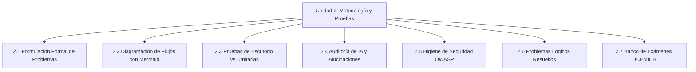
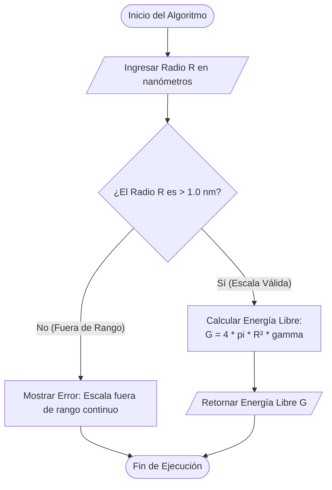
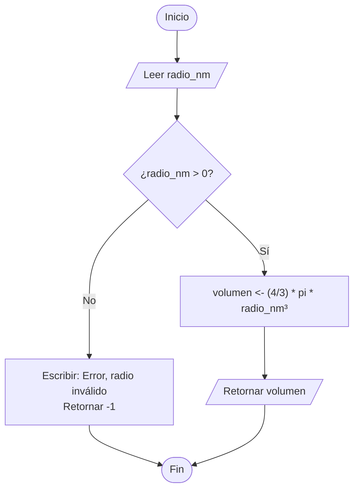

# UNIDAD 2: Metodología para Problemas Computables y Pruebas Unitarias

**Duración:** 1 semana (6 horas)  
**Curso:** Lógica de Programación y Desarrollo Agéntico con IA  
**Institución:** Universidad de la Ciénega del Estado de Michoacán de Ocampo (UCEMICH)  
**Carrera:** Ingeniería en Inteligencia Artificial y Nanotecnología  

[](https://colab.research.google.com/github/Multiagent-AI-Lab/Programming-Logic-Agentic-AI-Development/blob/master/notebooks/UNIDAD_2_METODOLOGIA_ALGORITMOS_PRUEBAS.ipynb)

```python
import sys
if 'google.colab' in sys.modules:
    %pip install -q mcp fastmcp chromadb rich
```

---

## 📚 OBJETIVOS DE APRENDIZAJE

Al finalizar esta unidad, el estudiante será capaz de:
1. **Formular formalmente** problemas físicos y de ingeniería a escala nanométrica, descomponiéndolos en algoritmos estructurados y deterministas.
2. **Diseñar diagramas de flujo** utilizando la sintaxis moderna de Mermaid, aplicándolo al control de flujos de ejecución en sistemas complejos.
3. **Implementar y ejecutar pruebas unitarias** robustas con `pytest` y la extensión interactiva `ipytest` para verificar algoritmos numéricos con alta precisión.
4. **Auditar código generado por herramientas de IA**, identificando alucinaciones conceptuales, errores lógicos sutiles de precisión y sesgos de cálculo.
5. **Aplicar prácticas rigurosas de higiene de seguridad** de acuerdo con los estándares OWASP (Open Web Application Security Project) para evitar la inyección de comandos, la evaluación insegura de código y la fuga de secretos de API.

---

## 📋 MAPA CONTENITIVO DE LA UNIDAD


<details>
<summary>Ver código fuente Mermaid (editable)</summary>



</details>

---

# 2.1 Formulación Formal de Problemas Computables

### Contexto Conceptual e Importancia
En la ingeniería moderna, un problema no puede ser resuelto por una computadora si primero no ha sido traducido a un modelo lógico explícito. Las computadoras son máquinas deterministas y carecen de intuición física. Por lo tanto, al modelar fenómenos termodinámicos, mecánicos o cuánticos en nanotecnología, debemos delimitar de manera matemática y lógica el sistema. 

La formulación formal consiste en descomponer cualquier problema en tres etapas fundamentales:
1. **Entrada (Input)**: Los datos iniciales conocidos, identificando su tipo de datos computacional (entero, flotante, cadena de texto) y sus límites físicos válidos (por ejemplo, temperaturas por encima del cero absoluto, o radios mayores que cero).
2. **Proceso (Process)**: El conjunto de ecuaciones matemáticas, restricciones lógicas y transformaciones algorítmicas que operan sobre los datos de entrada.
3. **Salida (Output)**: Los resultados esperados, especificando su formato, precisión requerida y las unidades de medida en las que se expresan.

> [!IMPORTANT]
> Un error común en el desarrollo de software científico es asumir que el lenguaje de programación validará automáticamente las leyes físicas. Si permitimos el ingreso de un radio negativo en un modelo de nanopartícula, el cálculo matemático se ejecutará arrojando resultados físicamente imposibles. La validación en el input es la primera línea de defensa del código.

---

### Analogía Simplificada (1): Diagramación Mermaid vs. Planos de Ingeniería Civil

Imagina que deseas construir un puente colgante de gran envergadura. Ningún ingeniero civil comenzaría a verter concreto o a soldar vigas de acero de inmediato sin antes dibujar esquemas detallados de la estructura, calcular las fuerzas de tensión, mapear la cimentación y someter los planos a revisiones rigurosas. 

```
┌────────────────────────────────────────────────────────┐
│               CONSTRUCCIÓN ESTRUCTURAL                 │
├──────────────────────────┬─────────────────────────────┤
│      Ingeniería Civil    │    Ingeniería de Software   │
├──────────────────────────┼─────────────────────────────┤
│  Planos Arquitectónicos  │   Diagramas de Flujo (Mermaid)│
│  Leyes de la Estática    │   Lógica de Programación    │
│  Inspección de Carga     │   Pruebas Unitarias (pytest)│
└──────────────────────────┴─────────────────────────────┘
```

En la programación agéntica y el desarrollo de software, la codificación sin un diagrama de flujo previo equivale a construir ese puente a ciegas. **Mermaid** actúa como nuestra herramienta de planos arquitectónicos digitales. Escribir la lógica en bloques visuales antes de implementar el código de producción nos permite identificar:
- Caminos sin salida (ciclos infinitos).
- Decisiones lógicas mal estructuradas (condicionales redundantes).
- Vacíos de control donde una variable podría quedar sin definir.

El uso de Mermaid permite que los planos del código residan directamente dentro de la documentación en formato Markdown, facilitando que los agentes de IA y los desarrolladores humanos verifiquen la coherencia estructural de los algoritmos sin necesidad de herramientas de dibujo externas.

---

### Explicación del Algoritmo de Tensión Superficial en Nanopartículas

Para ilustrar este principio, consideremos la modelación de la energía libre superficial de una nanopartícula. A escala nanométrica, la energía libre asociada a la tensión superficial es crítica debido a la enorme relación área/volumen. 

El modelo continuo tradicional asume que la energía superficial libre ($G_s$) de una esfera ideal está dada por la ecuación:
$$G_s = 4 \pi R^2 \gamma$$

Donde $R$ representa el radio de la partícula y $\gamma$ representa la tensión superficial del material. No obstante, si el radio de la nanopartícula es menor o igual a $1.0\text{ nm}$, las fluctuaciones atómicas individuales y los efectos cuánticos dominan, lo que significa que el modelo macroscópico continuo ya no es válido y debe descartarse.

A continuación, se define el diagrama de flujo en Mermaid que representa este algoritmo de validación y cálculo:


<details>
<summary>Ver código fuente Mermaid (editable)</summary>



</details>

---

## Pseudocódigo: El Puente entre la Idea y el Código

Antes de traducir un algoritmo a Python, lo escribimos en **pseudocódigo**: una notación estructurada, cercana al lenguaje natural, que no depende de la sintaxis de ningún lenguaje de programación específico. Escribir pseudocódigo obliga a pensar la lógica del problema sin distraerse todavía con paréntesis, dos puntos o indentación exacta.

### Convención de Pseudocódigo UCEMICH 2026

Toda la documentación del curso usa esta sintaxis estandarizada:

| Instrucción | Significado |
| :--- | :--- |
| `INICIO` / `FIN` | Delimitan el comienzo y el final del algoritmo. |
| `LEER variable` | Solicita un dato de entrada y lo guarda en `variable`. |
| `ESCRIBIR "texto", variable` | Muestra un mensaje y/o el valor de una variable. |
| `variable <- expresión` | Asignación: guarda el resultado de `expresión` en `variable`. |
| `SI condición ENTONCES ... SINO ... FIN_SI` | Estructura condicional. |
| `PARA i DESDE inicio HASTA fin HACER ... FIN_PARA` | Ciclo con número de iteraciones conocido. |
| `MIENTRAS condición HACER ... FIN_MIENTRAS` | Ciclo controlado por una condición. |
| `FUNCIÓN nombre(parámetros) ... RETORNAR valor ... FIN_FUNCIÓN` | Define una función reutilizable. |

### 💻 Ejemplo: Volumen de una Nanopartícula Esférica

Aplicamos el Hilo de Oro del curso: **Pseudocódigo → Mermaid → Python → pytest**. El problema: calcular el volumen de una nanopartícula esférica dado su radio en nanómetros, validando que el radio sea positivo.

**Paso 1 — Pseudocódigo:**
```pseudocodigo
FUNCIÓN calcular_volumen_esfera(radio_nm)
    SI radio_nm <= 0 ENTONCES
        ESCRIBIR "Error: el radio debe ser positivo"
        RETORNAR -1
    SINO
        volumen <- (4 / 3) * 3.14159 * radio_nm ** 3
        RETORNAR volumen
    FIN_SI
FIN_FUNCIÓN

INICIO
    LEER radio_particula
    resultado <- calcular_volumen_esfera(radio_particula)
    ESCRIBIR "Volumen calculado (nm³):", resultado
FIN
```

**Paso 2 — Diagrama Mermaid equivalente:**


<details>
<summary>Ver código fuente Mermaid (editable)</summary>



</details>

**Paso 3 — Traducción a Python:**
```python
def calcular_volumen_esfera(radio_nm: float) -> float:
    """Calcula el volumen de una nanopartícula esférica.

    Args:
        radio_nm: Radio de la partícula en nanómetros. Debe ser positivo.

    Returns:
        El volumen en nm³, o -1.0 si el radio no es válido.
    """
    if radio_nm <= 0:
        print("Error: el radio debe ser positivo")
        return -1.0
    volumen = (4 / 3) * 3.14159 * radio_nm ** 3
    return volumen
```

**Paso 4 — Prueba unitaria con pytest:**
```python
import pytest

def test_calcula_volumen_esfera_valida():
    assert calcular_volumen_esfera(1.0) == pytest.approx(4.18879, rel=1e-4)

def test_retorna_menos_uno_si_radio_no_positivo():
    assert calcular_volumen_esfera(0) == -1.0
    assert calcular_volumen_esfera(-5.2) == -1.0
```

**Paso 5 — Prueba de escritorio (trace table):** antes de ejecutar el código, se traza manualmente su comportamiento fila por fila, anotando el valor de cada variable en cada paso.

| Iteración | `radio_nm` (entrada) | ¿`radio_nm <= 0`? | `volumen` | Salida |
| :---: | :---: | :---: | :---: | :--- |
| 1 | `1.0` | No | `4.18879` | Retorna `4.18879` |
| 2 | `5.0` | No | `523.5983` | Retorna `523.5983` |
| 3 | `0` | Sí | (no se calcula) | `"Error..."`, retorna `-1` |
| 4 | `-3.2` | Sí | (no se calcula) | `"Error..."`, retorna `-1` |

Este flujo de 5 pasos (pseudocódigo → Mermaid → Python → pytest → prueba de escritorio) es la plantilla que se repite en cada concepto nuevo del curso.

📖 [Tipos y estructuras built-in de Python](https://ellibrodepython.com/python-built-in)

---

# 2.2 Implementación Robusta de Algoritmos en Python

### Contexto Conceptual e Importancia
Para traducir nuestro diagrama de flujo a código Python que se ejecute de manera profesional en un entorno de investigación o industria, debemos aplicar **tipado estricto**, **validación rigurosa de condiciones de frontera** y un **manejo estructurado de excepciones**. La robustez implica que el código debe fallar de forma controlada y explícita cuando reciba datos inválidos, en lugar de retornar valores basura o provocar caídas inesperadas del sistema.

---

### Explicación Matemática con LaTeX: El Área Superficial de una Nanopartícula

El área superficial $A$ de una nanopartícula esférica ideal es una función de su radio $R$, expresada matemáticamente como:

$$A(R) = 4 \pi R^2$$

Si representamos el radio en nanómetros ($\text{nm}$), el área resultante se expresará en nanómetros cuadrados ($\text{nm}^2$). 

Sin embargo, en el cómputo científico debemos validar los límites matemáticos del dominio de la función. Un radio de una partícula física real debe satisfacer la siguiente restricción estricta de dimensionalidad:

$$R \in \mathbb{R} \quad \Big| \quad R > 0$$

Además, para cálculos numéricos estables, el radio debe ser un número real finito:

$$R \notin \{-\infty, \infty, \text{NaN}\}$$

Donde $\text{NaN}$ (Not a Number) representa una indeterminación matemática. Si el código computa con valores infinitos o $\text{NaN}$, cualquier operación posterior se propagará destruyendo la consistencia del modelo.

---

### Código Python Completo (`calcular_area_nanoparticula`)

El siguiente bloque de código implementa esta función en Python bajo estándares UCEMICH, incorporando el tipado estricto con `typing.Union` y validaciones físicas minuciosas:

```python
import math
from typing import Union

def calcular_area_nanoparticula(radio: Union[float, int]) -> float:
    """Calcula el área superficial de una nanopartícula esférica ideal.

    Este cálculo se fundamenta en la aproximación del modelo continuo
    donde el área superficial A se define como: A = 4 * pi * R^2.

    Args:
        radio (Union[float, int]): El radio de la nanopartícula en nanómetros (nm).
            Debe ser un valor numérico real o entero estrictamente mayor que cero.

    Returns:
        float: El área superficial de la nanopartícula en nanómetros cuadrados (nm²).

    Raises:
        TypeError: Si la entrada 'radio' no es de tipo float o int (por ejemplo, si
            es string, None, booleano o colecciones).
        ValueError: Si la entrada 'radio' es un número no finito (NaN o infinito)
            o si es menor o igual a cero (físicamente inconsistente).
    """
    # 1. VALIDACIÓN DE TIPO (Anti-coerción de booleanos en Python)
    # En Python, isinstance(True, int) es True porque bool hereda de int.
    # Debemos bloquear explícitamente los booleanos para evitar falsos positivos.
    if not isinstance(radio, (int, float)) or isinstance(radio, bool):
        raise TypeError(
            f"Error de Tipo: El radio debe ser un valor numérico real (float o int). "
            f"Se recibió un objeto de tipo: {type(radio).__name__} con valor: {radio}"
        )
    
    # 2. VALIDACIÓN DE FINITUD NUMÉRICA
    # Previene el cálculo sobre valores indefinidos como infinito o NaN.
    if not math.isfinite(radio):
        raise ValueError(
            f"Error de Dominio: El radio debe ser un número real finito. "
            f"Se recibió: {radio}"
        )
        
    # 3. VALIDACIÓN DE COHERENCIA FÍSICA Y DIMENSIONAL
    # Una nanopartícula real no puede poseer dimensiones nulas o negativas.
    if radio <= 0.0:
        raise ValueError(
            f"Error de Dimensión: El radio de la nanopartícula debe ser estrictamente "
            f"positivo (mayor que cero). Se recibió: {radio}"
        )
        
    # 4. CÁLCULO MATEMÁTICO DE PRODUCCIÓN
    return 4.0 * math.pi * (radio ** 2)
```

---

### Desglose Paso a Paso de la Función

Analicemos de manera exhaustiva el flujo de control interno de la función:

1. **Definición de Firma y Tipado (`Union[float, int]`)**:
   Aceptamos tanto números enteros como decimales para el radio. Al especificar `-> float`, el intérprete y los linters estáticos saben que el retorno será siempre de punto flotante de doble precisión (IEEE 754).
   
2. **Filtro de Exclusión de Booleanos (`isinstance(radio, bool)`)**:
   En Python, el tipo `bool` es una subclase de `int`. Si no realizáramos esta validación secundaria, pasar `True` como parámetro de radio haría que la función computara `isinstance(True, (int, float))` como verdadero, procesando el valor interno `1` y arrojando una salida de `12.56` nm². Esto representaría una falla lógica grave.
   
3. **Verificación de Finitud (`math.isfinite`)**:
   La función `math.isfinite` comprueba que el valor no sea `nan`, `inf` o `-inf`. En simulaciones físicas moleculares de Monte Carlo o Dinámica Molecular, los errores numéricos de división por cero pueden generar infinitos. Si estos infinitos ingresan a nuestra función, el cálculo del área se vuelve inservible.
   
4. **Validación de Dimensión Física (`radio <= 0.0`)**:
   Un radio menor o igual a cero no tiene sentido geométrico. El algoritmo interrumpe el flujo y lanza un `ValueError` con un mensaje descriptivo y contextualizado, evitando cálculos erróneos en cascada.
   
5. **Cálculo de Área utilizando `math.pi`**:
   Se utiliza `math.pi` para obtener la representación más exacta disponible del número $\pi$ en hardware actual, minimizando errores de redondeo acumulativos.

---

# 2.3 Pruebas Unitarias Automatizadas

### Contexto Conceptual e Importancia
Las pruebas de escritorio tradicionales implican sentarse con lápiz y papel a simular los pasos del algoritmo para ciertos valores de entrada. Aunque esta práctica es excelente para que el estudiante principiante desarrolle lógica mental, es ineficiente y propensa a fallos humanos en el software de producción. 

Las **pruebas unitarias automatizadas** son bloques de código externos diseñados para interrogar a nuestras funciones bajo múltiples escenarios de estrés de manera instantánea. Su ejecución repetible garantiza que el código continúe operando de forma idéntica ante cualquier refactorización o cambio arquitectónico futuro.

---

### Analogía Simplificada (2): Pruebas Unitarias vs. Inspección de Tolerancias en Piezas Nanométricas con Microscopio Electrónico

Si fabricaras una serie de transistores nanométricos con compuertas de grafeno para un chip cuántico, no los ensamblarías en el circuito final esperando "a ver si funcionan". En su lugar, someterías a cada transistor individual a un proceso de inspección metrológica bajo un microscopio electrónico de barrido (SEM) o un microscopio de fuerza atómica (AFM). Medirías el ancho exacto del canal, la tolerancia de los átomos expuestos y su respuesta de conductancia ante pequeños voltajes. Si un componente individual se desvía de los límites definidos, es rechazado inmediatamente antes de integrarse al sistema.

```
                  [ FUNCIÓN BAJO PRUEBA ]
                             │
            ┌────────────────┴────────────────┐
     ¿Entrada Válida?                  ¿Entrada Inválida?
            │                                 │
     (Valores Reales)                 (NaN, Inf, Negativo)
            │                                 │
   [ Ejecuta Cálculo ]               [ Lanza Excepción ]
            │                                 │
   ¿Resultado en Tolerancia?          ¿Mensaje de Error Correcto?
            │                                 │
     (math.isclose)                  (pytest.raises)
            │                                 │
       ┌────┴────┐                       ┌────┴────┐
     [Sí]       [No]                   [Sí]       [No]
      │          │                      │          │
   (PASAR)    (FALLAR)               (PASAR)    (FALLAR)
```

En el desarrollo de software, la **Prueba Unitaria** actúa como ese microscopio de inspección atómica. En lugar de verificar el sistema completo, aislamos la función matemática más pequeña (la "unidad") y medimos su comportamiento. Introducimos valores típicos, extremos (el límite cuántico) e inválidos, asegurando que la función responda exactamente según los planos especificados.

---

### Explicación Matemática con LaTeX: Comparación de Punto Flotante y Tolerancia Relativa

En computación, los números decimales se representan usando el estándar de punto flotante de doble precisión IEEE 754. Debido a que el sistema decimal debe convertirse a binario en el hardware, números fraccionarios simples como $0.1$ o $0.2$ no pueden representarse con total exactitud, dando lugar a pequeños errores de redondeo. 

Por ejemplo, evaluar `0.1 + 0.2 == 0.3` en Python resulta en `False` debido a que:

$$0.1_{10} + 0.2_{10} = 0.30000000000000004_{10}$$

Por lo tanto, en pruebas científicas jamás debemos usar el operador de igualdad estricta `==` para comparar números reales. En su lugar, aplicamos la comparación por tolerancia con la función `math.isclose`, que evalúa la siguiente relación matemática:

$$|a - b| \le \max\left(\text{rel\_tol} \times \max(|a|, |b|), \text{abs\_tol}\right)$$

Donde:
* **$a$** es el valor calculado por nuestra función.
* **$b$** es el valor teórico o esperado de referencia.
* **$\text{rel\_tol}$** es la tolerancia relativa (por ejemplo, `1e-9` exige una coincidencia de al menos 9 dígitos significativos).
* **$\text{abs\_tol}$** es la tolerancia absoluta (útil cuando los valores de $a$ y $b$ están extremadamente cerca de cero, donde la tolerancia relativa pierde estabilidad numérica).

---

### Suite de Pruebas Unitarias Completa

A continuación, se detalla la suite de pruebas unitarias implementada con la sintaxis estándar de `pytest` e integrada para ejecución interactiva mediante `ipytest`:

```python
import pytest
import ipytest
import math

# Configuración interactiva para ejecutar dentro de un Notebook de Jupyter
ipytest.autoconfig()

# =====================================================================
# SUITE DE TESTING CON PYTEST
# =====================================================================

def test_calcular_area_valores_validos() -> None:
    """Valida el cálculo de área superficial con radios estándar e íntegros."""
    # Escenario 1: Radio = 1.0 nm. Área teórica: 4 * pi * 1.0 = 12.566370614359172...
    resultado_1 = calcular_area_nanoparticula(1.0)
    esperado_1 = 12.566370614359172
    assert math.isclose(resultado_1, esperado_1, rel_tol=1e-9, abs_tol=0.0)
    
    # Escenario 2: Radio = 5 nm. Área teórica: 4 * pi * 25.0 = 100 * pi
    resultado_2 = calcular_area_nanoparticula(5)
    esperado_2 = 4.0 * math.pi * 25.0
    assert math.isclose(resultado_2, esperado_2, rel_tol=1e-9, abs_tol=0.0)


def test_calcular_area_radios_muy_pequenos() -> None:
    """Valida el cálculo con radios en escalas físicas extremadamente pequeñas (sub-nanométricas)."""
    # Escenario 1: Radio en picómetros (1 pm = 1e-3 nm). R = 1e-3
    radio_pico = 1e-3
    esperado_pico = 4.0 * math.pi * (1e-6)
    assert math.isclose(calcular_area_nanoparticula(radio_pico), esperado_pico, rel_tol=1e-9)
    
    # Escenario 2: Radio en femtómetros (1 fm = 1e-6 nm). R = 1e-6
    radio_femto = 1e-6
    esperado_femto = 4.0 * math.pi * (1e-12)
    assert math.isclose(calcular_area_nanoparticula(radio_femto), esperado_femto, rel_tol=1e-9)
    
    # Escenario 3: Límite de precisión inferior extremo (R = 1e-18 nm)
    radio_limite = 1e-18
    esperado_limite = 4.0 * math.pi * (1e-36)
    assert math.isclose(calcular_area_nanoparticula(radio_limite), esperado_limite, rel_tol=1e-9)


def test_calcular_area_radio_cero() -> None:
    """Verifica que un radio de cero (límite físico nulo) lance un ValueError."""
    # El radio cero debe lanzar ValueError. Validamos el mensaje preciso.
    with pytest.raises(ValueError, match="El radio de la nanopartícula debe ser estrictamente positivo"):
        calcular_area_nanoparticula(0.0)
    with pytest.raises(ValueError, match="El radio de la nanopartícula debe ser estrictamente positivo"):
        calcular_area_nanoparticula(0)


def test_calcular_area_radios_negativos() -> None:
    """Valida que valores de radio negativos lancen un ValueError."""
    # Radios negativos no permitidos físicamente
    with pytest.raises(ValueError, match="El radio de la nanopartícula debe ser estrictamente positivo"):
        calcular_area_nanoparticula(-1.5)
    with pytest.raises(ValueError, match="El radio de la nanopartícula debe ser estrictamente positivo"):
        calcular_area_nanoparticula(-1e-9)


def test_calcular_area_entradas_no_numericas() -> None:
    """Verifica que tipos de datos no permitidos (strings, None, booleanos, listas) lancen un TypeError."""
    with pytest.raises(TypeError, match="El radio debe ser un valor numérico"):
        calcular_area_nanoparticula("1.0")  # type: ignore
    with pytest.raises(TypeError, match="El radio debe ser un valor numérico"):
        calcular_area_nanoparticula(None)  # type: ignore
    with pytest.raises(TypeError, match="El radio debe ser un valor numérico"):
        calcular_area_nanoparticula(True)  # type: ignore
    with pytest.raises(TypeError, match="El radio debe ser un valor numérico"):
        calcular_area_nanoparticula([1.0])  # type: ignore


def test_calcular_area_valores_no_finitos() -> None:
    """Verifica que el uso de números no finitos (NaN, Infinito) lance un ValueError."""
    with pytest.raises(ValueError, match="El radio debe ser un número real finito"):
        calcular_area_nanoparticula(float('nan'))
    with pytest.raises(ValueError, match="El radio debe ser un número real finito"):
        calcular_area_nanoparticula(float('inf'))
    with pytest.raises(ValueError, match="El radio debe ser un número real finito"):
        calcular_area_nanoparticula(float('-inf'))
```

---

### Desglose Paso a Paso de los Bloques de Prueba

* **`test_calcular_area_valores_validos`**: Prueba que los datos correctos generen las salidas correctas. Si ingresamos un radio flotante de `1.0` o entero de `5`, la función calcula el área con precisión matemática estricta y aprueba.
* **`test_calcular_area_radios_muy_pequenos`**: Comprueba la estabilidad numérica a escalas atómicas. Usamos constantes en notación científica como `1e-18` (escala subatómica). La tolerancia de `math.isclose` asegura que el redondeo decimal no afecte la validez del cálculo.
* **`test_calcular_area_radio_cero` y `test_calcular_area_radios_negativos`**: Hacen uso del administrador de contexto `with pytest.raises(ValueError, match=...)`. Esto le indica a pytest que la prueba pasará si y solo si la función en su interior falla y lanza una excepción de tipo `ValueError` cuyo mensaje contenga el texto indicado. Si la función calculara el área para un radio `-1.5` sin lanzar un error, la prueba fallaría automáticamente.
* **`test_calcular_area_entradas_no_numericas`**: Evalúa la resistencia frente a inyecciones de datos erróneos comunes cuando las APIs interactúan con la entrada del usuario. Los comentarios `# type: ignore` le indican a los analizadores estáticos de tipo de Python (como `mypy`) que deliberadamente estamos enviando datos incorrectos para probar las defensas en tiempo de ejecución.
* **`test_calcular_area_valores_no_finitos`**: Se asegura de que si un flujo de simulación de física matemática diverge y arroja un valor indeterminado, la función bloquee su propagación.

---

# 2.4 Detección de Alucinaciones en Código Generado por IA

### Contexto Conceptual e Importancia
Con la llegada de los modelos de lenguaje (LLMs) y los asistentes automáticos de desarrollo, la velocidad de escritura de código se ha multiplicado considerablemente. Sin embargo, los modelos de lenguaje son predictores probabilísticos de la siguiente palabra más probable; carecen de comprensión lógica, sentido común o conocimiento real de la física o las matemáticas. 

Esto genera las llamadas **alucinaciones de código**: funciones que parecen impecables y elegantes a simple vista, pero que contienen errores lógicos o de seguridad sutiles.

---

### Analogía Simplificada (3): Vibe Coding sin Auditoría vs. Construcción de un Puente sin la Firma de un Ingeniero Civil

El fenómeno conocido como *"Vibe Coding"* ocurre cuando un programador escribe software basándose únicamente en copiar y pegar fragmentos generados por IA, confiando en sus "buenas vibras" y asumiendo que "si corre, está bien". 

Esto es equivalente a construir un puente masivo simplemente contratando operarios para que vayan uniendo vigas metálicas que encontraron tiradas, sin planos validados matemáticamente y sin la firma de responsabilidad de un Ingeniero Civil matriculado. El puente podría mantenerse en pie temporalmente debido a la gravedad, pero se derrumbará catastróficamente al experimentar las vibraciones del tráfico o al recibir el impacto de un viento moderado.

```
       [ CONSTRUCTORES DE PUENTES ]
┌───────────────────────────────────────┐
│  Vibe Coder (Sin Auditoría)          │
│  - Copia código de la IA directamente. │
│  - No entiende el flujo matemático.   │
│  - No escribe pruebas de estrés.     │
│  - Riesgo: Colapso del software.      │
├───────────────────────────────────────┤
│  Ingeniero AI/Nanotecnología (Auditor)│
│  - Revisa línea por línea.            │
│  - Aplica validaciones físicas.       │
│  - Define suites de pruebas unitarias. │
│  - Código robusto y certificado.      │
└───────────────────────────────────────┘
```

En la UCEMICH, los futuros ingenieros en IA y Nanotecnología deben actuar como **auditores de arquitectura**. El código provisto por un agente inteligente o modelo generativo debe ser tratado únicamente como un borrador inicial. El rol del ingeniero es validarlo matemáticamente, verificar que cumpla con los límites de la física y estructurar las pruebas automatizadas necesarias antes de incorporarlo al proyecto.

---

# 2.5 Laboratorio de Higiene de Seguridad en Código Auditado (OWASP LLM)

### Contexto Conceptual e Importancia
Cuando el software que desarrollamos interactúa con usuarios, redes o con agentes inteligentes automatizados (desarrollo agéntico), se abre una superficie de ataque que puede ser explotada por usuarios maliciosos. El consorcio OWASP publica periódicamente las vulnerabilidades más comunes del software. 

A continuación, analizaremos detalladamente tres de las fallas de seguridad más graves en la programación científica y de inteligencia artificial:
1. **La evaluación insegura de expresiones utilizando `eval()`**: permite la inyección e interpretación de scripts dentro del flujo de la memoria del intérprete de Python.
2. **La inyección de comandos de terminal (Shell Injection)**: permite a un atacante ejecutar comandos a nivel de sistema operativo aprovechando malas implementaciones de bibliotecas como `subprocess` u `os.system`.
3. **Fuga de secretos y exposición de credenciales (Hardcoded Credentials)**: exponer claves de acceso o API keys de servicios en la nube en el repositorio de código.

---

### Explicación Paso a Paso de las Vulnerabilidades y sus Mitigaciones

#### 1. Evaluación Insegura con `eval()`
* **La falla**: La función incorporada `eval()` de Python toma un string de texto y lo ejecuta directamente en el entorno de ejecución de Python como si fuera código vivo. Si le pedimos al usuario que ingrese un diccionario que represente una configuración física (por ejemplo, `"{'temperatura': 300}"`) y lo procesamos con `eval()`, un atacante podría ingresar la cadena:
  `"__import__('os').system('format C:')"` o `"__import__('shutil').rmtree('.')"`
  Al evaluar esta cadena, Python importará el módulo del sistema operativo y borrará los archivos del servidor.
* **La mitigación**: Usar deserializadores estrictos y seguros que solo interpreten datos y no código. La librería estándar `json` mediante `json.loads()` analiza sintácticamente las llaves y valores asegurando que sean datos estáticos inofensivos.

#### 2. Inyección de Comandos Shell
* **La falla**: A veces los programas científicos necesitan interactuar con directorios o programas externos (compiladores de Fortran, motores de Dinámica Molecular como GROMACS, etc.). Si utilizamos `subprocess.run("dir " + ruta_usuario, shell=True)`, el argumento `shell=True` le pide al sistema operativo que ejecute un shell intermedio (cmd o bash) para procesar el comando. Si la variable `ruta_usuario` contiene caracteres delimitadores de comandos del sistema como `&`, `;` o `|`, el atacante puede encadenar comandos adicionales. Por ejemplo:
  `ruta_usuario = "C:\\Users & echo VULNERABLE"`
  Esto terminará ejecutando `dir C:\Users` y acto seguido ejecutará el comando inyectado `echo VULNERABLE`.
* **La mitigación**: Evitar llamadas al shell del sistema operativo. Utilizar las APIs nativas y seguras provistas por lenguajes modernos. Para listar directorios, se utiliza el módulo nativo `pathlib` o `os.listdir`, los cuales actúan directamente sobre la tabla de archivos del sistema sin abrir una consola intermedia interprete de comandos.

#### 3. Exposición de Secretos
* **La falla**: Al integrar nuestro código con APIs avanzadas de procesamiento de lenguaje o cálculo cuántico en la nube (como OpenAI o IBM Quantum), requerimos llaves de autenticación. Dejar estas claves escritas directamente en el archivo de código (`api_key = "sk-..."`) expone la clave al subir el archivo a repositorios públicos como GitHub.
* **La mitigación**: Utilizar variables de entorno a nivel del sistema operativo. El archivo `.env` almacena las claves en la máquina de desarrollo local de forma segura, y se agrega al archivo de control `.gitignore` para asegurar que nunca se suba al repositorio compartido.

---

### Código Python del Laboratorio (`seguridad_owasp.py`)

A continuación, se presenta la implementación del sistema que contrasta la versión insegura (vulnerable a inyecciones y fugas) con su respectiva solución mitigada y segura:

```python
import os
import sys
import json
import subprocess
from typing import Dict, Any
from pathlib import Path

# =====================================================================
# 1. EVALUACIÓN DE ENTRADAS JSON (Vulnerable vs Seguro)
# =====================================================================

def parsear_inseguro(datos_str: str) -> Any:
    """Parsea una cadena de texto de entrada de forma vulnerable usando eval.
    
    Peligro: eval() interpreta y ejecuta código de Python embebido
    en el string de entrada en vez de interpretarlo como datos estáticos.

    Args:
        datos_str (str): Cadena de texto a evaluar.

    Returns:
        Any: El diccionario o tipo interpretado resultante.
    """
    # ¡VULNERABILIDAD CRÍTICA! Ejecución de código arbitrario.
    # Si datos_str es: "__import__('os').system('echo COMPROMETIDO')"
    # eval lo ejecutará con los privilegios del intérprete.
    return eval(datos_str)


def parsear_seguro(datos_str: str) -> Dict[str, Any]:
    """Deserializa y valida de forma segura un JSON sin ejecutar código.

    Mitigación: Utiliza la librería estándar 'json' que solo deserializa
    tipos de datos estáticos y valida estrictamente las claves y los tipos.

    Args:
        datos_str (str): Cadena JSON que contiene la configuración del sensor.

    Returns:
        Dict[str, Any]: Diccionario con los datos parseados y validados.

    Raises:
        ValueError: Si la entrada no es un JSON válido o carece de campos obligatorios.
        TypeError: Si los campos no corresponden con el tipo esperado.
    """
    try:
        # Deserialización segura sin ejecución de scripts
        config: Any = json.loads(datos_str)
        
        # Validamos que el resultado sea de hecho una estructura de datos tipo diccionario
        if not isinstance(config, dict):
            raise ValueError("El JSON debe estructurarse como un objeto/diccionario.")
            
        # Validación estricta de esquema y tipos
        campos_obligatorios = ["limite_temperatura", "id_sensor"]
        for campo in campos_obligatorios:
            if campo not in config:
                raise ValueError(f"Falta el campo obligatorio requerido: '{campo}'")
                
        if not isinstance(config["limite_temperatura"], (int, float)):
            raise TypeError("El campo 'limite_temperatura' debe ser numérico (int o float).")
            
        if not isinstance(config["id_sensor"], str):
            raise TypeError("El campo 'id_sensor' debe ser una cadena de texto (str).")
            
        return config

    except json.JSONDecodeError as err:
        raise ValueError(f"Error de formato JSON: Entrada no válida. Detalles: {err}")


# =====================================================================
# 2. INYECCIÓN DE COMANDOS (Vulnerable vs Seguro)
# =====================================================================

def ejecutar_comando_inseguro(ruta: str) -> str:
    """Lista un directorio usando concatenación de strings y shell=True.
    
    Vulnerabilidad: El uso de shell=True y la concatenación de variables externas permite
    al atacante encadenar comandos del sistema operativo (delimitadores &, ;, |).

    Args:
        ruta (str): Directorio del sistema a listar.

    Returns:
        str: La salida por consola del comando del sistema.
    """
    # Si la entrada es ". & echo COMPROMETIDO", se ejecutan ambos comandos en el OS
    comando = f"dir {ruta}" if os.name == "nt" else f"ls {ruta}"
    proceso = subprocess.run(
        comando,
        shell=True,
        stdout=subprocess.PIPE,
        stderr=subprocess.PIPE,
        text=True
    )
    return proceso.stdout if proceso.returncode == 0 else proceso.stderr


def ejecutar_comando_seguro(ruta: str) -> str:
    """Lista un directorio utilizando APIs nativas seguras en Python.

    Mitigación: 
    1. Evitar por completo lanzar llamadas al shell del sistema (subprocess con shell=True).
    2. Utilizar librerías de la biblioteca estándar como pathlib que no interpretan comandos shell.

    Args:
        ruta (str): Directorio del sistema a listar.

    Returns:
        str: Cadena con el resultado seguro de listado de archivos.

    Raises:
        ValueError: Si la ruta no existe o es inválida.
    """
    try:
        # Se resuelve la ruta de forma absoluta para evitar rutas relativas engañosas
        path = Path(ruta).resolve()
        if not path.exists():
            return f"Error: La ruta '{ruta}' no existe."
        if not path.is_dir():
            return f"Error: '{ruta}' no es un directorio válido."

        # Solución nativa sin subprocesses ni llamadas a consolas
        archivos = [f.name for f in path.iterdir()]
        return "Archivos del directorio:\n" + "\n".join(archivos)
    except Exception as e:
        raise ValueError(f"Acceso de archivo inválido u operación denegada: {e}")


# =====================================================================
# 3. PREVENCIÓN DE FUGAS DE API KEYS (Vulnerable vs Seguro)
# =====================================================================

def obtener_api_key_insegura() -> str:
    """Ejemplo vulnerable de clave dura (hardcoded) en código de producción.
    
    Returns:
        str: API Key en texto plano expuesta al repositorio.
    """
    return "sk-proj-VulnerableHardcodedKeyExample12345"


def obtener_api_key_segura() -> str:
    """Ejemplo seguro cargando variables de entorno mediante el módulo os.

    Mitigación: Separar configuración de código cargando valores del entorno.
    El archivo '.env' local debe excluirse del control de versiones usando '.gitignore'.

    Returns:
        str: Clave API recuperada del entorno del sistema.

    Raises:
        KeyError: Si la variable de entorno 'OPENAI_API_KEY' no está configurada.
    """
    # Se lee de forma segura desde las variables de entorno locales del sistema
    api_key = os.environ.get("OPENAI_API_KEY")
    if not api_key:
        raise KeyError(
            "Error de Configuración de Seguridad: La variable 'OPENAI_API_KEY' no está definida.\n"
            "Configure su archivo local '.env' o declare la variable de entorno en su terminal."
        )
    return api_key
```

---

# 2.6 Problemas Lógicos Resueltos

A continuación se presentan tres problemas matemáticos y lógicos resueltos con enfoque pedagógico. Cada problema sigue la estructura unificada de la lección para servir como guía de estudio.

---

### Problema Lógico 1: Cálculo del Número de Coordinación Promedio en una Nanopartícula Monodispersa

#### Contexto conceptual e importancia
El número de coordinación ($CN$) representa la cantidad de átomos vecinos más cercanos que posee un átomo dentro de la estructura cristalina de una nanopartícula. En la superficie, los átomos están subcoordinados (tienen menos vecinos), lo que les otorga una alta reactividad química, clave en la catálisis a escala nanométrica. En el núcleo del clúster (bulk), los átomos alcanzan la coordinación ideal del cristal puro (e.g., $CN = 12$ para estructuras cúbicas centradas en las caras - FCC). 

Este algoritmo calcula la estimación teórica del número de coordinación promedio ponderado de una nanopartícula metálica de radio dado.

#### Explicación matemática con LaTeX
El número de coordinación promedio ponderado $\langle CN \rangle$ se calcula estimando la fracción de átomos en la superficie $f_s$ y en el núcleo $f_b = 1 - f_s$:

$$\langle CN \rangle = f_s \cdot CN_s + (1 - f_s) \cdot CN_b$$

Donde:
* **$CN_s$** es el número de coordinación de los átomos superficiales (usualmente aproximado a $8.0$).
* **$CN_b$** es el número de coordinación en el bulk ($12.0$).
* **$f_s$** es la fracción de dispersión (fracción de átomos en la superficie), estimada para clústeres esféricos como:
  $$f_s = \frac{4 \cdot d_{at}}{D}$$
  donde $d_{at}$ es el diámetro atómico del metal y $D$ es el diámetro total de la nanopartícula ($D = 2 \cdot R$). Esta aproximación física es válida si $D > 2 \cdot d_{at}$.

#### Código Python Completo

```python
def calcular_coordinacion_promedio(radio_np: float, diametro_atomo: float) -> float:
    """Calcula el número de coordinación promedio ponderado en una nanopartícula esférica.

    Args:
        radio_np (float): Radio de la nanopartícula en nanómetros (nm).
        diametro_atomo (float): Diámetro promedio del átomo individual en nm.

    Returns:
        float: El número de coordinación promedio estimado (adimensional).

    Raises:
        TypeError: Si los parámetros no son numéricos.
        ValueError: Si los valores son infinitos, NaN o físicamente imposibles.
    """
    if not isinstance(radio_np, (int, float)) or isinstance(radio_np, bool):
        raise TypeError("El radio de la nanopartícula debe ser un valor numérico.")
    if not isinstance(diametro_atomo, (int, float)) or isinstance(diametro_atomo, bool):
        raise TypeError("El diámetro del átomo debe ser un valor numérico.")
        
    if not math.isfinite(radio_np) or not math.isfinite(diametro_atomo):
        raise ValueError("Los parámetros ingresados deben ser valores numéricos finitos.")
        
    if radio_np <= 0.0 or diametro_atomo <= 0.0:
        raise ValueError("Las dimensiones físicas ingresadas deben ser estrictamente positivas.")
        
    diametro_np = 2.0 * radio_np
    
    # Comprobar límite de validez física del modelo
    if diametro_np <= 2.0 * diametro_atomo:
        raise ValueError("El tamaño de la nanopartícula es demasiado pequeño para este modelo continuo.")
        
    # Calcular fracción de átomos en superficie
    f_s = (4.0 * diametro_atomo) / diametro_np
    
    # Limitar físicamente la fracción a 1.0 (no puede haber más de 100% de átomos en superficie)
    if f_s > 1.0:
        f_s = 1.0
        
    cn_s = 8.0  # Coordinación típica en superficie
    cn_b = 12.0 # Coordinación típica en el bulk FCC
    
    return f_s * cn_s + (1.0 - f_s) * cn_b
```

#### Pruebas Unitarias Correspondientes

```python
def test_calcular_coordinacion_promedio_validos() -> None:
    # Caso 1: Nanopartícula de R = 2.0 nm, Diámetro atómico = 0.2 nm (D_np = 4.0 nm)
    # f_s = (4 * 0.2) / 4.0 = 0.8 / 4.0 = 0.2
    # CN_prom = 0.2 * 8.0 + 0.8 * 12.0 = 1.6 + 9.6 = 11.2
    assert math.isclose(calcular_coordinacion_promedio(2.0, 0.2), 11.2, rel_tol=1e-9)

def test_calcular_coordinacion_excepciones() -> None:
    # Tamaño físicamente inconsistente (Nanopartícula menor que el tamaño atómico)
    with pytest.raises(ValueError, match="El tamaño de la nanopartícula es demasiado pequeño"):
        calcular_coordinacion_promedio(0.1, 0.3)
```

#### Síntesis de Resultados
El algoritmo permite evaluar cómo disminuye el número de coordinación al contraerse el tamaño de la nanopartícula, evidenciando por qué a escala nanométrica los materiales modifican de manera tan radical su reactividad química catalítica.

---

### Problema Lógico 2: Estimación de la Fracción de Átomos Superficiales (Dispersión) en Clústeres Metálicos

#### Contexto conceptual e importancia
La dispersión ($D_{isp}$) es un parámetro crítico en nanocatálisis, definido como la fracción de átomos de una nanopartícula metálica que están expuestos en la superficie y listos para interactuar con reactivos químicos. Un clúster con alta dispersión aprovecha mucho mejor el metal activo (como platino u oro).

#### Explicación matemática con LaTeX
Para un clúster esférico ideal con empaquetamiento hexagonal compacto o cúbico centrado en las caras, la dispersión se relaciona directamente con el radio $R$ y el radio atómico $r_{at}$:

$$D_{isp} = \frac{N_s}{N_t} \approx \frac{3 \cdot r_{at}}{R}$$

Donde:
* **$N_s$** es el número de átomos superficiales.
* **$N_t$** es el número total de átomos.
* **$r_{at}$** es el radio del átomo del metal en $\text{nm}$.
* **$R$** es el radio total de la nanopartícula en $\text{nm}$.
* La ecuación es válida para $R \ge 3 \cdot r_{at}$.

#### Código Python Completo

```python
def calcular_dispersion_metalica(radio_np: float, radio_atomo: float) -> float:
    """Estima la fracción de dispersión atómica de una nanopartícula metálica.

    Args:
        radio_np (float): El radio de la nanopartícula (nm).
        radio_atomo (float): El radio atómico del elemento constituyente (nm).

    Returns:
        float: La fracción de dispersión (valor entre 0.0 y 1.0).

    Raises:
        ValueError: Si los valores contradicen las restricciones físicas.
    """
    if not isinstance(radio_np, (int, float)) or isinstance(radio_np, bool):
        raise TypeError("El radio de la nanopartícula debe ser numérico.")
    if not isinstance(radio_atomo, (int, float)) or isinstance(radio_atomo, bool):
        raise TypeError("El radio atómico debe ser numérico.")
        
    if radio_np <= 0.0 or radio_atomo <= 0.0:
        raise ValueError("Los radios deben ser estrictamente positivos.")
        
    if radio_np < 3.0 * radio_atomo:
        raise ValueError("El radio de la nanopartícula es inferior al límite de tres capas atómicas.")
        
    dispersion = (3.0 * radio_atomo) / radio_np
    
    # Asegurar cota superior física
    return min(dispersion, 1.0)
```

#### Pruebas Unitarias Correspondientes

```python
def test_calcular_dispersion_validos() -> None:
    # R = 1.5 nm, r_atomo = 0.15 nm
    # Dispersion = 3 * 0.15 / 1.5 = 0.45 / 1.5 = 0.30 (30% expuestos)
    assert math.isclose(calcular_dispersion_metalica(1.5, 0.15), 0.3, rel_tol=1e-9)

def test_calcular_dispersion_error_limite() -> None:
    # Si R < 3 * r_atomo, debe lanzar ValueError
    with pytest.raises(ValueError, match="El radio de la nanopartícula es inferior al límite"):
        calcular_dispersion_metalica(0.3, 0.15)
```

#### Síntesis de Resultados
El cálculo refleja que al duplicar el radio de una nanopartícula de platino, la eficiencia de átomos expuestos disminuye a la mitad. Esto justifica el esfuerzo tecnológico por sintetizar catalizadores con el menor diámetro posible.

---

### Problema Lógico 3: Filtrado y Validación de Datos de Microscopía de Fuerza Atómica (AFM)

#### Contexto conceptual e importancia
Un microscopio de fuerza atómica (AFM) escanea la topografía de una muestra a escala nanométrica. A veces, debido a la vibración mecánica externa del laboratorio o al desgaste de la punta del cantiléver, el escáner produce picos de lectura aberrantes o valores ruidosos (outliers) que alteran el cálculo de la rugosidad de la superficie. 

Este algoritmo toma una lista de mediciones de altura del AFM y filtra cualquier valor fuera de un rango de seguridad aceptable.

#### Explicación matemática con LaTeX
Dado un vector de mediciones de altura $H = \{h_1, h_2, \dots, h_n\}$, definimos el rango de validez física según los límites físicos del hardware del AFM:

$$h_i \in \mathbb{R} \quad \Big| \quad h_{min} \le h_i \le h_{max}$$

Donde:
* **$h_{min}$** es la altura mínima del rango dinámico del sensor piezoeléctrico.
* **$h_{max}$** es la altura máxima (limite de elongación del actuador piezoeléctrico).
* Cualquier lectura $h_i$ fuera de este intervalo se clasifica como outlier por ruido electrónico y debe removerse del cálculo.

#### Código Python Completo

```python
from typing import List

def filtrar_lecturas_afm(alturas: List[float], h_min: float, h_max: float) -> List[float]:
    """Filtra y elimina lecturas de altura anómalas obtenidas por el sensor del AFM.

    Args:
        alturas (List[float]): Lista de valores de altura leídos por el microscopio en nm.
        h_min (float): Cota inferior de seguridad en nm.
        h_max (float): Cota superior de seguridad en nm.

    Returns:
        List[float]: Nueva lista con las alturas que están estrictamente dentro de la ventana de tolerancia.

    Raises:
        TypeError: Si los parámetros no cumplen con el tipado de entrada esperado.
        ValueError: Si los límites de control están mal definidos (h_min >= h_max).
    """
    if not isinstance(alturas, list):
        raise TypeError("Las alturas a analizar deben presentarse en una estructura de datos de lista.")
    if not isinstance(h_min, (int, float)) or not isinstance(h_max, (int, float)):
        raise TypeError("Los valores límites h_min y h_max deben ser numéricos reales.")
        
    if h_min >= h_max:
        raise ValueError("El límite mínimo h_min debe ser estrictamente menor que el límite máximo h_max.")
        
    lecturas_filtradas: List[float] = []
    
    for h in alturas:
        # Validación individual del tipo de dato de cada elemento de la lista
        if not isinstance(h, (int, float)) or isinstance(h, bool):
            raise TypeError(f"Elemento de tipo incorrecto detectado en la lista: {type(h).__name__}")
            
        if not math.isfinite(h):
            # Omitimos valores no finitos de la lectura por considerarse ruido extremo
            continue
            
        # Comprobar la pertenencia al intervalo cerrado de seguridad
        if h_min <= h <= h_max:
            lecturas_filtradas.append(float(h))
            
    return lecturas_filtradas
```

#### Pruebas Unitarias Correspondientes

```python
def test_filtrar_lecturas_afm_comportamiento() -> None:
    datos = [1.2, 5.5, 10.0, -0.5, float('nan'), 120.0, 3.4]
    # Rango de seguridad: 0.0 a 10.0 nm.
    # Valores esperados: 1.2, 5.5, 10.0, 3.4
    resultado = filtrar_lecturas_afm(datos, 0.0, 10.0)
    esperado = [1.2, 5.5, 10.0, 3.4]
    
    assert len(resultado) == len(esperado)
    for res, esp in zip(resultado, esperado):
        assert math.isclose(res, esp, rel_tol=1e-9)

def test_filtrar_lecturas_afm_excepciones() -> None:
    # Error por límites incoherentes
    with pytest.raises(ValueError, match="El límite mínimo h_min debe ser estrictamente menor"):
        filtrar_lecturas_afm([1.0, 2.0], 5.0, 2.0)
```

#### Síntesis de Resultados
El algoritmo provee una base de filtrado determinista rápida que elimina artefactos de medición antes de computar métricas rugométricas clave como el promedio aritmético de rugosidad ($R_a$).

---

# 2.7 Banco de Preguntas de Examen (Opciones Múltiples)

Este banco de preguntas de opción múltiple está diseñado para desafiar la comprensión conceptual de lógica, programación y seguridad a nivel de ingeniería de primer semestre de la UCEMICH.

---

### Pregunta 1
**Enunciado:** En Python, ¿por qué la instrucción `isinstance(True, int)` retorna `True`?
- **A)** Porque el intérprete tiene un error de tipado dinámico débil incorporado que unifica booleanos con enteros.
- **B)** Porque a nivel de diseño del lenguaje Python, la clase `bool` es una subclase de `int`, lo que causa que los booleanos hereden las propiedades de los enteros (`True == 1` y `False == 0`).
- **C)** Porque los compiladores JIT optimizan todos los booleanos a nivel del procesador como valores lógicos binarios de un solo bit.
- **D)** Solo ocurre si el programador importa el módulo `math` al inicio del script.

* **Clave de Respuesta Correcta: B**
* **Justificación Didáctica Detallada:**
  - **A es incorrecta** porque no se trata de un error aleatorio del intérprete, sino de una decisión arquitectónica consciente tomada en los inicios de Python para garantizar compatibilidad hacia atrás.
  - **B es correcta** ya que, históricamente en Python, los booleanos no existían de forma nativa en sus primeras versiones (se usaba `1` y `0`). Cuando se introdujo el tipo `bool`, se modeló heredando de `int` para que el código antiguo no se rompiera. Esto causa que `isinstance(True, int)` y `True + True == 2` sean válidos en Python.
  - **C es incorrecta** porque es una explicación sobre compilación JIT que no aplica al funcionamiento básico del modelo de clases de CPython.
  - **D es incorrecta** ya que el comportamiento de herencia booleano es parte del núcleo global de Python y no depende de ninguna biblioteca externa.

---

### Pregunta 2
**Enunciado:** Deseas verificar si una nanopartícula metálica de radio $R$ calculada por un algoritmo de dinámica molecular es geométricamente equivalente a una de referencia de radio $R_{ref} = 3.5\text{ nm}$. ¿Cuál es la forma correcta de evaluar esta condición en el código de producción?
- **A)** `if R == R_ref:`
- **B)** `if math.isclose(R, R_ref, rel_tol=1e-9):`
- **C)** `if abs(R - R_ref) == 0.0:`
- **D)** `if R is R_ref:`

* **Clave de Respuesta Correcta: B**
* **Justificación Didáctica Detallada:**
  - **A es incorrecta** ya que los cálculos de dinámica molecular acumulan infinitesimales errores de redondeo de punto flotante binario. El operador `==` fallará si existe la mínima discrepancia en el bit 53 de la mantisa.
  - **B es correcta** porque `math.isclose` implementa la tolerancia relativa exigida por la física matemática y la especificación IEEE 754, garantizando robustez ante errores de redondeo decimal menores.
  - **C es incorrecta** porque restar y comparar directamente contra `0.0` mediante `==` presenta exactamente los mismos problemas de la igualdad estricta.
  - **D es incorrecta** porque el operador `is` en Python compara la identidad del objeto en la dirección física de la memoria RAM (`id(a) == id(b)`), no su equivalencia numérica.

---

### Pregunta 3
**Enunciado:** Tienes una variable `radio` ingresada por un usuario y ejecutas la siguiente línea: `eval("math.pi * (" + radio + " ** 2)")`. ¿Qué vulnerabilidad crítica de seguridad estás introduciendo de acuerdo con el estándar OWASP?
- **A)** Fuga de credenciales en repositorios públicos.
- **B)** Inyección de Comandos a nivel del Shell del Sistema.
- **C)** Ejecución de código Python arbitrario (Inyección de Código mediante la función `eval`).
- **D)** Alucinación matemática por cálculo cuántico indefinido.

* **Clave de Respuesta Correcta: C**
* **Justificación Didáctica Detallada:**
  - **A es incorrecta** porque no estamos exponiendo contraseñas ni API keys en texto plano en esta instrucción.
  - **B es incorrecta** porque la inyección no va dirigida a la consola del sistema operativo (Shell), sino a la máquina virtual interna de ejecución de Python.
  - **C es correcta** debido a que `eval` interpretará cualquier comando que el usuario introduzca en la cadena `radio`. Si el usuario ingresa un string destructivo, Python ejecutará esa lógica maliciosa con todos los permisos del proceso.
  - **D es incorrecta** ya que es una alucinación teórica del distractor.

---

### Pregunta 4
**Enunciado:** Si un linter te alerta de un posible error por usar la función `math.isfinite` para validar entradas científicas, ¿cuál de los siguientes casos ilustra por qué es indispensable usarla?
- **A)** El número de Euler ($e$) es irracional, por lo que la función no permitirá cálculos logarítmicos continuos.
- **B)** Si una operación matemática previa diverge y genera un valor `NaN` (Not a Number) o `inf`, pasarlo a la función de cálculo del área sin esta validación provocará que todo el sistema posterior propague el error numérico, generando salidas corruptas difíciles de rastrear.
- **C)** Para asegurar que la nanopartícula no exceda la escala macroscópica de más de un metro de longitud física.
- **D)** Para evitar que Python asuma que los números complejos son flotantes.

* **Clave de Respuesta Correcta: B**
* **Justificación Didáctica Detallada:**
  - **A es incorrecta** ya que $e$ es una constante finita y no causa fallas en `math.isfinite`.
  - **B es correcta** puesto que las operaciones matemáticas que involucran infinitos o valores indefinidos (`NaN`) en Python continúan retornando `NaN` o infinitos de forma automática. Al validar de forma proactiva con `math.isfinite(x)`, detenemos tempranamente la simulación y lanzamos una excepción limpia.
  - **C es incorrecta** porque `math.isfinite` comprueba que el valor sea finito numéricamente a nivel computacional, no restringe dimensiones físicas espaciales (eso se hace con `radio <= 0`).
  - **D es incorrecta** dado que `math.isfinite` no está pensada para separar números complejos de flotantes (de hecho, lanza un error si se le pasa directamente un número complejo).

---

### Pregunta 5
**Enunciado:** ¿Cuál es la analogía pedagógica correcta entre el modelado de algoritmos mediante diagramación Mermaid y la ingeniería estructural?
- **A)** Los diagramas Mermaid son equivalentes a las pruebas de resistencia mecánica que se hacen con microscopios ópticos.
- **B)** Mermaid representa los planos de ingeniería civil y estructurales que garantizan la integridad y la secuencia lógica del sistema antes de comenzar a verter código vivo.
- **C)** El diagrama de flujo es como el puente ya construido por los albañiles que no necesita mantenimiento posterior.
- **D)** Mermaid equivale a la firma de responsabilidad colegiada que previene la inyección de comandos shell.

* **Clave de Respuesta Correcta: B**
* **Justificación Didáctica Detallada:**
  - **A es incorrecta** porque la inspección microscópica se asocia con las pruebas unitarias automatizadas (`pytest`), no con la diagramación del flujo del programa.
  - **B es correcta** ya que un diagrama de flujo en Mermaid representa la planificación estructural y lógica. Muestra el esqueleto del código antes de que este sea escrito, permitiendo diagnosticar cuellos de botella de control o callejones sin salida.
  - **C es incorrecta** porque el puente construido representa al código en producción, no a los planos lógicos iniciales.
  - **D es incorrecta** debido a que un diagrama en Mermaid no tiene mecanismos automáticos de prevención de ataques informáticos (eso es parte de la higiene de código).

---

### Pregunta 6
**Enunciado:** ¿Cuál de los siguientes comandos de Python representa un riesgo crítico de inyección de comandos en el sistema operativo (Shell Injection) si se expone a entradas externas?
- **A)** `os.listdir(ruta)`
- **B)** `subprocess.run("ls -la " + ruta, shell=True)`
- **C)** `json.loads(ruta)`
- **D)** `pathlib.Path(ruta).iterdir()`

* **Clave de Respuesta Correcta: B**
* **Justificación Didáctica Detallada:**
  - **A es incorrecta** ya que `os.listdir` utiliza APIs internas del sistema de archivos y no invoca un intérprete shell secundario para procesar la ruta.
  - **B es correcta** debido a que concatenar la variable `ruta` en combinación con `shell=True` le instruye a Python a enviar la cadena completa a la consola de comandos de la máquina anfitriona. Un atacante puede colar comandos encadenados con operadores de la consola (como `; rm -rf /`).
  - **C es incorrecta** porque `json.loads` es un analizador de estructuras sintácticas de datos y no tiene ninguna capacidad para interactuar con los comandos de la consola del sistema operativo.
  - **D es incorrecta** ya que `pathlib` es una envoltura de objetos nativos del sistema de archivos sumamente robusta que no pasa por consolas de comandos intermedias.

---

### Pregunta 7
**Enunciado:** En la validación de la función `calcular_area_nanoparticula`, ¿por qué se realiza la comprobación `if not isinstance(radio, (int, float)) or isinstance(radio, bool):`?
- **A)** Para forzar a Python a que los números se conviertan a números reales de punto flotante automáticamente.
- **B)** Para excluir valores booleanos como `True` o `False` que en Python heredan de `int` y que de otro modo pasarían la validación inicial de tipo y causarían un cálculo erróneo del área.
- **C)** Porque los booleanos son convertidos automáticamente a cadenas por el compilador interno de CPython.
- **D)** Para evitar que la función se congele si la memoria del microprocesador está saturada.

* **Clave de Respuesta Correcta: B**
* **Justificación Didáctica Detallada:**
  - **A es incorrecta** ya que `isinstance` solo verifica tipos de datos, no realiza conversiones automáticas (como sí lo haría la función `float()`).
  - **B es correcta** porque de no excluir explícitamente a los booleanos (`isinstance(radio, bool)`), enviar la constante lógica `True` a la función no dispararía el error de tipo debido a la herencia nativa de tipos de Python, y computaría un radio de 1.0 nm.
  - **C es incorrecta** ya que Python no convierte booleanos a strings a menos que se invoque explícitamente `str()`.
  - **D es incorrecta** dado que la comprobación no tiene impacto en la gestión de memoria física del hardware del computador.

---

### Pregunta 8
**Enunciado:** ¿Cuál es la principal debilidad del "Vibe Coding" o desarrollo de software dependiente de IA sin auditoría según la analogía de la ingeniería civil?
- **A)** El costo elevado de contratar ingenieros especializados en inteligencia artificial.
- **B)** La falta de pruebas lógicas y validaciones estructuradas que garantizan que el código no colapse catastróficamente ante entradas imprevistas o límites físicos inusuales.
- **C)** La incompatibilidad de Python con los sistemas de cómputo cuántico.
- **D)** Que los diagramas de Mermaid no se pueden compilar en el procesador.

* **Clave de Respuesta Correcta: B**
* **Justificación Didáctica Detallada:**
  - **A es incorrecta** porque el costo de contratación no es el foco del debate sobre la calidad técnica del software generado.
  - **B es correcta** puesto que delegar ciegamente la programación a la IA sin un entendimiento causal e ingenieril del código y sin suites de pruebas automatizadas equivale a construir estructuras físicas sin validar la resistencia de materiales.
  - **C es incorrecta** porque el problema del vibe coding no tiene relación con el hardware de cómputo cuántico en la actualidad.
  - **D es incorrecta** ya que Mermaid es un formato de dibujo basado en texto que sirve para documentar y diseñar, nunca para compilarse en lenguaje máquina.

---

### Pregunta 9
**Enunciado:** ¿Para qué sirve el parámetro `rel_tol` en la función `math.isclose(a, b, rel_tol=1e-9)`?
- **A)** Para forzar a que el cálculo matemático use una tolerancia de redondeo de solo 9 decimales en lugar de los 16 del estándar flotante.
- **B)** Para especificar la tolerancia relativa permitida entre los números comparados, calculando que su diferencia absoluta sea proporcional al valor absoluto más grande de las entradas.
- **C)** Para asegurar que no se inyecten comandos SQL a través de los valores flotantes.
- **D)** Para descartar la parte entera de los números reales antes de realizar la comparación lógica.

* **Clave de Respuesta Correcta: B**
* **Justificación Didáctica Detallada:**
  - **A es incorrecta** porque `math.isclose` no trunca ni modifica el almacenamiento de los números en la memoria del microprocesador.
  - **B es correcta** ya que la tolerancia relativa escala de acuerdo a la magnitud de los números que se están comparando, lo que la hace matemáticamente estable tanto para comparar masas atómicas ($10^{-27}$) como masas estelaares ($10^{30}$).
  - **C es incorrecta** porque `math.isclose` no es una herramienta de ciberseguridad para evitar inyecciones SQL en bases de datos.
  - **D es incorrecta** puesto que descartar la parte entera rompería por completo la precisión del cálculo matemático.

---

### Pregunta 10
**Enunciado:** Si un programador de software científico publica su código en GitHub con la línea `OPENAI_API_KEY = "sk-proj-a1b2c3d4..."`, ¿cómo califica esta acción según el marco de higiene de seguridad OWASP?
- **A)** Exposición insegura por inyección de comandos en el shell local.
- **B)** Vulnerabilidad crítica de exposición de secretos de API (Hardcoded Secrets).
- **C)** Uso correcto de variables dinámicas globales en Python.
- **D)** Alucinación matemática por falta de uso del módulo `math`.

* **Clave de Respuesta Correcta: B**
* **Justificación Didáctica Detallada:**
  - **A es incorrecta** porque no se está ejecutando ningún comando en la consola del sistema a través de esta variable.
  - **B es correcta** ya que subir contraseñas o claves criptográficas duras en el código es una de las fallas más comunes de OWASP. Cualquier robot de rastreo de internet puede leer la clave del repositorio público y consumirla ilegalmente en minutos, generando cargos financieros al desarrollador.
  - **C es incorrecta** dado que incrustar claves criptográficas directamente en el código de producción viola los principios básicos de la higiene de ciberseguridad.
  - **D es incorrecta** porque no tiene ninguna relación con alucinaciones generadas por modelos de lenguaje ni con el módulo de operaciones matemáticas.

---

### Pregunta 11
**Enunciado:** ¿Cuál es la principal ventaja de utilizar la extensión de Jupyter `ipytest` en las clases prácticas de la UCEMICH?
- **A)** Permite compilar código de Python a lenguaje C para acelerar el microscopio AFM.
- **B)** Permite ejecutar la suite de pruebas de `pytest` interactivamente en las celdas del propio cuaderno, sin tener que alternar a una consola del sistema o editor externo.
- **C)** Traduce de forma automática el código de Python a sintaxis de Mermaid para documentación.
- **D)** Evita tener que usar variables de entorno para las API keys.

* **Clave de Respuesta Correcta: B**
* **Justificación Didáctica Detallada:**
  - **A es incorrecta** porque `ipytest` no compila a C ni se comunica con el hardware físico del microscopio AFM.
  - **B es correcta** puesto que Jupyter es el entorno educativo estándar de la carrera. `ipytest` proporciona un puente directo para configurar, instanciar y verificar los test en el mismo cuaderno interactivo.
  - **C es incorrecta** ya que no realiza conversiones de código a diagramas de flujo de Mermaid.
  - **D es incorrecta** dado que las pruebas de software y el manejo seguro de llaves de API son aspectos conceptuales ortogonales.

---

### Pregunta 12
**Enunciado:** ¿Qué ocurre si pasamos la constante `float('inf')` a la función `calcular_area_nanoparticula` cuando no existe la comprobación de finitud `math.isfinite`?
- **A)** La función retorna inmediatamente `0.0` debido a la dilución atómica extrema.
- **B)** Python levanta una excepción nativa automática del microprocesador llamada `InfiniteMemoryError`.
- **C)** La función retorna `inf` como resultado del área superficial, propagando un valor inválido que arruinará los análisis volumétricos siguientes.
- **D)** El compilador entra en un ciclo de reloj infinito congelando la computadora del estudiante.

* **Clave de Respuesta Correcta: C**
* **Justificación Didáctica Detallada:**
  - **A es incorrecta** ya que multiplicar cualquier número positivo por el infinito físico matemático de punto flotante en Python sigue resultando en infinito positivo, nunca en cero.
  - **B es incorrecta** porque Python no posee ninguna excepción predefinida en su intérprete con el nombre de `InfiniteMemoryError`.
  - **C es correcta** debido a que la aritmética flotante IEEE 754 define que $4 \cdot \pi \cdot \infty^2 = \infty$. Si este valor infinito no es interceptado por un filtro protector, se integrará en las siguientes funciones del programa destruyendo los modelos físicos.
  - **D es incorrecta** dado que el cálculo es instantáneo y no genera bloqueos de bucles de hardware en la computadora.

---

### Pregunta 13
**Enunciado:** En la analogía metrológica de la nanotecnología, ¿qué representa la suite de pruebas unitarias automatizada?
- **A)** El operario de la fábrica que une piezas al azar.
- **B)** El microscopio electrónico de inspección metrológica que mide las tolerancias estructurales de cada componente aislado antes de validarlo.
- **C)** El puente metálico completo sometido a la prueba final de tráfico.
- **D)** Las variables de entorno de seguridad del servidor central.

* **Clave de Respuesta Correcta: B**
* **Justificación Didáctica Detallada:**
  - **A es incorrecta** porque el operario representa al programador o al generador de código, no a las herramientas automatizadas de control de calidad.
  - **B es correcta** ya que las pruebas unitarias analizan de manera aislada las sub-funciones lógicas más pequeñas del código para garantizar que cada componente mantenga sus tolerancias intactas frente a cambios del sistema.
  - **C es incorrecta** porque el puente completo representa al sistema de software final integrado y en producción (lo que se validaría con pruebas de sistema o extremo a extremo, no unitarias).
  - **D es incorrecta** debido a que no tiene relación conceptual alguna con el microscopio metrológico ni con la suite de pruebas unitarias.

---

### Pregunta 14
**Enunciado:** Al programar código para nanotecnología, ¿cuál es el peligro de omitir la prueba de que un radio de `0` lance una excepción en `test_calcular_area_radio_cero`?
- **A)** Que el código asuma que una nanopartícula con radio cero tiene una masa infinita.
- **B)** Que la función de producción retorne un área de `0.0` nm², lo cual contradice las leyes fundamentales de la materia y de la termodinámica al modelar sistemas reales.
- **C)** Que el microscopio AFM no pueda encenderse en el laboratorio del campus.
- **D)** Que el servidor de base de datos SQL se inunde con tablas vacías automáticamente.

* **Clave de Respuesta Correcta: B**
* **Justificación Didáctica Detallada:**
  - **A es incorrecta** porque calcular un área con radio cero dará un área de cero, no de infinito.
  - **B es correcta** ya que en la simulación física real, permitir partículas virtuales de dimensiones nulas desestabiliza las densidades y relaciones energía/volumen del software de modelado, arrojando resultados absurdos pero que no se detienen si no se obliga a la función a fallar explícitamente en el radio cero.
  - **C es incorrecta** porque las funciones del código de simulación son independientes del circuito eléctrico de encendido del microscopio AFM físico del laboratorio.
  - **D es incorrecta** debido a que la falta de una validación geométrica no afecta la infraestructura de persistencia de bases de datos.

---

### Pregunta 15
**Enunciado:** En la mitigación de inyección de comandos shell en Python, ¿por qué el uso de `pathlib.Path` es preferible a lanzar comandos de terminal?
- **A)** Porque `pathlib` encripta los nombres de los archivos antes de enviarlos a la nube.
- **B)** Porque interactúa directamente con el núcleo del sistema de archivos a través de llamadas de sistema nativas y tipadas, sin necesidad de invocar un intérprete de comandos shell intermedio que pueda evaluar caracteres inyectados de control.
- **C)** Porque es el único módulo de Python compatible con sistemas Linux.
- **D)** Porque reduce el consumo de energía eléctrica del hardware de forma automatizada.

* **Clave de Respuesta Correcta: B**
* **Justificación Didáctica Detallada:**
  - **A es incorrecta** porque `pathlib` no encripta información ni sube archivos a redes de forma automática.
  - **B es correcta** dado que al prescindir de una terminal (como cmd o bash) para interactuar con los directorios, las inyecciones de comandos pierden su canal de ataque, puesto que `pathlib` trata la entrada únicamente como una ruta textual rígida, no como comandos ejecutables del sistema operativo.
  - **C es incorrecta** porque la librería estándar de Python tiene múltiples formas compatibles con Linux y Windows para gestionar directorios de manera segura.
  - **D es incorrecta** ya que el impacto de consumo energético a nivel de procesador por usar pathlib frente a subprocess es insignificante y no es el motivo principal por el cual se aplica como medida de seguridad.

---

# 2.8 Síntesis de Resultados de la Unidad

Al dominar esta unidad, los ingenieros de la UCEMICH adoptan una disciplina de desarrollo basada en la rigurosidad científica y la ciberseguridad. A continuación se presenta una matriz sintética de buenas prácticas a implementar en todo desarrollo futuro de la carrera:

| Práctica Tradicional (Vulnerable/Manual) | Práctica Profesional UCEMICH | Beneficio en Nanotecnología y Computación |
| :--- | :--- | :--- |
| Pruebas de escritorio manuales en papel. | Pruebas unitarias automatizadas con `pytest` y `ipytest`. | Garantía de consistencia matemática repetible ante cambios de versión. |
| Uso de operadores lógicos `==` para flotantes. | Uso de comparaciones de punto flotante mediante `math.isclose`. | Evita fallos lógicos fantasmas causados por la aritmética IEEE 754. |
| Programación en base a "vibras" directas de la IA. | Auditoría arquitectónica formal del código y diseño de diagramas Mermaid. | Prevención de alucinaciones teóricas y errores de lógica termodinámica. |
| Uso de `eval()` e invocaciones shell (`subprocess.run(shell=True)`). | Parsing estructurado con `json.loads` y gestión de archivos con `pathlib`. | Blindaje del sistema contra inyecciones de código y comandos no autorizados. |
| Hardcoding de contraseñas y llaves criptográficas. | Uso de archivos locales `.env` y variables de entorno ocultas en `.gitignore`. | Prevención de robos de identidad computacional y costos financieros por API. |

---

## 🛠️ Herramientas de esta Unidad

**TutorAgent** — resuelve tus dudas conceptuales sobre el contenido de esta unidad, citando la sección exacta de origen:

```python
from pathlib import Path
from src.multiagent_core.tutor_agent import TutorAgent

tutor = TutorAgent(course_dir=Path("."))
print(tutor.ask("¿cómo se escribe una prueba de escritorio para una función con pseudocódigo?"))
```

No requiere configuración adicional más allá de tu `GEMINI_API_KEY` (ver Unidad 0, sección 0.9).

### PseudocodeAgent — verifica tu Hilo de Oro

Escribe tu solución en pseudocódigo UCEMICH y visualiza su diagrama de flujo antes de traducir a Python:

```python
from src.multiagent_core.pseudocode_agent import PseudocodeAgent

agent = PseudocodeAgent()
mi_pseudocodigo = """
FUNCIÓN calcular_volumen_esfera(radio_nm)
    SI radio_nm <= 0 ENTONCES
        RETORNAR -1
    SINO
        volumen <- (4 / 3) * 3.14159 * radio_nm ** 3
        RETORNAR volumen
    FIN_SI
FIN_FUNCIÓN
"""
print(agent.pseudocode_to_mermaid(mi_pseudocodigo))
```

Copia el resultado en [mermaid.live](https://mermaid.live) para verlo renderizado, o pégalo en una celda Markdown de este notebook dentro de un bloque `` `mermaid ``.

### CodeAuditorAgent y EvaluatorAgent — audita tu código antes de entregar

Corre tu propio código a través del auditor y el evaluador antes de entregarlo, para detectar problemas de estilo, seguridad, o saber tu calificación aproximada contra la rúbrica:

```python
from src.multiagent_core.code_auditor_agent import CodeAuditorAgent
from src.multiagent_core.evaluator_agent import EvaluatorAgent

mi_codigo = """
def calcular_area(radio):
    return 3.14159 * radio ** 2
"""

auditor = CodeAuditorAgent()
print(auditor.generate_report(mi_codigo))

evaluador = EvaluatorAgent()
resultado = evaluador.evaluate(mi_codigo)
print(resultado["retroalimentacion"])
```
