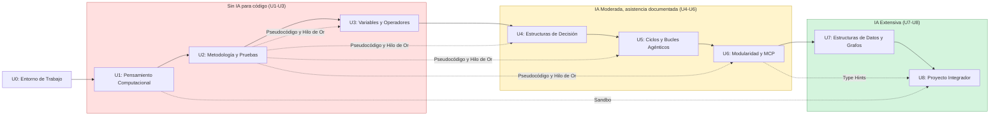

# UNIDAD 0: Entorno de Trabajo y Primer Programa

**Duración:** Sesión inicial (previa a Unidad 1)

**Curso:** Lógica de Programación y Desarrollo Agéntico con IA

**Institución:** Universidad de la Ciénega del Estado de Michoacán de Ocampo (UCEMICH)

**Profesor:** Luis José Yudico Anaya

**Carrera:** Ingeniería en Nanotecnología

**Nivel:** Primer Semestre

[](https://colab.research.google.com/github/Multiagent-AI-Lab/Programming-Logic-Agentic-AI-Development/blob/master/notebooks/UNIDAD_0_ENTORNO_Y_PRIMER_PROGRAMA.ipynb)

```python
import os
import sys

if 'google.colab' in sys.modules:
    repo_dir = "Programming-Logic-Agentic-AI-Development"
    if not os.path.exists(repo_dir):
        !git clone -q https://github.com/Multiagent-AI-Lab/{repo_dir}.git
    os.chdir(repo_dir)
    %pip install -q mcp fastmcp chromadb rich
```

---

## 📚 OBJETIVOS DE APRENDIZAJE

Al finalizar esta unidad, el estudiante será capaz de:
1. **Instalar y configurar** correctamente Python 3.11 en Windows, incluyendo la variable de entorno PATH.
2. **Distinguir cuándo usar** cada herramienta del curso: IDLE, Visual Studio Code, Google Colab y Antigravity IDE.
3. **Ejecutar su primer programa** en Python y verificar que el entorno del curso (`ia_logprog`) está correctamente instalado.
4. **Activar su cuenta de GitHub Education** y comprender qué herramientas incluye.
5. **Identificar la política de uso de IA** vigente para cada etapa del semestre, antes de comenzar a programar.

> [!IMPORTANT]
> **Política de IA — Unidades 1, 2 y 3: SIN IA para escribir código.**
> Durante las primeras tres unidades del curso, todo el código debe ser escrito manualmente por el estudiante. El uso de IA está permitido únicamente para resolver dudas conceptuales (no para generar o corregir código). Esta política se relaja progresivamente a partir de la Unidad 4. Ver la tabla completa en la sección 0.5 de esta unidad.

---

# 0.1 Herramientas del Curso: Cuándo Usar Cada Una

A lo largo del semestre se utilizan cuatro entornos distintos. Ninguno reemplaza a los demás: cada uno tiene un propósito pedagógico específico.

| Herramienta | Cuándo usarla | Unidades |
| :--- | :--- | :--- |
| **IDLE** | Primer contacto con Python. Interfaz mínima, sin distracciones, ideal para entender el intérprete y escribir los primeros programas de una sola línea. | U0, primeras sesiones de U1 |
| **Visual Studio Code** | Desarrollo del curso completo. Editor profesional con terminal integrada, control de versiones (Git) y extensión de Python. Es el entorno de trabajo principal desde U1 hasta U8. | U1–U8 |
| **Google Colab** | Modalidad híbrida/online, o cuando se necesita ejecutar notebooks sin instalar nada localmente. Todos los notebooks del curso incluyen una celda de instalación automática para Colab. | Todas (opcional/respaldo) |
| **Antigravity IDE** | Sesiones donde se practica el flujo de trabajo con asistentes de IA de forma estructurada (a partir de U4, cuando se habilita el Copiloto). | U4–U8 |

### 💡 Analogía Didáctica: La Caja de Herramientas del Taller

Un ingeniero no usa un martillo para todo. IDLE es el destornillador simple: rápido, directo, para ajustes pequeños. VS Code es la mesa de trabajo completa, con todas las herramientas organizadas y a la mano. Colab es el taller portátil que se lleva a cualquier lugar sin cargar equipo pesado. Antigravity es el asistente de taller que trabaja junto al ingeniero, pero que siempre necesita supervisión.

---

# 0.2 Instalación de Python 3.11 en Windows

## Paso a Paso

1. **Descargar el instalador**: ir a [python.org/downloads](https://www.python.org/downloads/) y descargar la versión **3.11.x** para Windows (64-bit).
2. **Ejecutar el instalador** y, en la primera pantalla, marcar obligatoriamente la casilla:
   ```
   ☑ Add python.exe to PATH
   ```
   Este paso es el más común de olvidar y la causa más frecuente de errores `'python' no se reconoce como un comando interno o externo`.
3. Seleccionar **"Install Now"** (instalación estándar) o **"Customize installation"** si se desea elegir la ruta de instalación manualmente.
4. Al finalizar, abrir una **nueva** ventana de PowerShell (las ventanas ya abiertas no detectan el cambio de PATH) y verificar:
   ```powershell
   python --version
   ```
   Debe mostrar `Python 3.11.x`.

### ⚠️ Problema Común: "python no se reconoce como un comando"

Si al ejecutar `python --version` PowerShell no reconoce el comando, significa que el PATH no se configuró correctamente. Solución:
1. Reinstalar Python marcando explícitamente "Add python.exe to PATH", o
2. Agregar manualmente la ruta de instalación a las Variables de Entorno del sistema (`Panel de Control → Sistema → Configuración avanzada → Variables de entorno`).

---

# 0.3 Tu Primer Programa en IDLE

IDLE se instala automáticamente junto con Python. Para abrirlo, escribir `IDLE` en el menú de inicio de Windows.

### 💻 Ejemplo: Hola Mundo

1. En IDLE, ir a `File → New File`.
2. Escribir la siguiente línea:
   ```python
   print("Bienvenido a UCEMICH")
   ```
3. Guardar el archivo como `hola_mundo.py` (`File → Save`).
4. Ejecutar con `Run → Run Module` (o la tecla `F5`).
5. En la consola de IDLE debe aparecer:
   ```
   Bienvenido a UCEMICH
   ```

Este es el programa más simple posible: le pedimos a la computadora que muestre un mensaje en pantalla usando la función `print()`. Todo el resto del curso construye sobre esta idea básica: instrucciones que la computadora ejecuta en orden, una tras otra.

---

# 0.4 Configuración del Entorno del Curso (`ia_logprog`)

El curso utiliza un entorno conda aislado llamado `ia_logprog`, con todas las dependencias necesarias (Python 3.11, Jupyter, pytest, librerías de agentes de IA, etc.) ya definidas en `environment.yml`.

## Instalación

```powershell
# 1. Crear el entorno a partir del archivo de configuración
conda env create -f environment.yml

# 2. Activar el entorno (repetir cada vez que se abra una terminal nueva)
conda activate ia_logprog

# 3. Registrar el kernel para usarlo en Jupyter/notebooks
python -m ipykernel install --user --name=ia_logprog --display-name "Python 3.11 (ia_logprog)"
```

Si el entorno ya existe y solo se necesita actualizar con nuevas dependencias:
```powershell
conda env update -f environment.yml
```

## Guía Rápida de PowerShell

| Comando | Descripción |
| :--- | :--- |
| `dir` | Lista los archivos del directorio actual (equivalente a `ls`) |
| `cd nombre_carpeta` | Cambia al directorio indicado |
| `cd ..` | Sube un nivel en el árbol de directorios |
| `mkdir nombre` | Crea una carpeta nueva |
| `python archivo.py` | Ejecuta un script de Python |
| `conda activate ia_logprog` | Activa el entorno del curso |

---

# 0.5 Política de Uso de IA del Semestre

La política de IA no es uniforme: cambia según la etapa del curso, para garantizar que el estudiante primero domine la lógica manualmente antes de delegar tareas a un asistente.

| Unidades | Nivel de IA permitido | Detalle |
| :--- | :--- | :--- |
| **U1, U2, U3** | **Sin IA para código.** | Solo se permite IA para consultas conceptuales (p. ej. "¿qué es una variable?"). Ningún código entregado puede haber sido generado por IA. |
| **U4, U5, U6** | **GitHub Copilot habilitado.** | El estudiante puede usar Copiloto, pero debe documentar el prompt utilizado en el README del entregable, y ser capaz de explicar y auditar cada línea generada. |
| **U7, U8** | **IA como herramienta principal.** | El estudiante diseña la arquitectura y usa IA extensamente para generar código, pero debe auditar, corregir y defender cada decisión. |
| **Exámenes** | **CERO IA.** | Solo lectura, corrección manual y trazabilidad del propio conocimiento. |
| **Defensa oral** | **CERO IA.** | Las respuestas deben ser del estudiante, sin asistencia de ningún modelo. |

> [!TIP]
> Esta progresión (Manual → Copiloto → Arquitecto) es intencional: primero se construye el criterio para *auditar* código, y solo después se delega su *escritura*. Un estudiante que nunca escribió un `for` a mano no puede detectar cuándo la IA generó un bucle incorrecto.

---

# 0.6 GitHub Education

Todos los estudiantes de la UCEMICH tienen acceso gratuito a GitHub Copilot y otras herramientas mediante GitHub Education.

## Pasos de Activación

1. Ir a [education.github.com/students](https://education.github.com/students).
2. Iniciar sesión con una cuenta de GitHub (crear una si no se tiene, usando el correo institucional si es posible).
3. Completar la solicitud del "Student Developer Pack" verificando la inscripción a la UCEMICH.
4. Una vez aprobada (puede tardar de horas a pocos días), GitHub Copilot queda disponible gratuitamente para uso académico.
5. Instalar la extensión de GitHub Copilot en Visual Studio Code desde la pestaña de Extensiones.

Este acceso se activa **antes** de llegar a la Unidad 4, para que esté listo cuando la política de IA lo habilite.

---

# 0.7 Checklist de Verificación del Entorno

Antes de la primera sesión de la Unidad 1, el estudiante debe poder marcar los 10 puntos siguientes:

- [ ] 1. `python --version` en PowerShell muestra `Python 3.11.x`.
- [ ] 2. IDLE abre correctamente desde el menú de inicio.
- [ ] 3. Se ejecutó y guardó el programa `hola_mundo.py` con éxito.
- [ ] 4. Visual Studio Code está instalado, con la extensión de Python activa.
- [ ] 5. `conda --version` responde sin errores (Anaconda o Miniconda instalado).
- [ ] 6. El entorno `ia_logprog` fue creado con `conda env create -f environment.yml`.
- [ ] 7. `conda activate ia_logprog` activa el entorno sin errores.
- [ ] 8. El kernel `ia_logprog` aparece disponible al abrir un notebook en Jupyter/VS Code.
- [ ] 9. La cuenta de GitHub Education fue solicitada (aprobación puede estar pendiente).
- [ ] 10. Se leyó y comprendió la tabla de política de IA de la sección 0.5.
- [ ] 11. Se leyó la sección 0.10 y se entiende cómo usar la celda de auto-evaluación en las Unidades 2, 3, 4 y 6.

---

# 0.8 El Libro de Python: Cómo Usarlo Correctamente

A lo largo de las 9 unidades encontrarás links a [ellibrodepython.com](https://ellibrodepython.com/) al final de las secciones teóricas relevantes. Es importante entender **qué rol cumple** para no confundirlo con el material principal del curso.

| | Rol |
| :--- | :--- |
| **Las unidades (`UNIDAD_0`–`UNIDAD_8`)** | Son el **currículo oficial**. Definen el orden en que se aprenden los conceptos, aplicados siempre al contexto de nanotecnología, siguiendo una progresión deliberada (por ejemplo, la escalera básica de la Unidad 5 antes de llegar a integradores numéricos, o la entrada gradual de la Unidad 3 antes de estructuras de datos complejas). |
| **El Libro de Python** | Es **material de consulta y refuerzo**, no la fuente que dicta la secuencia del curso. Sirve para: (1) profundizar en la sintaxis "pura" de un tema ya visto en clase, (2) practicar ejercicios adicionales fuera de horario, (3) resolver dudas puntuales de sintaxis que no requieren el contexto nanotecnológico. |

### 💡 Analogía Didáctica: El Manual del Fabricante

Las unidades del curso son como el instructor que te enseña a operar una máquina específica, en el orden correcto y con los ejercicios pensados para tu proyecto. El Libro de Python es como el manual técnico del fabricante: exhaustivo, bien escrito, útil para consultar un detalle específico — pero nadie aprende a operar la máquina leyendo el manual de principio a fin sin el instructor.

### ⚠️ Recordatorio de la Política de IA

Consultar el Libro de Python **no es usar IA** — es lectura de un recurso humano igual que un libro de texto impreso. Sin embargo, si estás en Unidades 1-3 (política "sin IA para código", sección 0.5) y usas un asistente de IA para resolver los ejercicios *del libro*, sigues rompiendo la política del curso en esa etapa. La restricción es sobre el uso de IA para escribir código, no sobre qué material de consulta lees.

---

# 0.9 Tu Tutor Personal: TutorAgent

El curso incluye un agente tutor que responde dudas conceptuales citando exactamente la sección de las unidades donde está la respuesta — a diferencia de un asistente genérico, `TutorAgent` conoce el contenido específico de este curso.

## Obtener tu API Key gratuita de Gemini

1. Ir a [aistudio.google.com/apikey](https://aistudio.google.com/apikey) e iniciar sesión con tu cuenta de Google.
2. Hacer clic en "Create API Key" — es gratuito, no requiere tarjeta de crédito para el tier básico.
3. Copiar la key generada.
4. Guardarla como variable de entorno **antes** de instanciar `TutorAgent`:
   - **En tu máquina local (VS Code)**, con un archivo `.env` en la raíz del proyecto (recomendado):
     ```
     GEMINI_API_KEY=tu_clave_aqui
     ```
     o en PowerShell, para la sesión actual:
     ```powershell
     $env:GEMINI_API_KEY = "tu_clave_aqui"
     ```
   - **En Google Colab**, usa el gestor de Secrets (ícono de llave 🔑 en la barra lateral izquierda): crea un secreto llamado `GEMINI_API_KEY` (o `GOOGLE_API_KEY`, la celda de abajo acepta cualquiera de los dos nombres) con tu key como valor, y actívalo para este notebook ("Notebook access" / "Acceso al notebook"). Nunca pegues la key directamente en una celda, ya que quedaría guardada en el notebook si lo compartes.

> [!IMPORTANT]
> Cada alumno debe generar **su propia** API key. No compartas la tuya ni uses una key ajena — el tier gratuito tiene un límite de peticiones por minuto/día, y compartir una sola key entre el grupo la agotaría rápido para todos.

> [!WARNING]
> `TutorAgent` lee `GEMINI_API_KEY` de `os.environ` **una sola vez, al importar el módulo** (no en cada pregunta). Si en Colab lees el secreto en una celda separada y DESPUÉS ejecutas el import, la key llega tarde y `tutor.ask(...)` fallará con `DefaultCredentialsError` aunque el secreto esté bien configurado. Por eso la celda de abajo establece la variable de entorno **antes** del `import` — no la separes en dos celdas.

## Cómo usar TutorAgent en cualquier notebook

Cada unidad de este curso incluye una celda "🛠️ Herramientas de esta unidad" al final. Para `TutorAgent`, instáncialo **una sola vez** por notebook y reutiliza la misma variable. En Colab, esta celda lee tu key desde Secrets **antes** de importar el módulo — prueba primero `GEMINI_API_KEY` y, si no existe con ese nombre, `GOOGLE_API_KEY`:

```python
import os
import sys
from pathlib import Path

if 'google.colab' in sys.modules:
    from google.colab import userdata
    for nombre_secreto in ("GEMINI_API_KEY", "GOOGLE_API_KEY"):
        try:
            os.environ["GEMINI_API_KEY"] = userdata.get(nombre_secreto)
            break
        except Exception:
            continue
    else:
        print(
            "⚠️ No se encontró el secreto GEMINI_API_KEY ni GOOGLE_API_KEY en Colab. "
            "Créalo en el ícono de llave 🔑 de la barra lateral izquierda "
            "(ver Unidad 0, sección 0.9)."
        )

from src.multiagent_core.tutor_agent import TutorAgent

# Instanciar una sola vez (abrir el índice tiene un costo fijo ~0.3s)
tutor = TutorAgent(course_dir=Path("lecciones"))
```

Prueba el tutor con una pregunta de ejemplo:

```python
# Reutiliza la variable "tutor" en cualquier celda posterior para preguntar
print(tutor.ask("¿qué es una variable?"))
```

Nota: la primera vez que ejecutes esto en una sesión nueva de Colab, `TutorAgent` indexa las 9 unidades del curso (tarda unos segundos); en ejecuciones posteriores en la misma máquina es instantáneo. Si `course_dir` no apunta a la raíz del repositorio (por ejemplo, tras un `git clone` en una ruta distinta en Colab), ajusta la ruta al directorio donde están los archivos `UNIDAD_*.md`.

📖 Referencia: [aistudio.google.com](https://aistudio.google.com/apikey)

---

# 0.10 Auto-evaluación: Calificación Automática en tu Propio Notebook

Algunas unidades (2, 3, 4 y 6) incluyen una celda "🧪 Auto-evaluación" al final del notebook. Al correrla, tu propio código se analiza automáticamente y recibes un reporte con retroalimentación contra la Rúbrica Genérica del curso (`RUBRICA_GENERAL.md`) — sin esperar a que el profesor revise tu entrega manualmente.

> [!TIP]
> Es una herramienta para practicar e iterar, no un reemplazo de la calificación oficial. El resultado no se guarda ni se envía a ningún lado — es feedback solo para ti, en esa sesión de Colab.

## Cómo funciona, según la unidad

Verás **uno de dos mecanismos**, dependiendo de cómo esa unidad ya te enseñó a escribir pruebas:

**Unidad 2 — automático, sin pasos extra.** Ya escribiste tu función y sus pruebas en celdas anteriores del notebook. Solo corre la celda de auto-evaluación: encuentra tu código automáticamente (por el nombre de la función que pide el ejercicio) y lo evalúa. No necesitas hacer nada más.

**Unidades 3, 4 y 6 — un paso adicional: guardar tu código en un archivo real.** Estas unidades usan funciones o clases que dependen de constantes definidas en la misma celda (por ejemplo, `K_COULOMB` en la Unidad 3) — la auto-evaluación necesita tu código completo, no solo el cuerpo de una función suelta, así que debes guardarlo en disco antes de evaluarlo:

1. Debajo de tu celda de solución (y debajo de tu celda de pruebas) verás una celda nueva, corta, que empieza con `%%writefile <nombre>.py` seguida de un comentario tipo `# Pega aquí tu código de la celda anterior` (en unidades donde la solución está repartida en más de un bloque, el comentario lo indica explícitamente, por ejemplo "los dos bloques de definiciones que escribiste arriba").
2. Reemplaza ese comentario pegando el código indicado (tu solución completa, o tus pruebas completas, según la celda).
3. Corre esa celda — `%%writefile` es una instrucción especial de Colab que guarda el contenido de la celda como un archivo de verdad, en vez de solo ejecutarlo en memoria.
4. Repite para la celda de pruebas.
5. Ahora sí, corre la celda de auto-evaluación al final de la unidad.

> [!WARNING]
> Si corres la celda de auto-evaluación sin haber completado estos pasos, verás un mensaje claro indicándote qué falta (por ejemplo, "⚠️ Aún no has guardado: fisica_atomica.py") — no un error críptico de Python. Simplemente completa el paso que falta y vuelve a intentar.

## ¿Por qué dos mecanismos distintos?

No es inconsistencia: cada unidad usa el mecanismo que corresponde a cómo ya aprendiste a probar tu código ahí. La Unidad 2 evalúa funciones sueltas con sus pruebas en el mismo notebook (`ipytest`); las Unidades 3, 4 y 6 te preparan para el patrón real de un proyecto de software — código en un archivo `.py`, pruebas en otro — por eso ahí sí guardas archivos de verdad antes de evaluar.

---

# 0.11 Mapa del Curso: Dependencias entre Unidades

El curso avanza en un orden estrictamente secuencial (Unidad 0 a Unidad 8) — no hay rutas alternativas. Este diagrama hace visibles dos cosas que de otro modo solo viven en prosa dispersa: en qué momento cambia el nivel de asistencia de IA permitido (ver política de la sección 0.5), y qué unidades reutilizan explícitamente un concepto técnico ya introducido en una unidad anterior (flechas punteadas).



> [!TIP]
> Cada unidad también documenta sus propios prerequisitos en su sección "📚 Prerequisitos de esta unidad", justo al inicio — no necesitas volver aquí cada vez, pero este mapa te da la vista completa del semestre de un vistazo.

---

## 📖 Referencias

- [Introducción a Python](https://ellibrodepython.com/introduccion-python)
- [Hola Mundo en Python](https://ellibrodepython.com/hola-mundo-python)

---

## ✅ Síntesis

La Unidad 0 no enseña lógica de programación todavía: prepara el terreno. Un entorno mal configurado es la causa más común de frustración temprana en un curso de programación, y una política de IA no leída desde el inicio genera confusión evitable en las primeras unidades. Con el checklist de la sección 0.7 completo, el estudiante está listo para comenzar la Unidad 1.
