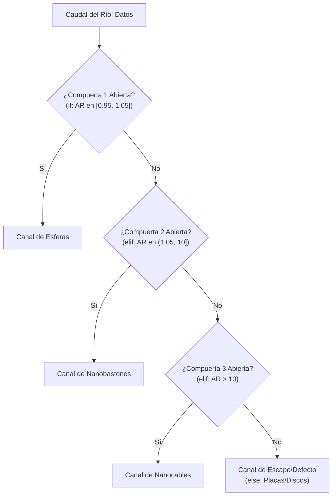
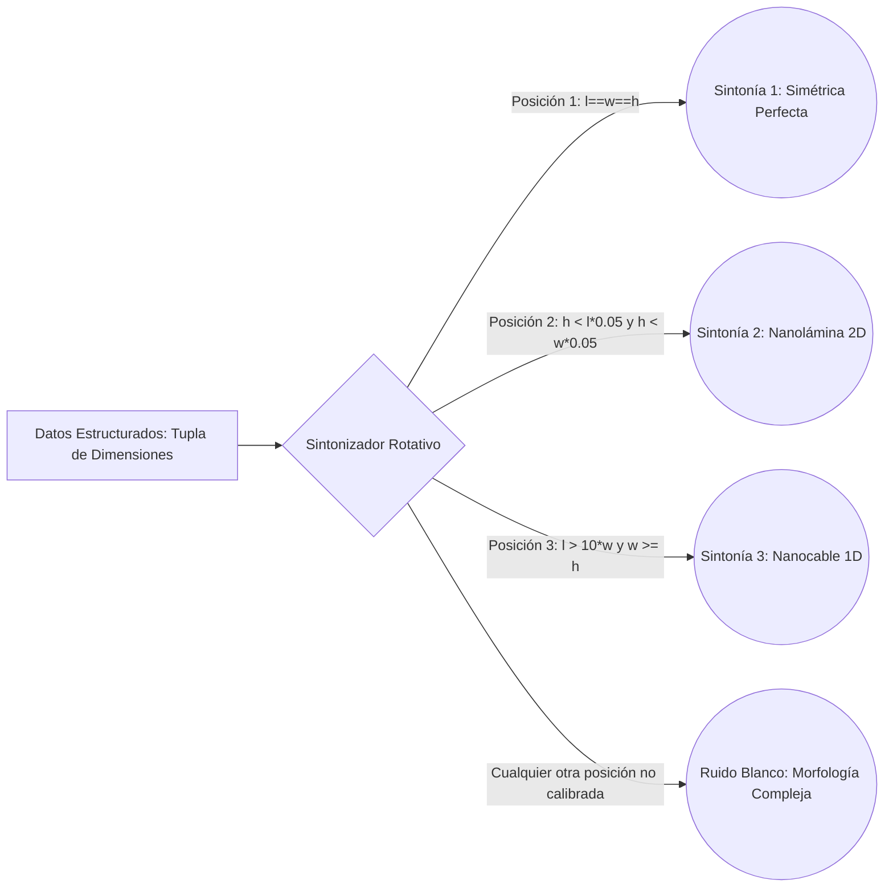

# Unidad 4: Estructuras de Decisión y Control de Flujo en Python 3

**Duración:** 2 semanas (12 horas)

**Curso:** Lógica de Programación y Desarrollo Agéntico con IA

**Institución:** Universidad de la Ciénega del Estado de Michoacán de Ocampo (UCEMICH)

**Profesor:** Luis José Yudico Anaya

**Carrera:** Ingeniería en Nanotecnología

**Nivel:** Primer Semestre

Este documento corresponde a la **Unidad 4** del curso *"Lógica de Programación y Desarrollo Agéntico"* del programa académico de la **UCEMICH**. En esta unidad se abordan las estructuras de decisión y el control de flujo aplicados a un dominio científico de frontera: la **Nanotecnología**. 

Aprenderás a construir un motor de clasificación morfológica para nanopartículas utilizando estructuras condicionales tradicionales (`if/elif/else`), la moderna coincidencia de patrones estructurada (`match/case`), técnicas avanzadas de refactorización condicional y pruebas unitarias de nivel profesional con `pytest`.

[](https://colab.research.google.com/github/Multiagent-AI-Lab/Programming-Logic-Agentic-AI-Development/blob/master/notebooks/UNIDAD_4_ESTRUCTURAS_DECISION.ipynb)

```python
import os
import sys

if 'google.colab' in sys.modules:
    repo_dir = "Programming-Logic-Agentic-AI-Development"
    if not os.path.exists(repo_dir):
        !git clone -q https://github.com/Multiagent-AI-Lab/{repo_dir}.git
    os.chdir(repo_dir)
    %pip install -q mcp fastmcp chromadb rich
```

> [!TIP]
> **Hito: primer uso permitido de GitHub Copilot.** A partir de esta unidad puedes usar IA para generar código, siguiendo este protocolo de 4 pasos:
> 1. **Formula el prompt** con especificidad lógica (describe entradas, salidas y restricciones, no solo "hazme una función que clasifique").
> 2. **Genera** el código con Copilot.
> 3. **Audita línea por línea** contra el pseudocódigo que escribiste antes — ¿hace exactamente lo que planeaste?
> 4. **Documenta el prompt** usado en el README del entregable, junto con qué corregiste del código generado.

---

## 1. Contexto Conceptual e Importancia en Ingeniería y Ciencia de Datos

En el universo de la nanotecnología, las propiedades físicas de la materia experimentan cambios drásticos debido al efecto de confinamiento cuántico y a la enorme relación entre el área superficial y el volumen que ocurre a escala nanométrica ($1\text{ nm} = 10^{-9}\text{ m}$). Por ejemplo, las nanopartículas de oro ($\text{AuNPs}$), que en macroescala exhiben un color amarillo brillante metálico, en nanoescala presentan tonalidades rojas, azules o violetas. Este fenómeno físico es gobernado por la **Resonancia de Plasmón Superficial Localizado (LSPR)**, el cual depende directamente del tamaño, el medio circundante y, de manera crítica, de la **morfología geométrica** de la nanopartícula.

Un motor computacional capaz de clasificar estas morfologías a partir de datos experimentales (obtenidos por técnicas de caracterización como Microscopía Electrónica de Transmisión - TEM, o Microscopía de Fuerza Atómica - AFM) es indispensable para:
1. **Control de Calidad Automatizado**: Clasificar lotes de síntesis química para validar si se obtuvo la forma deseada (por ejemplo, esferas para entrega de fármacos o nanocables para circuitos moleculares).
2. **Sistemas de Decisión Agéntica**: Agentes inteligentes que ajustan de forma autónoma los parámetros del reactor químico en función de la morfología obtenida en tiempo real.
3. **Modelado Predictivo**: Alimentar bases de datos de entrenamiento para algoritmos de Machine Learning que correlacionan la morfología con propiedades catalíticas o biomédicas.

Para desarrollar sistemas de software estables en este ámbito, es imperativo dominar el **control de flujo**. Las estructuras de decisión permiten al software bifurcar su camino de ejecución según el estado del sistema, aplicando filtros matemáticos rigorosos sobre los datos geométricos crudos.

---

## 2. Analogías Didácticas

Para asimilar el comportamiento de las estructuras de decisión en Python, es de gran utilidad analizarlas a través de modelos físicos y de comunicación cotidianos.

### Analogía 1: Las Bifurcaciones en un Río y las Compuertas Lógicas (`if/elif/else`)

Imagina el flujo de ejecución de un programa como un caudaloso río que fluye desde las montañas (el inicio del programa) hacia el océano (el final). A lo largo de su curso, el río se encuentra con un sistema de compuertas de control hidráulico dispuestas en serie (nuestra estructura `if/elif/else`):


<details>
<summary>Ver código fuente Mermaid (editable)</summary>



</details>

* **El `if` (Compuerta 1)**: Es el primer punto de control. Si la condición lógica del agua (parámetros de la nanopartícula) cumple con los requisitos de la Compuerta 1, esta se abre de inmediato. El agua fluye por este canal exclusivo y **nunca** llega a las compuertas inferiores.
* **El `elif` (Compuertas 2 y 3)**: Si la Compuerta 1 permanece cerrada porque la condición fue evaluar falsa, el agua avanza por el canal principal hasta encontrarse con la Compuerta 2. Esta compuerta evalúa una nueva propiedad específica. Si es verdadera, se abre; de lo contrario, el flujo continúa aguas abajo hacia la Compuerta 3.
* **El `else` (El canal de escape final)**: Si el agua no logró abrir ninguna de las compuertas anteriores (todas las expresiones lógicas previas resultaron falsas), el agua es guiada de manera inevitable por un canal de desborde general. Este canal no evalúa ninguna condición; simplemente recolecta todo lo que no encajó en las compuertas previas.

Desde la perspectiva de las **compuertas lógicas digitales**, esta estructura emula un decodificador de prioridad. Cada condición actúa como un filtro electrónico que evalúa bits de información en cascada. La primera señal que activa una condición bloquea las evaluaciones subsiguientes (cortocircuito lógico o *short-circuit evaluation*), optimizando el uso de recursos lógicos.

📖 [If, elif y else en Python](https://ellibrodepython.com/if-python)

---

### Analogía 2: El Sintonizador Rotativo Multicanal de Radio (`match/case`)

Introducido en Python 3.10 mediante la especificación PEP 634, el bloque `match/case` representa la **Coincidencia de Patrones Estructurados (Structural Pattern Matching)**. A diferencia de la cascada lineal de compuertas del río, el `match/case` se asemeja al funcionamiento de un sintonizador rotativo analógico o multicanal de un radio antiguo de perilla:


<details>
<summary>Ver código fuente Mermaid (editable)</summary>



</details>

* **La Perilla Rotativa (`match`)**: Apunta a una estructura compleja de datos (por ejemplo, una tupla con tres coordenadas espaciales `(l, w, h)`). No se limita a evaluar si una variable es verdadera o falsa, sino que inspecciona la "forma" o el patrón de los datos tridimensionales simultáneamente.
* **Las Muescas de Frecuencia (`case`)**: Cada posición de la perilla representa un canal de radio preestablecido. Al girar la perilla, esta cae firmemente en una muesca física si la estructura de los datos coincide con el patrón esperado. 
* **La Desestructuración Integrada**: Al sintonizar un canal específico, no solo captas la música, sino que el sintonizador separa la señal de audio izquierda, derecha, y la información de texto (RDS). En Python, el `case` no solo verifica la forma, sino que extrae automáticamente los valores individuales de las dimensiones y los asigna a variables locales en ese instante, aplicando filtros lógicos adicionales conocidos como **guardas** (`if` dentro del `case`).
* **El Caso por Defecto (`case _`)**: Representa la sintonización de una frecuencia vacía donde solo hay estática o ruido blanco. Captura cualquier estructura de datos que no encajó exactamente en las muescas de canales anteriores.

📖 [Match/case (Structural Pattern Matching) en Python](https://ellibrodepython.com/match-python)

---

## 3. Explicación Matemática del Espacio de Decisiones

Para diseñar algoritmos libres de ambigüedades, debemos formalizar las geometrías de las nanopartículas dentro del espacio métrico tridimensional continuo. Definamos un vector de dimensiones físicas $\mathbf{x} \in \mathbb{R}^3_+$, expresado como:

$$\mathbf{x} = (l, w, h)$$

Donde $l$ representa la longitud (length), $w$ el ancho (width) y $h$ la altura (height), cumpliendo la restricción de positividad estricta:

$$\mathbb{R}^3_+ = \{ (l, w, h) \in \mathbb{R}^3 \mid l > 0, w > 0, h > 0 \}$$

### Relación de Aspecto (Aspect Ratio - AR)

La relación de aspecto bidimensional tradicional es una función de proyección espacial definida como:

$$AR(l, w) = \frac{l}{w}$$

Usando esta función de proyección, podemos particionar el espacio geométrico en subconjuntos disjuntos que representan cada morfología bajo el esquema clásico `if/elif/else`:

1. **Subconjunto de Esferas ($E$)**:
   Se modela permitiendo una tolerancia del $\pm 5\%$ respecto a la simetría perfecta ($AR = 1.0$) debido a las imperfecciones termodinámicas inherentes a la síntesis química:
   $$E = \left\{ \mathbf{x} \in \mathbb{R}^3_+ \;\middle|\; 0.95 \le \frac{l}{w} \le 1.05 \right\}$$

2. **Subconjunto de Nanobastones ($R$)**:
   Estructuras elongadas donde la longitud predomina de manera moderada sobre el ancho:
   $$R = \left\{ \mathbf{x} \in \mathbb{R}^3_+ \;\middle|\; 1.05 < \frac{l}{w} \le 10.0 \right\}$$

3. **Subconjunto de Nanocables ($W$)**:
   Estructuras unidimensionales extremas de alta relación de aspecto:
   $$W = \left\{ \mathbf{x} \in \mathbb{R}^3_+ \;\middle|\; \frac{l}{w} > 10.0 \right\}$$

4. **Subconjunto de Nanodiscos o Nanoláminas ($D$)**:
   Estructuras aplanadas donde el ancho es superior a la longitud:
   $$D = \left\{ \mathbf{x} \in \mathbb{R}^3_+ \;\middle|\; \frac{l}{w} < 0.95 \right\}$$

Es matemáticamente evidente que la unión de estos subconjuntos cubre todo el espacio de entrada válido y que sus intersecciones mutuas son vacías:

$$E \cup R \cup W \cup D = \mathbb{R}^3_+ \quad \text{y} \quad A \cap B = \emptyset \quad \forall A, B \in \{E, R, W, D\}, A \neq B$$

### Lógica Boolean y Guardas en Coincidencia de Patrones

En el clasificador tridimensional más avanzado (`match/case`), evaluamos restricciones geométricas más ricas en $\mathbb{R}^3_+$:

* **Simetría Cúbica o Esférica Perfecta**:
  $$S_{\text{perf}} = \{ (l, w, h) \in \mathbb{R}^3_+ \mid l = w \land w = h \}$$

* **Morfología 2D (Nanoláminas)**:
  Definido por una altura extremadamente pequeña en comparación con la longitud y el ancho (menor al 5% de ambos valores):
  $$S_{\text{2D}} = \{ (l, w, h) \in \mathbb{R}^3_+ \mid h < 0.05 \cdot l \land h < 0.05 \cdot w \}$$

* **Nanocable Unidimensional (1D Nanowire)**:
  $$S_{\text{1D}} = \{ (l, w, h) \in \mathbb{R}^3_+ \mid l > 10 \cdot w \land w \ge h \}$$

Estas definiciones matemáticas garantizan que las decisiones tomadas en el código Python correspondan a límites de frontera físicos y reales en la ciencia de los materiales.

---

## 4. Desglose Paso a Paso del Código de Clasificación y Refactorización

Examinemos minuciosamente cómo está estructurado el código de producción para entender sus mecanismos internos y su arquitectura defensiva.

### 4.1. Análisis Detallado de la Clase `Nanoparticle`

La clase `Nanoparticle` se define utilizando un decorador especial:

```python
@dataclass(frozen=True)
class Nanoparticle:
    name: str
    length: float
    width: float
    height: float
```

El parámetro `frozen=True` convierte a los objetos de esta clase en estructuras **inmutables**. Una vez creado un objeto `Nanoparticle`, sus dimensiones o nombre no pueden ser modificados por ningún agente externo. Esto previene efectos secundarios indeseados (bugs colaterales) durante la ejecución de algoritmos concurrentes o flujos complejos de IA.

El método `__post_init__` ejecuta la validación inmediatamente después de que Python crea la instancia:

```python
def __post_init__(self) -> None:
    # Validación del nombre
    if not isinstance(self.name, str):
        raise TypeError("El atributo 'name' debe ser de tipo str.")
    if not self.name.strip():
        raise ValueError("El atributo 'name' no puede ser una cadena vacía o con solo espacios.")
```

Aquí aplicamos el principio de **Fail-Fast (Fallo Rápido)**. Si el tipo de datos no es una cadena (`str`), lanzamos un `TypeError`. Si es una cadena pero está vacía o llena de espacios en blanco (`"   "`), lanzamos un `ValueError`.

A continuación, validamos de forma iterativa todas las dimensiones físicas de la nanopartícula:

```python
    for attr_name in ("length", "width", "height"):
        val = getattr(self, attr_name)
        # Bloqueamos tipos no numéricos y de manera explícita los tipos booleanos (bool)
        if not isinstance(val, (int, float)) or isinstance(val, bool):
            raise TypeError(f"El atributo '{attr_name}' debe ser de tipo int o float.")
        if val <= 0:
            raise ValueError(f"El atributo '{attr_name}' debe ser un valor estrictamente positivo (> 0).")
```

1. `getattr(self, attr_name)` extrae dinámicamente el valor de los campos `length`, `width` y `height`.
2. Evaluamos si el tipo del valor no es entero o flotante, prestando especial atención a `isinstance(val, bool)`. En Python, los booleanos (`bool`) son subclase de los enteros (`int`), por lo que `isinstance(True, int)` retorna `True`. Al añadir `or isinstance(val, bool)`, bloqueamos explícitamente el paso de valores booleanos como dimensiones físicas.
3. Se verifica si el valor es menor o igual a cero (`val <= 0`), lo cual carece de sentido físico en nanoestructura y lanza un `ValueError`.

---

### 4.2. Análisis de `classify_by_aspect_ratio_if`

Esta función implementa la estructura condicional clásica:

```python
def classify_by_aspect_ratio_if(nanoparticle: Nanoparticle) -> str:
    if not isinstance(nanoparticle, Nanoparticle):
        raise TypeError("Se requiere una instancia válida de la clase 'Nanoparticle'.")

    aspect_ratio = nanoparticle.length / nanoparticle.width
```

1. **Validación de Tipo**: Antes de realizar cualquier cálculo, se verifica que el objeto sea de clase `Nanoparticle`. Esto evita errores de atributo en tiempo de ejecución (como un `AttributeError` al intentar acceder a `.length`).
2. **Cálculo de la Métrica**: Se evalúa la relación de aspecto espacial.
3. **Flujo de Decisión Lineal**:
   ```python
   if 0.95 <= aspect_ratio <= 1.05:
       return "Esfera"
   elif 1.05 < aspect_ratio <= 10.0:
       return "Nanobastón (Nanorod)"
   elif aspect_ratio > 10.0:
       return "Nanocable (Nanowire)"
   else:
       return "Nanodisco/Nanolámina"
   ```
   Gracias a que el cálculo de `aspect_ratio` es estrictamente positivo (garantizado por el constructor de la clase `Nanoparticle`), la sección final `else` recoge lógicamente todas las nanopartículas donde `aspect_ratio < 0.95` de manera robusta y sin necesidad de otra condición redundante.

---

### 4.3. Análisis de `classify_by_geometry_match`

Esta función utiliza la potencia del pattern matching estructural:

```python
def classify_by_geometry_match(nanoparticle: Nanoparticle) -> str:
    if not isinstance(nanoparticle, Nanoparticle):
        raise TypeError("Se requiere una instancia válida de la clase 'Nanoparticle'.")

    dimensions = (nanoparticle.length, nanoparticle.width, nanoparticle.height)
```

Empaquetamos las tres variables físicas del objeto en una tupla de longitud 3 para poder desestructurarla dentro del bloque `match`:

```python
    match dimensions:
        # Caso 1: Simétrica Perfecta
        case (l, w, h) if l == w == h:
            return "Simétrica Perfecta (Cúbica/Esférica)"
```

* El patrón `case (l, w, h)` le dice a Python: "Si `dimensions` es una secuencia de exactamente tres elementos, asígnalos temporalmente a las variables de alcance local `l`, `w` e `h`".
* La cláusula `if l == w == h` actúa como una **guarda**. El caso sólo se ejecutará si la forma coincide con una tupla de tres elementos **y además** la expresión booleana de la guarda resulta verdadera.

```python
        # Caso 2: Nanolámina
        case (l, w, h) if h < (l * 0.05) and h < (w * 0.05):
            return "Nanolámina (2D Nanoplatelet)"
```

* Aquí, el patrón desestructura la tupla y evalúa si la altura `h` es menor al 5% de la longitud y el ancho de manera simultánea. Este condicional compuesto detecta estructuras bidimensionales similares al grafeno.

```python
        # Caso 3, 4 y 5: Nanocables, Nanobastones y Nanodiscos
        case (l, w, h) if l > (10 * w) and w >= h:
            return "Nanocable Unidimensional (1D Nanowire)"
        case (l, w, h) if (1.1 * w) < l <= (10 * w):
            return "Nanobastón (Nanorod)"
        case (l, w, h) if w > (1.5 * l) and l >= h:
            return "Nanodisco"
```

* Cada una de estas ramas desestructura y extrae las dimensiones físicas, aplicando las relaciones de aspecto espaciales definidas matemáticamente en la sección anterior.

```python
        # Caso por defecto
        case _:
            return "Morfología Compleja / No Clasificada"
```

* La sintaxis `case _` actúa como un comodín universal. Si ninguna de las guardas de los casos anteriores se evalúa como verdadera, el flujo de ejecución entra en esta sección. Esto evita que la función finalice sin retornar un valor explícito.

---

### 4.4. Explicación de la Refactorización de Código Condicional Espagueti

El concepto de **código espagueti** se aplica a programas con un flujo de control enmarañado y complejo, difícil de mantener y propenso a fallos. Observemos nuevamente la estructura problemática original:

```python
def spaghetti_classifier(data):
    if data is not None:
        if "dim" in data:
            d = data["dim"]
            if len(d) == 3:
                l = d[0]
                # ... sigue la anidación en pirámide
```

Esta implementación sufre de la **"Pirámide de la Muerte"** (anidamientos condicionales excesivos). Cada nivel adicional de indentación incrementa la carga cognitiva necesaria para comprender el flujo del programa. Además, si ocurre un error (por ejemplo, si `data` es `None` o si no contiene `"dim"`), la función retorna de forma genérica `"Error"`, lo cual enmascara fallos estructurales de integración.

#### El Concepto de Cláusulas de Guarda (Guard Clauses)

La técnica de refactorización clave para eliminar esta anidación es la aplicación de **Cláusulas de Guarda**. Su filosofía es simple: *identifica las condiciones necesarias de error al inicio de la función, lánzalas o retorna inmediatamente, y deja el flujo principal libre de indentación*.

Observemos el flujo de ejecución comparativo de ambas lógicas:

##### Flujo con Anidación (Código Espagueti)
```text
[Inicio de Función]
  └── ¿Los datos son válidos? (Sí)
        └── ¿Existe la clave 'dim'? (Sí)
              └── ¿Tiene longitud 3? (Sí)
                    └── ¿Los valores son positivos? (Sí)
                          └── [Hacer Procesamiento Principal y Retornar]
```

##### Flujo con Cláusulas de Guarda
```text
[Inicio de Función]
  ├── ¿Los datos son Inválidos? ──> [Sí] ──> [Lanzar Excepción / Salida Inmediata]
  ├── ¿Falta clave 'dim'? ────────> [Sí] ──> [Lanzar Excepción / Salida Inmediata]
  ├── ¿Longitud != 3? ────────────> [Sí] ──> [Lanzar Excepción / Salida Inmediata]
  └── [Hacer Procesamiento Principal en el Nivel Raíz de Indentación y Retornar]
```

Implementando este cambio en la función refactorizada:

```python
def refactored_classifier(data: Dict[str, Any]) -> str:
    # 1. Cláusulas de guarda (Fallo rápido)
    if not isinstance(data, dict):
        raise TypeError("Los datos de entrada deben estar contenidos en un diccionario (dict).")
    
    if "dim" not in data:
        raise ValueError("Falta la clave obligatoria 'dim' en el diccionario de datos.")

    dimensions = data["dim"]
    if not isinstance(dimensions, (list, tuple)) or len(dimensions) != 3:
        raise ValueError("El campo 'dim' debe ser una lista o tupla con exactamente 3 elementos.")
```

Al resolver y descartar los casos problemáticos de manera prematura, el cuerpo principal de la función puede asumir con total seguridad que `dimensions` es un objeto iterable de tres elementos válidos. Esto nos permite proceder directamente con la desestructuración:

```python
    try:
        length, width, height = float(dimensions[0]), float(dimensions[1]), float(dimensions[2])
    except (ValueError, TypeError) as err:
        raise TypeError("Todos los elementos de 'dim' deben ser convertibles a números flotantes.") from err

    if length <= 0 or width <= 0 or height <= 0:
        raise ValueError("Las dimensiones de la nanopartícula deben ser estrictamente positivas (> 0).")
```

El bloque `try/except` actúa como un segundo nivel de guarda dinámico. Captura cualquier intento de conversión de tipos no válidos (por ejemplo, intentar convertir la cadena `"nanotubo"` a flotante) y eleva una excepción descriptiva que proporciona contexto al desarrollador o agente inteligente sobre el fallo de la operación.

Finalmente, el flujo principal de clasificación se ejecuta de forma lineal y clara:

```python
    aspect_ratio = length / width

    match aspect_ratio:
        case ar if 0.95 <= ar <= 1.05:
            return "Esfera Perfecta" if length == width == height else "Esfera Cuasi-perfecta"
        case ar if ar > 10.0:
            return "Nanocable"
        case ar if ar > 1.05:
            return "Nanorod"
        case _:
            return "Placa/Disco"
```

El código refactorizado no solo reduce los niveles de indentación de 6 a 1, sino que también introduce robustez y predictibilidad a través del uso formal de excepciones.

---

## 5. Código de Producción Completo: `nanoparticle_classifier.py`

A continuación, se detalla el código completo y listo para producción. Se aconseja su guardado bajo el nombre exacto de `nanoparticle_classifier.py`.

```python
"""Motor de clasificación de nanopartículas basado en geometría.

Este módulo implementa clases y funciones para clasificar nanopartículas
según sus dimensiones nanométricas usando relaciones de aspecto y
coincidencia de patrones estructurales.
"""

from dataclasses import dataclass
from typing import Union, Dict, Any, Tuple

# Definición de tipos personalizados para mayor legibilidad
Number = Union[int, float]


@dataclass(frozen=True)
class Nanoparticle:
    """Representa una nanopartícula con dimensiones físicas validadas.

    Attributes:
        name (str): Identificador único o nombre del lote de la nanopartícula.
        length (float): Longitud máxima en nanómetros (nm).
        width (float): Ancho o diámetro en nanómetros (nm).
        height (float): Altura o espesor en nanómetros (nm).

    Raises:
        TypeError: Si los tipos de datos de entrada no corresponden a los definidos.
        ValueError: Si alguna dimensión es menor o igual a cero o el nombre está vacío.
    """
    name: str
    length: float
    width: float
    height: float

    def __post_init__(self) -> None:
        """Realiza la validación estricta de tipos y valores tras la inicialización.
        
        Aplica técnicas de fail-fast para evitar estados inválidos en el ciclo
        de procesamiento agéntico.
        """
        # Validación del nombre de la nanopartícula
        if not isinstance(self.name, str):
            raise TypeError("El atributo 'name' debe ser de tipo str.")
        if not self.name.strip():
            raise ValueError("El atributo 'name' no puede ser una cadena vacía o con solo espacios.")

        # Validación de las tres dimensiones físicas espaciales
        for attr_name in ("length", "width", "height"):
            val = getattr(self, attr_name)
            # Bloqueamos tipos no numéricos y de manera explícita los tipos booleanos (bool)
            if not isinstance(val, (int, float)) or isinstance(val, bool):
                raise TypeError(f"El atributo '{attr_name}' debe ser de tipo int o float.")
            if val <= 0:
                raise ValueError(f"El atributo '{attr_name}' debe ser un valor estrictamente positivo (> 0).")


def classify_by_aspect_ratio_if(nanoparticle: Nanoparticle) -> str:
    """Clasifica la nanopartícula basándose en su relación de aspecto (longitud/ancho).

    Utiliza una jerarquía clásica de control 'if/elif/else'. La relación de aspecto (AR)
    se calcula como longitud / ancho.

    Categorías:
        - "Esfera": AR en el intervalo [0.95, 1.05] (tolerancia por imperfección de síntesis).
        - "Nanobastón (Nanorod)": AR en el intervalo (1.05, 10.0].
        - "Nanocable (Nanowire)": AR estrictamente mayor a 10.0.
        - "Nanodisco/Nanolámina": AR estrictamente menor a 0.95.

    Args:
        nanoparticle (Nanoparticle): Instancia validada de Nanoparticle.

    Returns:
        str: Categoría morfológica de la nanopartícula.

    Raises:
        TypeError: Si el parámetro recibido no es una instancia de Nanoparticle.
    """
    if not isinstance(nanoparticle, Nanoparticle):
        raise TypeError("Se requiere una instancia válida de la clase 'Nanoparticle'.")

    aspect_ratio = nanoparticle.length / nanoparticle.width

    if 0.95 <= aspect_ratio <= 1.05:
        return "Esfera"
    elif 1.05 < aspect_ratio <= 10.0:
        return "Nanobastón (Nanorod)"
    elif aspect_ratio > 10.0:
        return "Nanocable (Nanowire)"
    else:
        return "Nanodisco/Nanolámina"


def classify_by_geometry_match(nanoparticle: Nanoparticle) -> str:
    """Clasifica la nanopartícula mediante coincidencia de patrones (match/case).

    Utiliza la desestructuración de secuencias y guardas condicionales en
    coincidencias de patrones estructurados (PEP 634) introducidos en Python 3.10.

    Args:
        nanoparticle (Nanoparticle): Instancia validada de Nanoparticle.

    Returns:
        str: Clasificación geométrica tridimensional detallada.

    Raises:
        TypeError: Si el parámetro recibido no es una instancia de Nanoparticle.
    """
    if not isinstance(nanoparticle, Nanoparticle):
        raise TypeError("Se requiere una instancia válida de la clase 'Nanoparticle'.")

    # Empaquetamos las dimensiones clave en una tupla para el pattern matching
    dimensions = (nanoparticle.length, nanoparticle.width, nanoparticle.height)

    match dimensions:
        # Caso 1: Estructura tridimensional simétrica (Cubo / Esfera perfecta)
        case (l, w, h) if l == w == h:
            return "Simétrica Perfecta (Cúbica/Esférica)"
        
        # Caso 2: Estructuras bidimensionales ultra-delgadas (Nanoláminas / Nanoplatelets)
        case (l, w, h) if h < (l * 0.05) and h < (w * 0.05):
            return "Nanolámina (2D Nanoplatelet)"
        
        # Caso 3: Relación de aspecto longitudinal extrema (Nanocables unidimensionales)
        case (l, w, h) if l > (10 * w) and w >= h:
            return "Nanocable Unidimensional (1D Nanowire)"
        
        # Caso 4: Relación de aspecto longitudinal moderada (Nanobastones)
        case (l, w, h) if (1.1 * w) < l <= (10 * w):
            return "Nanobastón (Nanorod)"
        
        # Caso 5: Estructuras discoidales (Ancho mucho mayor a la longitud y altura)
        case (l, w, h) if w > (1.5 * l) and l >= h:
            return "Nanodisco"
            
        # Caso por defecto para morfologías complejas o no convencionales
        case _:
            return "Morfología Compleja / No Clasificada"


def spaghetti_classifier(data: Any) -> str:
    """Implementación heredada de baja calidad (código espagueti).
    
    Este método condicional anidado es mantenido únicamente para fines de retrocompatibilidad
    y comparación didáctica.
    """
    if data is not None:
        if "dim" in data:
            d = data["dim"]
            if len(d) == 3:
                l = d[0]
                w = d[1]
                h = d[2]
                if l > 0 and w > 0 and h > 0:
                    ar = l / w
                    if ar >= 0.95 and ar <= 1.05:
                        if l == w and w == h:
                            return "Esfera Perfecta"
                        else:
                            return "Esfera Cuasi-perfecta"
                    else:
                        if ar > 10:
                            return "Nanocable"
                        else:
                            if ar > 1.05:
                                return "Nanorod"
                            else:
                                return "Placa/Disco"
                else:
                    return "Error"
            else:
                return "Error"
        else:
            return "Error"
    else:
        return "Error"


def refactored_classifier(data: Dict[str, Any]) -> str:
    """Clasifica una nanopartícula a partir de un diccionario de datos.

    Aplica cláusulas de guarda para un fallo rápido (fail-fast), realiza 
    desestructuración segura con validación explícita de tipos numéricos y utiliza 
    'match/case' simplificado para eliminar el anidamiento redundante.

    Args:
        data (Dict[str, Any]): Datos de entrada con el formato {'dim': [l, w, h]}.

    Returns:
        str: Categoría geométrica de la nanopartícula.

    Raises:
        TypeError: Si los datos o las dimensiones no son del tipo correcto.
        ValueError: Si faltan claves o las dimensiones son no positivas.
    """
    # 1. Cláusulas de guarda (Guard Clauses) para validación de entrada
    if not isinstance(data, dict):
        raise TypeError("Los datos de entrada deben estar contenidos en un diccionario (dict).")
    
    if "dim" not in data:
        raise ValueError("Falta la clave obligatoria 'dim' en el diccionario de datos.")

    dimensions = data["dim"]
    if not isinstance(dimensions, (list, tuple)) or len(dimensions) != 3:
        raise ValueError("El campo 'dim' debe ser una lista o tupla con exactamente 3 elementos.")

    # 2. Desestructuración explícita y validación numérica
    try:
        length, width, height = float(dimensions[0]), float(dimensions[1]), float(dimensions[2])
    except (ValueError, TypeError) as err:
        raise TypeError("Todos los elementos de 'dim' deben ser convertibles a números flotantes.") from err

    if length <= 0 or width <= 0 or height <= 0:
        raise ValueError("Las dimensiones de la nanopartícula deben ser estrictamente positivas (> 0).")

    # 3. Clasificación optimizada mediante pattern matching estructurado
    aspect_ratio = length / width

    match aspect_ratio:
        case ar if 0.95 <= ar <= 1.05:
            return "Esfera Perfecta" if length == width == height else "Esfera Cuasi-perfecta"
        case ar if ar > 10.0:
            return "Nanocable"
        case ar if ar > 1.05:
            return "Nanorod"
        case _:
            return "Placa/Disco"
```

---

## 6. Suite Completa de Pruebas Unitarias: `test_nanoparticle_classifier.py`

Para asegurar la estabilidad lógica y garantizar una cobertura de ramas del 100%, se presenta la siguiente suite de pruebas utilizando la librería científica `pytest`. Se recomienda guardar el contenido como `test_nanoparticle_classifier.py`.

```python
"""Suite de pruebas unitarias para validación del clasificador de nanopartículas.

Diseñado bajo la suite pytest para obtener una cobertura del 100% de decisiones.
"""

import pytest
from nanoparticle_classifier import (
    Nanoparticle,
    classify_by_aspect_ratio_if,
    classify_by_geometry_match,
    spaghetti_classifier,
    refactored_classifier
)

# =====================================================================
# PRUEBAS UNITARIAS PARA LA CLASE NANOPARTICLE
# =====================================================================

def test_nanoparticle_instantiation_success():
    """Prueba que una nanopartícula válida se inicialice correctamente."""
    np = Nanoparticle(name="AuNP_Sphere", length=12.5, width=12.5, height=12.5)
    assert np.name == "AuNP_Sphere"
    assert np.length == 12.5
    assert np.width == 12.5
    assert np.height == 12.5


def test_nanoparticle_name_validation_fails():
    """Prueba que nombres vacíos o tipos de nombre incorrectos lancen errores."""
    with pytest.raises(TypeError):
        Nanoparticle(name=123, length=10.0, width=10.0, height=10.0)  # type: ignore
    with pytest.raises(ValueError):
        Nanoparticle(name="   ", length=10.0, width=10.0, height=10.0)


def test_nanoparticle_dimension_types_fail():
    """Prueba que dimensiones que no sean float o int lancen TypeError."""
    with pytest.raises(TypeError):
        Nanoparticle(name="AgNP", length="10.0", width=10.0, height=10.0)  # type: ignore
    with pytest.raises(TypeError):
        Nanoparticle(name="AgNP", length=10.0, width=True, height=10.0)  # type: ignore


def test_nanoparticle_dimension_values_fail():
    """Prueba que dimensiones no positivas (<= 0) lancen ValueError."""
    with pytest.raises(ValueError):
        Nanoparticle(name="AgNP", length=-5.0, width=10.0, height=10.0)
    with pytest.raises(ValueError):
        Nanoparticle(name="AgNP", length=10.0, width=0.0, height=10.0)


# =====================================================================
# PRUEBAS PARA CLASSIFY_BY_ASPECT_RATIO_IF (COBERTURA DE RAMAS)
# =====================================================================

@pytest.mark.parametrize(
    "length,width,expected",
    [
        (10.0, 10.0, "Esfera"),                     # AR = 1.0 (Esfera)
        (10.4, 10.0, "Esfera"),                     # AR = 1.04 (Esfera)
        (9.6, 10.0, "Esfera"),                      # AR = 0.96 (Esfera)
        (12.0, 10.0, "Nanobastón (Nanorod)"),       # AR = 1.2 (Nanorod)
        (100.0, 10.0, "Nanobastón (Nanorod)"),     # AR = 10.0 (Nanorod)
        (101.0, 10.0, "Nanocable (Nanowire)"),      # AR = 10.1 (Nanowire)
        (8.0, 10.0, "Nanodisco/Nanolámina"),        # AR = 0.8 (Nanodisco/Nanolámina)
    ]
)
def test_classify_by_aspect_ratio_if_branches(length: float, width: float, expected: str):
    """Valida cada una de las bifurcaciones lógicas del condicional if/elif/else."""
    np = Nanoparticle(name="TestNP", length=length, width=width, height=5.0)
    assert classify_by_aspect_ratio_if(np) == expected


def test_classify_by_aspect_ratio_if_invalid_type():
    """Valida la protección de tipos al pasar un objeto no compatible."""
    with pytest.raises(TypeError):
        classify_by_aspect_ratio_if("no_es_nanoparticula")  # type: ignore


# =====================================================================
# PRUEBAS PARA CLASSIFY_BY_GEOMETRY_MATCH (COBERTURA DE RAMAS)
# =====================================================================

def test_geometry_match_perfect_symmetry():
    """Rama: Simétrica Perfecta (l == w == h)."""
    np = Nanoparticle(name="AuCube", length=15.0, width=15.0, height=15.0)
    assert classify_by_geometry_match(np) == "Simétrica Perfecta (Cúbica/Esférica)"


def test_geometry_match_nanoplatelet():
    """Rama: Nanolámina (h < 0.05*l y h < 0.05*w)."""
    np = Nanoparticle(name="GrapheneSheet", length=100.0, width=120.0, height=2.0)
    assert classify_by_geometry_match(np) == "Nanolámina (2D Nanoplatelet)"


def test_geometry_match_nanowire():
    """Rama: Nanocable 1D (l > 10*w y w >= h)."""
    np = Nanoparticle(name="SiWire", length=200.0, width=15.0, height=10.0)
    assert classify_by_geometry_match(np) == "Nanocable Unidimensional (1D Nanowire)"


def test_geometry_match_nanorod():
    """Rama: Nanobastón (1.1*w < l <= 10*w)."""
    np = Nanoparticle(name="AuRod", length=40.0, width=10.0, height=8.0)
    assert classify_by_geometry_match(np) == "Nanobastón (Nanorod)"


def test_geometry_match_nanodisc():
    """Rama: Nanodisco (w > 1.5*l y l >= h)."""
    np = Nanoparticle(name="AuDisc", length=10.0, width=20.0, height=5.0)
    assert classify_by_geometry_match(np) == "Nanodisco"


def test_geometry_match_complex():
    """Rama por defecto: Morfología Compleja / No Clasificada."""
    np = Nanoparticle(name="IrregularNP", length=10.5, width=10.0, height=9.5)
    assert classify_by_geometry_match(np) == "Morfología Compleja / No Clasificada"


def test_classify_by_geometry_match_invalid_type():
    """Valida la protección de tipos en el clasificador por coincidencia de patrones."""
    with pytest.raises(TypeError):
        classify_by_geometry_match("no_es_nanoparticula")  # type: ignore


# =====================================================================
# PRUEBAS PARA EL CÓDIGO ESPAGUETI HUELLA (VERIFICACIÓN LÓGICA ANTERIOR)
# =====================================================================

def test_spaghetti_classifier_behavior():
    """Valida que el clasificador antiguo responde según su lógica enredada."""
    assert spaghetti_classifier({"dim": [10.0, 10.0, 10.0]}) == "Esfera Perfecta"
    assert spaghetti_classifier({"dim": [10.2, 10.0, 9.0]}) == "Esfera Cuasi-perfecta"
    assert spaghetti_classifier({"dim": [150.0, 10.0, 10.0]}) == "Nanocable"
    assert spaghetti_classifier({"dim": [20.0, 10.0, 10.0]}) == "Nanorod"
    assert spaghetti_classifier({"dim": [5.0, 10.0, 10.0]}) == "Placa/Disco"
    assert spaghetti_classifier(None) == "Error"
    assert spaghetti_classifier({"dim": [10.0]}) == "Error"


# =====================================================================
# PRUEBAS PARA EL CÓDIGO REFACTORIZADO (COBERTURA DE RAMAS Y ERRORES)
# =====================================================================

def test_refactored_classifier_success_paths():
    """Valida las salidas correctas del clasificador refactorizado."""
    assert refactored_classifier({"dim": [10.0, 10.0, 10.0]}) == "Esfera Perfecta"
    assert refactored_classifier({"dim": [10.2, 10.0, 9.0]}) == "Esfera Cuasi-perfecta"
    assert refactored_classifier({"dim": [150.0, 10.0, 10.0]}) == "Nanocable"
    assert refactored_classifier({"dim": [20.0, 10.0, 10.0]}) == "Nanorod"
    assert refactored_classifier({"dim": [5.0, 10.0, 10.0]}) == "Placa/Disco"


def test_refactored_classifier_raises_exceptions():
    """Valida que el clasificador refactorizado lance las excepciones correspondientes."""
    # Entrada inválida (no es un diccionario)
    with pytest.raises(TypeError, match="Los datos de entrada deben estar contenidos"):
        refactored_classifier("no_un_diccionario")  # type: ignore

    # Falta clave dim
    with pytest.raises(ValueError, match="Falta la clave obligatoria"):
        refactored_classifier({"otra_clave": [1, 2, 3]})

    # Formato de dim incorrecto (longitud incorrecta)
    with pytest.raises(ValueError, match="El campo 'dim' debe ser una lista o tupla"):
        refactored_classifier({"dim": [10.0, 10.0]})

    # Tipos no numéricos dentro del campo dim
    with pytest.raises(TypeError, match="Todos los elementos de 'dim' deben ser convertibles"):
        refactored_classifier({"dim": [10.0, "cinco", 10.0]})

    # Dimensiones menores o iguales a cero
    with pytest.raises(ValueError, match="Las dimensiones de la nanopartícula deben ser"):
        refactored_classifier({"dim": [10.0, -1.0, 10.0]})
```

---

## 7. Banco de 15 Preguntas de Examen (Con Justificación Didáctica)

Este banco de reactivos ha sido diseñado para evaluar la comprensión conceptual y práctica de las estructuras de control de flujo, su optimización mediante cláusulas de guarda y la implementación de lógica condicional robusta en Python 3.

### Pregunta 1
**¿Cuál es la función pedagógica principal del uso de "Cláusulas de Guarda" (Guard Clauses) en la lógica de programación moderna?**
* A) Incrementar la velocidad de ejecución nativa del procesador mediante compilación Just-in-Time.
* B) Eliminar la necesidad de escribir pruebas unitarias para capturar excepciones de tipo.
* C) Reducir la indentación excesiva y mejorar la legibilidad al descartar casos inválidos o de error al inicio de la función.
* D) Forzar a que todas las variables de la función se definan como constantes inmutables de manera estricta.

**Justificaciones Didácticas:**
* **Opción C (Correcta)**: Las cláusulas de guarda permiten la salida temprana ante escenarios de fallo, manteniendo el camino feliz (*happy path*) alineado a la izquierda (menor nivel de anidamiento condicional), lo que reduce la complejidad cognitiva.
* *Distractor A*: Incorrecto. Aunque evita procesamientos adicionales en casos de error, su fin primordial es la legibilidad del código fuente humano, no una optimización a bajo nivel de hardware o compilador.
* *Distractor B*: Incorrecto. Las cláusulas de guarda lanzan excepciones que, de hecho, **deben** ser probadas explícitamente mediante suites como `pytest.raises` para asegurar que el sistema se comporta adecuadamente.
* *Distractor D*: Incorrecto. La inmutabilidad es una propiedad de las estructuras de datos (como `@dataclass(frozen=True)` o tuplas), independiente del estilo de estructuración condicional utilizado.

---

### Pregunta 2
**En Python 3.10+, ¿qué ocurre en un bloque `match/case` si ninguna de las ramas coincide con la estructura del dato evaluado y no se ha implementado el caso comodín (`case _`)?**
* A) Se lanza de forma obligatoria una excepción de tipo `NoPatternMatchError`.
* B) El flujo de control continúa silenciosamente con la siguiente instrucción después del bloque `match`, sin ejecutar ninguna rama ni lanzar error.
* C) Python entra en un bucle infinito buscando el patrón correcto en el espacio de nombres global.
* D) El intérprete detiene la ejecución del script arrojando un error de sintaxis en tiempo de compilación.

**Justificaciones Didácticas:**
* **Opción B (Correcta)**: Si no se produce ninguna coincidencia (*pattern match*) y no existe un comodín, el bloque simplemente se salta y la ejecución prosigue de manera secuencial. A diferencia de otros lenguajes (como Rust o Scala), Python no exige exhaustividad obligatoria en tiempo de compilación.
* *Distractor A*: Incorrecto. Python no define ni lanza una excepción por la ausencia de coincidencia estructural bajo esta condición.
* *Distractor C*: Incorrecto. El control de flujo es estrictamente síncrono y secuencial; no se inician bucles de búsqueda dinámica.
* *Distractor D*: Incorrecto. No se trata de un error sintáctico; la estructura está bien construida y el intérprete la procesará en runtime de manera válida ignorándola.

---

### Pregunta 3
**¿Por qué en la clase `Nanoparticle` la expresión `isinstance(val, bool)` se utiliza explícitamente como una condición de rechazo de tipo, a pesar de evaluar previamente `isinstance(val, (int, float))`?**
* A) Porque en Python la clase `bool` es una subclase de `int`, lo que causaría que `True` o `False` fuesen aceptados erróneamente como valores numéricos de dimensión.
* B) Para forzar a que el compilador de Python convierta los booleanos a flotantes de manera interna.
* C) Debido a que el recolector de basura de Python no puede procesar booleanos si están contenidos dentro de una clase de datos inmutable.
* D) Porque las nanopartículas poseen propiedades cuánticas binarias que no admiten representación matemática de punto flotante.

**Justificaciones Didácticas:**
* **Opción A (Correcta)**: Históricamente en Python, `bool` hereda de `int` (`True` se representa internamente como `1` y `False` como `0`). Por ende, `isinstance(True, int)` retorna `True`. Sin la validación adicional de exclusión de tipo, un desarrollador podría inicializar una nanopartícula con `length=True` sin disparar una excepción.
* *Distractor B*: Incorrecto. La validación busca **rechazar** la entrada y arrojar un error, no forzar una coerción de tipos.
* *Distractor C*: Incorrecto. El recolector de basura gestiona todos los objetos incorporados en Python de forma idéntica; esto no guarda relación con la inmutabilidad de la clase de datos.
* *Distractor D*: Incorrecto. Es una explicación pseudocientífica que confunde la física del nanomundo con las reglas sintácticas del intérprete de Python.

---

### Pregunta 4
**Considere el siguiente fragmento de código: `aspect_ratio = 1.0`. Si evaluamos este valor en el bloque condicional de `classify_by_aspect_ratio_if`, ¿por qué se retorna "Esfera" en lugar de evaluarse en la siguiente rama condicional?**
* A) Debido a que la evaluación por cortocircuito lógico detiene el análisis condicional tan pronto como una rama evalúa como verdadera.
* B) Porque el valor $1.0$ es menor a $0.95$ en la aritmética de precisión simple de Python.
* C) Dado que el intérprete evalúa de forma paralela todas las ramas condicionales y escoge la que tenga la cadena de texto más corta.
* D) Porque la función utiliza una cláusula de escape aleatoria configurada en el sistema operativo.

**Justificaciones Didácticas:**
* **Opción A (Correcta)**: El flujo condicional `if/elif/else` se evalúa de manera estrictamente secuencial y lineal. Cuando una condición (en este caso `0.95 <= 1.0 <= 1.05`) resulta verdadera (`True`), se ejecuta su bloque de código correspondiente y se sale inmediatamente de la estructura condicional.
* *Distractor B*: Incorrecto. Matemáticamente $1.0 \ge 0.95$, lo cual es verdadero; no existe un error de precisión en esta comparación básica.
* *Distractor C*: Incorrecto. Python evalúa las condiciones de forma secuencial y síncrona, jamás de manera paralela o concurrente integrada dentro de un mismo bloque condicional básico.
* *Distractor D*: Incorrecto. El flujo del programa es determinista y lógico; no intervienen variables de aleatoriedad del sistema operativo.

---

### Pregunta 5
**¿Qué ventaja de arquitectura de software proporciona el decorador `@dataclass(frozen=True)` al modelo de datos de nanopartículas?**
* A) Incrementa el tamaño de la memoria utilizada para permitir copias dinámicas del objeto.
* B) Garantiza la inmutabilidad de los atributos del objeto, asegurando que sus dimensiones físicas no sean alteradas accidentalmente por procesos externos.
* C) Habilita la autocompilación de código Python a C++ en tiempo de ejecución.
* D) Permite que la clase herede automáticamente de todos los tipos de datos primitivos de Python de forma simultánea.

**Justificaciones Didácticas:**
* **Opción B (Correcta)**: El parámetro `frozen=True` altera el comportamiento de la clase de datos generada, provocando que cualquier intento de asignación de atributo (como `np.length = 5.0`) arroje una excepción `FrozenInstanceError`, protegiendo la integridad del modelo.
* *Distractor A*: Incorrecto. En realidad, puede optimizar el uso de memoria y permite que el objeto sea indexable en diccionarios (*hashable*), pero no incrementa la memoria para facilitar copias.
* *Distractor C*: Incorrecto. Las clases de datos son estructuras de código Python puro y estándar; no involucran transpilación ni compilación a otros lenguajes.
* *Distractor D*: Incorrecto. La herencia múltiple en Python se maneja mediante la declaración explícita en la firma de la clase, no por medio de decoradores de configuración del modelo.

---

### Pregunta 6
**Si pasamos a la función refactorizada el siguiente diccionario: `{"dim": [10.0, 10.0, 10.0, 5.0]}`, ¿qué excepción se lanzará y en qué línea del flujo defensivo ocurrirá?**
* A) `TypeError` durante el bloque de casting a flotantes.
* B) `ValueError` en la cláusula de guarda que valida la longitud de la secuencia de dimensiones.
* C) `FrozenInstanceError` al intentar redefinir la lista de dimensiones.
* D) Ninguna, la función asume que los primeros tres elementos son válidos e ignora el cuarto.

**Justificaciones Didácticas:**
* **Opción B (Correcta)**: La cláusula de guarda de la función refactorizada verifica: `if not isinstance(dimensions, (list, tuple)) or len(dimensions) != 3`. Como la longitud de la lista dada es $4$, se evalúa verdadero el lado derecho de la disyunción y se lanza un `ValueError`.
* *Distractor A*: Incorrecto. El flujo defensivo de validación de longitud se ejecuta antes del bloque `try/except` de conversión numérica, interrumpiendo el flujo de inmediato.
* *Distractor C*: Incorrecto. No se está manipulando un objeto inmutable de tipo `@dataclass`, sino una estructura mutable estándar (`dict`).
* *Distractor D*: Incorrecto. El motor de clasificación es estricto; no se permite el paso de datos con ruido dimensional sobrante para evitar fallos físicos en la clasificación.

---

### Pregunta 7
**¿Cómo procesa Python la evaluación por cortocircuito (*short-circuit evaluation*) en la siguiente expresión booleana: `A and B`?**
* A) Si `A` es evaluado como falso, la expresión completa se determina falsa y `B` no se evalúa bajo ninguna circunstancia.
* B) Ambos términos `A` y `B` se evalúan simultáneamente y se aplica un promedio booleano.
* C) Si `A` es verdadero, el programa se detiene de forma abrupta por seguridad.
* D) Evalúa primero `B` y si este es falso, asume que `A` debe ser convertido a una cadena de texto.

**Justificaciones Didácticas:**
* **Opción A (Correcta)**: En la operación lógica `AND`, ambos operandos deben ser verdaderos para que el resultado sea verdadero. Si el primer operando (`A`) resulta falso, es lógicamente imposible que la expresión completa sea verdadera, por lo que Python optimiza el rendimiento omitiendo evaluar `B`.
* *Distractor B*: Incorrecto. Las evaluaciones son secuenciales (de izquierda a derecha), y no existe el concepto de "promedio booleano" en lógica binaria clásica.
* *Distractor C*: Incorrecto. Si `A` es verdadero, Python continúa evaluando `B` para determinar el valor final de la expresión; no hay ninguna interrupción o caída de programa.
* *Distractor D*: Incorrecto. El orden de evaluación es estrictamente de izquierda a derecha en el intérprete de Python estándar.

---

### Pregunta 8
**En la función `classify_by_geometry_match`, ¿cuál es el propósito técnico de la instrucción `case (l, w, h) if l == w == h`?**
* A) Generar un bucle que redimensiona la nanopartícula hasta que sus tres dimensiones sean físicamente equivalentes.
* B) Desestructurar la tupla en variables locales (`l`, `w`, `h`) y validar simultáneamente mediante una guarda que los tres valores sean idénticos.
* C) Transformar la tupla en un objeto de tipo conjunto (`set`) para eliminar elementos duplicados de la memoria.
* D) Comprobar si las tres variables apuntan a la misma dirección física de memoria en la pila del sistema.

**Justificaciones Didácticas:**
* **Opción B (Correcta)**: El patrón desestructura la tupla en sus tres elementos constituyentes en un solo paso y aplica la condición lógica complementaria (`if l == w == h`) para validar la simetría tridimensional perfecta antes de retornar.
* *Distractor A*: Incorrecto. Los condicionales y coincidencias de patrones no son estructuras iterativas; no repiten código ni modifican el valor físico del objeto.
* *Distractor C*: Incorrecto. El pattern matching no altera las estructuras de datos originales ni realiza conversiones a conjuntos.
* *Distractor D*: Incorrecto. Evalúa igualdad de valor numérico (`==`), no igualdad de identidad referencial (`is`).

---

### Pregunta 9
**¿Por qué el código condicional anidado (código espagueti) se considera un antipatrón en el desarrollo de software y sistemas de IA agéntica?**
* A) Porque consume mayor ancho de banda de red en cada iteración del ciclo de procesamiento.
* B) Debido a que dificulta la comprensión humana de los flujos de decisión, eleva la complejidad ciclomática y complica la cobertura de pruebas unitarias.
* C) Porque imposibilita el uso de variables locales e inhabilita las llamadas a funciones nativas.
* D) Debido a que restringe la cantidad de condicionales a un máximo de tres por script de Python.

**Justificaciones Didácticas:**
* **Opción B (Correcta)**: El código espagueti con excesiva anidación incrementa de manera drástica la complejidad ciclomática (el número de caminos independientes que puede tomar un programa). Esto dificulta que los desarrolladores y los agentes inteligentes puedan razonar sobre el flujo o garantizar que todas las ramas han sido probadas adecuadamente.
* *Distractor A*: Incorrecto. La anidación condicional afecta la legibilidad del código y la estructura lógica, no el tráfico de red.
* *Distractor C*: Incorrecto. La anidación permite el uso de variables y funciones; el problema no radica en restricciones sintácticas, sino en la mala arquitectura y diseño de código.
* *Distractor D*: Incorrecto. No hay un límite sintáctico de condicionales impuesto por el compilador, pero sí hay límites pragmáticos impuestos por las buenas prácticas de desarrollo.

---

### Pregunta 10
**Si intentamos ejecutar la siguiente aserción en nuestra suite de pruebas: `assert classify_by_aspect_ratio_if(Nanoparticle("Test", 10.0, 10.0, 10.0)) == "Nanobastón (Nanorod)"`, ¿qué ocurrirá con la prueba?**
* A) Pasará de forma exitosa ya que la nanopartícula es tridimensionalmente simétrica.
* B) Fallará, debido a que el cálculo del aspecto de relación dará $1.0$, clasificándola correctamente como "Esfera".
* C) Arrojará un error de sintaxis al no contener el parámetro de tolerancia física para la simetría.
* D) Quedará en estado suspendido esperando entrada manual del usuario por consola.

**Justificaciones Didácticas:**
* **Opción B (Correcta)**: Una nanopartícula con dimensiones $10.0 \times 10.0$ tiene una relación de aspecto de $10.0 / 10.0 = 1.0$. De acuerdo con las reglas de negocio condicionales, un valor de $1.0$ cae dentro del intervalo $[0.95, 1.05]$, clasificándose como "Esfera". Al contrastarla con `"Nanobastón (Nanorod)"`, la aserción resultará falsa y fallará.
* *Distractor A*: Incorrecto. El hecho de que sea simétrica la clasifica como esfera, no como nanobastón.
* *Distractor C*: Incorrecto. La sintaxis es válida y la tolerancia ya está integrada matemáticamente dentro del cuerpo del clasificador.
* *Distractor D*: Incorrecto. Las pruebas unitarias automatizadas se ejecutan de manera desatendida y determinista; no hay solicitudes de entrada por consola.

---

### Pregunta 11
**¿Qué excepción y por qué mecanismo es arrojada en `refactored_classifier` si se ingresa como parámetro la estructura `{"dim": [10.0, "15.0nm", 5.0]}`?**
* A) `ValueError` lanzado directamente por el validador de longitud de lista.
* B) `TypeError` lanzado dentro del bloque `try/except` al fallar el casting a flotante del valor `"15.0nm"`.
* C) `FrozenInstanceError` al intentar desestructurar la lista a variables independientes.
* D) `KeyError` debido a la ausencia de la clave dimensional `"15.0nm"` en el diccionario global.

**Justificaciones Didácticas:**
* **Opción B (Correcta)**: La función intenta convertir cada elemento de `dimensions` a flotante mediante `float(dimensions[1])`. Al evaluar `"15.0nm"`, el método `float()` lanza un `ValueError` de Python debido a los caracteres no numéricos. La instrucción `except (ValueError, TypeError)` captura este error y lanza un `TypeError` personalizado e informativo.
* *Distractor A*: Incorrecto. La longitud de la lista es $3$, por lo que la cláusula de guarda de longitud no activa ningún fallo.
* *Distractor C*: Incorrecto. La desestructuración en Python se puede aplicar sobre listas o tuplas mutables ordinarias; esto no tiene relación con el estado inmutable de una clase de datos.
* *Distractor D*: Incorrecto. No se está indexando un diccionario con la clave `"15.0nm"`, sino intentando convertir un elemento string contenido dentro de una lista de dimensiones.

---

### Pregunta 12
**¿Cuál de las siguientes condiciones lógicas representa de forma exacta el intervalo matemático de los Nanobastones (Nanorods) en la función `classify_by_aspect_ratio_if`?**
* A) `aspect_ratio > 10.0`
* B) `1.05 < aspect_ratio <= 10.0`
* C) `0.95 <= aspect_ratio <= 1.05`
* D) `aspect_ratio < 0.95`

**Justificaciones Didácticas:**
* **Opción B (Correcta)**: En la especificación del dominio nanotecnológico y en la implementación del condicional en Python, el intervalo exacto que define a un Nanobastón es aquel donde la relación de aspecto es estrictamente superior a $1.05$ e igual o inferior a $10.0$.
* *Distractor A*: Incorrecto. Este intervalo corresponde a los Nanocables (estructuras 1D extremadamente largas).
* *Distractor C*: Incorrecto. Corresponde al subconjunto morfológico de las Esferas.
* *Distractor D*: Incorrecto. Define al conjunto de Nanodiscos o Nanoláminas aplanadas.

---

### Pregunta 13
**Al realizar pruebas unitarias, ¿qué significa el término "Cobertura de Decisiones" (Branch Coverage)?**
* A) Evaluar que cada una de las líneas del código de pruebas se ejecute al menos una vez en orden inverso.
* B) Probar que todas las posibles salidas lógicas (ramas verdaderas y falsas de cada bifurcación condicional) hayan sido ejecutadas durante la suite de pruebas.
* C) Medir la cantidad total de variables de tipo flotante declaradas dentro del espacio de memoria de pruebas.
* D) Validar que las funciones llamen exclusivamente a librerías externas de análisis estadístico.

**Justificaciones Didácticas:**
* **Opción B (Correcta)**: La cobertura de decisiones va más allá de la cobertura de líneas. Asegura que si hay un condicional `if A:`, la suite de pruebas evalúe un escenario donde `A` sea verdadero y otro escenario donde `A` sea falso, garantizando que todos los caminos lógicos han sido verificados.
* *Distractor A*: Incorrecto. Las pruebas se ejecutan de inicio a fin; la cobertura no tiene relación con el orden de lectura del script de pruebas.
* *Distractor C*: Incorrecto. La cobertura mide flujos lógicos de decisión, no declaraciones o recuentos de tipos en memoria.
* *Distractor D*: Incorrecto. Es independiente de si se usan módulos externos; mide la ejecución de ramas internas del código del software bajo prueba.

---

### Pregunta 14
**En el bloque `match/case` del clasificador geométrico, ¿qué papel desempeña la guarda condicional en `case (l, w, h) if h < (l * 0.05) and h < (w * 0.05)`?**
* A) Reducir de forma permanente el tamaño de la nanopartícula en la memoria a un 5% de sus dimensiones originales.
* B) Filtrar la coincidencia del patrón permitiendo que la rama se ejecute únicamente si se cumple la expresión lógica que valida que la altura es despreciable frente al largo y ancho.
* C) Forzar a que la función retorne un valor booleano en lugar de la clasificación en formato string.
* D) Inicializar las variables `l`, `w` y `h` con valores por defecto en caso de que estas sean nulas.

**Justificaciones Didácticas:**
* **Opción B (Correcta)**: Las guardas (`if <condicion>`) añadidas a una declaración `case` actúan como filtros booleanos complementarios. El patrón estructural debe coincidir primero (la tupla de 3 elementos), y luego evaluarse verdadera la guarda para validar la rama de decisión.
* *Distractor A*: Incorrecto. Las operaciones de lectura y comparación no alteran el estado físico ni los valores del objeto en memoria.
* *Distractor C*: Incorrecto. El retorno sigue siendo la cadena de texto `"Nanolámina (2D Nanoplatelet)"` especificada dentro de la rama.
* *Distractor D*: Incorrecto. No realiza inicializaciones de variables ante valores nulos, asume que los valores ya existen y evalúa su relación geométrica.

---

### Pregunta 15
**¿Qué ocurrirá si intentamos inicializar la clase `Nanoparticle(name="AuNP", length=15, width=15, height=15)`?**
* A) Lanzará un `TypeError` ya que pasamos valores enteros en lugar de valores flotantes de forma estricta.
* B) Se instanciará correctamente, ya que los valores enteros son aceptados válidamente dentro del tipo `float` en la verificación del constructor.
* C) Lanzará un `ValueError` debido a la falta de precisión decimal en la dimensión de la altura.
* D) El objeto quedará corrupto impidiendo el acceso a sus campos de información.

**Justificaciones Didácticas:**
* **Opción B (Correcta)**: En la validación ejecutada en el constructor: `isinstance(val, (int, float))`, los valores enteros (`int`) están explícitamente permitidos junto con los flotantes (`float`). Por tanto, pasar el número entero `15` es completamente válido y no dispara ninguna excepción.
* *Distractor A*: Incorrecto. Aunque las anotaciones de tipo sugieran `float`, la validación lógica real permite tanto `int` como `float` para flexibilizar la usabilidad del software sin perder robustez.
* *Distractor C*: Incorrecto. La precisión decimal no es un requisito para instanciar la clase; un entero representa una dimensión perfectamente medible y válida.
* *Distractor D*: Incorrecto. Python inicializará el objeto de manera íntegra, permitiendo el acceso de lectura a todas sus propiedades con normalidad.

---

## 8. Síntesis de Resultados y Buenas Prácticas

El análisis morfológico de nanopartículas mediante programación nos permite extraer directrices clave para el desarrollo de software científico e industrial:

### Comparativa de Estructuras de Control

| Estructura | Legibilidad | Complejidad de Mantenimiento | Flexibilidad | Escenario Recomendado |
| :--- | :--- | :--- | :--- | :--- |
| **`if/elif/else` clásico** | Alta para decisiones simples. | Alta si se anidan múltiples niveles de control. | Alta. Permite rangos continuos complejos directamente. | Decisiones lineales basadas en rangos de una sola variable. |
| **`match/case` estructurado** | Muy Alta para estructuras complejas. | Baja. Modular y segmentado por casos específicos. | Muy Alta. Permite desestructurar colecciones y validar tipos. | Clasificaciones tridimensionales y lógica de datos anidados o complejos. |
| **Cláusulas de Guarda** | Excelente. Mantiene el código alineado a la izquierda. | Muy Baja. Cada caso de error está desacoplado del resto. | Alta. Facilita la inserción de nuevos controles de validación. | Validación inicial de argumentos de entrada y técnicas de Fail-Fast. |

### Directrices de Ingeniería
1. **Validación Temprana**: Valide tipos e intervalos en el punto de entrada de los datos. No permita que estructuras inválidas (como dimensiones negativas) se propaguen por el código.
2. **Evite la Anidación**: Si nota que su código supera los tres niveles de indentación condicional, aplique la refactorización mediante cláusulas de guarda para simplificar el flujo mental de ejecución.
3. **Use Excepciones Descriptivas**: Reemplace retornos silenciosos de error (como retornar la cadena `"Error"` o retornar `None`) por excepciones estándar de Python (`ValueError`, `TypeError`). Esto facilita la depuración e integración con agentes de software autónomos.
4. **Pruebe las Ramas**: Diseñe sus suites de pruebas asegurándose de cubrir tanto el flujo exitoso como cada una de las condiciones de fallo programadas. La robustez del software es proporcional a la rigurosidad de sus pruebas unitarias.

---

## 🛠️ Herramientas de esta Unidad

**TutorAgent** — resuelve tus dudas conceptuales sobre el contenido de esta unidad, citando la sección exacta de origen:

```python
import os
import sys
from pathlib import Path

if 'google.colab' in sys.modules:
    from google.colab import userdata
    for nombre_secreto in ("GEMINI_API_KEY", "GOOGLE_API_KEY"):
        try:
            os.environ["GEMINI_API_KEY"] = userdata.get(nombre_secreto)
            break
        except Exception:
            continue
    else:
        print(
            "⚠️ No se encontró el secreto GEMINI_API_KEY ni GOOGLE_API_KEY en Colab. "
            "Créalo en el ícono de llave 🔑 de la barra lateral izquierda "
            "(ver Unidad 0, sección 0.9)."
        )

from src.multiagent_core.tutor_agent import TutorAgent

tutor = TutorAgent(course_dir=Path("lecciones"))
print(tutor.ask("¿cuándo usar match/case en vez de if/elif/else?"))
```

No requiere configuración adicional más allá de tu `GEMINI_API_KEY` (ver Unidad 0, sección 0.9).

### PseudocodeAgent — verifica tu Hilo de Oro

Escribe tu solución en pseudocódigo UCEMICH y visualiza su diagrama de flujo antes de traducir a Python:

```python
from src.multiagent_core.pseudocode_agent import PseudocodeAgent

agent = PseudocodeAgent()
mi_pseudocodigo = """
FUNCIÓN calcular_volumen_esfera(radio_nm)
    SI radio_nm <= 0 ENTONCES
        RETORNAR -1
    SINO
        volumen <- (4 / 3) * 3.14159 * radio_nm ** 3
        RETORNAR volumen
    FIN_SI
FIN_FUNCIÓN
"""
print(agent.pseudocode_to_mermaid(mi_pseudocodigo))
```

Copia el resultado en [mermaid.live](https://mermaid.live) para verlo renderizado, o pégalo en una celda Markdown de este notebook dentro de un bloque `` `mermaid ``.

### CodeAuditorAgent y EvaluatorAgent — audita tu código antes de entregar

Corre tu propio código a través del auditor y el evaluador antes de entregarlo, para detectar problemas de estilo, seguridad, o saber tu calificación aproximada contra la rúbrica:

```python
from src.multiagent_core.code_auditor_agent import CodeAuditorAgent
from src.multiagent_core.evaluator_agent import EvaluatorAgent

mi_codigo = """
def calcular_area(radio):
    return 3.14159 * radio ** 2
"""

auditor = CodeAuditorAgent()
print(auditor.generate_report(mi_codigo))

evaluador = EvaluatorAgent()
resultado = evaluador.evaluate(mi_codigo)
print(resultado["retroalimentacion"])
```
