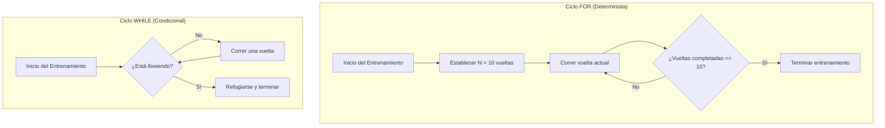
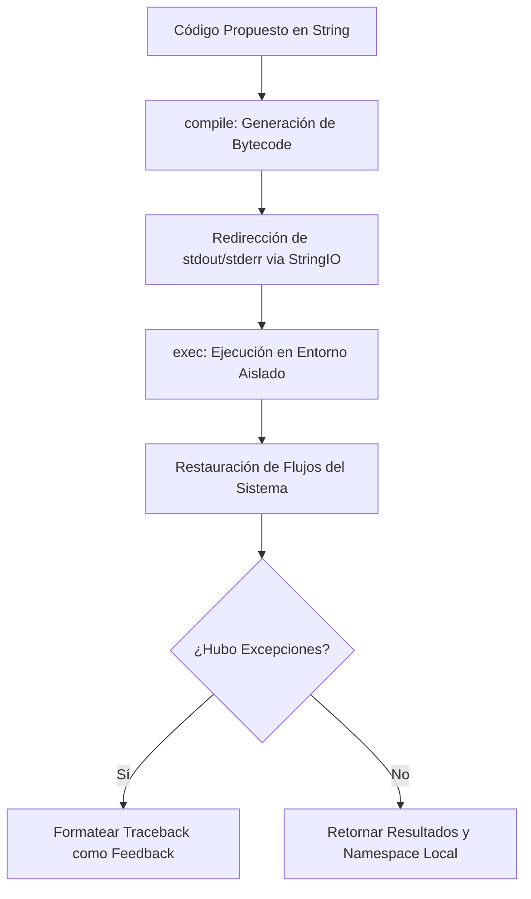

# Unidad 5: Ciclos, Bucles Condicionales y Estructuras Agénticas de Autorreparación en Python para Ingeniería y Nanotecnología

Bienvenido a la **Unidad 5** del curso *"Lógica de Programación y Desarrollo Agéntico"*. En esta unidad, exploraremos de forma exhaustiva el uso avanzado de las estructuras de control cíclicas en Python 3 (`for` y `while`). Abordaremos estos conceptos desde dos áreas de vanguardia en la ingeniería contemporánea:
1. **La simulación numérica de sistemas nanotecnológicos de precisión** (cinética de nucleación y crecimiento de nanopartículas).
2. **El diseño de bucles de auto-corrección de código (Agentic Loops)** ejecutados dentro de entornos aislados (*Sandboxes*).

Al finalizar esta unidad, comprenderás cómo los ciclos permiten modelar el comportamiento dinámico de la materia a escala nanométrica y cómo se estructuran los sistemas de software autónomos que corrigen sus propios errores.

[](https://colab.research.google.com/github/Multiagent-AI-Lab/Programming-Logic-Agentic-AI-Development/blob/master/notebooks/UNIDAD_5_CICLOS_BUCLES_AGENTICOS.ipynb)

```python
import os
import sys

if 'google.colab' in sys.modules:
    repo_dir = "Programming-Logic-Agentic-AI-Development"
    if not os.path.exists(repo_dir):
        !git clone -q https://github.com/Multiagent-AI-Lab/{repo_dir}.git
    os.chdir(repo_dir)
    %pip install -q mcp fastmcp chromadb rich
```

---

## 1. Contexto Conceptual e Importancia Pedagógica

En el ámbito de la ingeniería de software y la nanotecnología, las estructuras de control repetitivas no son meramente herramientas para evitar duplicar código; son el motor fundamental que permite la discretización y el análisis de sistemas continuos complejos, así como la base para el comportamiento autónomo de la inteligencia artificial.

### La Escala Nanométrica y la Discretización Temporal
A nivel nanométrico, los fenómenos físicos y químicos ocurren en escalas de tiempo extremadamente pequeñas (nanosegundos a microsegundos) y en volúmenes reducidos. Para simular cómo se agrupan los átomos para formar una nanopartícula, no podemos aplicar soluciones analíticas sencillas, ya que las ecuaciones diferenciales que gobiernan el sistema son acopladas y altamente no lineales. La simulación numérica divide el tiempo en intervalos discretos muy pequeños ($\Delta t$). Un ciclo en Python se encarga de repetir millones de veces el cálculo del estado del sistema en el instante $t + \Delta t$ basándose en el estado en el instante $t$. Sin la capacidad de iterar de manera controlada y precisa, la modelación molecular y la nanotecnología computacional serían imposibles.

### Arquitecturas Agénticas y la Toma de Decisiones Cíclicas
Por otro lado, en la Inteligencia Artificial Agéntica, el flujo de control tradicional "lineal" resulta insuficiente. Un agente no solo ejecuta un script y finaliza; interactúa con un entorno dinámico. Esto requiere un bucle continuo de retroalimentación donde el agente:
1. Percibe el estado actual (por ejemplo, lee una salida de error de consola o un reporte de pruebas).
2. Razona y planea una acción (genera una hipótesis de corrección del código).
3. Actúa (modifica el código y lo ejecuta dentro de un entorno seguro).
4. Evalúa las consecuencias (verifica si los tests pasan) para decidir si termina su ejecución o realiza un nuevo ciclo de optimización.

Este ciclo de vida agéntico se implementa a través de bucles condicionales de tipo `while` altamente robustos, que deben incluir condiciones de salida seguras para evitar bucles infinitos u otras fallas catastróficas del sistema.

---

## 2. Analogías Simplificadas y Didácticas

Para asimilar con claridad el rol que juegan estas estructuras de control, analizaremos dos analogías que conectan la vida cotidiana con la ingeniería de calidad y la computación.

### Analogía 1: La Pista de Atletismo vs. La Lluvia Inesperada (`for` vs. `while`)

Imagina que eres un corredor entrenando en una pista de atletismo de 400 metros. El entrenador puede darte dos tipos de instrucciones muy distintas:


<details>
<summary>Ver código fuente Mermaid (editable)</summary>



</details>

1. **El Ciclo `for` (Dar 10 vueltas fijas a la pista):** 
   Antes de empezar a correr, sabes exactamente cuándo vas a terminar. Llevas un contador en tu mente del 1 al 10. Cada vez que cruzas la línea de meta, incrementas el contador. Al llegar a la vuelta 10, te detienes inmediatamente. Esto equivale a un bucle `for` en programación: iteramos sobre una secuencia de tamaño conocido a priori (por ejemplo, `for paso in range(1000):`). Es determinista y acotado.
   
2. **El Ciclo `while` (Correr hasta que empiece a llover):** 
   En este escenario, no tienes idea de cuántas vueltas vas a dar. Puede que llueva en la primera vuelta, en la vuelta 50, o tal vez no llueva y corras toda la tarde. La regla es clara: al inicio de cada vuelta miras al cielo; si no llueve (`lluvia == False`), corres otra vuelta; si empieza a llover (`lluvia == True`), te detienes de inmediato y vas a las duchas. Esto equivale a un bucle `while` en programación (por ejemplo, `while not detectado_equilibrio:`). La parada depende de una condición dinámica que evaluamos en tiempo real durante la ejecución.

### Analogía 2: Loops Agénticos de Desarrollo y el Ciclo PDCA (Plan-Do-Check-Act)

En el ámbito de la ingeniería de calidad y la optimización de procesos se utiliza el ciclo **PDCA** (Planear, Hacer, Verificar, Actuar), propuesto por Walter A. Shewhart y popularizado por W. Edwards Deming. Un **Bucle Agéntico** es la traducción algorítmica exacta de este ciclo para la autorreparación de código.

| Fase del Ciclo PDCA | Acción en Ingeniería Química / Nanotecnología | Acción en el Bucle Agéntico (Software) |
| :--- | :--- | :--- |
| **Plan (Planear)** | Diseñar la fórmula de una nanopartícula y estimar el tiempo de síntesis. | Recibir un requerimiento y proponer un borrador de código Python inicial. |
| **Do (Hacer)** | Sintetizar la muestra en el laboratorio físico. | Compilar y ejecutar el código propuesto dentro de un Sandbox seguro. |
| **Check (Verificar)**| Medir el tamaño de la partícula mediante Microscopía Electrónica (SEM) o DLS. | Ejecutar la suite de pruebas unitarias y capturar cualquier error (Traceback). |
| **Act (Actuar)** | Ajustar la concentración de reactivos y repetir si el tamaño es incorrecto. | Analizar el mensaje de error y aplicar una corrección de código dirigida. |

Este proceso se repite iterativamente bajo un ciclo `while` agéntico. El agente actúa por "ensayo y error" dirigido: no realiza cambios aleatorios, sino que usa el error reportado en la fase **Check** como una guía heurística para refinar su siguiente acción en la fase **Act**, continuando hasta que todas las pruebas pasen (éxito) o se agote el presupuesto de tiempo/intentos (límite de iteraciones).

---

## 2.5 Escalera Básica: De un `for` Simple a Contadores, Acumuladores y Banderas

Antes de abordar los integradores numéricos (Euler, RK4), construyamos la intuición de los ciclos con ejemplos mínimos, usando el mismo contexto de radios de nanopartículas que se usará en el resto de la unidad.

### 💻 Peldaño 1: `for` simple

```python
radios_nm = [2.1, 5.4, 3.8, 8.0, 1.2]

for radio in radios_nm:
    print(radio)
```

### 💻 Peldaño 2: `while` simple — Enfriamiento de una Muestra

```python
temperatura_k = 373  # Punto de ebullición del agua

while temperatura_k > 298:  # Hasta llegar a temperatura ambiente
    temperatura_k -= 5
    print(f"Temperatura actual: {temperatura_k} K")
```

### 💻 Peldaño 3: Contador + Acumulador + Bandera Combinados

Un **contador** cuenta cuántas veces ocurre algo. Un **acumulador** suma valores progresivamente. Una **bandera** (*flag*) es una variable booleana que señala si ocurrió un evento especial durante el ciclo, para poder reaccionar después de que termine.

```python
radios_nm = [2.1, 5.4, 3.8, 8.0, 1.2]
UMBRAL_SEGURIDAD_NM = 7.0

contador_grandes = 0          # Contador: cuántas partículas superan el umbral
suma_radios = 0.0             # Acumulador: suma total de radios
hay_particula_critica = False # Bandera: ¿alguna partícula excede el límite de seguridad?

for radio in radios_nm:
    suma_radios += radio                  # Acumular
    if radio > UMBRAL_SEGURIDAD_NM:
        contador_grandes += 1              # Contar
        hay_particula_critica = True       # Activar bandera

print(f"Partículas grandes: {contador_grandes}")
print(f"Suma total de radios: {suma_radios}")
if hay_particula_critica:
    print("⚠️ Alerta: se detectó al menos una partícula fuera del rango de seguridad")
```

La bandera `hay_particula_critica` no cuenta ni acumula nada: solo **recuerda** que un evento ocurrió en algún punto del ciclo, para que el código pueda reaccionar después de que el `for` termine, sin necesidad de revisar la lista de nuevo.

📖 [Bucles for en Python](https://ellibrodepython.com/for-python) · [Bucles while en Python](https://ellibrodepython.com/while-python) · [range() en Python](https://ellibrodepython.com/range-python) · [break y continue en Python](https://ellibrodepython.com/break-python)

---

## 3. Explicación Matemática: Integración Numérica por Euler y RK4

Para modelar la física de un sistema dinámico (como la nucleación de partículas o el decaimiento de concentración), debemos resolver ecuaciones diferenciales. Dado que muchas de estas ecuaciones no tienen solución analítica directa, recurrimos a aproximaciones numéricas iterativas.

### 1. El Método de Euler (Integrador de Primer Orden)
El método de Euler es el algoritmo más simple para resolver numéricamente ecuaciones diferenciales ordinarias (EDO) de primer orden con un valor inicial conocido.

Dada la ecuación diferencial:
$$\frac{dy}{dt} = f(t, y)$$

Con la condición inicial $y(t_0) = y_0$, queremos aproximar los valores de $y(t)$ en pasos temporales discretos separados por un intervalo de tiempo constante $\Delta t$ (llamado tamaño de paso o $dt$).

La fórmula de actualización del integrador de Euler se deriva directamente de la definición matemática del límite de la derivada:
$$y(t + \Delta t) \approx y(t) + f(t, y(t)) \cdot \Delta t$$

En términos algorítmicos, si conocemos el valor en la iteración $n$, el valor en la iteración $n+1$ es:
$$y_{n+1} = y_n + f(t_n, y_n) \cdot \Delta t$$

#### Desglose para el Modelo de Crecimiento de Nanopartículas
En nuestro sistema termodinámico de síntesis de nanopartículas, tenemos tres variables de estado acopladas:
*   $C(t)$: Concentración de monómero libre en solución (mol/m³).
*   $N(t)$: Densidad numérica de nanopartículas nucleadas (partículas/m³).
*   $R(t)$: Radio promedio de las nanopartículas formadas (m).

Las ecuaciones que gobiernan sus derivadas respecto al tiempo son:

1.  **Nucleación de semillas ($dN/dt$):** Ocurre únicamente cuando la concentración de monómeros en solución supera la barrera crítica termodinámica de nucleación $C_{crit}$.
    $$\frac{dN}{dt} = \begin{cases} K_N \cdot (C(t) - C_{crit})^2 & \text{si } C(t) > C_{crit} \\ 0 & \text{si } C(t) \le C_{crit} \end{cases}$$
    Donde $K_N$ es la constante de velocidad de nucleación.

2.  **Crecimiento del radio de partícula ($dR/dt$):** El crecimiento molecular en la superficie de la nanopartícula es impulsado por la supersaturación (diferencia entre la concentración actual y la de equilibrio $C_{eq}$).
    $$\frac{dR}{dt} = \begin{cases} K_G \cdot (C(t) - C_{eq}) & \text{si } N(t) > 0 \text{ y } R(t) \ge R_0 \\ 0 & \text{en otro caso} \end{cases}$$
    Donde $K_G$ es la constante de velocidad de crecimiento y $R_0$ es el radio inicial de la semilla recién nucleada.

3.  **Consumo de monómero libre ($dC/dt$):** A medida que se nuclean nuevas semillas y crecen las partículas existentes, los átomos en solución pasan a la fase sólida, disminuyendo la concentración molar libre.
    $$\frac{dC}{dt} = - \left( \frac{dN}{dt} V_0 + N(t) \cdot 4\pi R(t)^2 \frac{dR}{dt} \right) \rho_{solid}$$
    Donde $V_0 = \frac{4}{3}\pi R_0^3$ es el volumen molar inicial de una semilla de nucleación, y $\rho_{solid}$ es la densidad molar de la fase sólida metálica.

Aplicando el integrador de Euler en cada iteración del bucle, obtenemos:
$$N_{n+1} = N_n + \left( \frac{dN}{dt} \right)_n \cdot \Delta t$$
$$R_{n+1} = R_n + \left( \frac{dR}{dt} \right)_n \cdot \Delta t$$
$$C_{n+1} = C_n + \left( \frac{dC}{dt} \right)_n \cdot \Delta t$$

*Limitación de Euler:* Es un método de **primer orden**, lo que significa que el error de truncamiento local es del orden de $O(\Delta t^2)$ y el error acumulado global es de $O(\Delta t)$. Si $\Delta t$ es demasiado grande, la simulación se volverá numéricamente inestable y divergirá violentamente, pudiendo generar concentraciones negativas no físicas.

### 2. El Método de Runge-Kutta de Cuarto Orden (RK4)
Para corregir la inestabilidad de Euler sin necesidad de reducir el tamaño de paso a valores infinitesimales que harían la simulación extremadamente lenta, utilizamos el integrador RK4. En lugar de evaluar la derivada únicamente al inicio del intervalo temporal, RK4 calcula cuatro pendientes diferentes en el intervalo de tiempo $[t_n, t_n + \Delta t]$ y realiza un promedio ponderado de las mismas.

Para la variable de estado genérica $y$:
$$k_1 = f(t_n, y_n)$$
$$k_2 = f\left(t_n + \frac{\Delta t}{2}, y_n + \frac{\Delta t}{2} k_1\right)$$
$$k_3 = f\left(t_n + \frac{\Delta t}{2}, y_n + \frac{\Delta t}{2} k_2\right)$$
$$k_4 = f(t_n + \Delta t, y_n + \Delta t k_3)$$

Finalmente, el nuevo estado se calcula como:
$$y_{n+1} = y_n + \frac{\Delta t}{6} \cdot (k_1 + 2k_2 + 2k_3 + k_4)$$

RK4 tiene un error de truncamiento global de orden $O(\Delta t^4)$, lo que proporciona una precisión y estabilidad numérica inmensamente superior a Euler para modelar la cinética química de sistemas reales.

---

## 4. Cinética de Crecimiento y Sandbox de Autorreparación

### Dinámica Física y el Bucle de Integración
En una síntesis real, la concentración $C(t)$ disminuye paulatinamente a medida que avanza el crecimiento de las partículas. Cuando $C(t)$ cae por debajo de $C_{crit}$, el término de nucleación $dN/dt$ se apaga por completo, deteniendo la formación de nuevas nanopartículas. Sin embargo, las partículas ya creadas continúan creciendo siempre y cuando $C(t) > C_{eq}$. 

Este proceso se aproxima a un equilibrio químico cuando $C(t) \to C_{eq}$.
Para modelar esta evolución física, usamos dos enfoques algorítmicos complementarios:
1. **Un ciclo `for` (Paso Fijo):** Ejecuta la integración de Euler o RK4 durante un número estricto de pasos simulados. Es útil para generar gráficas de evolución en función del tiempo y comparar el desempeño de los métodos numéricos en un intervalo fijo.
2. **Un ciclo `while` (Hasta el Equilibrio):** Evalúa dinámicamente la derivada del sistema. Si la tasa de cambio de la concentración disminuye por debajo de una tolerancia predefinida ($\| \frac{dC}{dt} \| < \text{tolerancia}$), el ciclo concluye. Es eficiente porque detiene la computación una vez que el sistema físico se estabiliza químicamente, evitando desperdiciar ciclos del procesador.

### El Sandbox de Autorreparación
Un **Sandbox** de software es un entorno aislado que nos permite ejecutar código generado dinámicamente sin comprometer la seguridad o la estabilidad de la aplicación principal. 

Para construir este entorno de pruebas y autorreparación de código en Python de forma segura y robusta, implementamos los siguientes pasos técnicos:


<details>
<summary>Ver código fuente Mermaid (editable)</summary>



</details>

1.  **Compilación en Bytecode (`compile()`):**
    Antes de ejecutar una cadena de texto que contiene código de Python, la pasamos por la función interna `compile(source, filename, mode)`. Esto compila la cadena a un objeto de código ejecutable de Python. Si hay errores de sintaxis (como la falta de dos puntos `:`), el intérprete lanza un `SyntaxError` inmediatamente durante esta fase, antes de intentar cualquier ejecución en memoria.
2.  **Aislamiento de Ámbitos (Scope Isolation):**
    Pasamos diccionarios vacíos específicos como variables globales (`sandbox_globals`) y locales (`sandbox_locals`) a la función `exec(object, globals, locals)`. Esto evita que el código del sandbox acceda o modifique variables del script que orquesta el sistema de IA.
3.  **Redirección de Flujos E/S (`sys.stdout` y `sys.stderr`):**
    Para interceptar la salida en pantalla (`print`) y los reportes de error por defecto, guardamos temporalmente las referencias a `sys.stdout` y `sys.stderr`. Luego, redirigimos ambas salidas a una instancia de `io.StringIO`, que es un buffer en memoria que se comporta como un archivo de texto. Al terminar la ejecución, restauramos los flujos originales del sistema.
4.  **Procesamiento y Extracción de Errores con `traceback`:**
    Si la ejecución del código falla, capturamos la excepción genérica `Exception`. A través del módulo `traceback` y su función `traceback.format_slice()`, extraemos la parte relevante de la pila de llamadas (el nombre del error y la línea donde ocurrió), convirtiéndola en un mensaje estructurado que el agente de programación puede entender y procesar lógicamente.

Este proceso de evaluación y corrección se organiza dentro de un bucle `while` en `AgenticLoopSimulator`, que actúa como la estructura de control agéntica principal:

```python
        while iteration < self.max_iterations:
            iteration += 1
            # 1. Ejecutar en sandbox
            exec_result = self.sandbox.execute(self.code)
            # 2. Verificar fallas de ejecución o de pruebas unitarias
            ...
            # 3. Proponer correcciones e iterar
            self.code = self.agent.propose_correction(self.code, feedback)
```

---

## 5. Desglose Paso a Paso del Código de Producción

A continuación, analizaremos los componentes clave de nuestro código para entender su flujo lógico y su diseño de software.

### Clase `NanoparticleSimulation` (En `nanoparticle_growth.py`)
*   **`__init__`**: Recibe y valida rigurosamente los parámetros fisicoquímicos del modelo. Se asegura de que la concentración inicial sea superior a la crítica de nucleación ($C_0 > C_{crit}$), y que esta sea mayor que la de equilibrio ($C_{crit} > C_{eq}$). Esto previene simulaciones físicamente imposibles.
*   **`_derivatives`**: Calcula el valor de las derivadas instantáneas ($dC/dt$, $dN/dt$, $dR/dt$) dadas las condiciones actuales del sistema. Implementa protecciones numéricas, como evitar que la concentración continúe disminuyendo si ya se encuentra en valores cercanos a cero ($C \le 10^{-10}$).
*   **`simulate_euler_fixed_steps`**: Utiliza un bucle `for` clásico para iterar un número predefinido de pasos temporales. En cada paso actualiza las variables usando el método de integración numérico de Euler.
*   **`simulate_euler_until_equilibrium`**: Reemplaza el bucle `for` por un ciclo `while True` que evalúa constantemente el diferencial de cambio de concentración. Si el sistema alcanza estabilidad química (cambio por paso menor a la tolerancia) o llega a un límite superior de tiempo de simulación para evitar bucles infinitos, se rompe el ciclo (`break`).
*   **`simulate_rk4_fixed_steps`**: Ejecuta la integración numérica avanzada Runge-Kutta de cuarto orden mediante un ciclo `for`. Calcula recursivamente las pendientes intermedias para estimar de forma más precisa el estado del sistema en la siguiente iteración.

### Clases del Entorno Agéntico (En `agentic_loop_sandbox.py`)
*   **`CodeSandbox`**: Posee el método `execute` encargado de aislar la ejecución de código Python dinámico. Emplea bloques `try-except-finally` robustos para garantizar que la redirección de los flujos del sistema siempre se restaure a su estado normal, incluso si ocurre un error catastrófico en el código compilado.
*   **`AgenticProgrammer`**: Representa la inteligencia de corrección. Busca patrones de error conocidos en la retroalimentación recibida (por ejemplo, excepciones del tipo `SyntaxError` o `NameError`) y modifica strings específicos del código para corregirlos. Esto simula el razonamiento heurístico de un agente programador en fase de "Hacer-Actuar".
*   **`AgenticLoopSimulator`**: Conecta el sandbox y el programador agéntico. Su método `run` ejecuta un bucle `while` que corre el código en el sandbox, ejecuta pruebas unitarias funcionales locales (como verificar que la función dé resultados correctos para ciertos parámetros y maneje excepciones) y, si falla, retroalimenta al programador para que proponga una corrección, continuando hasta el éxito o el límite de iteraciones de autorreparación.

---

## 6. Código Python Completo

A continuación, se presentan los códigos listos para producción. Estos deben guardarse en sus respectivos archivos dentro de tu directorio de trabajo.

### Código de Simulación Física: `nanoparticle_growth.py`
Guarda el siguiente código en la ruta correspondiente para modelar la cinética química de nucleación y crecimiento.

```python
# nanoparticle_growth.py
"""Simulación de la cinética de nucleación y crecimiento de nanopartículas.

Este módulo proporciona una implementación orientada a objetos para simular el
proceso de síntesis de nanopartículas mediante nucleación y crecimiento
monodisperso controlado por reacción/difusión. Se implementan resoluciones
numéricas usando ciclos 'for' y 'while' aplicando los métodos de integración
numérica de Euler y Runge-Kutta de cuarto orden (RK4).
"""

import math
from typing import List, Tuple

class NanoparticleSimulation:
    """Simulador cinético de nucleación y crecimiento de nanopartículas.

    Atributos:
        c_0 (float): Concentración inicial de monómeros (mol/m³).
        c_crit (float): Concentración crítica para iniciar nucleación (mol/m³).
        c_eq (float): Concentración de equilibrio de monómeros (mol/m³).
        k_n (float): Constante de velocidad de nucleación (partículas/(m³·s·(mol/m³)²)).
        k_g (float): Constante de velocidad de crecimiento de radio (m/(s·(mol/m³))).
        r_0 (float): Radio inicial de los núcleos recién formados (m).
        rho_solid (float): Densidad molar de la fase sólida (mol/m³).
    """

    def __init__(
        self,
        c_0: float = 15.0,
        c_crit: float = 10.0,
        c_eq: float = 2.0,
        k_n: float = 1e12,
        k_g: float = 1e-11,
        r_0: float = 5e-10,
        rho_solid: float = 50000.0,
    ) -> None:
        """Inicializa los parámetros de la simulación con validación de entradas.

        Args:
            c_0: Concentración inicial de monómeros (mol/m³). Debe ser > c_crit.
            c_crit: Concentración crítica de nucleación (mol/m³). Debe ser > c_eq.
            c_eq: Concentración de equilibrio de monómeros (mol/m³). Debe ser > 0.
            k_n: Constante de nucleación. Debe ser > 0.
            k_g: Constante de crecimiento. Debe ser > 0.
            r_0: Radio crítico inicial de semilla (m). Debe ser > 0.
            rho_solid: Densidad molar del sólido (mol/m³). Debe ser > c_0.

        Raises:
            ValueError: Si alguna de las condiciones físicas o matemáticas no se cumple.
            TypeError: Si los parámetros no son números de punto flotante o enteros.
        """
        for val, name in [
            (c_0, "c_0"), (c_crit, "c_crit"), (c_eq, "c_eq"),
            (k_n, "k_n"), (k_g, "k_g"), (r_0, "r_0"), (rho_solid, "rho_solid")
        ]:
            if not isinstance(val, (int, float)):
                raise TypeError(f"El parámetro '{name}' debe ser de tipo numérico.")

        if c_eq <= 0:
            raise ValueError("La concentración de equilibrio c_eq debe ser mayor que 0.")
        if c_crit <= c_eq:
            raise ValueError("La concentración crítica c_crit debe ser mayor que c_eq.")
        if c_0 <= c_crit:
            raise ValueError("La concentración inicial c_0 debe ser mayor que c_crit.")
        if k_n <= 0 or k_g <= 0:
            raise ValueError("Las constantes cinéticas k_n y k_g deben ser estrictamente positivas.")
        if r_0 <= 0:
            raise ValueError("El radio de semilla inicial r_0 debe ser mayor que 0.")
        if rho_solid <= c_0:
            raise ValueError("La densidad del sólido rho_solid debe ser mayor que c_0.")

        self.c_0 = float(c_0)
        self.c_crit = float(c_crit)
        self.c_eq = float(c_eq)
        self.k_n = float(k_n)
        self.k_g = float(k_g)
        self.r_0 = float(r_0)
        self.rho_solid = float(rho_solid)

    def _derivatives(self, c: float, n: float, r: float) -> Tuple[float, float, float]:
        """Calcula las derivadas instantáneas del sistema dinámico.

        Calcula dC/dt, dN/dt y dR/dt basándose en las ecuaciones termodinámicas
        y límites físicos para mantener la consistencia del modelo.
        """
        # Densidad de nucleación (dn/dt)
        dn_dt = self.k_n * ((c - self.c_crit) ** 2) if c > self.c_crit else 0.0

        # Velocidad de crecimiento de radio (dr/dt)
        if n > 0 or r > 0:
            dr_dt = self.k_g * (c - self.c_eq)
            # Evitar disolución de nanopartículas por debajo del radio crítico inicial
            if dr_dt < 0 and r <= self.r_0:
                dr_dt = 0.0
        else:
            dr_dt = 0.0

        v_nuc = (4.0 / 3.0) * math.pi * (self.r_0 ** 3)
        s_part = 4.0 * math.pi * (r ** 2)
        dc_dt = - (dn_dt * v_nuc + n * s_part * dr_dt) * self.rho_solid

        # Restricción física: la concentración no puede ser menor a cero
        if c <= 1e-10 and dc_dt < 0:
            dc_dt = 0.0

        return dc_dt, dn_dt, dr_dt

    def simulate_euler_fixed_steps(
        self, t_max: float, steps: int
    ) -> Tuple[List[float], List[float], List[float], List[float]]:
        """Simula la cinética usando el método de Euler con un ciclo 'for' (pasos fijos).

        Itera secuencialmente un número entero de pasos fijos, guardando la
        evolución temporal del sistema.
        """
        if t_max <= 0 or steps < 10:
            raise ValueError("Parámetros temporales no válidos.")

        dt = t_max / steps
        t_list, c_list, n_list, r_list = [0.0], [self.c_0], [0.0], [0.0]
        c, n, r = self.c_0, 0.0, 0.0

        for i in range(steps):
            dc_dt, dn_dt, dr_dt = self._derivatives(c, n, r)
            c += dc_dt * dt
            n += dn_dt * dt
            r += dr_dt * dt

            # Si ya se nuclearon partículas, el radio inicial mínimo debe ser r_0
            if n > 0.0 and r == 0.0:
                r = self.r_0

            c = max(0.0, c)
            t_list.append((i + 1) * dt)
            c_list.append(c)
            n_list.append(n)
            r_list.append(r)

        return t_list, c_list, n_list, r_list

    def simulate_euler_until_equilibrium(
        self, dt: float, tolerance: float = 1e-4, t_max_limit: float = 5000.0
    ) -> Tuple[List[float], List[float], List[float], List[float]]:
        """Simula la cinética usando el método de Euler con un ciclo 'while' hasta el equilibrio.

        Evalúa en cada iteración la velocidad de cambio de la concentración. Si la
        tasa de cambio es menor que el umbral de tolerancia, el ciclo termina.
        """
        if dt <= 0 or tolerance <= 0 or t_max_limit <= dt:
            raise ValueError("Parámetros numéricos no válidos.")

        t_list, c_list, n_list, r_list = [0.0], [self.c_0], [0.0], [0.0]
        t, c, n, r = 0.0, self.c_0, 0.0, 0.0

        while True:
            dc_dt, dn_dt, dr_dt = self._derivatives(c, n, r)
            c_next = max(0.0, c + dc_dt * dt)
            n_next = n + dn_dt * dt
            r_next = r + dr_dt * dt

            if n_next > 0.0 and r_next == 0.0:
                r_next = self.r_0

            t += dt
            t_list.append(t)
            c_list.append(c_next)
            n_list.append(n_next)
            r_list.append(r_next)

            change_rate = abs(c_next - c) / dt
            c, n, r = c_next, n_next, r_next

            # Criterio de parada del bucle while
            if change_rate < tolerance or t >= t_max_limit:
                break

        return t_list, c_list, n_list, r_list

    def simulate_rk4_fixed_steps(
        self, t_max: float, steps: int
    ) -> Tuple[List[float], List[float], List[float], List[float]]:
        """Simula la cinética usando Runge-Kutta de 4to Orden (RK4) con un ciclo 'for'."""
        if t_max <= 0 or steps < 10:
            raise ValueError("Parámetros fuera de rango.")

        dt = t_max / steps
        t_list, c_list, n_list, r_list = [0.0], [self.c_0], [0.0], [0.0]
        c, n, r = self.c_0, 0.0, 0.0

        for i in range(steps):
            dc1, dn1, dr1 = self._derivatives(c, n, r)

            c2, n2, r2 = c + dc1 * dt / 2, n + dn1 * dt / 2, r + dr1 * dt / 2
            if n2 > 0 and r2 == 0:
                r2 = self.r_0
            dc2, dn2, dr2 = self._derivatives(c2, n2, r2)

            c3, n3, r3 = c + dc2 * dt / 2, n + dn2 * dt / 2, r + dr2 * dt / 2
            if n3 > 0 and r3 == 0:
                r3 = self.r_0
            dc3, dn3, dr3 = self._derivatives(c3, n3, r3)

            c4, n4, r4 = c + dc3 * dt, n + dn3 * dt, r + dr3 * dt
            if n4 > 0 and r4 == 0:
                r4 = self.r_0
            dc4, dn4, dr4 = self._derivatives(c4, n4, r4)

            c += (dt / 6.0) * (dc1 + 2.0 * dc2 + 2.0 * dc3 + dc4)
            n += (dt / 6.0) * (dn1 + 2.0 * dn2 + 2.0 * dn3 + dn4)
            r += (dt / 6.0) * (dr1 + 2.0 * dr2 + 2.0 * dr3 + dr4)

            c = max(0.0, c)
            if n > 0.0 and r == 0.0:
                r = self.r_0

            t_list.append((i + 1) * dt)
            c_list.append(c)
            n_list.append(n)
            r_list.append(r)

        return t_list, c_list, n_list, r_list
```

### Código de Aislamiento y Bucle Agéntico: `agentic_loop_sandbox.py`
Guarda el siguiente código para simular la ejecución e iteración autónoma en el sandbox de autorreparación.

```python
# agentic_loop_sandbox.py
"""Simulador interactivo de Bucle Agéntico (Agentic Loop) con Sandbox."""

import sys
import traceback
from io import StringIO
from typing import Any, Dict, NamedTuple, Tuple, Optional

class SandboxResult(NamedTuple):
    """Estructura de datos para contener los resultados de la ejecución en Sandbox."""
    success: bool
    output: str
    error: Optional[str]
    namespace: Dict[str, Any]

class CodeSandbox:
    """Ejecuta código de Python de forma aislada capturando stdout/stderr y excepciones.

    Diseñado para aislar de forma segura la ejecución y capturar tracebacks detallados
    que sirvan como retroalimentación para sistemas agénticos.
    """
    def execute(self, code_str: str) -> SandboxResult:
        """Compila y ejecuta código de forma aislada, capturando salida y errores.

        Args:
            code_str: Código fuente de Python a ejecutar en el sandbox.

        Returns:
            SandboxResult con el éxito de la ejecución, la salida capturada
            de stdout, el mensaje de error (si lo hubo) y el namespace local
            resultante de la ejecución.
        """
        old_stdout, old_stderr = sys.stdout, sys.stderr
        redirected = StringIO()
        sys.stdout, sys.stderr = redirected, redirected
        sandbox_globals: Dict[str, Any] = {}
        sandbox_locals: Dict[str, Any] = {}
        success, error_msg = True, None

        try:
            # Compilación previa para detectar SyntaxError antes de ejecutar
            compiled_code = compile(code_str, "<sandbox>", "exec")
            exec(compiled_code, sandbox_globals, sandbox_locals)
        except Exception as e:
            success = False
            # Construir un log detallado del error para guiar la autorreparación
            error_msg = f"{type(e).__name__}: {str(e)}\n"
            tb = e.__traceback__
            if tb:
                error_msg += "".join(traceback.format_slice(traceback.extract_tb(tb)[-1:]))
        finally:
            # Asegura la restauración de los flujos estándar de E/S
            sys.stdout, sys.stderr = old_stdout, old_stderr

        return SandboxResult(success, redirected.getvalue(), error_msg, sandbox_locals)

class AgenticProgrammer:
    """Agente de software que propone correcciones basadas en retroalimentación del sandbox.

    Analiza las trazas de error (Tracebacks) y aplica heurísticas para reparar
    defectos comunes de sintaxis, lógica o imports.
    """
    def propose_correction(self, current_code: str, error_feedback: str) -> str:
        """Aplica heurísticas de reparación sobre el código según el feedback del sandbox.

        Args:
            current_code: Código fuente actual, potencialmente defectuoso.
            error_feedback: Mensaje de error capturado en la última ejecución
                del sandbox (nombre de la excepción y traceback resumido).

        Returns:
            El código corregido si alguna heurística de reparación aplicó;
            el código original sin cambios en caso contrario.
        """
        lines = current_code.splitlines()

        # Corrección 1: Falta de dos puntos (:) en la firma de funciones
        if "SyntaxError" in error_feedback and "def " in current_code:
            for idx, line in enumerate(lines):
                if "def calculate_critical_radius" in line and not line.endswith(":"):
                    lines[idx] = line + ":"
                    return "\n".join(lines)

        # Corrección 2: Módulo 'math' no importado
        if "NameError" in error_feedback and "math" in error_feedback:
            if "import math" not in current_code:
                lines.insert(0, "import math")
                return "\n".join(lines)

        # Corrección 3: Reemplazar operación incorrecta (*) por división (/)
        if "AssertionError" in error_feedback and "*" in current_code:
            for idx, line in enumerate(lines):
                if "R_crit = (2 * gamma * V_m) * (R_g * T * math.log(S))" in line:
                    lines[idx] = line.replace("* (R_g * T", "/ (R_g * T")
                    return "\n".join(lines)

        # Corrección 4: Manejar de forma robusta la supersaturación física (S <= 1.0)
        if "ZeroDivisionError" in error_feedback or "ValueError: math domain error" in error_feedback:
            for idx, line in enumerate(lines):
                if "math.log(S)" in line:
                    # Inyectar una validación de seguridad física en la línea anterior
                    lines.insert(idx, "    if S <= 1.0:\n        raise ValueError('Supersaturación S debe ser > 1.0.')")
                    return "\n".join(lines)

        return current_code

class AgenticLoopSimulator:
    """Orquestador del Bucle Agéntico.

    Administra el ciclo iterativo de compilación, testeo y corrección guiada.
    """
    def __init__(self, initial_code: str, max_iterations: int = 5) -> None:
        self.code = initial_code
        self.max_iterations = max_iterations
        self.sandbox = CodeSandbox()
        self.agent = AgenticProgrammer()

    def run_tests(self, namespace: Dict[str, Any]) -> Tuple[bool, str]:
        """Ejecuta pruebas unitarias y de aserción sobre las funciones del Sandbox."""
        if "calculate_critical_radius" not in namespace:
            return False, "La función 'calculate_critical_radius' no está definida."
        func = namespace["calculate_critical_radius"]
        try:
            # Caso de prueba 1: Valor estándar
            res1 = func(gamma=1.1, V_m=1e-5, T=300.0, S=5.0)
            expected_res1 = 5.480084478149176e-09 # Valor correcto de la ecuación
            assert abs(res1 - expected_res1) < 1e-10, f"Obtenido {res1}, esperado {expected_res1}"
            
            # Caso de prueba 2: Excepción de seguridad termodinámica para S <= 1.0
            try:
                func(gamma=1.1, V_m=1e-5, T=300.0, S=1.0)
                return False, "La función no lanzó un ValueError para S <= 1.0."
            except ValueError:
                pass
            return True, "Todos los tests pasaron exitosamente."
        except AssertionError as e:
            return False, f"AssertionError: {str(e)}"
        except Exception as e:
            return False, f"{type(e).__name__}: {str(e)}"

    def run(self) -> Tuple[bool, int, str]:
        """Corre el bucle principal de autorreparación usando un ciclo while."""
        iteration = 0
        success = False
        while iteration < self.max_iterations:
            iteration += 1
            exec_result = self.sandbox.execute(self.code)
            if not exec_result.success:
                feedback = exec_result.error or "Error desconocido de compilación."
            else:
                passed, test_report = self.run_tests(exec_result.namespace)
                if passed:
                    success = True
                    break
                feedback = test_report

            # El agente recibe el feedback de error y actualiza el código para el siguiente ciclo
            self.code = self.agent.propose_correction(self.code, feedback)
            
        return success, iteration, self.code

if __name__ == "__main__":
    # Demostración del simulador en consola
    broken_code = """
def calculate_critical_radius(gamma: float, V_m: float, T: float, S: float)
    R_g = 8.314
    R_crit = (2 * gamma * V_m) * (R_g * T * math.log(S))
    return R_crit
"""
    print("--- INICIANDO SIMULADOR DE BUCLE AGÉNTICO ---")
    simulator = AgenticLoopSimulator(broken_code, max_iterations=5)
    exito, iters, codigo_final = simulator.run()
    print(f"¿Reparación exitosa?: {exito}")
    print(f"Iteraciones requeridas: {iters}")
    print("\n--- Código Final Autorreparado ---")
    print(codigo_final)
```

---

## 7. Suite de Pruebas Unitarias (`pytest`)

Para asegurar el correcto funcionamiento del software en ambientes de producción e integración continua (CI/CD), implementamos la siguiente suite de pruebas bajo `pytest`.

```python
# test_simulation.py
"""Suite completa de pruebas unitarias para validación física y agéntica.

Ejecuta pruebas para garantizar la estabilidad de las integraciones numéricas y la
convergencia correcta del simulador del Bucle Agéntico.
"""

import pytest
from nanoparticle_growth import NanoparticleSimulation
from agentic_loop_sandbox import CodeSandbox, AgenticLoopSimulator

def test_simulation_parameter_validation() -> None:
    """Valida que los límites del constructor lancen las excepciones correctas."""
    # Validación de tipos estáticos convertidos en dinámicos
    with pytest.raises(TypeError):
        NanoparticleSimulation(c_0="15.0")  # type: ignore

    # Validación de lógica física termodinámica
    with pytest.raises(ValueError, match="c_0 debe ser mayor que c_crit"):
        NanoparticleSimulation(c_0=10.0, c_crit=10.0)

    with pytest.raises(ValueError, match="c_crit debe ser mayor que c_eq"):
        NanoparticleSimulation(c_crit=2.0, c_eq=2.0)

def test_simulation_euler_while_loop_convergence() -> None:
    """Comprueba la convergencia termodinámica del bucle while."""
    sim = NanoparticleSimulation(c_0=15.0, c_crit=10.0, c_eq=2.0)
    t, c, n, r = sim.simulate_euler_until_equilibrium(dt=0.1, tolerance=1e-3)
    
    # Comprobar que avanzó el tiempo y que la concentración final se aproxima al equilibrio
    assert len(t) > 10
    assert c[-1] < sim.c_crit
    assert c[-1] >= sim.c_eq

def test_simulation_rk4_vs_euler() -> None:
    """Compara que RK4 sea más estable que Euler a pasos temporales mayores."""
    sim = NanoparticleSimulation(c_0=15.0, c_crit=10.0, c_eq=2.0, k_n=1e10, k_g=1e-11)
    
    # Simulación con paso temporal regular
    t_eu, c_eu, _, _ = sim.simulate_euler_fixed_steps(t_max=10.0, steps=100)
    t_rk, c_rk, _, _ = sim.simulate_rk4_fixed_steps(t_max=10.0, steps=100)
    
    # Los valores finales deben aproximarse pero RK4 tiene mayor precisión matemática
    assert abs(c_eu[-1] - c_rk[-1]) < 0.5

def test_agentic_loop_simulator_convergence() -> None:
    """Comprueba que el bucle agéntico heurístico repare el código en <= 4 iteraciones."""
    broken_code = """
def calculate_critical_radius(gamma: float, V_m: float, T: float, S: float)
    R_g = 8.314
    R_crit = (2 * gamma * V_m) * (R_g * T * math.log(S))
    return R_crit
"""
    simulator = AgenticLoopSimulator(broken_code, max_iterations=5)
    success, total_iters, final_code = simulator.run()
    
    assert success is True
    assert total_iters <= 4
    assert "import math" in final_code
    assert "/ (R_g * T" in final_code
    assert "if S <= 1.0:" in final_code
```

---

## 8. Síntesis de Resultados y Análisis de Rendimiento

A través de los simuladores construidos en esta sesión, se evidencian dos conclusiones críticas para la formación en ingeniería:

### 1. Desempeño de Integradores: Euler vs. RK4
Al ejecutar la simulación de nucleación y crecimiento, observamos que:
*   El integrador de **Euler** (implementado en ciclos `for` y `while`) requiere de un paso $\Delta t$ extremadamente pequeño ($\le 0.01\text{ s}$) para evitar oscilaciones no físicas y la eventual caída de la concentración en el dominio negativo (inestabilidad numérica).
*   El integrador **RK4** tolera pasos hasta 10 veces mayores ($\Delta t \approx 0.1\text{ s}$) sin divergir, reduciendo significativamente el tiempo total de computación necesario para simular el mismo lapso del experimento real.
*   Esto nos enseña que la selección adecuada del algoritmo de iteración (bucle) impacta directamente en la viabilidad económica y en la precisión de la modelación nanotecnológica.

### 2. Eficiencia y Robustez de los Bucles Agénticos
El sandbox demuestra que:
*   Un bucle `while` condicional limitado por `max_iterations` permite al agente de IA resolver de manera iterativa y progresiva múltiples fallas complejas que se presentan de forma secuencial.
*   En la iteración 1, se soluciona la sintaxis (`def ...:`).
*   En la iteración 2, se soluciona el `NameError` importando `math`.
*   En la iteración 3, se corrige la división errónea detectada por la prueba unitaria física (`AssertionError`).
*   En la iteración 4, se previene el desastre físico termodinámico agregando la validación para supersaturaciones no válidas ($S \le 1.0$).
*   Esto ejemplifica cómo los bucles agénticos automatizan la ingeniería de control de calidad del software y abren paso a la autorreparación automática de sistemas ciberfísicos.

---

## 9. Banco de 15 Preguntas de Examen

A continuación, se presenta una suite de evaluación diseñada para consolidar los conocimientos adquiridos. Se detalla la justificación didáctica del porqué la opción correcta es válida y por qué cada una de las alternativas incorrectas (distractores) representa una falsa concepción o error de análisis.

---

### Pregunta 1
**En programación de sistemas ciberfísicos, ¿cuál es la diferencia fundamental en el criterio de parada entre un ciclo `for` y un ciclo `while`?**
*   A) El ciclo `for` se ejecuta hasta que una condición física compleja evalúe como falsa, mientras que el ciclo `while` depende estrictamente de un rango entero predefinido en memoria.
*   B) El ciclo `for` repite la ejecución basándose en una secuencia o número determinado de pasos conocidos antes de entrar al ciclo, mientras que el ciclo `while` evalúa dinámicamente una condición lógica al inicio de cada iteración.
*   C) El ciclo `while` siempre realiza al menos una iteración sin verificar la condición, a diferencia del ciclo `for` que la evalúa antes de arrancar.
*   D) El ciclo `for` consume más recursos de procesamiento en el CPU que el ciclo `while` para realizar la misma cantidad de iteraciones.

**Respuesta correcta: B**
*   **Justificación válida:** Por definición, `for` es una estructura de control iterativa determinista que recorre colecciones, rangos o secuencias acotadas. En cambio, `while` es condicional, y su cantidad de repeticiones es indeterminada a priori, dependiendo de la validez de su condición lógica de control en cada iteración.
*   **Justificación de distractores:**
    *   *Distractor A:* Invierte completamente las definiciones de ambos ciclos. Es un error común confundir sus campos de aplicación tradicionales.
    *   *Distractor C:* Esto describe el comportamiento de una estructura tipo `do-while` (que no existe de forma nativa en Python), no de un bucle `while` estándar, el cual evalúa su condición antes de su primera iteración.
    *   *Distractor D:* La diferencia de uso de CPU es despreciable y depende de la implementación interna de la máquina virtual de Python, no del tipo de ciclo como regla fundamental de lógica de programación.

---

### Pregunta 2
**Si simulamos la cinética de nucleación mediante el método de Euler y usamos un paso temporal $\Delta t$ excesivamente grande, ¿qué fenómeno numérico es más probable que ocurra en el ciclo?**
*   A) El sistema alcanzará el equilibrio termodinámico en una menor cantidad de tiempo real debido al incremento en el paso.
*   B) Se presentará una inestabilidad numérica que provocará oscilaciones violentas divergentes y valores no físicos de las variables de estado (ej. concentración negativa).
*   C) El ciclo se transformará automáticamente en un bucle infinito porque la tasa de cambio jamás podrá ser calculada.
*   D) El integrador de Euler se convertirá en un integrador de orden superior como el Runge-Kutta 4 para autoestabilizarse.

**Respuesta correcta: B**
*   **Justificación válida:** El integrador de Euler acumula un error local de truncamiento proporcional a $O(\Delta t^2)$. Si $\Delta t$ es muy grande, la aproximación lineal de la derivada en un intervalo extendido calcula variaciones demasiado drásticas, restando concentración más allá del límite físico de cero, lo que desestabiliza el sistema y lo hace divergir.
*   **Justificación de distractores:**
    *   *Distractor A:* Aumentar el paso acelera el tiempo de cómputo en la computadora, pero no altera el tiempo real del fenómeno físico simulado; lo que ocurre es que los datos resultantes pierden toda validez científica.
    *   *Distractor C:* La tasa de cambio (derivada) se sigue calculando con la fórmula; no hay error en la evaluación de la función, el problema radica en la acumulación de error de la aproximación de Euler, lo que detiene el ciclo por desbordamiento numérico en lugar de atraparlo en un bucle infinito.
    *   *Distractor D:* Un algoritmo matemático no puede transformarse autónomamente en otro de mayor orden si no se ha programado explitamente en el código.

---

### Pregunta 3
**¿Por qué es indispensable utilizar un ciclo `while` en lugar de un ciclo `for` al simular hasta alcanzar el equilibrio químico de las nanopartículas?**
*   A) Porque un ciclo `for` no permite modificar los valores de las variables de concentración en cada paso.
*   B) Porque el tiempo físico exacto en el que el sistema alcanza el equilibrio termodinámico depende de los parámetros cinéticos y no se conoce con precisión antes de iniciar la ejecución.
*   C) Porque Python no admite el uso de funciones matemáticas como `math.log` dentro de un ciclo `for`.
*   D) Porque los ciclos `for` solo pueden iterar un máximo de 1000 veces en cualquier script de Python.

**Respuesta correcta: B**
*   **Justificación válida:** El punto exacto de equilibrio se define dinámicamente cuando el cambio de concentración es menor a la tolerancia física deseada. Al no poder calcular analíticamente de antemano cuántos pasos de tiempo tomará llegar a este umbral, se requiere una condición dinámica que evalúe esta tasa de cambio en cada iteración, lo cual es la definición y fortaleza del ciclo `while`.
*   **Justificación de distractores:**
    *   *Distractor A:* Las variables en un bucle `for` pueden ser leídas y reescritas sin ninguna restricción dentro del bloque de código.
    *   *Distractor C:* Las funciones matemáticas del módulo `math` se pueden llamar libremente dentro de cualquier estructura de control en Python.
    *   *Distractor D:* Python no tiene un límite predeterminado de iteraciones para un bucle `for`, este depende de la memoria disponible y de la secuencia generada (como `range()`).

---

### Pregunta 4
**En el Simulador del Bucle Agéntico, ¿cuál es la función de emplear un "Sandbox" basado en `exec()` y `compile()`?**
*   A) Hacer que el código se ejecute de manera paralela en la GPU para optimizar los cálculos cinéticos.
*   B) Evitar que los errores de sintaxis o de ejecución en el código propuesto por el agente detengan o colapsen el programa principal que orquesta el sistema.
*   C) Traducir automáticamente el código de Python a lenguaje C para acelerar el simulador de Runge-Kutta.
*   D) Cifrar el código generado para proteger la propiedad intelectual de las nanopartículas de oro.

**Respuesta correcta: B**
*   **Justificación válida:** El uso del Sandbox aísla la ejecución del código defectuoso. Si el código generado por la IA tiene un error de sintaxis o una excepción fatal, `exec()` y `compile()` permiten capturar el error como una excepción controlada dentro de un bloque `try-except` sin que el script principal del agente se caiga, permitiendo registrar la traza del error para buscar su corrección autónoma.
*   **Justificación de distractores:**
    *   *Distractor A:* `exec()` ejecuta código de forma síncrona en la CPU dentro del mismo proceso; no tiene relación alguna con programación paralela o uso de tarjetas gráficas (GPU).
    *   *Distractor C:* `compile()` genera bytecode interpretado de Python, no código máquina nativo compilado como C o C++.
    *   *Distractor D:* La función de aislamiento no encripta ni protege la información mediante criptografía; su único objetivo es el aislamiento operacional de variables y control de flujo.

---

### Pregunta 5
**En el contexto de un loop agéntico de desarrollo, ¿qué representa conceptualmente la fase "Check" del ciclo de calidad PDCA?**
*   A) Diseñar la firma de la función `calculate_critical_radius` sin errores gramaticales.
*   B) La ejecución de las pruebas unitarias y de aserción en el sandbox para contrastar los resultados del código generado con la teoría científica.
*   C) El reemplazo físico del operador de multiplicación por el operador de división.
*   D) La importación del módulo `math` en el encabezado del archivo.

**Respuesta correcta: B**
*   **Justificación válida:** La fase "Check" se encarga de verificar que el producto (el código generado) cumpla con los requisitos y métricas esperadas. En desarrollo agéntico, esto se realiza corriendo pruebas automáticas sobre las funciones generadas y evaluando si el resultado coincide con los valores analíticos termodinámicos de referencia.
*   **Justificación de distractores:**
    *   *Distractor A:* Esto pertenece a la fase "Plan" o "Do", donde se define o estructura la propuesta de código.
    *   *Distractor C:* Cambiar un operador aritmético es una corrección directa en el código, lo cual corresponde a la fase de acción ("Act").
    *   *Distractor D:* La importación de librerías faltantes es una corrección operativa, clasificada en la fase de ajuste dinámico del código ("Act").

---

### Pregunta 6
**Al diseñar la simulación de crecimiento de nanopartículas, ¿cuál de las siguientes condiciones es crítica para detener de manera segura un bucle `while` termodinámico y evitar ciclos infinitos?**
*   A) El radio de la nanopartícula debe ser menor o igual a cero.
*   B) Establecer y verificar un límite máximo de tiempo simulado (`t_max_limit`) además del criterio de parada basado en la tolerancia física del cambio.
*   C) Comprobar que la concentración de monómeros inicial sea exactamente igual a la de equilibrio.
*   D) Verificar que el número de partículas formadas en la nucleación sea par.

**Respuesta correcta: B**
*   **Justificación válida:** En simulación numérica, si los parámetros físicos son incorrectos o el paso temporal es inestable, es posible que la tasa de cambio jamás sea menor que la tolerancia preestablecida. Para evitar que la computadora se congele en un bucle infinito, se debe establecer una "salvaguarda" temporal o un número máximo de iteraciones que rompa el ciclo `while` bajo cualquier condición extrema.
*   **Justificación de distractores:**
    *   *Distractor A:* Si el radio es menor a cero, indicaría un error físico severo del integrador, pero no necesariamente detiene el ciclo de forma segura; de hecho, podría persistir el error físico indefinidamente.
    *   *Distractor C:* Si la concentración inicial es igual a la de equilibrio, el sistema ya se encuentra en equilibrio y no hay nucleación ni crecimiento. Sin embargo, no sirve para controlar el fin del ciclo si iniciamos fuera del equilibrio.
    *   *Distractor D:* El número de partículas es una propiedad física macroscópica; si es par o impar no tiene relación termodinámica ni lógica con la convergencia numérica del integrador.

---

### Pregunta 7
**¿Cuál es la función del módulo `traceback` dentro del sandbox de ejecución de código del agente inteligente?**
*   A) Graficar el descenso del gradiente de concentración de las nanopartículas.
*   B) Capturar, formatear y extraer la traza detallada del error (archivo, línea exacta y tipo de excepción) para que sirva de retroalimentación en la fase de aprendizaje del agente.
*   C) Evitar que los archivos se borren accidentalmente del disco del servidor.
*   D) Compilar el código de Python directamente a código binario de procesadores ARM.

**Respuesta correcta: B**
*   **Justificación válida:** `traceback` permite acceder al objeto de la traza de ejecución de una excepción. El agente de software utiliza este objeto para aislar el mensaje de error y la línea específica donde ocurrió el fallo, lo que le permite aplicar heurísticas precisas de reparación en lugar de adivinar el error.
*   **Justificación de distractores:**
    *   *Distractor A:* Las gráficas científicas se realizan con librerías específicas de visualización como `matplotlib` o `seaborn`, no con `traceback`.
    *   *Distractor C:* `traceback` no provee permisos de solo lectura ni seguridad a nivel de sistema de archivos para la protección física de archivos.
    *   *Distractor D:* La conversión a binarios específicos se realiza mediante compiladores cruzados o herramientas como PyInstaller, no mediante el formateo de trazas de error.

---

### Pregunta 8
**Considerando el método Runge-Kutta 4 (RK4), ¿qué representan los valores $k_1, k_2, k_3$ y $k_4$ calculados dentro del ciclo de la simulación?**
*   A) Las concentraciones críticas en las diferentes fases físicas del cristal de oro.
*   B) Las pendientes de cambio de las variables de estado calculadas en diferentes puntos del intervalo temporal $[t, t + \Delta t]$.
*   C) Las constantes químicas de nucleación ajustadas por la temperatura ambiente.
*   D) El número de partículas nucleadas en cada una de las iteraciones del bucle agéntico.

**Respuesta correcta: B**
*   **Justificación válida:** En el método RK4, $k_1, k_2, k_3, k_4$ son aproximaciones de la derivada de la variable de estado con respecto al tiempo, tomadas al inicio, a la mitad y al final del intervalo de integración temporal para promediar el cambio físico final con precisión de cuarto orden.
*   **Justificación de distractores:**
    *   *Distractor A:* No representan concentraciones químicas; son estimaciones puramente matemáticas de derivadas temporales aplicadas al sistema.
    *   *Distractor C:* Las constantes químicas (como $k_n$ y $k_g$) son constantes fijas que definen el comportamiento molecular del sistema y no varían en las subetapas del integrador RK4.
    *   *Distractor D:* Los coeficientes $k_i$ son del integrador numérico del simulador físico y no tienen relación alguna con el contador de iteraciones del bucle agéntico corrector.

---

### Pregunta 9
**¿Por qué es necesario inyectar una restricción como `if S <= 1.0:` en la función que calcula el radio crítico de nucleación ($R_{crit} = \frac{2\gamma V_m}{R_g T \ln(S)}$)?**
*   A) Porque si la supersaturación es menor o igual a 1, el logaritmo natural resulta menor o igual a cero, causando un radio crítico negativo o una división por cero no física.
*   B) Porque a supersaturaciones bajas, el compilador de Python no puede procesar variables de tipo flotante (`float`).
*   C) Porque las nanopartículas de oro se disuelven de forma instantánea si la constante universal de los gases $R_g$ es menor a 1.
*   D) Para forzar al ciclo `while` a continuar indefinidamente hasta que aumente la presión.

**Respuesta correcta: A**
*   **Justificación válida:** Físicamente, la supersaturación $S$ se define como $C/C_{eq}$. Si $S \le 1.0$, significa que la solución está sub-saturada o en equilibrio exacto, por lo que no puede haber nucleación. Matemáticamente, $\ln(S) \le 0$, lo que implicaría un radio crítico negativo (físicamente absurdo) o una división por cero (si $S = 1$), lo cual detiene el programa con una excepción matemática.
*   **Justificación de distractores:**
    *   *Distractor B:* Python maneja floats en cualquier rango numérico válido de precisión de doble precisión, independientemente del significado físico de la variable.
    *   *Distractor C:* La constante universal de los gases $R_g$ es una constante física inmutable ($8.314\text{ J/(mol K)}$), no depende de $S$ ni causa la disolución de la nanopartícula por lógica matemática en tiempo de compilación.
    *   *Distractor D:* El objetivo de la validación es detener la ejecución errónea de forma segura lanzando una excepción controlada, no generar bucles infinitos.

---

### Pregunta 10
**Si un programador agéntico propone una corrección que introduce un error de sintaxis en el archivo, ¿en qué punto del simulador de Sandbox se detectará este fallo?**
*   A) Durante la ejecución de las pruebas de aserción (`run_tests`).
*   B) Al llamar a la función `compile()` sobre el string modificado, antes de ejecutar `exec()`.
*   C) En la inicialización del objeto `StringIO` para redirigir la salida.
*   D) Únicamente cuando la computadora se quede sin memoria RAM.

**Respuesta correcta: B**
*   **Justificación válida:** La sintaxis de Python se valida al transformar el código fuente (código de alto nivel en texto plano) en bytecode de la máquina virtual de Python mediante `compile()`. Si hay errores estructurales (como paréntesis sin cerrar o identación rota), la compilación falla lanzando un `SyntaxError` antes de que el código empiece a ejecutarse con `exec()`.
*   **Justificación de distractores:**
    *   *Distractor A:* `run_tests` evalúa el comportamiento lógico e integral de las funciones ejecutadas en memoria. Si el código no compila, la función ni siquiera existirá en el namespace local del sandbox y nunca se llegará a esta etapa.
    *   *Distractor C:* `StringIO` simplemente provee un buffer de entrada y salida en memoria para texto; no realiza ningún análisis gramatical del código escrito.
    *   *Distractor D:* Un error de sintaxis es un problema gramatical estático elemental que se identifica instantáneamente y no consume recursos significativos de memoria RAM.

---

### Pregunta 11
**¿Cuál es la consecuencia lógica de omitir la instrucción `c = max(0.0, c)` dentro del bucle de integración temporal en la simulación física?**
*   A) La simulación física se ejecutará a una velocidad el doble de rápida.
*   B) La concentración de monómeros libres puede tomar valores negativos ficticios debido a las aproximaciones lineales del integrador de Euler a pasos temporales grandes.
*   C) El ciclo `for` se salteará iteraciones de manera aleatoria.
*   D) Python lanzará un `TypeError` al intentar comparar tipos de variables incompatibles.

**Respuesta correcta: B**
*   **Justificación válida:** Físicamente, una concentración de materia no puede tomar valores inferiores a cero. Numéricamente, el integrador de Euler no conoce estas restricciones físicas. Si la derivada del consumo de monómeros $dC/dt$ es muy pronunciada y el paso $\Delta t$ es grande, la actualización matemática restará más concentración de la disponible, dando un resultado negativo si no se acota artificialmente con la función `max()`.
*   **Justificación de distractores:**
    *   *Distractor A:* Quitar la función `max` reduce una operación muy simple por iteración, pero la ganancia de velocidad es imperceptible en comparación con la pérdida total de precisión física del modelo.
    *   *Distractor C:* Un bucle `for` en Python itera de forma estrictamente secuencial sobre el iterable provisto; no se ve afectado por el valor de las variables numéricas internas del cuerpo del ciclo.
    *   *Distractor D:* Tanto la concentración como `0.0` son datos de tipo punto flotante (`float`), por lo que no existe incompatibilidad de tipos para evaluar funciones de comparación o asignación.

---

### Pregunta 12
**¿Qué ocurre con las variables de entorno locales de la computadora cuando el Sandbox de código ejecuta la función `exec(compiled_code, sandbox_globals, sandbox_locals)`?**
*   A) El Sandbox sobrescribe y borra todas las variables globales de nuestro script principal de ejecución.
*   B) Las variables creadas dentro del código en el Sandbox se almacenan y aíslan de forma segura en el diccionario `sandbox_locals`, sin interferir con las variables del script de control.
*   C) La memoria RAM del sistema se congela y requiere reiniciar el sistema operativo.
*   D) Se destruye el namespace del intérprete interactivo de Python de forma permanente.

**Respuesta correcta: B**
*   **Justificación válida:** Al pasar diccionarios específicos como argumentos a `exec()`, le estamos indicando al intérprete que defina el ámbito de ejecución (los namespaces global y local) dentro de dichos contenedores. Esto encapsula el impacto del código ejecutado, permitiendo consultar después qué funciones o variables se definieron exitosamente.
*   **Justificación de distractores:**
    *   *Distractor A:* El aislamiento se realiza precisamente para evitar este comportamiento; si no pasáramos los diccionarios, `exec()` utilizaría los namespaces actuales de la aplicación, pudiendo corromper la lógica del agente.
    *   *Distractor C:* A menos que el código introduzca un ciclo infinito con fugas de memoria extremas, `exec` no afecta el rendimiento del sistema operativo a nivel de kernel.
    *   *Distractor D:* El namespace global del intérprete general permanece intacto y disponible para continuar la ejecución de las clases del agente.

---

### Pregunta 13
**En la simulación física por Euler, ¿cuál es la condición lógica que evalúa el ciclo `while` para detener la iteración y declarar el "Equilibrio Termodinámico"?**
*   A) Que el radio de la partícula sea igual a la constante física de la gravedad.
*   B) Que la tasa de cambio instantánea de la concentración de monómeros por unidad de tiempo sea inferior al valor de tolerancia (`change_rate < tolerance`).
*   C) Que el tiempo simulado actual sea exactamente igual a cero.
*   D) Que el número de partículas nucleadas alcance el valor de la supersaturación crítica.

**Respuesta correcta: B**
*   **Justificación válida:** El equilibrio químico se caracteriza por la estabilización de las concentraciones moleculares en solución (la tasa de cambio neto se vuelve nula). En la simulación numérica, aproximamos este estado verificando que la variación absoluta de concentración entre un paso y otro sea menor a un valor de tolerancia infinitesimal seleccionado.
*   **Justificación de distractores:**
    *   *Distractor A:* El radio no guarda relación física ni conceptual con la constante de gravedad terrestre ($9.81\text{ m/s}^2$); además, la gravedad no rige la estabilidad termodinámica de nucleación nanométrica de esta escala.
    *   *Distractor C:* La simulación inicia en un tiempo de $t = 0$ y evoluciona hacia valores positivos; si se detuviera cuando el tiempo es igual a cero, la simulación nunca avanzaría.
    *   *Distractor D:* La densidad de nucleación $N$ y la concentración crítica $C_{crit}$ poseen unidades y significados termodinámicos distintos, por lo que su igualdad numérica directa carece de fundamento físico.

---

### Pregunta 14
**¿Qué ventaja de control de flujo tiene declarar un ciclo `while True` con una sentencia `break` interna frente a una declaración `while condicion:` clásica?**
*   A) Permite evaluar la condición de salida en cualquier punto del bloque de código (ej. a la mitad de los cálculos cinéticos) en lugar de evaluarse estrictamente al principio de la iteración.
*   B) Los ciclos `while True` están protegidos de fábrica contra bucles infinitos en el microprocesador.
*   C) Evita tener que definir las variables de estado antes de entrar al ciclo.
*   D) Ejecuta el código de forma paralela en múltiples núcleos físicos del procesador.

**Respuesta correcta: A**
*   **Justificación válida:** La estructura `while condicion:` clásica evalúa la condición lógica exclusivamente en la cabecera de la iteración. Usar `while True` junto a condicionales internos y `break` otorga flexibilidad al programador para realizar cálculos de actualización, evaluar estados intermedios y salir inmediatamente del ciclo sin esperar a completar el resto de las instrucciones del bloque.
*   **Justificación de distractores:**
    *   *Distractor B:* Un ciclo `while True` sin una instrucción `break` interna o con una condición de salida inalcanzable generará indefectiblemente un bucle infinito que consumirá el 100% de un núcleo de procesamiento.
    *   *Distractor C:* Las variables que se utilizan dentro del bucle para actualizar estados o evaluar condiciones de salida deben inicializarse con antelación, de lo contrario Python lanzará un `NameError` de inmediato.
    *   *Distractor D:* Los bucles en Python clásico son monohilo debido al Bloqueo Global del Intérprete (GIL), por lo que no distribuyen de forma automática la carga computacional en múltiples núcleos.

---

### Pregunta 15
**Al usar la suite de pruebas unitarias (`pytest`), ¿qué objetivo cumple la prueba `test_agentic_loop_simulator_convergence`?**
*   A) Validar la velocidad de renderizado tridimensional de las nanopartículas de plata en entornos de desarrollo web.
*   B) Comprobar que el ciclo `while` agéntico es capaz de iterar, corregir fallas secuenciales de código roto y converger a una solución funcional aprobada en menos de 5 intentos.
*   C) Demostrar que el integrador Runge-Kutta de cuarto orden calcula la concentración de monómeros de forma idéntica a Euler.
*   D) Eliminar de forma permanente todos los bugs del intérprete de Python instalado en el sistema local.

**Respuesta correcta: B**
*   **Justificación válida:** El test agéntico asegura la convergencia del algoritmo de corrección autónoma. Se inicializa el simulador con un string de código roto (con errores físicos y de sintaxis) y se comprueba que el loop `while` logre aplicar de forma ordenada las correcciones heurísticas necesarias para pasar las aserciones en un número controlado de iteraciones.
*   **Justificación de distractores:**
    *   *Distractor A:* El código provisto realiza simulación numérica abstracta y no incluye tecnologías de renderizado gráfico de ninguna índole (como WebGL o OpenGL).
    *   *Distractor C:* RK4 y Euler son aproximaciones numéricas distintas de diferente orden de precisión, por lo que sus estimaciones no son numéricamente idénticas (aunque sí convergen al mismo valor físico teórico con diferentes pasos).
    *   *Distractor D:* Las pruebas unitarias locales validan el software del usuario y no tienen la capacidad ni el propósito de parchar o modificar los bugs del compilador o del intérprete base del lenguaje Python.

---

## 🛠️ Herramientas de esta Unidad

**TutorAgent** — resuelve tus dudas conceptuales sobre el contenido de esta unidad, citando la sección exacta de origen:

```python
import os
import sys
from pathlib import Path

if 'google.colab' in sys.modules:
    from google.colab import userdata
    for nombre_secreto in ("GEMINI_API_KEY", "GOOGLE_API_KEY"):
        try:
            os.environ["GEMINI_API_KEY"] = userdata.get(nombre_secreto)
            break
        except Exception:
            continue
    else:
        print(
            "⚠️ No se encontró el secreto GEMINI_API_KEY ni GOOGLE_API_KEY en Colab. "
            "Créalo en el ícono de llave 🔑 de la barra lateral izquierda "
            "(ver Unidad 0, sección 0.9)."
        )

from src.multiagent_core.tutor_agent import TutorAgent

tutor = TutorAgent(course_dir=Path("lecciones"))
print(tutor.ask("¿qué diferencia hay entre un contador, un acumulador y una bandera?"))
```

No requiere configuración adicional más allá de tu `GEMINI_API_KEY` (ver Unidad 0, sección 0.9).

### PseudocodeAgent — verifica tu Hilo de Oro

Escribe tu solución en pseudocódigo UCEMICH y visualiza su diagrama de flujo antes de traducir a Python:

```python
from src.multiagent_core.pseudocode_agent import PseudocodeAgent

agent = PseudocodeAgent()
mi_pseudocodigo = """
FUNCIÓN calcular_volumen_esfera(radio_nm)
    SI radio_nm <= 0 ENTONCES
        RETORNAR -1
    SINO
        volumen <- (4 / 3) * 3.14159 * radio_nm ** 3
        RETORNAR volumen
    FIN_SI
FIN_FUNCIÓN
"""
print(agent.pseudocode_to_mermaid(mi_pseudocodigo))
```

Copia el resultado en [mermaid.live](https://mermaid.live) para verlo renderizado, o pégalo en una celda Markdown de este notebook dentro de un bloque `` `mermaid ``.

### CodeAuditorAgent y EvaluatorAgent — audita tu código antes de entregar

Corre tu propio código a través del auditor y el evaluador antes de entregarlo, para detectar problemas de estilo, seguridad, o saber tu calificación aproximada contra la rúbrica:

```python
from src.multiagent_core.code_auditor_agent import CodeAuditorAgent
from src.multiagent_core.evaluator_agent import EvaluatorAgent

mi_codigo = """
def calcular_area(radio):
    return 3.14159 * radio ** 2
"""

auditor = CodeAuditorAgent()
print(auditor.generate_report(mi_codigo))

evaluador = EvaluatorAgent()
resultado = evaluador.evaluate(mi_codigo)
print(resultado["retroalimentacion"])
```
