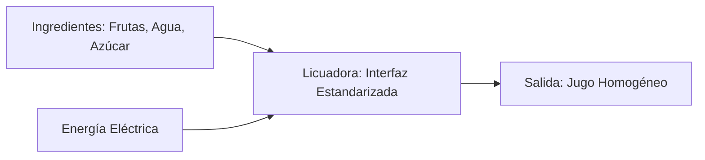
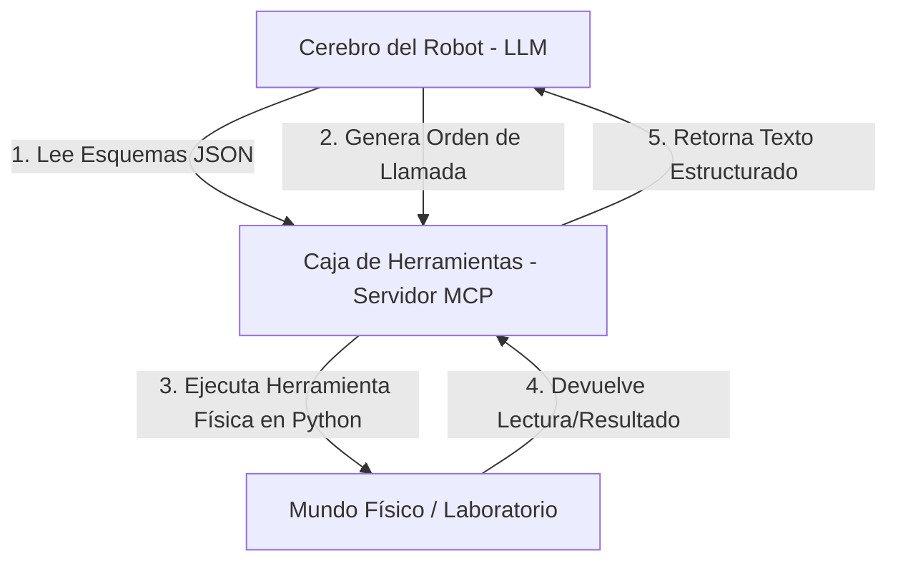

# Unidad 6: Modularidad en Python y Desarrollo Agéntico (MCP & Function Calling)

**Duración:** 2 semanas (12 horas)

**Curso:** Lógica de Programación y Desarrollo Agéntico con IA

**Institución:** Universidad de la Ciénega del Estado de Michoacán de Ocampo (UCEMICH)

**Profesor:** Luis José Yudico Anaya

**Carrera:** Ingeniería en Nanotecnología

**Nivel:** Primer Semestre

Este documento constituye la guía oficial de estudio, repositorio de código de producción y marco de referencia pedagógico para la **Unidad 6: Modularidad e Integración con IA** de la materia *"Lógica de Programación y Desarrollo Agéntico"*. 

El objetivo primordial de esta unidad es capacitar a los estudiantes de primer semestre de Ingeniería de la **Universidad de la Ciénega del Estado de Michoacán de Ocampo (UCEMICH)** en el diseño de software altamente cohesivo, débilmente acoplado y preparado para interactuar con sistemas de Inteligencia Artificial (IA) avanzados. A través del estudio de la modularidad y el **Model Context Protocol (MCP)**, los estudiantes comprenderán cómo los modelos de lenguaje a gran escala (LLMs) pueden descubrir, entender y ejecutar de manera autónoma herramientas programadas en Python.

[](https://colab.research.google.com/github/Multiagent-AI-Lab/Programming-Logic-Agentic-AI-Development/blob/master/notebooks/UNIDAD_6_MODULARIDAD_IA_MCP.ipynb)

```python
import os
import sys

if 'google.colab' in sys.modules:
    repo_dir = "Programming-Logic-Agentic-AI-Development"
    if not os.path.exists(repo_dir):
        !git clone -q https://github.com/Multiagent-AI-Lab/{repo_dir}.git
    os.chdir(repo_dir)
    %pip install -q mcp fastmcp chromadb rich
```

---

## 1. Contexto Conceptual e Importancia de la Modularidad

### 1.1. Cohesión y Acoplamiento: Pilares del Diseño de Software
En el desarrollo de software moderno y aplicaciones científicas (como el modelado en Nanotecnología), la complejidad puede salirse de control rápidamente. Para mitigar esto, aplicamos dos principios de diseño fundamentales:
*   **Alta Cohesión:** Se refiere a la medida en que los elementos internos de un módulo (o función) pertenecen y trabajan juntos para resolver una única tarea bien definida. Una función altamente cohesiva hace una sola cosa (por ejemplo, calcular la relación de aspecto de una nanopartícula) y la hace de manera exhaustiva y correcta.
*   **Bajo Acoplamiento:** Mide el nivel de dependencia o interconexión entre diferentes módulos. Un diseño con bajo acoplamiento permite cambiar la implementación interna de una función (como optimizar el algoritmo de cálculo de energía libre de nucleación) sin alterar o romper el resto de las partes del software que la invocan.

### 1.2. El Modelo de Evaluación de Python: "Paso por Asignación" (*Call-by-Sharing*)
A diferencia de los lenguajes tradicionales que dividen de manera estricta el paso de parámetros en "paso por valor" (donde se clona el dato) y "paso por referencia" (donde se comparte la dirección de memoria directa), Python opera bajo el modelo **Paso por Asignación** o *Call-by-Sharing*.

Cuando pasamos un argumento a una función:
1.  **Objetos Inmutables (Números `int`/`float`, Cadenas `str`, Tuplas `tuple`):** Python comparte la referencia al objeto. Sin embargo, al ser inmutable, cualquier intento de modificación dentro del cuerpo de la función obligará a Python a instanciar un nuevo objeto en un espacio de memoria local. El objeto original en el ámbito del llamador permanece completamente inalterado, imitando un comportamiento de paso por valor.
2.  **Objetos Mutables (Listas `list`, Diccionarios `dict`, Conjuntos `set`):** Se comparte la referencia al mismo objeto exacto en memoria. Si la función modifica internamente el objeto (por ejemplo, aumentando un elemento a una lista o mutando una llave de diccionario), la alteración ocurre *in-place*. Al finalizar la función, el ámbito del llamador verá reflejada la modificación de manera inmediata, imitando un paso por referencia.

### 1.3. Anotaciones de Tipo (*Type Hints*) y Validación Estricta
Python es dinámicamente tipado, pero para entornos de producción e integración con inteligencia artificial, requerimos herramientas de robustez estática. Las anotaciones de tipo (`def calcular(x: float) -> float`) no restringen la ejecución en tiempo de ejecución por defecto, pero sirven como:
1.  **Documentación formal e inambigua** para otros desarrolladores.
2.  **Entradas para linters y analizadores estáticos** como `mypy` que previenen bugs antes de la ejecución.
3.  **Metadatos legibles por la máquina** para que un servidor MCP genere esquemas JSON precisos que los LLMs interpreten para saber qué tipo de dato inyectar en cada parámetro.

### 1.4. Lambda, Argumentos Opcionales, `*args` y `**kwargs`

Antes de construir el servidor MCP completo, necesitamos cuatro herramientas de sintaxis de funciones que se usan constantemente en código modular y en la comunicación con LLMs.

**Funciones lambda** (funciones anónimas de una sola línea), útiles para criterios de ordenamiento rápidos:
```python
nanoparticulas = [
    {"id": "np1", "radio_nm": 5.2},
    {"id": "np2", "radio_nm": 1.8},
    {"id": "np3", "radio_nm": 9.4},
]

# Ordenar por radio de menor a mayor usando lambda como criterio (key)
ordenadas = sorted(nanoparticulas, key=lambda p: p["radio_nm"])
```

**Argumentos opcionales con valor por defecto**, para no obligar al llamador a especificar todo:
```python
def calcular_relacion_aspecto(longitud_nm: float, diametro_nm: float = 1.0) -> float:
    return longitud_nm / diametro_nm
```

**`*args`**: recibe un número variable de argumentos posicionales, empaquetados en una tupla:
```python
def suma_radios(*radios_nm: float) -> float:
    return sum(radios_nm)

suma_radios(2.1, 5.4, 3.8)  # funciona con cualquier cantidad de argumentos
```

**`**kwargs`**: recibe un número variable de argumentos nombrados, empaquetados en un diccionario. Esta es exactamente la mecánica que usa nuestro servidor MCP: cuando un LLM invoca una herramienta, envía un diccionario JSON de argumentos (ver sección 2.3 y 6.2 más abajo) que el servidor **desempaqueta** con `**` antes de llamar a la función real de Python:
```python
def registrar_particula(**propiedades) -> dict:
    """Recibe cualquier combinación de propiedades como argumentos nombrados."""
    return propiedades

registrar_particula(radio_nm=5.2, material="Au", morfologia="esferica")
# equivale a registrar_particula({"radio_nm": 5.2, "material": "Au", "morfologia": "esferica"})
```
En la sección 6.2 veremos que el método `call_tool` del servidor MCP recibe el diccionario JSON de argumentos que envía el LLM y lo desempaqueta exactamente así, con `func(**validated_args)`, para ejecutar la función Python real registrada.

📖 [Funciones en Python](https://ellibrodepython.com/funciones-en-python) · [Funciones lambda](https://ellibrodepython.com/lambda-python) · [Alcance de variables](https://ellibrodepython.com/alcance-variables-python)

---

## 2. Analogías Didácticas

Para asentar estos complejos conceptos de programación e IA, utilizaremos tres analogías adaptadas al entorno académico y tecnológico de la UCEMICH.

### 2.1. Analogía 1: Las Funciones como Electrodomésticos Estandarizados
Imagine que una función es un **electrodoméstico de cocina estándar**, por ejemplo, una licuadora. 


<details>
<summary>Ver código fuente Mermaid (editable)</summary>



</details>

*   **La Entrada:** Corresponde a los ingredientes físicos y la corriente eléctrica (los argumentos de la función). Estos deben cumplir con ciertas características: no se pueden meter piedras en la licuadora (validación de tipo/`TypeError`).
*   **La Interfaz / Abstracción:** Para usar la licuadora, usted solo interactúa con los botones de velocidad y la tapa. No necesita conocer la física detrás del motor de inducción electromagnética ni el diseño aerodinámico de las aspas de acero inoxidable. Esto representa la **firma de la función** y sus parámetros expuestos.
*   **La Salida:** Es el jugo homogéneo (el valor retornado mediante `return`). Una licuadora bien diseñada es **altamente cohesiva** (solo sirve para licuar/mezclar, no intenta lavar platos ni hornear pan) y tiene **bajo acoplamiento** (se puede conectar a cualquier enchufe de pared de la UCEMICH sin importar la marca de la instalación eléctrica, siempre que cumpla con el voltaje estándar).

---

### 2.2. Analogía 2: Variables Locales vs. Globales: El Diario Íntimo vs. El Periódico Mural
Imagine la diferencia de alcances (*scopes*) de las variables dentro del campus de la UCEMICH:

*   **Ámbito Local (El Diario Íntimo del Estudiante):**
    Cada estudiante tiene un cuaderno personal donde escribe sus reflexiones privadas (variables declaradas dentro de una función).
    *   Nadie fuera de esa función (fuera de la cabeza o la mochila del estudiante) puede leer o alterar lo que está escrito en ese diario.
    *   Si dos estudiantes diferentes escriben en sus respectivos diarios locales una variable llamada `mi_secreto = 5`, no hay ningún conflicto ni colisión, pues cada diario existe en un espacio físico (ámbito local) completamente aislado.
    *   Al terminar la jornada de estudio (cuando la función termina de ejecutarse), el diario se cierra y los datos locales desaparecen de la memoria activa de la universidad.

*   **Ámbito Global (El Periódico Mural de la UCEMICH):**
    El periódico mural ubicado en la explanada principal de la universidad representa el ámbito global.
    *   Cualquier persona del campus (cualquier función en el script) puede pasar por ahí, leer el tablero y, con los permisos adecuados, modificar lo que está escrito.
    *   **El Riesgo de Colisión (*Shadowing* y Efectos Secundarios):** Si un estudiante de Nanotecnología escribe en el periódico mural la variable `temperatura = 25` y luego un estudiante de Biología, pensando que es su espacio, cambia ese valor a `temperatura = 37`, el estudiante de Nanotecnología que dependía del valor original sufrirá un error crítico en sus cálculos sin saber de dónde provino la alteración. Por ello, depender de variables globales (el periódico mural) para transferir datos entre funciones es considerado una práctica peligrosa y un síntoma de mal diseño de software.

---

### 2.3. Analogía 3: Servidores MCP y Function Calling: El Asistente Robot y su Caja de Herramientas
Piense en un modelo de lenguaje de última generación (como un LLM agéntico) como un **asistente robot sumamente inteligente y conversador**.


<details>
<summary>Ver código fuente Mermaid (editable)</summary>



</details>

*   **El Cerebro del Robot (LLM):** Es capaz de razonar, escribir poesía y formular hipótesis sobre la síntesis de nanopartículas de plata, pero carece de "manos" o "sensores" para interactuar directamente con la realidad física o con la base de datos de la universidad.
*   **La Caja de Herramientas (Function Calling):** Para que el robot sea verdaderamente útil, le otorgamos una caja de herramientas física. Sin embargo, el robot no puede adivinar qué herramientas contiene la caja ni cómo usarlas. Por tanto, cada herramienta de la caja viene con una **ficha técnica estandarizada** (el **JSON Schema**). Esta ficha describe en un lenguaje lógico: el nombre de la herramienta (ej. `medir_viscosidad`), para qué sirve (descripción) y qué entradas exactas requiere (por ejemplo, `temperatura_c: float`).
*   **El Protocolo (MCP - Model Context Protocol):** Es el canal estandarizado de comunicación. Cuando el robot razona y determina: *"Para sugerir el método de síntesis correcto, necesito calcular la relación de aspecto del nanotubo de carbono de la muestra"* él busca en su caja de herramientas, encuentra la ficha técnica de la herramienta `calcular_relacion_aspecto`, y emite una orden estructurada por el canal: `call_tool("calcular_relacion_aspecto", {"longitud_nm": 120.0, "diametro_nm": 10.0})`. El **Servidor MCP** (los actuadores mecánicos del robot) ejecuta la función en la computadora física y le devuelve la respuesta al cerebro del robot como texto estructurado, permitiéndole continuar su tarea de análisis.

---

## 3. Explicación Detallada de Introspección y Esquemas JSON

### 3.1. Introspección Dinámica con el Módulo `inspect`
La introspección es la capacidad que posee un lenguaje de programación para examinar la estructura, metadatos y propiedades de los objetos en memoria en tiempo de ejecución. En Python, el módulo estándar `inspect` es el motor que permite a un servidor MCP autogenerar la documentación técnica para el LLM a partir del propio código fuente de las funciones.

#### El método `inspect.signature()`
Cuando aplicamos `inspect.signature(func)` sobre una función, obtenemos un objeto `Signature` que expone detalladamente los parámetros declarados. 

```python
import inspect

def calcular_area(radio: float, unidad: str = "nm") -> float:
    return 3.14159 * (radio ** 2)

sig = inspect.signature(calcular_area)
print(sig.parameters)
# Retorna un mapeo ordenado: {'radio': <Parameter "radio: float">, 'unidad': <Parameter "unidad: str = 'nm'">}
```

Cada parámetro expuesto en `sig.parameters` posee atributos esenciales:
*   `name`: El nombre textual de la variable (por ejemplo, `"radio"`).
*   `default`: Si el parámetro tiene un valor asignado por defecto (como `"nm"`). Si no tiene valor por defecto, toma el valor especial `inspect.Parameter.empty`.
*   `annotation`: La anotación de tipo estático de Python (por ejemplo, `float`).

#### El método `typing.get_type_hints()`
Aunque podríamos usar `func.__annotations__` para leer los tipos, en Python moderno es altamente recomendado usar `get_type_hints(func)`. Este método resuelve de manera dinámica las referencias cruzadas, las importaciones diferidas y traduce tipos complejos (como `Union`, `Optional` o `List` del módulo `typing`) a sus clases u objetos de tipado correspondientes en tiempo de ejecución, previniendo errores de evaluación semántica.

---

### 3.2. Estructura de Esquemas JSON (JSON Schema) para Function Calling
Un **JSON Schema** es un estándar declarativo diseñado para describir y validar la estructura de los datos en formato JSON. Cuando un LLM se conecta a un Servidor MCP, lo primero que hace es solicitar la lista de herramientas disponibles. El servidor responde enviando un arreglo de esquemas JSON.

A continuación se muestra un ejemplo detallado de un esquema JSON generado dinámicamente y la explicación de cada uno de sus campos clave:

```json
{
  "name": "calcular_relacion_aspecto",
  "description": "Calcula la relación de aspecto de un nanomaterial unidimensional (nanotubo/nanohilo).",
  "inputSchema": {
    "type": "object",
    "properties": {
      "longitud_nm": {
        "type": "number",
        "description": "Longitud del nanomaterial en nanómetros. Debe ser > 0."
      },
      "diametro_nm": {
        "type": "number",
        "description": "Diámetro del nanomaterial en nanómetros. Debe ser > 0."
      }
    },
    "required": [
      "longitud_nm",
      "diametro_nm"
    ]
  }
}
```

#### Desglose de Campos del Esquema:
1.  **`name` (string):** Es el identificador único de la herramienta. El LLM utilizará exactamente este valor al escribir la llamada a la función. Debe ser conciso y representativo (se desaconsejan nombres genéricos como `funcion_1`).
2.  **`description` (string):** Es el texto semántico que lee el LLM para comprender la utilidad física o lógica de la herramienta. **¡Es un elemento de diseño crítico!** Si la descripción es ambigua o escueta, el LLM sufrirá alucinaciones y llamará a la herramienta de forma incorrecta o en contextos inadecuados. En nuestro código de producción, esta descripción se extrae automáticamente de la primera línea del *docstring* de la función de Python.
3.  **`inputSchema` (object):** Define la plantilla estructural que deben cumplir los argumentos que enviará la IA.
    *   **`type`:** Declara que el contenedor raíz de los parámetros es un objeto de JSON (equivalente a un diccionario en Python).
    *   **`properties` (object):** Es un mapa de propiedades donde cada clave es el nombre exacto de un parámetro esperado por la función de Python. Dentro de cada propiedad se define su tipo de dato JSON compatible (`string`, `number`, `boolean`, `array`, `object`) y una descripción individual mapeada desde el docstring en estilo Google de la función.
    *   **`required` (array de strings):** Contiene la lista de nombres de propiedades que son estrictamente obligatorias para ejecutar la función. Si un parámetro en Python carece de valor por defecto, se inyecta automáticamente en esta lista, forzando al LLM a proporcionar obligatoriamente dicho dato en su llamada.

---

## 4. Explicación Matemática del Fenómeno Termodinámico de Nucleación

Para ilustrar la importancia de la lógica robusta y las validaciones de tipo en el desarrollo de software científico en la UCEMICH, analizaremos la termodinámica de la **nucleación esférica homogénea**.

Cuando átomos o moléculas en una fase desordenada (por ejemplo, átomos de oro disueltos en un solvente líquido) se agrupan para formar una nanopartícula sólida cristalina, ocurre un cambio en la energía libre de Gibbs total del sistema ($\Delta G$). Este proceso se modela mediante la suma de dos contribuciones energéticas competitivas: la energía superficial y la energía volumétrica.

Matemáticamente, la ecuación que describe este fenómeno para una partícula perfectamente esférica de radio $r$ (en metros) es:

$$\Delta G = 4\pi r^2 \gamma + \frac{4}{3}\pi r^3 \Delta G_v$$

Donde:
*   $\gamma$ (gamma) es la **tensión superficial de interfaz** (en $\text{J/m}^2$), la cual representa la penalización energética por crear una nueva interfaz sólido-líquido. Al ser una penalización, siempre posee un valor estrictamente positivo ($\gamma > 0$).
*   $\Delta G_v$ es el **cambio de energía libre volumétrica** (en $\text{J/m}^3$), que representa la ganancia de estabilidad química de los átomos al organizarse en un cristal ordenado. Para que el proceso de nucleación sea termodinámicamente favorable, este término debe ser estrictamente negativo ($\Delta G_v < 0$).
*   $r$ es el **radio del núcleo** (en metros), el cual físicamente solo existe como una cantidad real y positiva ($r > 0$).

📖 Esta es la formulación clásica de la barrera de nucleación homogénea del modelo de LaMer, la misma que gobierna la simulación cinética de la Unidad 5 — ver Whitehead, C. B., Özkar, S., & Finke, R. G. (2021). "LaMer's 1950 model of particle formation: a review and critical analysis..." *Materials Advances*, 2(1), 186–235. DOI: [10.1039/D0MA00439A](https://doi.org/10.1039/D0MA00439A).

### Comportamiento Físico de la Curva de Energía
El término superficial crece proporcionalmente a $r^2$ (positivo), dominando a radios atómicos muy pequeños. El término volumétrico decrece proporcionalmente a $r^3$ (negativo), dominando a radios grandes. Esto genera una barrera de energía máxima en un radio crítico ($r^*$):

```text
Energía ΔG
   ^
   |        * * * (Barrera de energía crítica ΔG*)
   |      *       *
   |     *         *
   |    *           *
   |   *             *
---+-------------------> Radio r
   |                   *
   |                    *
```

*   **Radios menores a $r^*$ (Embriones):** El sistema reduce su energía disolviéndose de nuevo.
*   **Radios mayores a $r^*$ (Núcleos estables):** El sistema reduce su energía creciendo de forma continua para dar origen a las nanopartículas estables.

En la implementación de `mcp_server.py`, las validaciones impiden que un usuario (o una IA descuidada) intente simular el sistema con valores físicamente imposibles como un radio negativo ($r \leq 0$), una tensión superficial negativa ($\gamma \leq 0$), o un delta de energía volumétrico positivo ($\Delta G_v \ge 0$), arrojando excepciones `ValueError` controladas y explicativas.

---

## 5. Implementación del Código de Producción: `mcp_server.py`

A continuación, se detalla el código completo y listo para producción que implementa las funciones de nanotecnología y la arquitectura del servidor MCP simulado.

```python
"""Módulo de Servidor MCP Simulado y Funciones de Nanotecnología.

Este módulo proporciona una implementación educativa y de nivel producción de un
servidor de herramientas compatible con el Model Context Protocol (MCP) y un
simulador de Function Calling. Incluye funciones modulares enfocadas en
cálculos de nanotecnología y una infraestructura robusta para inspección de
funciones y validación de tipos en tiempo de ejecución.
"""

import inspect
import json
import math
import re
from typing import Any, Callable, Dict, List, get_type_hints


# =====================================================================
# 1. FUNCIONES MODULARES (Cálculos de Nanotecnología)
# =====================================================================

def calcular_relacion_aspecto(longitud_nm: float, diametro_nm: float) -> float:
    """Calcula la relación de aspecto de un nanomaterial unidimensional (nanotubo/nanohilo).

    La relación de aspecto es un parámetro crítico adimensional que define las
    propiedades mecánicas, ópticas y de transporte de carga en nanomateriales 1D.

    Args:
        longitud_nm (float): Longitud del nanomaterial en nanómetros. Debe ser > 0.
        diametro_nm (float): Diámetro del nanomaterial en nanómetros. Debe ser > 0.

    Returns:
        float: Relación de aspecto (adimensional).

    Raises:
        ValueError: Si longitud_nm o diametro_nm son menores o iguales a cero.
        TypeError: Si las entradas no son numéricas (int o float).
    """
    if not isinstance(longitud_nm, (int, float)) or not isinstance(diametro_nm, (int, float)):
        raise TypeError("Los parámetros 'longitud_nm' y 'diametro_nm' deben ser numéricos.")
    
    if longitud_nm <= 0 or diametro_nm <= 0:
        raise ValueError("La longitud y el diámetro deben ser valores estrictamente positivos mayores que cero.")
    
    return float(longitud_nm / diametro_nm)


def calcular_energia_nucleacion(radio_m: float, tension_superficial: float, delta_g_vol: float) -> float:
    """Calcula la energía libre de Gibbs para la nucleación esférica homogénea.

    Esta función evalúa la termodinámica de formación de una nanopartícula.
    Combina el término de energía superficial (favorable a la disolución, positivo)
    y el término volumétrico (favorable a la formación, negativo).

    Fórmula:
        Delta_G = 4 * pi * r^2 * gamma + (4/3) * pi * r^3 * Delta_G_v

    Args:
        radio_m (float): Radio del núcleo embrionario en metros. Debe ser > 0.
        tension_superficial (float): Energía libre superficial (gamma) en J/m². Debe ser > 0.
        delta_g_vol (float): Cambio de energía libre de volumen (Delta_G_v) en J/m³. Debe ser < 0.

    Returns:
        float: Energía libre de Gibbs (Delta_G) en Julios.

    Raises:
        ValueError: Si radio_m o tension_superficial son <= 0, o si delta_g_vol >= 0.
        TypeError: Si los parámetros no son numéricos.
    """
    if not all(isinstance(x, (int, float)) for x in (radio_m, tension_superficial, delta_g_vol)):
        raise TypeError("Todos los argumentos deben ser valores numéricos (float o int).")

    if radio_m <= 0:
        raise ValueError("El radio de la nanopartícula debe ser mayor que cero.")
    if tension_superficial <= 0:
        raise ValueError("La tensión superficial de interfaz debe ser mayor que cero.")
    if delta_g_vol >= 0:
        raise ValueError("El cambio de energía libre volumétrica (delta_g_vol) debe ser negativo para que ocurra la nucleación.")

    area_term = 4.0 * math.pi * (radio_m ** 2) * tension_superficial
    volumen_term = (4.0 / 3.0) * math.pi * (radio_m ** 3) * delta_g_vol
    return area_term + volumen_term


def simular_modificacion_superficial(nanoparticula: Dict[str, Any], ligando: str) -> Dict[str, Any]:
    """Simula la funcionalización superficial de una nanopartícula con un ligando químico.

    Demuestra el comportamiento de paso de argumentos por referencia (mutabilidad).
    Modifica el diccionario de la nanopartícula in-place y lo retorna.

    Args:
        nanoparticula (Dict[str, Any]): Diccionario que representa la nanopartícula.
            Debe contener las llaves 'id' (str), 'nucleo' (str) y 'ligandos' (List[str]).
        ligando (str): Nombre del ligando químico a acoplar (e.g., 'PEG', 'Tiol').

    Returns:
        Dict[str, Any]: La nanopartícula modificada con el nuevo ligando agregado.

    Raises:
        TypeError: Si nanoparticula no es un diccionario o ligando no es un string.
        KeyError: Si el diccionario no tiene la estructura requerida.
    """
    if not isinstance(nanoparticula, dict):
        raise TypeError("El parámetro 'nanoparticula' debe ser un diccionario (mutable).")
    if not isinstance(ligando, str) or not ligando.strip():
        raise TypeError("El parámetro 'ligando' debe ser una cadena de texto no vacía.")

    required_keys = {"id", "nucleo", "ligandos"}
    if not required_keys.issubset(nanoparticula.keys()):
        raise KeyError(f"La nanopartícula debe contener las llaves: {required_keys}")

    if not isinstance(nanoparticula["ligandos"], list):
        raise TypeError("El campo 'ligandos' dentro de la nanopartícula debe ser una lista.")

    # Modificación in-place (paso de referencia)
    nanoparticula["ligandos"].append(ligando.strip())
    nanoparticula["funcionalizada"] = True
    return nanoparticula
```

Prueba las tres funciones:

```python
relacion = calcular_relacion_aspecto(100.0, 5.0)
print(f"Relación de aspecto (100nm/5nm): {relacion}")

energia = calcular_energia_nucleacion(1e-9, 0.1, -1e8)
print(f"Energía de nucleación: {energia:.5e} J")

nanoparticula = {"id": "NP-Au-001", "nucleo": "Oro (Au)", "ligandos": ["Citrato"]}
resultado = simular_modificacion_superficial(nanoparticula, "Tiol-PEG")
print(f"Nanopartícula funcionalizada: {resultado}")
```

Una relación de aspecto de 20.0 (longitud 20 veces el diámetro) describe un nanomaterial claramente 1D, como un nanohilo — valores cercanos a 1 corresponderían a partículas casi esféricas. La energía de nucleación positiva (~8.4×10⁻¹⁹ J) confirma que formar este núcleo cuesta energía: existe una barrera termodinámica que la nanopartícula debe superar antes de crecer establemente, el mismo fenómeno detrás de la curva de energía ($\Delta G$ vs. radio) vista más arriba en la unidad. Por último, nota que `resultado` es literalmente el mismo diccionario que `nanoparticula` — la función modifica el argumento in-place (paso por referencia), no crea una copia nueva.

```python
# =====================================================================
# 2. SERVIDOR MCP / SIMULADOR DE FUNCTION CALLING
# =====================================================================

class MCPServer:
    """Simulador de un Servidor de Herramientas compatible con el Model Context Protocol (MCP).

    Permite registrar funciones de Python, generar sus esquemas JSON correspondientes
    según la firma y los docstrings en estilo Google, y ejecutar las funciones
    validando dinámicamente los tipos de entrada y deserializando payloads JSON.
    """

    def __init__(self) -> None:
        """Inicializa el servidor con un registro de herramientas vacío."""
        self._tools: Dict[str, Callable[..., Any]] = {}

    def register_tool(self, func: Callable[..., Any]) -> Callable[..., Any]:
        """Decorador para registrar una función como herramienta MCP.

        Args:
            func (Callable[..., Any]): Función a registrar.

        Returns:
            Callable[..., Any]: La función original sin modificar.
        """
        self._tools[func.__name__] = func
        return func

    def list_tools(self) -> List[Dict[str, Any]]:
        """Devuelve la lista de herramientas registradas y sus esquemas JSON.

        Returns:
            List[Dict[str, Any]]: Lista de esquemas de herramientas compatibles con MCP.
        """
        return [self.generate_tool_schema(name) for name in self._tools]

    def _parse_google_docstring(self, docstring: str) -> Dict[str, str]:
        """Parsea un docstring de estilo Google para extraer descripciones de argumentos.

        Args:
            docstring (str): El docstring de la función.

        Returns:
            Dict[str, str]: Mapeo del nombre del argumento a su descripción.
        """
        if not docstring:
            return {}

        param_descriptions: Dict[str, str] = {}
        # Busca la sección de Args:
        args_match = re.search(r"Args:\s*\n((?:\s+.+\n)+)", docstring)
        if args_match:
            args_section = args_match.group(1)
            # Buscar patrones del tipo: "nombre (tipo): descripción"
            param_matches = re.finditer(r"^\s+([a-zA-Z0-9_]+)\s*(?:\([^)]+\))?:\s*(.+)$", args_section, re.MULTILINE)
            for match in param_matches:
                name = match.group(1)
                desc = match.group(2).strip()
                param_descriptions[name] = desc
        return param_descriptions

    def _map_python_type_to_json_type(self, py_type: Any) -> str:
        """Mapea tipos de Python a tipos JSON Schema.

        Args:
            py_type (Any): Tipo de Python.

        Returns:
            str: Tipo equivalente en JSON Schema.
        """
        origin = getattr(py_type, "__origin__", None)
        if origin is list:
            return "array"
        elif origin is dict:
            return "object"
        
        if py_type is float or py_type is int:
            return "number"
        elif py_type is str:
            return "string"
        elif py_type is bool:
            return "boolean"
        elif py_type is dict:
            return "object"
        elif py_type is list:
            return "array"
        return "string"

    def generate_tool_schema(self, name: str) -> Dict[str, Any]:
        """Genera el esquema JSON compatible con MCP/OpenAI Function Calling para una herramienta.

        Args:
            name (str): Nombre de la herramienta registrada.

        Returns:
            Dict[str, Any]: Esquema JSON de la herramienta.

        Raises:
            KeyError: Si la herramienta no está registrada.
        """
        if name not in self._tools:
            raise KeyError(f"La herramienta '{name}' no está registrada en el servidor.")

        func = self._tools[name]
        doc = func.__doc__ or ""
        lines = [line.strip() for line in doc.splitlines() if line.strip()]
        description = lines[0] if lines else "Sin descripción disponible."

        # Extraer descripciones de parámetros
        param_descs = self._parse_google_docstring(doc)

        # Inspeccionar firma de la función
        sig = inspect.signature(func)
        type_hints = get_type_hints(func)

        properties: Dict[str, Dict[str, Any]] = {}
        required: List[str] = []

        for param_name, param in sig.parameters.items():
            if param_name == "self":
                continue
            
            py_type = type_hints.get(param_name, param.annotation)
            json_type = self._map_python_type_to_json_type(py_type)

            param_info = {
                "type": json_type,
                "description": param_descs.get(param_name, f"Parámetro {param_name}")
            }

            origin = getattr(py_type, "__origin__", None)
            if origin is list:
                args = getattr(py_type, "__args__", None)
                if args:
                    param_info["items"] = {"type": self._map_python_type_to_json_type(args[0])}
            
            properties[param_name] = param_info

            if param.default is inspect.Parameter.empty:
                required.append(param_name)

        return {
            "name": name,
            "description": description,
            "inputSchema": {
                "type": "object",
                "properties": properties,
                "required": required
            }
        }

    def call_tool(self, name: str, arguments: Dict[str, Any]) -> Dict[str, Any]:
        """Invocador seguro de herramientas que procesa JSON y valida tipos en tiempo de ejecución.

        Simula el comportamiento de un servidor MCP al recibir una llamada a herramienta de un LLM.

        Args:
            name (str): Nombre de la herramienta a invocar.
            arguments (Dict[str, Any]): Parámetros de entrada provistos en formato de diccionario JSON.

        Returns:
            Dict[str, Any]: Estructura de respuesta MCP estandarizada.
                Ejemplo: {"content": [{"type": "text", "text": "..."}], "isError": bool}
        """
        if name not in self._tools:
            return {
                "content": [{"type": "text", "text": f"Error: La herramienta '{name}' no existe."}],
                "isError": True
            }

        func = self._tools[name]
        type_hints = get_type_hints(func)
        sig = inspect.signature(func)

        validated_args: Dict[str, Any] = {}

        try:
            for param_name, param in sig.parameters.items():
                if param_name == "self":
                    continue

                if param_name not in arguments:
                    if param.default is inspect.Parameter.empty:
                        raise ValueError(f"Falta el argumento requerido '{param_name}'.")
                    else:
                        validated_args[param_name] = param.default
                        continue

                val = arguments[param_name]
                expected_type = type_hints.get(param_name, param.annotation)

                if expected_type is not inspect.Parameter.empty:
                    origin = getattr(expected_type, "__origin__", None)
                    if origin is list:
                        if not isinstance(val, list):
                            raise TypeError(f"El argumento '{param_name}' debe ser de tipo List. Se obtuvo {type(val).__name__}.")
                    elif origin is dict:
                        if not isinstance(val, dict):
                            raise TypeError(f"El argumento '{param_name}' debe ser de tipo Dict. Se obtuvo {type(val).__name__}.")
                    elif expected_type in (float, int):
                        if not isinstance(val, (int, float)):
                            raise TypeError(f"El argumento '{param_name}' debe ser numérico (float o int). Se obtuvo {type(val).__name__}.")
                    elif not isinstance(val, expected_type):
                        raise TypeError(f"El argumento '{param_name}' debe ser de tipo {expected_type.__name__}. Se obtuvo {type(val).__name__}.")

                validated_args[param_name] = val

            result = func(**validated_args)

            return {
                "content": [
                    {
                        "type": "text",
                        "text": json.dumps(result, ensure_ascii=False) if isinstance(result, (dict, list)) else str(result)
                    }
                ],
                "isError": False
            }

        except Exception as e:
            return {
                "content": [{"type": "text", "text": f"Error de ejecución: {str(e)}"}],
                "isError": True
            }
```

> 💾 Corre la celda siguiente para guardar tu solución en un archivo real (necesario para la auto-evaluación al final de la unidad). Pega debajo de la línea mágica el código completo de la Sección 5: primero el bloque con las funciones modulares (`calcular_relacion_aspecto`, `calcular_energia_nucleacion`, `simular_modificacion_superficial`), y luego el bloque con la clase `MCPServer`.

```python
%%writefile mcp_server.py
# Pega aquí tu código de las dos celdas anteriores (mcp_server.py completo)
```

---

## 6. Desglose Paso a Paso del Código de Producción

Para afianzar el aprendizaje, explicaremos de forma minuciosa los componentes lógicos del archivo `mcp_server.py`:

### 6.1. Sección 1: Funciones de Nanotecnología
*   **`calcular_relacion_aspecto`:** Es una función de cálculo matemático directo. Primero realiza una validación defensiva (`isinstance`) para asegurar que el usuario provea enteros o flotantes, evitando fallas de ejecución no controladas. Posteriormente, valida que las dimensiones físicas sean mayores a cero (`longitud_nm <= 0 or diametro_nm <= 0`), lanzando un `ValueError` descriptivo. Retorna el cociente con tipado explícito.
*   **`calcular_energia_nucleacion`:** Implementa la termodinámica de nucleación homogénea. En su sección de validaciones, se garantiza que `delta_g_vol` sea estrictamente menor a cero (`delta_g_vol >= 0`), forzando al usuario o al LLM a ingresar un valor físicamente representativo de una fase condensada favorable. Realiza el cálculo físico en dos partes: el término de área (`area_term`) y el término volumétrico (`volumen_term`), sumándolos y retornando el cambio total de la energía libre de Gibbs ($\Delta G$).
*   **`simular_modificacion_superficial`:** Diseñada específicamente para ilustrar la mutabilidad. Recibe un diccionario `nanoparticula`. Mediante la llamada `.append()`, modifica el contenido de la lista interna asociada a la clave `"ligandos"` del diccionario original directamente en memoria (mutación in-place). Esto demuestra cómo las variables compuestas pasadas a las funciones se comportan bajo el concepto de paso por referencia compartida (*Call-by-Sharing*).

### 6.2. Sección 2: Servidor MCP
*   **`__init__`:** Inicializa un diccionario privado `self._tools` que servirá como registro central, donde la clave es el nombre textual de la función y el valor es la referencia al objeto función ejecutable en memoria.
*   **`register_tool`:** Un decorador clásico de Python. Recibe una función `func`, registra su referencia en el mapa interno del servidor utilizando su metadato interno `__name__`, y retorna la función original sin alterarla, facilitando su integración fluida en cualquier script.
*   **`_parse_google_docstring`:** Parsea docstrings de estilo Google usando expresiones regulares (`re`). Extrae específicamente la sección `Args:` y busca patrones estructurados como `nombre (tipo): descripción` para asignarle semántica a los parámetros en el JSON Schema final.
*   **`_map_python_type_to_json_type`:** Traduce el sistema de tipos de Python al estándar de JSON Schema. Resuelve tipos genéricos complejos de `typing` (usando `__origin__`) mapeando, por ejemplo, `list` a `"array"` y `dict` a `"object"`.
*   **`generate_tool_schema`:** Es el corazón de la introspección del servidor.
    1.  Verifica si la función está registrada.
    2.  Obtiene el docstring de la función (`func.__doc__`) y extrae la descripción del método y de cada parámetro individual usando `_parse_google_docstring`.
    3.  Llama a `inspect.signature` y `get_type_hints` para decodificar dinámicamente cada parámetro formal de la firma de la función.
    4.  Determina si un parámetro es requerido (obligatorio) validando si carece de un valor predeterminado (`param.default is inspect.Parameter.empty`).
    5.  Escribe y retorna el diccionario de esquema compatible con el protocolo MCP.
*   **`call_tool`:** Simula el despachador (*dispatcher*) del servidor cuando un LLM ejecuta una llamada.
    1.  Recibe el nombre de la herramienta y un diccionario JSON con los argumentos.
    2.  Busca la función en el registro de herramientas.
    3.  Itera sobre los parámetros esperados por la función real utilizando la firma de `inspect`.
    4.  Valida y castea rigurosamente los tipos de entrada recibidos del JSON contra las anotaciones de tipo esperadas en Python en tiempo de ejecución.
    5.  Si falta un parámetro requerido, lanza una excepción controlada.
    6.  Ejecuta la función real de Python desempaquetando los parámetros validados con el operador de doble asterisco (`func(**validated_args)`).
    7.  Retorna la respuesta empaquetada de manera estructurada en un formato compatible con MCP (con los campos `content` y `isError`).

---

## 7. Pruebas Unitarias con `pytest`: `test_mcp_server.py`

Las pruebas unitarias son críticas en ingeniería para garantizar la confiabilidad del código y prevenir regresiones durante refactorizaciones. A continuación se expone la suite completa de pruebas unitarias para validar las funciones de nanotecnología y las capacidades del servidor MCP.

```python
"""Suite de pruebas unitarias para el Servidor MCP Simulado y Funciones Modulares.

Este módulo valida el comportamiento correcto de las funciones de nanotecnología,
la generación de esquemas de herramientas y el despacho seguro de llamadas en el servidor.
"""

import pytest
from mcp_server import (
    MCPServer,
    calcular_relacion_aspecto,
    calcular_energia_nucleacion,
    simular_modificacion_superficial
)


# =====================================================================
# PRUEBAS PARA LAS FUNCIONES MODULARES (Lógica de Negocio)
# =====================================================================

def test_calcular_relacion_aspecto_exito() -> None:
    """Valida el cálculo correcto con valores numéricos válidos."""
    assert calcular_relacion_aspecto(100.0, 5.0) == 20.0
    assert calcular_relacion_aspecto(50, 10) == 5.0


def test_calcular_relacion_aspecto_excepciones() -> None:
    """Valida que la función maneje errores de valor y tipo de forma robusta."""
    with pytest.raises(ValueError, match="valores estrictamente positivos"):
        calcular_relacion_aspecto(0.0, 5.0)
    with pytest.raises(ValueError, match="valores estrictamente positivos"):
        calcular_relacion_aspecto(100.0, -1.0)
    with pytest.raises(TypeError, match="deben ser numéricos"):
        calcular_relacion_aspecto("100", 5.0)  # type: ignore


def test_calcular_energia_nucleacion_exito() -> None:
    """Valida el cálculo de la energía de nucleación con parámetros físicos plausibles."""
    # Radio: 1e-9 m (1 nm), Tensión interfacial: 0.1 J/m², Delta_G_v: -1e8 J/m³
    energia = calcular_energia_nucleacion(1e-9, 0.1, -1e8)
    assert energia > 0
    assert abs(energia - 8.37758e-19) < 1e-23


def test_calcular_energia_nucleacion_excepciones() -> None:
    """Valida la detección de parámetros físicos inválidos."""
    with pytest.raises(ValueError, match="El radio de la nanopartícula debe ser mayor que cero"):
        calcular_energia_nucleacion(0.0, 0.1, -1e8)
    with pytest.raises(ValueError, match="La tensión superficial de interfaz debe ser mayor que cero"):
        calcular_energia_nucleacion(1e-9, -0.05, -1e8)
    with pytest.raises(ValueError, match="debe ser negativo"):
        calcular_energia_nucleacion(1e-9, 0.1, 1e8)
    with pytest.raises(TypeError, match="deben ser valores numéricos"):
        calcular_energia_nucleacion(1e-9, "0.1", -1e8)  # type: ignore


def test_simular_modificacion_superficial_paso_por_referencia() -> None:
    """Prueba que los objetos mutables se modifiquen in-place (paso por referencia)."""
    np_original = {
        "id": "NP-Au-001",
        "nucleo": "Oro (Au)",
        "ligandos": ["Citrato"]
    }
    
    np_retornada = simular_modificacion_superficial(np_original, "Tiol-PEG")

    # Ambas apuntan al mismo objeto en memoria y reflejan cambios (paso por referencia)
    assert np_retornada is np_original
    assert "Tiol-PEG" in np_original["ligandos"]
    assert np_original["funcionalizada"] is True


def test_simular_modificacion_superficial_excepciones() -> None:
    """Valida los esquemas de error en modificación superficial."""
    np_invalida = {"id": "NP-002"}
    with pytest.raises(KeyError, match="La nanopartícula debe contener las llaves"):
        simular_modificacion_superficial(np_invalida, "PEG")  # type: ignore

    np_valida = {"id": "NP-003", "nucleo": "Sílice", "ligandos": []}
    with pytest.raises(TypeError, match="cadena de texto no vacía"):
        simular_modificacion_superficial(np_valida, "   ")
    with pytest.raises(TypeError, match="debe ser un diccionario"):
        simular_modificacion_superficial("no_un_dict", "PEG")  # type: ignore


# =====================================================================
# PRUEBAS PARA EL SERVIDOR MCP (Registro, Esquemas e Invocación)
# =====================================================================

@pytest.fixture
def servidor_inicializado() -> MCPServer:
    """Fixture que retorna un servidor MCP con herramientas de nanotecnología registradas."""
    server = MCPServer()
    server.register_tool(calcular_relacion_aspecto)
    server.register_tool(calcular_energia_nucleacion)
    server.register_tool(simular_modificacion_superficial)
    return server


def test_mcp_registro_y_lista(servidor_inicializado: MCPServer) -> None:
    """Prueba que el servidor liste correctamente las herramientas registradas."""
    tools = servidor_inicializado.list_tools()
    assert len(tools) == 3
    tool_names = [t["name"] for t in tools]
    assert "calcular_relacion_aspecto" in tool_names
    assert "calcular_energia_nucleacion" in tool_names
    assert "simular_modificacion_superficial" in tool_names


def test_mcp_generacion_de_esquema(servidor_inicializado: MCPServer) -> None:
    """Verifica que el esquema JSON-Schema de las herramientas se autogenere correctamente."""
    schema = servidor_inicializado.generate_tool_schema("calcular_relacion_aspecto")
    
    assert schema["name"] == "calcular_relacion_aspecto"
    assert "Calcula la relación de aspecto" in schema["description"]
    
    input_schema = schema["inputSchema"]
    assert input_schema["type"] == "object"
    assert "longitud_nm" in input_schema["properties"]
    assert "diametro_nm" in input_schema["properties"]
    
    assert input_schema["properties"]["longitud_nm"]["type"] == "number"
    assert "longitud_nm" in input_schema["required"]
    assert "diametro_nm" in input_schema["required"]


def test_mcp_call_tool_exito(servidor_inicializado: MCPServer) -> None:
    """Prueba la invocación exitosa a través de call_tool pasándole un diccionario."""
    payload_args = {
        "longitud_nm": 150.0,
        "diametro_nm": 15.0
    }
    response = servidor_inicializado.call_tool("calcular_relacion_aspecto", payload_args)
    
    assert response["isError"] is False
    assert len(response["content"]) == 1
    assert response["content"][0]["text"] == "10.0"


def test_mcp_call_tool_error_validacion_tipos(servidor_inicializado: MCPServer) -> None:
    """Prueba que call_tool valide tipos y prevenga la ejecución con tipos incorrectos."""
    payload_args = {
        "longitud_nm": "ciento cincuenta",
        "diametro_nm": 15.0
    }
    response = servidor_inicializado.call_tool("calcular_relacion_aspecto", payload_args)
    
    assert response["isError"] is True
    assert "debe ser numérico" in response["content"][0]["text"]
```

> 💾 Corre la celda siguiente para guardar tus pruebas en un archivo real. Pega debajo de la línea mágica el mismo código de la celda anterior.

```python
%%writefile test_mcp_server.py
# Pega aquí tu código de la celda anterior (test_mcp_server.py completo)
```

---

## 8. Guía de Ejecución y Orquestación

### 8.1. Configuración del Entorno de Desarrollo
Para asegurar un entorno limpio de dependencias aisladas en Windows, es altamente recomendable configurar y activar un entorno virtual dentro del directorio de trabajo en la terminal de PowerShell o CMD:

```powershell
# Crear el entorno virtual en la carpeta venv
python -m venv venv

# Activar el entorno virtual en Windows (PowerShell)
.\venv\Scripts\Activate.ps1
```

### 8.2. Instalación de Dependencias
Una vez activado el entorno virtual, instale `pytest` para poder ejecutar la suite de pruebas automatizadas:

```bash
pip install pytest
```

### 8.3. Ejecución de la Suite de Pruebas
Para ejecutar las pruebas en modo detallado (verbose) mostrando el resultado de cada caso de prueba, ejecute el siguiente comando en la consola en el mismo directorio donde se ubican los archivos `mcp_server.py` y `test_mcp_server.py`:

```bash
pytest -v test_mcp_server.py
```

### 8.4. Script de Demostración del Flujo Agéntico
Para ver cómo opera el servidor simulando la recepción de un JSON de entrada de una IA, puede crear y ejecutar un script complementario (`demo_agent.py`):

```python
from mcp_server import MCPServer, calcular_relacion_aspecto, simular_modificacion_superficial

# 1. Instanciar el Servidor MCP de la UCEMICH
servidor = MCPServer()

# 2. Registrar herramientas dinámicamente
servidor.register_tool(calcular_relacion_aspecto)
servidor.register_tool(simular_modificacion_superficial)

# 3. Listar herramientas en formato JSON Schema (Esto es lo que lee el LLM)
print("=== HERRAMIENTAS EXPUESTAS AL AGENTE (JSON SCHEMA) ===")
print(servidor.list_tools())

# 4. Simulación de llamada de un LLM (Payload JSON entrante)
print("\n=== SIMULACIÓN DE LLAMADA DE LA IA ===")
input_payload = {
    "longitud_nm": 220.0,
    "diametro_nm": 5.5
}
respuesta = servidor.call_tool("calcular_relacion_aspecto", input_payload)
print(f"Entrada de la IA: {input_payload}")
print(f"Respuesta del Servidor MCP:\n{respuesta}")
```

---

## 9. Banco de Preguntas de Examen (Unidad 6)

Este banco consta de 15 preguntas estructuradas bajo el estándar de evaluación del curso. Cada pregunta incluye la respuesta válida y un desglose detallado de las justificaciones didácticas para la opción correcta y para cada uno de los distractores (opciones incorrectas).

---

### Pregunta 1
**¿Cuál es la principal diferencia entre la cohesión y el acoplamiento en el diseño de software modular aplicado a simulaciones nanotecnológicas?**

*   A) La cohesión mide la interdependencia entre diferentes módulos, mientras que el acoplamiento mide la especialización interna de un solo módulo.
*   B) La cohesión se refiere a qué tan enfocada está una única función en realizar una tarea específica, mientras que el acoplamiento mide el grado de dependencia mutua entre diferentes módulos.
*   C) Ambos conceptos son sinónimos y describen únicamente el número de líneas de código que tiene una función en Python.
*   D) La cohesión y el acoplamiento solo aplican a la programación orientada a objetos de gran escala y no tienen relevancia en el diseño de funciones procedimentales puras.

**Respuesta Correcta: B**

#### Justificación Didáctica:
*   **Justificación de la Opción B (Correcta):** Define con precisión matemática y arquitectónica ambos términos. La alta cohesión busca que un módulo haga una sola cosa (evitando efectos secundarios colaterales) y el bajo acoplamiento busca que los cambios en dicho módulo no impacten a otros, facilitando la modularidad y el testeo unitario.
*   **Justificación del Distractor A:** Invierte incorrectamente las definiciones de cohesión y acoplamiento, confundiendo al estudiante en la dirección de la interdependencia.
*   **Justificación del Distractor C:** Reduce incorrectamente principios abstractos y cualitativos de diseño a una métrica cuantitativa básica (conteo de líneas de código), la cual no guarda relación con la calidad arquitectónica del código.
*   **Justificación del Distractor D:** Excluye incorrectamente el paradigma procedimental o funcional. La cohesión y el acoplamiento son principios universales del diseño de software y aplican a cualquier paradigma de programación.

---

### Pregunta 2
**Si pasamos una variable entera `temperatura_k = 298` a una función que calcula la termodinámica de un material y dentro de la función ejecutamos `temperatura_k += 50`, ¿qué ocurre con el valor de la variable original fuera de la función y por qué?**

*   A) Cambia a 348 porque las variables en Python siempre se pasan por referencia directa a la memoria del llamador.
*   B) Lanza un error `TypeError` porque los enteros son inmutables y no se les puede aplicar el operador de adición-asignación (`+=`).
*   C) Permanece en 298 porque los enteros son objetos inmutables en Python y se aplica el paso por asignación (*Call-by-Sharing*), generando un nuevo objeto local para la modificación.
*   D) Cambia a 348 pero solo si la función retorna explícitamente el valor modificado usando la palabra reservada `return`.

**Respuesta Correcta: C**

#### Justificación Didáctica:
*   **Justificación de la Opción C (Correcta):** Explica detalladamente el comportamiento del modelo de evaluación de Python. Al ser el entero inmutable, cualquier operación de reasignación local desvincula la referencia local y apunta a un nuevo entero en memoria (`348`), manteniendo la variable del llamador apuntando al objeto original (`298`).
*   **Justificación del Distractor A:** Afirma falsamente que Python usa paso por referencia pura para todos los tipos de datos, ignorando la inmutabilidad de los tipos primitivos.
*   **Justificación del Distractor B:** Asume erróneamente que los enteros no soportan el operador `+=`. Sí lo soportan, pero la operación produce un nuevo objeto en lugar de modificar el existente.
*   **Justificación del Distractor D:** Establece una regla falsa sobre el comportamiento de la memoria dependiente del retorno de la función, cuando la inmutabilidad física en memoria es independiente de si existe o no un `return`.

---

### Pregunta 3
**Dada una lista `nanoparticulas = ["Au", "Ag"]` pasada como argumento a la función `func(lista)` donde se ejecuta `lista.append("Cu")`, ¿qué ocurre con la lista original fuera de la función y qué principio de Python se demuestra?**

*   A) La lista original se mantiene como `["Au", "Ag"]` porque Python pasa todos los argumentos como copias locales e independientes en memoria.
*   B) La lista original se convierte en `["Au", "Ag", "Cu"]` debido a que las listas son objetos mutables y se pasa una referencia al mismo objeto en memoria (Paso por Asignación).
*   C) El intérprete de Python lanza una excepción en tiempo de ejecución debido a un conflicto de ámbito local de variables.
*   D) La lista original se destruye y se genera una tupla inmutable para salvaguardar la consistencia de los datos del sistema.

**Respuesta Correcta: B**

#### Justificación Didáctica:
*   **Justificación de la Opción B (Correcta):** Las listas son mutables. Modificarlas *in-place* con métodos como `.append()` altera el espacio de memoria compartido. Es el comportamiento clásico del paso por asignación para objetos mutables en Python.
*   **Justificación del Distractor A:** Parte de la premisa falsa de que Python realiza copias implícitas profundas de las colecciones al pasarlas como parámetros, lo cual sería sumamente costoso en términos de memoria RAM y CPU.
*   **Justificación del Distractor C:** Sostiene incorrectamente que la modificación directa de variables mutables genera un error de ámbito, cuando en realidad es una operación sintáctica y semántica completamente válida del lenguaje.
*   **Justificación del Distractor D:** Inventa un comportamiento de conversión implícita a tupla que no existe en la semántica de ejecución de Python.

---

### Pregunta 4
**En el contexto del Model Context Protocol (MCP) y Function Calling, ¿por qué los Modelos de Lenguaje (LLMs) requieren esquemas JSON en lugar de leer el código fuente de Python directamente?**

*   A) Porque los LLMs no entienden la sintaxis de Python y solo pueden procesar código formateado en Javascript u objetos JSON.
*   B) Porque los esquemas JSON actúan como un contrato de interfaz estandarizado y abstracto que describe el nombre, propósito y tipos requeridos de la herramienta, permitiendo al LLM generar una invocación precisa sin lidiar con la complejidad de la implementación interna.
*   C) Porque los servidores MCP compilan el código Python a JSON antes de ejecutarlo en el procesador físico de la máquina.
*   D) Porque el estándar JSON Schema es la única forma de encriptar el código para evitar que el LLM robe la propiedad intelectual de la universidad.

**Respuesta Correcta: B**

#### Justificación Didáctica:
*   **Justificación de la Opción B (Correcta):** El esquema JSON proporciona una abstracción formal (API) que independiza la descripción de la herramienta de su implementación técnica en código, facilitando al modelo comprender la semántica y los tipos válidos de entrada y salida de forma universal.
*   **Justificación del Distractor A:** Falso. Los LLMs modernos comprenden y generan código en Python y múltiples lenguajes de programación a la perfección.
*   **Justificación del Distractor C:** Es un error de concepto técnico. El código de Python se compila a bytecode o se interpreta directamente, el JSON solo sirve como medio estructurado de transporte de mensajes.
*   **Justificación del Distractor D:** Confunde el modelado declarativo de un esquema JSON (que es texto plano y legible) con técnicas de encriptación o seguridad criptográfica de código.

---

### Pregunta 5
**¿Cuál es el rol del módulo `inspect` de Python dentro de un servidor de herramientas MCP simulado?**

*   A) Analizar el rendimiento de la CPU y optimizar el consumo de memoria física al ejecutar las simulaciones.
*   B) Analizar dinámicamente la firma de las funciones para extraer los nombres de los parámetros y verificar si tienen valores por defecto o son requeridos.
*   C) Compilar el código de Python a lenguaje ensamblador para que pueda ejecutarse en chips de procesamiento nanotecnológico.
*   D) Validar que los docstrings cumplan estrictamente con las reglas ortográficas y semánticas de la lengua española.

**Respuesta Correcta: B**

#### Justificación Didáctica:
*   **Justificación de la Opción B (Correcta):** El módulo `inspect` provee introspección de código vivo. Permite que el servidor MCP examine firmas de funciones en tiempo de ejecución y automatice la creación del JSON Schema sin que el desarrollador deba escribir el esquema a mano.
*   **Justificación del Distractor A:** Confunde `inspect` con perfiladores de ejecución o herramientas de análisis de rendimiento de hardware como `cProfile` o `timeit`.
*   **Justificación del Distractor C:** Confunde la inspección de metadatos de alto nivel con un compilador de bajo nivel para arquitecturas de hardware específicas.
*   **Justificación del Distractor D:** Sugiere falsamente que el módulo tiene capacidades de corrección gramatical u ortográfica del idioma español en los comentarios de código.

---

### Pregunta 6
**¿Para qué sirve la función `typing.get_type_hints()` en el desarrollo de servidores MCP interactivos con IA?**

*   A) Para sugerirle al programador mejores nombres de variables mediante autocompletado en el editor de código.
*   B) Para resolver las anotaciones de tipo de una función en tiempo de ejecución, devolviendo los tipos reales de Python, facilitando el mapeo a tipos de JSON Schema.
*   C) Para convertir dinámicamente tipos como `str` a `float` sin necesidad de casting explícito en el código.
*   D) Para eliminar las anotaciones de tipo antes de compilar y hacer el código más ligero y rápido.

**Respuesta Correcta: B**

#### Justificación Didáctica:
*   **Justificación de la Opción B (Correcta):** `get_type_hints` es una herramienta robusta de introspección para evaluar anotaciones de tipos. Resuelve tipos definidos como strings u objetos complejos de la biblioteca `typing`, permitiendo al servidor mapear con precisión qué tipo JSON le corresponde a cada variable.
*   **Justificación del Distractor A:** Confunde una función del lenguaje en ejecución con herramientas estáticas de desarrollo (LSP) integradas en IDEs como VS Code o PyCharm.
*   **Justificación del Distractor C:** Describe una coerción de tipos automática que `get_type_hints` no realiza, ya que esta función solo lee anotaciones de tipo y no procesa o transforma datos.
*   **Justificación del Distractor D:** Describe el proceso de "type stripping" o compilación a bajo nivel que no tiene relación con el comportamiento de esta biblioteca en tiempo de ejecución.

---

### Pregunta 7
**¿Qué representa el campo `"required"` en la sección `inputSchema` de una herramienta en un esquema compatible con OpenAI Function Calling?**

*   A) Una lista de tipos de datos permitidos para todas las variables de la función.
*   B) Una lista con los nombres de los parámetros que el LLM está obligado a proporcionar en su payload para que la llamada a la herramienta sea válida.
*   C) Los módulos de Python que deben instalarse obligatoriamente antes de poder ejecutar la herramienta.
*   D) El nivel de prioridad de ejecución de la herramienta en el servidor de la UCEMICH.

**Respuesta Correcta: B**

#### Justificación Didáctica:
*   **Justificación de la Opción B (Correcta):** En un JSON Schema para Function Calling, `"required"` es un arreglo de cadenas que contiene las propiedades mandatorias. Si el LLM omite alguna de ellas en la llamada, la validación fallará antes de invocar la función de Python.
*   **Justificación del Distractor A:** Confunde la obligatoriedad de la existencia del parámetro con el tipo de dato del mismo, el cual se define de forma individual bajo el campo `"type"`.
*   **Justificación del Distractor C:** Atribuye erróneamente la gestión de dependencias de software (como `pip install`) al esquema de validación de argumentos de una API de IA.
*   **Justificación del Distractor D:** Confunde un esquema de definición de parámetros con la cola de tareas o la priorización de ejecución del sistema operativo.

---

### Pregunta 8
**En el código de `mcp_server.py`, ¿por qué se utiliza un bloque `try-except` general dentro del método `call_tool`?**

*   A) Para ocultar todos los errores y hacer creer al cliente que la ejecución siempre fue exitosa.
*   B) Para capturar cualquier excepción física, matemática o de tipo ocurrida durante la ejecución de la herramienta y empaquetarla en una respuesta estructurada de error compatible con MCP.
*   C) Porque en Python es obligatorio poner un bloque `try-except` en cada método que se defina.
*   D) Para acelerar la velocidad de cálculo del procesador al saltarse las validaciones normales.

**Respuesta Correcta: B**

#### Justificación Didáctica:
*   **Justificación de la Opción B (Correcta):** En una arquitectura cliente-servidor (especialmente con IAs), los errores deben manejarse con elegancia. Si la función matemática falla (ej. por datos fuera de rango), el error se empaqueta en JSON indicando `"isError": True` para que el LLM pueda leer el error y ajustar su razonamiento en lugar de provocar la caída total del servidor.
*   **Justificación del Distractor A:** El error no se oculta; al contrario, se reporta explícitamente y con estructura formal para que la IA sepa qué falló.
*   **Justificación del Distractor C:** Sugiere una regla de obligatoriedad del manejo de excepciones que no existe en la especificación del lenguaje Python.
*   **Justificación del Distractor D:** Asume de forma errónea que el bloque `try-except` optimiza la velocidad del procesador. El manejo de excepciones añade una leve penalización cuando ocurre una excepción.

---

### Pregunta 9
**En la analogía "Variables locales vs globales como el diario íntimo de un estudiante vs el periódico mural de la UCEMICH", ¿qué representa el fenómeno de colisión o "shadowing" de variables?**

*   A) Un estudiante escribiendo un secreto en su diario íntimo y descubriendo que mágicamente apareció en el periódico mural.
*   B) Una variable local que tiene el mismo nombre que una variable global, ocultando la variable global dentro del ámbito de esa función específica.
*   C) El borrado accidental de toda la base de datos de la universidad por no usar variables de tipo string.
*   D) El proceso de compilación donde se eliminan todas las variables globales para ahorrar memoria RAM.

**Respuesta Correcta: B**

#### Justificación Didáctica:
*   **Justificación de la Opción B (Correcta):** El shadowing ocurre cuando declaramos una variable dentro del ámbito local de una función con el mismo nombre que una variable global. La función utilizará su variable local (el diario) ocultando la global (el periódico mural) para ese contexto específico sin alterar el valor de la variable global externa.
*   **Justificación del Distractor A:** Falso. Python no propaga automáticamente variables del ámbito local al global a menos que se use la palabra clave reservada `global`, lo cual rompe la modularidad.
*   **Justificación del Distractor C:** Plantea un escenario de pérdida catastrófica de bases de datos que no tiene relación lógica con los alcances de variables en memoria.
*   **Justificación del Distractor D:** Describe una supuesta optimización de memoria inexistente e ilógica en la semántica del compilador de Python.

---

### Pregunta 10
**Al calcular la energía libre de Gibbs para la nucleación esférica homogénea, ¿por qué se lanza una excepción `ValueError` si el cambio de energía libre de volumen (`delta_g_vol`) es mayor o igual a cero?**

*   A) Porque el volumen de una nanopartícula no puede medirse si es una cantidad positiva de materia.
*   B) Porque la termodinámica dicta que la formación de una nueva fase sólida (nucleación) solo es favorable si hay una disminución de energía libre volumétrica ($\Delta G_v < 0$). Un valor positivo o nulo haría físicamente imposible la nucleación.
*   C) Porque la biblioteca `math` de Python falla al calcular raíces cuadradas de números positivos.
*   D) Porque el Model Context Protocol prohíbe el uso de constantes termodinámicas positivas.

**Respuesta Correcta: B**

#### Justificación Didáctica:
*   **Justificación de la Opción B (Correcta):** En el software para ingeniería, la validación defensiva basada en leyes físicas de la naturaleza es obligatoria. Un $\Delta G_v \ge 0$ significa que la fase sólida es menos estable que la líquida dispersa; por ende, no hay nucleación posible y simularlo violaría los principios de la termodinámica.
*   **Justificación del Distractor A:** Confunde el volumen de la nanopartícula (el cual siempre es una magnitud física positiva) con el cambio de energía libre asociado a ese volumen ($\Delta G_v$).
*   **Justificación del Distractor C:** El cálculo termodinámico planteado en la fórmula no involucra raíces cuadradas y, además, la función raíz cuadrada de `math` opera perfectamente con números reales positivos.
*   **Justificación del Distractor D:** Atribuye de manera errónea regulaciones físicas o restricciones termodinámicas al protocolo de red y mensajería MCP.

---

### Pregunta 11
**¿Cuál de las siguientes afirmaciones describe mejor el acoplamiento en el diseño de un script de automatización de laboratorio que interactúa con un servidor MCP?**

*   A) El script depende fuertemente de los detalles de implementación interna de cada herramienta del servidor.
*   B) El script interactúa con el servidor únicamente a través de la interfaz de comunicación estándar (JSON Schema), manteniendo una alta modularidad e independencia (bajo acoplamiento).
*   C) El script requiere que el servidor y el cliente se programen exactamente en el mismo archivo físico.
*   D) El acoplamiento es alto porque el servidor debe conocer las variables de entorno personales del programador.

**Respuesta Correcta: B**

#### Justificación Didáctica:
*   **Justificación de la Opción B (Correcta):** El bajo acoplamiento se logra definiendo interfaces claras (APIs). El script cliente no necesita saber cómo calcula internamente el servidor la relación de aspecto de un nanotubo; solo envía los parámetros definidos en el JSON Schema y recibe el float resultante.
*   **Justificación del Distractor A:** Eso describiría un acoplamiento alto (o estrecho), lo cual es una mala práctica de diseño que dificulta el mantenimiento del software.
*   **Justificación del Distractor C:** La modularidad permite (y a menudo exige) que el cliente y el servidor estén en archivos separados o incluso en servidores físicos distintos conectados por red.
*   **Justificación del Distractor D:** La seguridad y modularidad exigen que las variables de entorno estén aisladas y no se compartan innecesariamente entre componentes.

---

### Pregunta 12
**Si una función en Python tiene la firma `def funcionalizar_nanoparticula(np: dict, agente: str = "Tiol") -> dict`, ¿cuál será el comportamiento de `MCPServer.generate_tool_schema()` respecto al parámetro `agente`?**

*   A) El parámetro `agente` será clasificado en la lista `"required"` del JSON Schema porque tiene una anotación de tipo.
*   B) El parámetro `agente` NO se incluirá en la lista `"required"` del JSON Schema porque posee un valor predeterminado (`"Tiol"`), haciéndolo opcional para la llamada.
*   C) El servidor lanzará un error porque los parámetros opcionales están prohibidos en Function Calling.
*   D) El parámetro `agente` se renombrará automáticamente a `agente_optional` en el esquema de salida.

**Respuesta Correcta: B**

#### Justificación Didáctica:
*   **Justificación de la Opción B (Correcta):** En la firma de Python, si un parámetro define un valor predeterminado, `inspect.Parameter.default` no estará vacío. El generador de esquemas verifica esto y evita agregar su nombre a la lista `"required"`.
*   **Justificación del Distractor A:** Las anotaciones de tipo declaran el tipo esperado de dato, pero no hacen que un parámetro con valor por defecto sea obligatorio en la llamada.
*   **Justificación del Distractor C:** El Function Calling soporta perfectamente argumentos opcionales gracias a las especificaciones de JSON Schema.
*   **Justificación del Distractor D:** El servidor respeta los nombres exactos definidos en el código fuente de Python para asegurar la consistencia al invocar la función.

---

### Pregunta 13
**¿Cómo se interpreta el paso por asignación (*Call-by-Sharing*) cuando pasamos una tupla de constantes físicas `constantes = (8.314, 6.022e23)` a una función?**

*   A) La tupla es copiada bit a bit en un nuevo sector de la memoria RAM del sistema antes de entrar a la función.
*   B) La tupla se pasa por referencia compartida, pero al ser inmutable, cualquier intento de modificar sus elementos dentro de la función (ej. `constantes[0] = 8.315`) lanzará un error `TypeError`, protegiendo la constante original.
*   C) La tupla se convierte automáticamente en una lista dinámica para permitir la edición rápida de constantes.
*   D) El recolector de basura de Python elimina la tupla inmediatamente al entrar al ámbito local.

**Respuesta Correcta: B**

#### Justificación Didáctica:
*   **Justificación de la Opción B (Correcta):** Python comparte la referencia al objeto inmutable `tupla`. Como las tuplas no permiten modificaciones *in-place*, cualquier operación de asignación directa sobre sus índices está prohibida y genera un error de tipo en tiempo de ejecución.
*   **Justificación del Distractor A:** Python no realiza copias profundas automáticas por rendimiento; comparte la misma referencia de memoria.
*   **Justificación del Distractor C:** Python no altera dinámicamente los tipos declarados por el desarrollador para permitir modificaciones prohibidas.
*   **Justificación del Distractor D:** El recolector de basura solo elimina objetos cuando su contador de referencias llega a cero. Al pasar la tupla a la función, su contador de referencias aumenta en 1.

---

### Pregunta 14
**¿Por qué es una mala práctica de modularidad depender de la palabra clave `global` dentro de funciones secundarias en un sistema de análisis nanotecnológico?**

*   A) Porque el compilador de Python duplica el consumo de memoria RAM al usar variables globales.
*   B) Porque introduce efectos secundarios ocultos, dificulta las pruebas unitarias aisladas y rompe el principio de bajo acoplamiento al entrelazar el estado interno de la función con variables externas.
*   C) Porque la palabra clave `global` está obsoleta en las versiones modernas de Python 3.
*   D) Porque los agentes de IA solo pueden leer variables escritas en inglés y `global` es un término en español.

**Respuesta Correcta: B**

#### Justificación Didáctica:
*   **Justificación de la Opción B (Correcta):** La modularidad busca que cada función sea autónoma. Si una función modifica variables globales, su comportamiento ya no depende únicamente de sus parámetros de entrada, lo que hace que depurar y probar el código sea extremadamente complejo.
*   **Justificación del Distractor A:** No duplica la memoria; de hecho, apunta al mismo espacio. El problema no es de rendimiento físico directo, sino de diseño arquitectónico y mantenibilidad del código.
*   **Justificación del Distractor C:** La palabra clave `global` sigue siendo perfectamente válida y funcional en la especificación de Python 3, aunque su uso se desaconseja en favor de un diseño funcional y limpio.
*   **Justificación del Distractor D:** `global` es una palabra clave en inglés utilizada universalmente en programación; el origen idiomático no influye en las capacidades de comprensión del modelo de lenguaje.

---

### Pregunta 15
**En el contexto de pruebas unitarias con `pytest` para un servidor MCP simulado, ¿qué papel juega una `@pytest.fixture`?**

*   A) Compilar las pruebas a formato binario para una ejecución más veloz.
*   B) Proporcionar un estado inicial limpio y repetible (como un servidor instanciado y configurado con herramientas) para múltiples pruebas unitarias, evitando la duplicación de código de inicialización.
*   C) Reportar automáticamente los resultados de las pruebas a la base de datos de la UCEMICH.
*   D) Generar código de producción de forma autónoma usando algoritmos genéticos.

**Respuesta Correcta: B**

#### Justificación Didáctica:
*   **Justificación de la Opción B (Correcta):** Las fixtures permiten inyectar dependencias configuradas de forma estándar (en este caso, un `MCPServer` con las herramientas ya registradas) en las funciones de prueba de manera limpia, ordenada y modular.
*   **Justificación del Distractor A:** Las fixtures no compilan código; `pytest` ejecuta código interpretado de Python estándar.
*   **Justificación del Distractor C:** Las fixtures no envían informes automáticos a bases de datos académicas externas a menos que se configure un plugin de reportería muy específico.
*   **Justificación del Distractor D:** No generan código de producción; su propósito es estructurar el entorno de prueba y los objetos de prueba (test doubles/setups).

---

## 10. Síntesis de Resultados y Conclusiones

La modularidad no es simplemente una técnica cosmética para acortar scripts largos; es una disciplina de diseño que habilita la escalabilidad de sistemas complejos y su posterior automatización mediante Inteligencia Artificial. A través de este laboratorio, los estudiantes de la UCEMICH han aprendido a:

1.  **Aislar responsabilidades** matemáticas y termodinámicas en funciones autocontenidas y altamente cohesivas.
2.  **Gestionar de manera segura la memoria** de Python, entendiendo la naturaleza mutable o inmutable de los datos y cómo influyen bajo el mecanismo de *Call-by-Sharing*.
3.  **Habilitar la introspección de software**, permitiendo que bibliotecas como `inspect` extraigan la firma funcional del código y la traduzcan al estándar de comunicación de IA (JSON Schema).
4.  **Integrar el Model Context Protocol (MCP)** como el puente unificado que equipa a los modelos de lenguaje (LLMs) con la capacidad de ejecutar de forma autónoma, controlada y estructurada el código de producción desarrollado en Python.

---

## 🛠️ Herramientas de esta Unidad

**TutorAgent** — resuelve tus dudas conceptuales sobre el contenido de esta unidad, citando la sección exacta de origen:

```python
import os
import sys
from pathlib import Path

if 'google.colab' in sys.modules:
    from google.colab import userdata
    for nombre_secreto in ("GEMINI_API_KEY", "GOOGLE_API_KEY"):
        try:
            os.environ["GEMINI_API_KEY"] = userdata.get(nombre_secreto)
            break
        except Exception:
            continue
    else:
        print(
            "⚠️ No se encontró el secreto GEMINI_API_KEY ni GOOGLE_API_KEY en Colab. "
            "Créalo en el ícono de llave 🔑 de la barra lateral izquierda "
            "(ver Unidad 0, sección 0.9)."
        )

from src.multiagent_core.tutor_agent import TutorAgent

tutor = TutorAgent(course_dir=Path("lecciones"))
print(tutor.ask("¿cómo se desempaquetan los argumentos con **kwargs en una tool call MCP?"))
```

No requiere configuración adicional más allá de tu `GEMINI_API_KEY` (ver Unidad 0, sección 0.9).

### PseudocodeAgent — verifica tu Hilo de Oro

Escribe tu solución en pseudocódigo UCEMICH y visualiza su diagrama de flujo antes de traducir a Python:

```python
from src.multiagent_core.pseudocode_agent import PseudocodeAgent

agent = PseudocodeAgent()
mi_pseudocodigo = """
FUNCIÓN calcular_volumen_esfera(radio_nm)
    SI radio_nm <= 0 ENTONCES
        RETORNAR -1
    SINO
        volumen <- (4 / 3) * 3.14159 * radio_nm ** 3
        RETORNAR volumen
    FIN_SI
FIN_FUNCIÓN
"""
print(agent.pseudocode_to_mermaid(mi_pseudocodigo))
```

Copia el resultado en [mermaid.live](https://mermaid.live) para verlo renderizado, o pégalo en una celda Markdown de este notebook dentro de un bloque `` `mermaid ``.

### CodeAuditorAgent y EvaluatorAgent — audita tu código antes de entregar

Corre tu propio código a través del auditor y el evaluador antes de entregarlo, para detectar problemas de estilo, seguridad, o saber tu calificación aproximada contra la rúbrica:

```python
from src.multiagent_core.code_auditor_agent import CodeAuditorAgent
from src.multiagent_core.evaluator_agent import EvaluatorAgent

mi_codigo = """
def calcular_area(radio):
    return 3.14159 * radio ** 2
"""

auditor = CodeAuditorAgent()
print(auditor.generate_report(mi_codigo))

evaluador = EvaluatorAgent()
resultado = evaluador.evaluate(mi_codigo)
print(resultado["retroalimentacion"])
```

---

## 🧪 Auto-evaluación

Corre esta celda al terminar los ejercicios de la unidad para recibir retroalimentación automática sobre tu módulo `mcp_server.py`, calificado contra la Rúbrica Genérica del curso (`RUBRICA_GENERAL.md`).

```python
MODULO_SOLUCION = "mcp_server.py"
MODULO_TESTS = "test_mcp_server.py"

from pathlib import Path
from IPython.display import Markdown, display
from src.multiagent_core.orchestrator_agent import OrchestratorAgent

ruta_solucion = Path(MODULO_SOLUCION)
ruta_tests = Path(MODULO_TESTS)

faltantes = [
    nombre for nombre, ruta in
    [(MODULO_SOLUCION, ruta_solucion), (MODULO_TESTS, ruta_tests)]
    if not ruta.exists()
]
if faltantes:
    print("⚠️ Aún no has guardado:", ", ".join(faltantes))
    print(
        f"Usa %%writefile {MODULO_SOLUCION} en la celda de tu solución y "
        f"%%writefile {MODULO_TESTS} en la celda de tus pruebas, cada una "
        "como primera línea de la celda, y vuelve a correr ambas antes de auto-evaluarte."
    )
else:
    codigo_fuente = ruta_solucion.read_text(encoding="utf-8")

    orchestrator = OrchestratorAgent()
    reporte = orchestrator.generate_pedagogical_report(
        codigo_fuente, unit_number=6, test_file_path=ruta_tests
    )
    display(Markdown(reporte))
```
