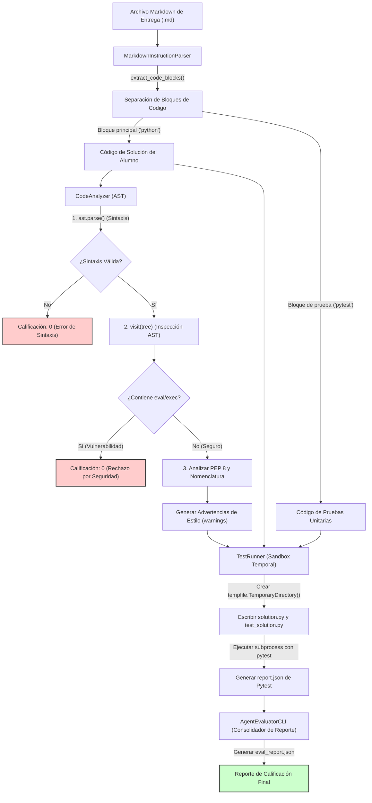

# Unidad 8: Proyecto Integrador - Desarrollo Agéntico y Lógica de Programación
## El Mini-Agente de Evaluación de Código (MAEC) para el Análisis y Calificación Automatizada

**Duración:** 3 semanas y media (21 horas)  
**Curso:** Lógica de Programación y Desarrollo Agéntico con IA  
**Institución:** Universidad de la Ciénega del Estado de Michoacán de Ocampo (UCEMICH)  
**Profesor:** Luis José Yudico Anaya  
**Carrera:** Ingeniería en Nanotecnología  
**Nivel:** Primer Semestre  

[](https://colab.research.google.com/github/Multiagent-AI-Lab/Programming-Logic-Agentic-AI-Development/blob/master/notebooks/UNIDAD_8_PROYECTO_INTEGRADOR.ipynb)

```python
import os
import sys

if 'google.colab' in sys.modules:
    repo_dir = "Programming-Logic-Agentic-AI-Development"
    if not os.path.exists(repo_dir):
        !git clone -q https://github.com/Multiagent-AI-Lab/{repo_dir}.git
    os.chdir(repo_dir)
    %pip install -q mcp fastmcp chromadb rich
```

---

## 1. Portada y Contexto Académico

*   **Institución:** Universidad de la Ciénega del Estado de Michoacán de Ocampo (UCEMICH)
*   **Trayectoria Académica:** Ingeniería en Nanotecnología / Licenciatura en Innovación Educativa / Ingeniería en Software
*   **Materia:** Lógica de Programación y Desarrollo Agéntico
*   **Unidad Temática:** Unidad 8 - Proyecto Integrador: Orquestación Agéntica y Evaluación Automatizada
*   **Objetivo de Aprendizaje:** Comprender la estructura y el funcionamiento de los agentes de software autónomos aplicados a la evaluación y validación de código. A través del diseño del Mini-Agente de Evaluación de Código (MAEC), los estudiantes de primer semestre experimentarán de forma práctica cómo los conceptos de análisis sintáctico abstracto (AST), sandboxing e integración de suites de pruebas dinámicas interactúan para automatizar tareas repetitivas de revisión técnica y de seguridad, sentando las bases del desarrollo agéntico moderno.

---

## 2. Contexto Conceptual e Importancia

En el desarrollo de software y la inteligencia artificial orientada a agentes, la **autoevaluación y la validación de código** son pilares fundamentales para garantizar la robustez, seguridad y fiabilidad del software autogenerado. Cuando un agente inteligente de IA genera código para resolver un problema científico o ingenieril (por ejemplo, modelar la dinámica de una nanopartícula), no basta con que el código "parezca" correcto; debe ser sometido a un riguroso proceso de verificación.

El paradigma del **Desarrollo Agéntico** propone que los programas no actúen como simples ejecutores lineales de instrucciones, sino como entidades capaces de percibir su entorno, tomar decisiones, ejecutar acciones y, crucialmente, **evaluar de forma autónoma el resultado de sus propias acciones** para corregir el rumbo (bucle de retroalimentación o *feedback loop*). En el ámbito educativo, esto permite a los estudiantes obtener una retroalimentación inmediata, precisa y sin sesgos humanos sobre sus entregas de programación.

### Análisis Estático frente a Análisis Dinámico

El Mini-Agente de Evaluación de Código (MAEC) implementa dos tipos complementarios de análisis:

1.  **Análisis Estático (Verificación Estructural e Inspección de Seguridad):**
    Consiste en examinar el código fuente sin ejecutarlo. Es análogo a corregir la gramática, ortografía y estructura de un ensayo literario. En programación, el análisis estático busca errores de sintaxis, violaciones de estándares de estilo (como el estándar PEP 8 en Python) y patrones de código potencialmente peligrosos (como inyecciones de comandos). Para realizar esto de forma robusta, el agente convierte el código plano en una estructura jerárquica de datos conocida como **Árbol de Sintaxis Abstracta (AST)**.
2.  **Análisis Dinámico (Validación del Comportamiento Funcional):**
    Consiste en ejecutar el programa en un entorno controlado para evaluar su comportamiento en tiempo de ejecución. Es equivalente a realizar un experimento químico en el laboratorio siguiendo un protocolo predefinido. En el software, esto se logra ejecutando pruebas unitarias mediante herramientas como `pytest`. Si el código del alumno arroja los resultados correctos ante diferentes entradas de prueba (incluyendo casos límite), se demuestra su validez matemática y lógica.

### Sandboxing e Integridad del Sistema

La ejecución de código ajeno (el código de un estudiante o el código generado de forma autónoma por una IA) presenta riesgos informáticos críticos. Un estudiante podría, intencionadamente o por error, escribir código que borre archivos del sistema, consuma toda la memoria RAM, o abra conexiones de red vulnerables. Por ello, el MAEC introduce el concepto de **Sandbox (Entorno de Aislamiento Temporal)**. Al ejecutar las pruebas unitarias dentro de directorios temporales efímeros y restringir las llamadas a librerías de sistema, el agente garantiza que cualquier falla catastrófica quede confinada y no afecte al servidor o máquina anfitriona.

---

## 3. Analogía Simplificada: El Profesor Asistente Robótico

Para comprender cómo funciona el MAEC, imaginemos el flujo de trabajo de un **Profesor Asistente de Laboratorio Robótico** que audita las bitácoras y experimentos de los alumnos de ingeniería en nanotecnología.

```
+---------------------------------------------------------------------------------+
|                       EL PROFESOR ASISTENTE ROBÓTICO                            |
+---------------------------------------------------------------------------------+
|                                                                                 |
|  1. EL OJO ESCÁNER (Parser de Markdown)                                         |
|     El robot toma la libreta de reportes del alumno y detecta las secciones    |
|     con tinta especial de código de producción y recetas de laboratorio.        |
|                                                                                 |
|  2. EL INSPECTOR DE SEGURIDAD (Analizador AST)                                  |
|     Antes de ir a los reactivos, el robot examina las fórmulas estáticamente.   |
|     ¿Hay ingredientes peligrosos no declarados (eval/exec)?                     |
|     ¿La nomenclatura y el formato están limpios y ordenados (PEP 8)?            |
|     * Si hay peligro, aborta el proceso de inmediato.                           |
|                                                                                 |
|  3. LA CAMPANA DE EXTRACCIÓN AISLADA (Runner de Pytest en TempDir)              |
|     Si las fórmulas son seguras, el robot coloca el experimento dentro de una   |
|     cabina sellada y desechable. Ejecuta las recetas y mide los resultados.     |
|     Si algo explota o falla, el daño queda contenido en la cabina.              |
|                                                                                 |
|  4. LA FICHA DE RETROALIMENTACIÓN (Reporte de Calificación)                     |
|     El robot escribe un reporte detallado con puntajes de estilo, seguridad,    |
|     y pruebas aprobadas, devolviendo la libreta al alumno para que itere.      |
|                                                                                 |
+---------------------------------------------------------------------------------+
```

### Paso 1: El Ojo Escáner (El Parser de Markdown)
El alumno entrega una libreta de laboratorio escrita en formato Markdown (`.md`). Esta libreta contiene explicaciones en texto plano de sus hipótesis y, en ciertas partes delimitadas por marcas específicas, contiene las instrucciones de programación y las pruebas unitarias. El Profesor Asistente Robótico activa su **Ojo Escáner** (el módulo `MarkdownInstructionParser`). Su única tarea en esta etapa es ignorar el texto conversacional y extraer de forma limpia únicamente los bloques que contienen el código ejecutable y las pruebas, separándolos adecuadamente.

### Paso 2: El Inspector de Seguridad y Calidad (El Analizador AST)
Antes de llevar el código del alumno a la zona de pruebas físicas, el robot realiza una inspección visual rigurosa.
*   **Filtro de Seguridad Crítico:** Busca sustancias altamente peligrosas o inestables. En Python, estas sustancias son funciones como `eval()` y `exec()`, que permiten ejecutar cualquier texto como si fuera código del sistema. Si el robot detecta estas funciones, activa una **alarma roja inmediata** y rechaza la tarea sin ejecutarla, protegiendo al laboratorio de posibles sabotajes o accidentes catastróficos.
*   **Auditoría de Limpieza (Estilo PEP 8):** Verifica que los instrumentos y fórmulas estén correctamente rotulados. Revisa si las variables y funciones siguen la convención de escritura en minúsculas separadas por guiones bajos (`snake_case`) y si las clases usan mayúsculas iniciales (`PascalCase`). Asimismo, vigila que las líneas de código no sean demasiado largas, asegurando la legibilidad. Si el estilo es sucio pero seguro, anota advertencias (tarjetas amarillas) pero permite que el código continúe al siguiente paso.

### Paso 3: La Campana de Extracción Aislada (El Runner de Pruebas en Sandbox)
Una vez que el código es declarado seguro estáticamente, el robot procede a probar su funcionamiento físico. Para evitar que un error lógico del alumno dañe el laboratorio principal, el robot monta una **cabina temporal de experimentos (Sandbox)**. Abre un maletín desechable (un directorio temporal en el disco duro), copia la solución del estudiante y el instructivo de pruebas allí dentro, y arranca la simulación (ejecuta `pytest`). Si el experimento funciona correctamente y cumple las expectativas, el robot valida la prueba. Al terminar, la cabina de extracción se desmonta y destruye por completo, borrando cualquier residuo del experimento.

### Paso 4: La Ficha de Retroalimentación (El Reporte Consolidado)
Finalmente, el asistente robótico compila todas sus observaciones (errores de seguridad, advertencias de estilo y pruebas funcionales superadas) en una **Ficha de Retroalimentación digital** (un archivo JSON estructurado). Este archivo es devuelto al estudiante, quien de inmediato puede ver en qué falló su código y realizar las correcciones necesarias antes de la evaluación humana definitiva.

---

## 4. Explicación Matemática y Teórica

Para fundamentar con rigor el comportamiento del Mini-Agente de Evaluación de Código, recurrimos a conceptos de la teoría de grafos, gramáticas libres de contexto y el modelado formal de funciones de evaluación.

### Representación Formal del Árbol de Sintaxis Abstracta (AST)

El código fuente de cualquier lenguaje de programación estructurado puede ser representado formalmente como un **Árbol de Sintaxis Abstracta (AST)**. Un AST es un grafo dirigido acíclico y conectado, definido matemáticamente como una tupla:

$$T = (V, E, r)$$

Donde:
*   $V$ es el conjunto de vértices o **nodos**, donde cada nodo $v \in V$ representa un constructo de programación (como una declaración de función, un ciclo `for`, una asignación de variable, una llamada a función o una constante).
*   $E \subset V \times V$ es el conjunto de **aristas dirigidas**, que representan la relación de anidamiento y jerarquía sintáctica entre los componentes. Si $(v_i, v_j) \in E$, significa que el nodo $v_j$ es un hijo directo del nodo $v_i$.
*   $r \in V$ es la **raíz del árbol**, que en este contexto representa el nodo del módulo o archivo de código completo (`ast.Module`).

### Modelado Matemático del Pipeline de Evaluación del Agente

Podemos modelar matemáticamente el comportamiento del MAEC como una función de evaluación compuesta. Sea $S$ la cadena de texto que contiene el código de solución del estudiante, y sea $P$ la cadena de texto con las pruebas unitarias.

#### 1. Verificación Estática de Seguridad
Definimos la función de seguridad sintáctica $\sigma(v)$ para cada nodo $v \in V$ del árbol sintáctico $T$ obtenido al parsear $S$ ($T = \text{ast.parse}(S)$):

$$\sigma(v) = \begin{cases} 
0 & \text{si } \text{type}(v) \in \{\text{ast.Call}\} \land \text{name}(v) \in \{\text{"eval"}, \text{"exec"}\} \\
1 & \text{en otro caso}
\end{cases}$$

El índice de seguridad global del código, $\Psi(T) \in \{0, 1\}$, se define como el producto lógico (conjunción) de las evaluaciones de seguridad de todos sus nodos individuales:

$$\Psi(T) = \prod_{v \in V} \sigma(v)$$

Si $\Psi(T) = 0$, el código contiene al menos una vulnerabilidad crítica y es rechazado de inmediato. Si $\Psi(T) = 1$, el código es seguro para ser ejecutado dinámicamente.

#### 2. Evaluación de Cumplimiento de Estilo (PEP 8)
Sea $W$ el conjunto de advertencias de estilo detectadas durante el recorrido del AST y el análisis de texto lineal (como nombres incorrectos y líneas que exceden los 79 caracteres recomendados). Definimos la penalización de estilo $\mu(W) \in [0, 1]$ en función del número total de líneas del archivo, $N_{\text{líneas}}$:

$$\mu(W) = \max\left(0, 1 - \gamma \cdot \frac{|W|}{N_{\text{líneas}}}\right)$$

Donde $\gamma \ge 0$ es un factor de penalización de escala (por defecto, $\gamma = 0.5$). Esta ecuación indica que a mayor cantidad de advertencias por línea de código, menor será la calificación de estilo del alumno, con un límite inferior de cero.

#### 3. Validación Dinámica de Pruebas Unitarias
Sea $P = \{p_1, p_2, \dots, p_n\}$ el conjunto de pruebas unitarias individuales que el runner intenta ejecutar en el sandbox. Definimos la función de resultado de prueba $\delta(p_i)$ para cada prueba $p_i \in P$:

$$\delta(p_i) = \begin{cases} 
1 & \text{si la ejecución de la prueba } p_i \text{ finaliza con éxito (Passed)} \\
0 & \text{si la prueba falla (Failed) o genera un error de ejecución (Error)}
\end{cases}$$

La tasa de éxito funcional $\eta(P) \in [0, 1]$ se define como la proporción de pruebas exitosas sobre el total de pruebas del conjunto:

$$\eta(P) = \frac{\sum_{i=1}^{n} \delta(p_i)}{|P|}$$

#### 4. Cálculo de la Calificación Consolidada Final
La calificación consolidada final, $Q(T, P) \in [0, 100]$, obtenida por el estudiante es calculada a través de la multiplicación del índice de seguridad por una combinación lineal ponderada de las evaluaciones estática y dinámica:

$$Q(T, P) = \Psi(T) \cdot \left[ w_s \cdot \mu(W) + w_d \cdot \eta(P) \right] \times 100$$

Donde:
*   $w_s$ es el peso asignado al cumplimiento de buenas prácticas de estilo (por ejemplo, $w_s = 0.20$).
*   $w_d$ es el peso asignado al correcto funcionamiento dinámico (por ejemplo, $w_d = 0.80$).
*   Los pesos satisfacen la restricción de normalización: $w_s + w_d = 1$.

> [!IMPORTANT]
> Observe que si la seguridad falla ($\Psi(T) = 0$), el término multiplicativo anula por completo la ecuación, dando como resultado una calificación $Q = 0$. Esto enseña al alumno de ingeniería que un código funcional pero inseguro o malicioso no es admisible en entornos de producción.

---

## 5. Arquitectura del Mini-Agente

El flujo de control y datos dentro del MAEC sigue una estructura modular y secuencial. El siguiente diagrama describe cómo los datos fluyen a través de cada uno de los componentes internos del agente:


<details>
<summary>Ver código fuente Mermaid (editable)</summary>



</details>

---

## 6. Desglose Paso a Paso de los Componentes

### 6.1. MarkdownInstructionParser
Este componente actúa como la interfaz de lectura del agente. Su propósito es parsear documentos escritos en lenguaje natural (Markdown) y filtrar las secciones de código que nos interesan.
*   **Mecanismo de funcionamiento:** Utiliza la librería `re` (expresiones regulares) de Python. El patrón de búsqueda clave es `r"```(\w*)\n(.*?)\n```"`. 
    *   ```` ``` ```` identifica el inicio del bloque de código.
    *   `(\w*)` representa el primer grupo de captura, encargado de identificar el lenguaje de programación especificado por el estudiante (por ejemplo, `python`, `pytest` o `python-test`).
    *   `\n` coincide con el salto de línea obligatorio después de la etiqueta del lenguaje.
    *   `(.*?)` es el segundo grupo de captura, el cual extrae el código fuente propiamente dicho. El sufijo `?` realiza una coincidencia "no codiciosa" (*non-greedy*), lo que garantiza que la expresión regular se detenga en el cierre de bloque de código más cercano y no capture múltiples bloques juntos.
    *   `re.DOTALL` es una bandera fundamental que le indica al motor de expresiones regulares que el carácter comodín punto `.` debe coincidir también con los saltos de línea `\n`, permitiendo capturar bloques de código de múltiples líneas de forma íntegra.

### 6.2. CodeAnalyzer (AST)
El analizador estático no ejecuta el código, sino que examina su morfología sintáctica. Hereda de `ast.NodeVisitor`, una clase de la biblioteca estándar de Python diseñada para recorrer el árbol sintáctico estructurado de forma jerárquica utilizando el patrón de diseño *Visitor*.
*   **`ast.parse`**: Toma la cadena de código y genera el árbol $T$. Si el código tiene un paréntesis abierto no cerrado o un error de indentación grave, esta función lanza una excepción `SyntaxError`, la cual es atrapada por el constructor para abortar la evaluación inmediatamente.
*   **`visit_Call`**: Este método es llamado automáticamente cuando el analizador encuentra un nodo del tipo `ast.Call` (una llamada a función). El analizador inspecciona el identificador de la función. Si este coincide con las palabras clave `"eval"` o `"exec"`, registra una violación crítica de seguridad en el vector de errores.
*   **`visit_Import` y `visit_ImportFrom`**: Se activan al detectar instrucciones `import` y `from ... import ...`. Su función es rastrear si el alumno está cargando módulos del sistema operativo (`os`, `sys`, `subprocess`, `shutil`). En un entorno educativo básico, estas importaciones no se prohíben por completo (para permitir el desarrollo de simulaciones), pero generan advertencias de seguridad en el reporte.
*   **`_check_line_lengths`**: Es un analizador de texto lineal simple que divide el código en líneas y verifica si la longitud de alguna de ellas supera el límite sugerido de 79 caracteres por la convención de estilo PEP 8.
*   **`_check_naming_conventions`**: Utiliza expresiones regulares para recorrer todos los nodos de definición de funciones (`ast.FunctionDef`) y de clases (`ast.ClassDef`). Comprueba que los nombres de las funciones estén escritos en minúsculas y guiones bajos (`snake_case`) y que las clases usen la notación de camello (`PascalCase`).

### 6.3. TestRunner
Una vez que el código es considerado sintácticamente válido y seguro, el control pasa al `TestRunner`, que se encarga de la validación dinámica en el Sandbox.
*   **`tempfile.TemporaryDirectory`**: Este bloque de contexto crea un directorio temporal seguro en el sistema operativo. Su gran ventaja pedagógica e informática es que garantiza la autodestrucción: al salir del bloque `with`, todo el directorio y los archivos creados en su interior son borrados físicamente del disco de forma automática, evitando la acumulación de archivos residuales.
*   **Aislamiento de Módulos (PYTHONPATH):** Cuando el código de pruebas ejecuta la instrucción `from solution import calcular_difusion`, Python necesita saber dónde encontrar el archivo `solution.py`. Para lograr que el entorno temporal sea el origen prioritario de importaciones, el runner modifica la variable de entorno `PYTHONPATH`, inyectando la ruta del directorio temporal al inicio de la lista de búsqueda de módulos de Python.
*   **`subprocess.run`**: Ejecuta `pytest` como un proceso hijo independiente del agente evaluador. Se le pasa el ejecutable de Python actual (`sys.executable -m pytest`), la ruta del archivo de pruebas temporal y el parámetro opcional `--json-report`, el cual genera un reporte estructurado en formato JSON. Se utiliza la bandera `check=False` para evitar que el agente aborte si una de las pruebas del estudiante falla; queremos capturar el fallo de forma controlada en nuestro reporte en lugar de interrumpir la ejecución del propio agente.

### 6.4. Reporte y Consolidación de Resultados
La clase coordinadora `AgentEvaluatorCLI` une todas las piezas. Toma los resultados del `CodeAnalyzer` y del `TestRunner`, y construye un único diccionario estructurado de resultados. Si el análisis estático arrojó errores críticos, el runner de pruebas no se ejecuta y se escribe un reporte con estado `rejected`. Si todo fue exitoso o solo hubo fallos lógicos en las pruebas, el estado se registra como `completed` o `failed_tests` respectivamente. Finalmente, este reporte se guarda en disco en formato JSON para que pueda ser consumido por otras herramientas o mostrado visualmente en una interfaz web.

---

## 7. Código de Producción Completo del Mini-Agente

A continuación se presenta el código fuente de producción del **Mini-Agente de Evaluación de Código (MAEC)**. El código incluye tipos estáticos definidos mediante anotaciones de tipo (`type hints`) y una amplia documentación interna que cumple con el estándar de documentación de Google.

```python
"""Mini-Agente de Evaluación de Código (MAEC) para el Proyecto Integrador.

Este módulo proporciona herramientas avanzadas para parsear archivos Markdown
de tareas entregadas por los alumnos, realizar un análisis estático basado en
Árboles de Sintaxis Abstracta (AST) para verificar buenas prácticas de estilo y
seguridad, y ejecutar suites de pruebas dinámicas con pytest bajo un entorno
aislado y controlado de sandbox en disco.
"""

import ast
import json
import os
import re
import subprocess
import sys
import tempfile
from typing import Dict, List, Any, Tuple, Optional


class MarkdownInstructionParser:
    """Clase encargada de parsear y extraer el código y las instrucciones de archivos Markdown.

    Analiza el archivo Markdown provisto, ignorando el texto explicativo y
    extrayendo de forma selectiva los bloques de código delimitados por triples acentos graves.

    Attributes:
        filepath (str): Ruta del archivo de entrada Markdown que contiene la solución.
    """

    def __init__(self, filepath: str) -> None:
        """Inicializa el parser con la ruta del archivo de instrucciones.

        Args:
            filepath (str): Ruta relativa o absoluta al archivo de entrega (.md).
        """
        self.filepath = filepath

    def read_instructions(self) -> str:
        """Lee el contenido completo del archivo de instrucciones Markdown.

        Returns:
            str: El contenido del archivo de texto Markdown en formato utf-8.

        Raises:
            FileNotFoundError: Si el archivo provisto no existe en la ruta indicada.
        """
        if not os.path.exists(self.filepath):
            raise FileNotFoundError(f"El archivo {self.filepath} no fue encontrado en el sistema.")
        with open(self.filepath, "r", encoding="utf-8") as file:
            return file.read()

    def extract_code_blocks(self) -> List[Tuple[str, str]]:
        """Extrae los bloques de código y sus lenguajes declarados del Markdown.

        Utiliza expresiones regulares no codiciosas en modo multilínea para
        capturar de manera ordenada la etiqueta del lenguaje y el cuerpo del código.

        Returns:
            List[Tuple[str, str]]: Una lista de tuplas conteniendo el lenguaje
            (por ejemplo, 'python' o 'pytest') y el código fuente correspondiente.
        """
        content = self.read_instructions()
        # Patrón regex que coincide con: ```lenguaje\n[código_fuente]\n```
        pattern = re.compile(r"```(\w*)\n(.*?)\n```", re.DOTALL)
        matches = pattern.findall(content)
        return [(lang.strip().lower(), code.strip()) for lang, code in matches]


class CodeAnalyzer(ast.NodeVisitor):
    """Analizador estático de código basado en AST (Abstract Syntax Tree).

    Recorre el árbol jerárquico de sintaxis para inspeccionar el cumplimiento
    de estilo PEP 8 y aplicar filtros estrictos contra código malicioso o no seguro.
    """

    def __init__(self, source_code: str) -> None:
        """Inicializa el analizador con el código fuente del estudiante.

        Args:
            source_code (str): Código Python plano que se someterá a análisis.
        """
        self.source_code = source_code
        self.errors: List[str] = []
        self.warnings: List[str] = []
        self._tree: Optional[ast.AST] = None

        try:
            self._tree = ast.parse(self.source_code)
        except SyntaxError as err:
            self.errors.append(f"Error de Sintaxis Crítico: {err.msg} en la línea {err.lineno}")

    def analyze(self) -> Dict[str, Any]:
        """Ejecuta todos los análisis estáticos sobre el árbol de sintaxis y el texto base.

        Returns:
            Dict[str, Any]: Un reporte del análisis estático con las claves:
                - 'pass' (bool): Verdadero si no se encontraron errores críticos de seguridad.
                - 'errors' (list): Mensajes descriptivos de fallas críticas.
                - 'warnings' (list): Sugerencias de mejora de estilo o advertencias menores.
        """
        if not self._tree:
            # Si falló la compilación del AST, retornamos el error de inmediato
            return {"pass": False, "errors": self.errors, "warnings": self.warnings}

        # Iniciar el recorrido jerárquico del AST invocando visit sobre el nodo raíz
        self.visit(self._tree)

        # Análisis basados en la estructura lineal del texto
        self._check_line_lengths()
        self._check_naming_conventions()

        is_passed = len(self.errors) == 0
        return {
            "pass": is_passed,
            "errors": self.errors,
            "warnings": self.warnings
        }

    def visit_Call(self, node: ast.Call) -> None:
        """Filtra y detecta llamadas a funciones del sistema extremadamente inseguras.

        Detiene el análisis estático y genera un error crítico si se detecta
        la invocación explícita de 'eval()' o 'exec()'.

        Args:
            node (ast.Call): Nodo del árbol que representa una llamada a función.
        """
        if isinstance(node.func, ast.Name):
            func_name = node.func.id
            if func_name in ("eval", "exec"):
                self.errors.append(
                    f"Seguridad (Crítico): Uso estrictamente prohibido de la función '{func_name}' "
                    f"en la línea {node.lineno}."
                )
        self.generic_visit(node)

    def visit_Import(self, node: ast.Import) -> None:
        """Detecta la importación directa de librerías del sistema operativo y subprocesos.

        Args:
            node (ast.Import): Nodo del árbol que representa la declaración de una importación.
        """
        for alias in node.names:
            if alias.name in ("subprocess", "os", "sys", "shutil"):
                self.warnings.append(
                    f"Seguridad (Advertencia): El código importa el módulo de sistema '{alias.name}' "
                    f"en la línea {node.lineno}. Asegúrese de no realizar llamadas destructivas."
                )
        self.generic_visit(node)

    def visit_ImportFrom(self, node: ast.ImportFrom) -> None:
        """Detecta la importación selectiva 'from ... import ...' de librerías de sistema.

        Args:
            node (ast.ImportFrom): Nodo del árbol que representa una importación selectiva.
        """
        if node.module in ("subprocess", "os", "sys", "shutil"):
            self.warnings.append(
                f"Seguridad (Advertencia): Importación desde módulo de sistema '{node.module}' "
                f"en la línea {node.lineno}."
            )
        self.generic_visit(node)

    def _check_line_lengths(self, max_length: int = 79) -> None:
        """Verifica que el código no exceda la longitud de línea recomendada por PEP 8.

        Args:
            max_length (int): Límite de caracteres permitidos por línea. Por defecto 79.
        """
        lines = self.source_code.splitlines()
        for idx, line in enumerate(lines, start=1):
            if len(line) > max_length:
                self.warnings.append(
                    f"PEP 8 (Estilo): La línea {idx} excede los {max_length} caracteres recomendados "
                    f"(longitud real: {len(line)})."
                )

    def _check_naming_conventions(self) -> None:
        """Inspecciona la nomenclatura de funciones y clases mediante convenciones de Python.

        Valida que las funciones sigan snake_case y las clases sigan PascalCase.
        """
        snake_case_pattern = re.compile(r"^[a-z_][a-z0-9_]*$")
        class_pattern = re.compile(r"^[A-Z][a-zA-Z0-9]*$")

        if not self._tree:
            return

        for node in ast.walk(self._tree):
            if isinstance(node, ast.FunctionDef):
                if not snake_case_pattern.match(node.name):
                    self.warnings.append(
                        f"PEP 8 (Estilo): El nombre de la función '{node.name}' (línea {node.lineno}) "
                        f"no sigue la convención recomendada de minúsculas snake_case."
                    )
            elif isinstance(node, ast.ClassDef):
                if not class_pattern.match(node.name):
                    self.warnings.append(
                        f"PEP 8 (Estilo): El nombre de la clase '{node.name}' (línea {node.lineno}) "
                        f"no sigue la convención recomendada PascalCase (CamelCase)."
                    )


class TestRunner:
    """Clase encargada de preparar y ejecutar suites de pruebas usando pytest en entornos aislados."""

    def __init__(self, student_code: str, test_code: str) -> None:
        """Inicializa el cargador de pruebas con los códigos fuente del estudiante y de la suite de pruebas.

        Args:
            student_code (str): Código fuente escrito por el estudiante.
            test_code (str): Código de pruebas unitarias escrito para verificar la entrega.
        """
        self.student_code = student_code
        self.test_code = test_code

    def run(self) -> Dict[str, Any]:
        """Ejecuta de forma aislada e independiente la suite de pruebas en un sandbox temporal.

        Crea un directorio temporal único en el sistema, escribe las soluciones, configura
        los paths de importación para aislar los módulos de Python y ejecuta pytest en un subproceso.

        Returns:
            Dict[str, Any]: Un diccionario que resume la tasa de aprobación de las pruebas:
                - 'success' (bool): Verdadero si se pasaron todas las pruebas sin errores.
                - 'passed' (int): Cantidad de casos de prueba aprobados.
                - 'failed' (int): Cantidad de casos de prueba fallidos.
                - 'total' (int): Total de casos de prueba ejecutados.
                - 'stdout' (str): Salida estándar devuelta por el proceso de pytest.
                - 'stderr' (str): Salida de error devuelta por el proceso de pytest.
        """
        with tempfile.TemporaryDirectory() as temp_dir:
            # Escribir el código del estudiante en el archivo solution.py dentro de la Sandbox
            student_file_path = os.path.join(temp_dir, "solution.py")
            with open(student_file_path, "w", encoding="utf-8") as f:
                f.write(self.student_code)

            # Escribir el código de pruebas en test_solution.py dentro de la Sandbox
            test_file_path = os.path.join(temp_dir, "test_solution.py")
            with open(test_file_path, "w", encoding="utf-8") as f:
                f.write(self.test_code)

            # Configuración de las variables de entorno para que Python busque módulos prioritariamente en el Sandbox
            env = os.environ.copy()
            env["PYTHONPATH"] = temp_dir + os.pathsep + env.get("PYTHONPATH", "")

            # Path para almacenar de forma estructurada los reportes JSON emitidos por pytest
            report_file_path = os.path.join(temp_dir, "report.json")
            
            # Comando CLI para ejecutar de forma programática pytest
            cmd = [
                sys.executable,
                "-m",
                "pytest",
                test_file_path,
                "--json-report",
                f"--json-report-file={report_file_path}",
                "-q"
            ]

            # Ejecución en un subproceso aislado
            result = subprocess.run(
                cmd,
                capture_output=True,
                text=True,
                env=env,
                check=False
            )

            # Procesamiento de report.json si fue generado con éxito
            if os.path.exists(report_file_path):
                with open(report_file_path, "r", encoding="utf-8") as rf:
                    report_data = json.load(rf)
                
                summary = report_data.get("summary", {})
                passed = summary.get("passed", 0)
                failed = summary.get("failed", 0)
                total = summary.get("total", 0)
                
                return {
                    "success": failed == 0 and total > 0,
                    "passed": passed,
                    "failed": failed,
                    "total": total,
                    "tests": report_data.get("tests", []),
                    "stdout": result.stdout,
                    "stderr": result.stderr
                }
            else:
                # Si la extensión pytest-json-report no está disponible, dependemos del código de retorno de la CLI
                success = result.returncode == 0
                return {
                    "success": success,
                    "passed": -1,
                    "failed": -1,
                    "total": -1,
                    "stdout": result.stdout,
                    "stderr": result.stderr,
                    "warning": "La extensión 'pytest-json-report' no está instalada. Usando el código de retorno básico."
                }


class AgentEvaluatorCLI:
    """Clase coordinadora principal que orquesta el pipeline de evaluación del Mini-Agente.

    Coordina la lectura del archivo, el análisis sintáctico de seguridad y estilo, la
    ejecución de pruebas y el guardado final del reporte consolidado de desempeño.
    """

    def __init__(self, task_file: str) -> None:
        """Inicializa el agente evaluador.

        Args:
            task_file (str): Ruta al archivo Markdown (.md) que contiene la entrega del estudiante.
        """
        self.task_file = task_file

    def execute_evaluation(self, output_report_path: str = "eval_report.json") -> Dict[str, Any]:
        """Ejecuta de manera coordinada el ciclo completo de autoevaluación agéntica.

        Args:
            output_report_path (str): Ruta de destino para almacenar el reporte de evaluación en JSON.

        Returns:
            Dict[str, Any]: Estructura consolidada con la calificación e historial del análisis.
        """
        print(f"[*] Iniciando evaluación automatizada sobre el archivo: {self.task_file}...")
        
        try:
            parser = MarkdownInstructionParser(self.task_file)
            blocks = parser.extract_code_blocks()
        except FileNotFoundError as err:
            return {"status": "error", "message": str(err)}

        # Separar el código fuente de la solución de las pruebas unitarias
        # Por convención pedagógica, 'python' denota código del alumno y 'pytest'/'python-test' denota pruebas.
        student_code_blocks = [code for lang, code in blocks if lang == "python"]
        test_code_blocks = [code for lang, code in blocks if lang in ("pytest", "python-test")]

        if not student_code_blocks:
            return {
                "status": "rejected",
                "message": "Error crítico: No se encontró ningún bloque de código de solución etiquetado como ```python."
            }
        if not test_code_blocks:
            return {
                "status": "rejected",
                "message": "Error crítico: No se encontró ningún bloque de pruebas unitarias etiquetado como ```pytest."
            }

        # Extraer el primer bloque representativo de cada tipo
        student_code = student_code_blocks[0]
        test_code = test_code_blocks[0]

        # Fase 1: Análisis Estático de Estilo y Seguridad
        analyzer = CodeAnalyzer(student_code)
        analysis_res = analyzer.analyze()

        # Fase 2: Cortocircuito de Seguridad. Si existen violaciones críticas (errors), rechazar el código de inmediato.
        if not analysis_res["pass"]:
            report = {
                "status": "rejected",
                "calificacion": 0.0,
                "analysis": analysis_res,
                "tests": {
                    "success": False,
                    "message": "Evaluación abortada debido a problemas de seguridad críticos detectados por el AST."
                }
            }
            self._save_report(report, output_report_path)
            return report

        # Fase 3: Evaluación Dinámica en Sandbox Seguro
        runner = TestRunner(student_code, test_code)
        test_res = runner.run()

        # Cálculo matemático formal de la calificación consolidada final (20% estilo, 80% pruebas unitarias)
        # Si no se pudo obtener el desglose del reporte, dependemos de si fue exitoso o no
        peso_estilo = 0.20
        peso_pruebas = 0.80
        
        # Evaluar la tasa de estilo: restamos una penalización por cada advertencia encontrada (0.02 por advertencia, máx penalización 1.0)
        cantidad_warnings = len(analysis_res["warnings"])
        calificacion_estilo = max(0.0, 1.0 - (0.02 * cantidad_warnings))
        
        # Evaluar la tasa de éxito de pruebas unitarias
        if test_res.get("total", 0) > 0:
            calificacion_pruebas = test_res.get("passed", 0) / test_res.get("total", 1)
        else:
            calificacion_pruebas = 1.0 if test_res.get("success", False) else 0.0

        calificacion_final = ((peso_estilo * calificacion_estilo) + (peso_pruebas * calificacion_pruebas)) * 100.0

        report = {
            "status": "completed" if test_res["success"] else "failed_tests",
            "calificacion": round(calificacion_final, 2),
            "analysis": analysis_res,
            "tests": test_res
        }
        self._save_report(report, output_report_path)
        return report

    def _save_report(self, data: Dict[str, Any], path: str) -> None:
        """Guarda el reporte JSON consolidado en el disco del sistema.

        Args:
            data (Dict[str, Any]): Datos estructurados del reporte de calificación.
            path (str): Ruta de destino en el sistema de archivos.
        """
        with open(path, "w", encoding="utf-8") as f:
            json.dump(data, f, indent=4, ensure_ascii=False)
        print(f"[+] Reporte de evaluación de MAEC guardado con éxito en: {path}")


if __name__ == "__main__":
    # Permite la ejecución directa del agente a través de la terminal o CMD
    if len(sys.argv) < 2:
        print("Uso sugerido: python UNIDAD_8_PROYECTO_INTEGRADOR.py <ruta_del_archivo_entrega.md>")
        sys.exit(1)
    
    evaluator = AgentEvaluatorCLI(sys.argv[1])
    evaluator.execute_evaluation()
```

---

## 8. Guía de Uso del Mini-Agente y Flujo de Trabajo en Nanotecnología

Para poner a prueba el funcionamiento del agente, el alumno debe estructurar su entrega utilizando la sintaxis de Markdown con etiquetas de bloques de código muy precisas. A continuación, se presenta un caso práctico para la materia de **Ingeniería en Nanotecnología**.

### Caso de Estudio: Coeficiente de Difusión de Stokes-Einstein

En nanotecnología, un cálculo común es determinar cómo se difunde una nanopartícula esférica en un fluido newtoniano. La fórmula de Stokes-Einstein está dada por:

$$D = \frac{k_B \cdot T}{6 \cdot \pi \cdot \eta \cdot r}$$

Donde:
*   $D$ es el coeficiente de difusión ($m^2/s$).
*   $k_B$ es la constante de Boltzmann ($1.380649 \times 10^{-23} \text{ J/K}$).
*   $T$ es la temperatura absoluta del medio ($K$).
*   $\eta$ es la viscosidad dinámica del fluido ($Pa \cdot s$ o $\text{kg}/(\text{m} \cdot \text{s})$).
*   $r$ es el radio hidrodinámico de la nanopartícula ($m$).

#### Ejemplo de Estructura de un Archivo de Entrega (`entrega_alumno.md`):

````markdown
# Entrega de Laboratorio de Nanotecnología - Alumno UCEMICH

En este laboratorio calculamos el coeficiente de difusión de nanopartículas utilizando la ecuación de Stokes-Einstein.

```python
def calcular_difusion(radio_nm: float, viscosidad: float, temperatura_k: float) -> float:
    """Calcula el coeficiente de difusión D utilizando Stokes-Einstein.

    Args:
        radio_nm: Radio de la nanopartícula en nanómetros.
        viscosidad: Viscosidad del fluido en Pascal-segundos (Pa*s).
        temperatura_k: Temperatura del sistema en Kelvin.
        
    Returns:
        Coeficiente de difusión en metros cuadrados por segundo (m^2/s).
    """
    # Constante de Boltzmann en el SI
    k_b = 1.380649e-23
    
    # Conversión del radio de nanómetros a metros (1 nm = 1e-9 m)
    radio_m = radio_nm * 1e-9
    
    # Aproximación del número Pi
    pi = 3.141592653589793
    
    # Ecuación de Stokes-Einstein
    difusion = (k_b * temperatura_k) / (6 * pi * viscosidad * radio_m)
    return difusion
```

A continuación se adjuntan las pruebas unitarias que el agente ejecutará dinámicamente en el Sandbox temporal:

```pytest
from solution import calcular_difusion
import math

def test_difusion_agua_ambiente():
    """Valida la difusión de una nanopartícula de 1 nm en agua a 298.15 K (viscosidad = 8.9e-4 Pa*s)."""
    d_esperado = 2.454238e-10  # m^2/s aproximado
    d_calculado = calcular_difusion(1.0, 0.00089, 298.15)
    
    # Validamos que el resultado sea numéricamente cercano considerando un margen de tolerancia
    assert math.isclose(d_calculado, d_esperado, rel_tol=1e-4)

def test_difusion_viscosidad_cero_raises_error():
    """Verifica el comportamiento lógico si la viscosidad del fluido es cero."""
    try:
        calcular_difusion(1.0, 0.0, 298.15)
    except ZeroDivisionError:
        assert True
    else:
        # Si no arrojó la excepción esperada, forzamos el fallo del caso
        assert False, "Se esperaba un ZeroDivisionError debido a viscosidad igual a cero."
```
````

#### Comando de Ejecución
El estudiante ejecuta el agente desde su consola de comandos:

```bash
python UNIDAD_8_PROYECTO_INTEGRADOR.py entrega_alumno.md
```

---

## 9. Suite de Pruebas Unitarias y de Integración de MAEC

La propia arquitectura del Mini-Agente MAEC debe probarse de manera exhaustiva para garantizar que su motor de análisis estático y dinámico funciona perfectamente y no genera falsos positivos. A continuación se presenta la suite de pruebas unitarias oficiales para el agente.

```python
"""Suite de Pruebas Unitarias y de Integración para el Agente MAEC.

Este script contiene las aserciones necesarias para probar de forma automatizada
que el extractor de bloques, el detector de vulnerabilidades de seguridad,
los checks de estilo PEP 8 y el runner dinámico se comporten de forma correcta.
"""

import pytest
import tempfile
import os
import json
from solution import MarkdownInstructionParser, CodeAnalyzer, TestRunner


def test_markdown_parser_extracts_correct_blocks() -> None:
    """Valida que el parser extraiga correctamente múltiples bloques con sus respectivos lenguajes."""
    documento_simulado = (
        "# Laboratorio Experimental\n"
        "Esta es la solución de producción:\n"
        "```python\n"
        "def calcular_area(radio):\n"
        "    return 3.1416 * radio ** 2\n"
        "```\n"
        "Y esta es la suite de pruebas asociada:\n"
        "```pytest\n"
        "def test_area():\n"
        "    assert calcular_area(1) == 3.1416\n"
        "```\n"
    )

    # Creamos un archivo temporal físico para simular la entrega del alumno
    with tempfile.NamedTemporaryFile(suffix=".md", delete=False, mode="w", encoding="utf-8") as temp_file:
        temp_file.write(documento_simulado)
        temp_filename = temp_file.name

    try:
        parser = MarkdownInstructionParser(temp_filename)
        blocks = parser.extract_code_blocks()
        
        # Validaciones de extracción
        assert len(blocks) == 2, "El parser no extrajo exactamente los dos bloques del archivo."
        assert blocks[0][0] == "python", "El lenguaje del primer bloque extraído debería ser 'python'."
        assert "calcular_area" in blocks[0][1], "El cuerpo del primer bloque no contiene la función esperada."
        assert blocks[1][0] == "pytest", "El lenguaje del segundo bloque extraído debería ser 'pytest'."
    finally:
        # Limpieza obligatoria del archivo temporal del sistema
        if os.path.exists(temp_filename):
            os.remove(temp_filename)


def test_code_analyzer_detects_unsafe_functions() -> None:
    """Prueba que el detector AST intercepte funciones maliciosas (eval y exec) y genere errores."""
    codigo_peligroso_eval = (
        "def ejecutar_calculo(formula):\n"
        "    return eval(formula)\n"
    )
    codigo_peligroso_exec = (
        "def ejecutar_sistema(comando):\n"
        "    exec(comando)\n"
    )

    # Analizando el caso de eval()
    analyzer_eval = CodeAnalyzer(codigo_peligroso_eval)
    reporte_eval = analyzer_eval.analyze()
    assert reporte_eval["pass"] is False, "El analizador debió rechazar el uso de la función eval()."
    assert any("eval" in err for err in reporte_eval["errors"]), "El error no menciona la función 'eval'."

    # Analizando el caso de exec()
    analyzer_exec = CodeAnalyzer(codigo_peligroso_exec)
    reporte_exec = analyzer_exec.analyze()
    assert reporte_exec["pass"] is False, "El analizador debió rechazar el uso de la función exec()."
    assert any("exec" in err for err in reporte_exec["errors"]), "El error no menciona la función 'exec'."


def test_code_analyzer_detects_style_warnings() -> None:
    """Verifica que el analizador reporte advertencias de estilo PEP 8 sobre nomenclatura sin rechazar el código."""
    codigo_estilo_inapropiado = (
        "def miFuncionMalNombrada(x):\n"
        "    return x * 2\n"
        "\n"
        "class mi_clase_incorrecta:\n"
        "    pass\n"
    )

    analyzer = CodeAnalyzer(codigo_estilo_inapropiado)
    reporte = analyzer.analyze()

    # No debe considerarse inseguro (pass debe ser True), pero debe poblar la lista de warnings
    assert reporte["pass"] is True, "El estilo inapropiado no debe invalidar la seguridad del código."
    assert len(reporte["warnings"]) >= 2, "Se esperaban al menos dos advertencias de estilo."
    assert any("miFuncionMalNombrada" in warn for warn in reporte["warnings"])
    assert any("mi_clase_incorrecta" in warn for warn in reporte["warnings"])


def test_test_runner_runs_and_passes() -> None:
    """Ejecuta una integración completa simulando el flujo del Runner sobre código correcto."""
    solucion_estudiante = (
        "def duplicar(n: float) -> float:\n"
        "    return n * 2.0\n"
    )
    pruebas_estudiante = (
        "from solution import duplicar\n"
        "def test_duplicar():\n"
        "    assert duplicar(5.0) == 10.0\n"
    )

    runner = TestRunner(solucion_estudiante, pruebas_estudiante)
    resultado = runner.run()

    # Si pytest-json-report está instalado en el entorno de desarrollo local
    if "warning" not in resultado:
        assert resultado["success"] is True, "Las pruebas debieron pasar con éxito."
        assert resultado["total"] == 1, "Debería reportarse un caso de prueba total."
        assert resultado["passed"] == 1, "Debería reportarse una prueba pasada."
        assert resultado["failed"] == 0, "No deberían existir pruebas fallidas."
    else:
        # Fallback en caso de que falte la dependencia en la máquina de ejecución
        assert resultado["success"] is True, "La ejecución básica debió reportar éxito en su returncode."
```

---

## 10. Síntesis y Resultados Pedagógicos

La implementación y el uso activo de MAEC en la materia de *Lógica de Programación y Desarrollo Agéntico* genera una serie de aprendizajes fundamentales:

1.  **Iteración Rápida:** Los estudiantes no tienen que esperar días a que un docente califique manualmente la sintaxis de su código. Pueden ejecutar el agente de forma local tantas veces como lo deseen, corrigiendo advertencias de estilo y errores lógicos de forma autónoma.
2.  **Responsabilidad en Seguridad:** Al bloquear el uso de `eval()` y `exec()`, los alumnos aprenden desde el primer semestre que la flexibilidad del código nunca debe comprometer la integridad y seguridad de la infraestructura tecnológica.
3.  **Comprensión Estructural del Código:** El estudio del análisis AST abre la mente de los alumnos para comprender que el código no es solo una secuencia de texto plano, sino una estructura de datos ordenada y jerárquica que una computadora interpreta geométricamente como un árbol.

---

## 11. Banco de Preguntas de Examen (15 Reactivos)

A continuación, se detalla un banco de 15 preguntas de examen diseñadas para evaluar los conocimientos teóricos y prácticos adquiridos en esta unidad. Cada reactivo incluye la clave correcta y la justificación didáctica y detallada tanto de la respuesta correcta como de los distractores.

---

### Reactivo 1
**Enunciado:** ¿Cuál es la función principal del Árbol de Sintaxis Abstracta (AST) en el análisis de código que realiza nuestro mini-agente?
*   A) Ejecutar el código en un entorno aislado temporal (sandbox).
*   B) Traducir el código de Python a lenguaje ensamblador de bajo nivel.
*   C) Representar la estructura jerárquica del código sin ejecutarlo para verificar seguridad y estilo.
*   D) Modificar automáticamente las variables mal nombradas por el alumno.

*   **Clave Correcta:** C
*   **Justificación Didáctica de la Opción Válida (C):** El AST descompone el código fuente escrito en texto plano en una estructura de árbol en memoria donde cada nodo es un componente sintáctico del lenguaje. Esto permite al agente recorrer la estructura buscando patrones específicos (como llamadas a funciones no deseadas o estructuras de control complejas) de manera lógica y sin necesidad de ejecutar las instrucciones.
*   **Justificación de los Distractores:**
    *   *Opción A:* Es incorrecta porque el aislamiento y ejecución dinámica del código es responsabilidad del componente `TestRunner` y la librería `tempfile`, no del análisis estático del AST.
    *   *Opción B:* Es incorrecta porque el AST no genera código de máquina o ensamblador; esa es una fase de traducción de los compiladores o intérpretes, mientras que aquí se utiliza únicamente para el análisis estático.
    *   *Opción D:* Es incorrecta porque el AST solo lee e inspecciona la estructura; no tiene lógica para modificar el código fuente entregado por el estudiante.

---

### Reactivo 2
**Enunciado:** Si el analizador estático detecta el uso de la función `eval()` en el código del estudiante, ¿cuál es el comportamiento diseñado en la arquitectura del MAEC?
*   A) Genera una advertencia de estilo y continúa ejecutando las pruebas unitarias.
*   B) Lanza un error crítico, interrumpe el flujo de evaluación (cortocircuito) y califica con cero.
*   C) Reemplaza automáticamente la función `eval()` por una asignación segura.
*   D) Envía el código al servidor central para que sea verificado manualmente.

*   **Clave Correcta:** B
*   **Justificación Didáctica de la Opción Válida (B):** La seguridad en sistemas agénticos es binaria y mandatoria. La función `eval()` es un riesgo crítico de seguridad ya que ejecuta cadenas de texto arbitrarias como código de Python, lo que permitiría inyecciones maliciosas. Por ello, el MAEC está diseñado para realizar un cortocircuito: si hay un fallo de seguridad, la evaluación se cancela de inmediato para proteger el sandbox y el host, asignando un cero.
*   **Justificación de los Distractores:**
    *   *Opción A:* Es incorrecta porque si el agente permitiera la ejecución de las pruebas ante un `eval()`, el código inseguro se ejecutaría dinámicamente en el subproceso de `pytest`, vulnerando el entorno seguro.
    *   *Opción C:* Es incorrecta porque el agente no tiene la capacidad de reescribir de manera autónoma la lógica del código del estudiante; su rol es auditar y calificar, no codificar.
    *   *Opción D:* Es incorrecta porque el agente está diseñado para operar localmente y de forma automatizada; no requiere intervención manual intermedia para dictaminar un fallo de seguridad evidente.

---

### Reactivo 3
**Enunciado:** En la expresión regular `r"```(\w*)\n(.*?)\n```"`, ¿qué función cumple el símbolo `?` colocado después de `.*`?
*   A) Indica que el bloque de código completo es opcional dentro del documento.
*   B) Vuelve la coincidencia "no codiciosa" (non-greedy), obligando al motor de búsqueda a detenerse en el primer cierre de comillas triples.
*   C) Permite que la expresión regular coincida con caracteres especiales como signos de interrogación.
*   D) Sirve para indicar que el bloque contiene comentarios del alumno.

*   **Clave Correcta:** B
*   **Justificación Didáctica de la Opción Válida (B):** De forma predeterminada, los cuantificadores en expresiones regulares como `.*` son codiciosos (*greedy*) e intentan emparejar la mayor cantidad de texto posible. Si una entrega tuviera varios bloques de código, un patrón codicioso uniría el inicio del primer bloque con el final del último bloque de la página, perdiendo el contenido intermedio. El uso de `.*?` limita la captura hasta el siguiente delimitador inmediato.
*   **Justificación de los Distractores:**
    *   *Opción A:* Es incorrecta porque el símbolo `?` de no codicia dentro de un grupo de captura no modifica la obligatoriedad del patrón completo de comillas triples.
    *   *Opción C:* Es incorrecta porque la búsqueda de caracteres especiales se realiza con caracteres de escape, no con un cuantificador de coincidencia restrictiva.
    *   *Opción D:* Es incorrecta porque los comentarios no son detectados ni filtrados por el operador de no codicia en la expresión regular.

---

### Reactivo 4
**Enunciado:** ¿Para qué se hereda de la clase `ast.NodeVisitor` al construir el componente `CodeAnalyzer`?
*   A) Para poder escribir el archivo estructurado JSON en el disco del sistema.
*   B) Para ejecutar pruebas unitarias a las funciones del estudiante.
*   C) Para aprovechar la infraestructura de Python que recorre secuencialmente todos los nodos del árbol sintáctico.
*   D) Para compilar el programa a lenguaje de bajo nivel.

*   **Clave Correcta:** C
*   **Justificación Didáctica de la Opción Válida (C):** La clase `ast.NodeVisitor` de Python implementa el patrón de diseño de software *Visitor*. Al heredar de ella, el desarrollador solo tiene que declarar métodos específicos como `visit_Call` o `visit_Import`. La clase padre se encarga de recorrer secuencialmente el árbol sintáctico y activar el método correspondiente en cuanto detecta el nodo de ese tipo.
*   **Justificación de los Distractores:**
    *   *Opción A:* Es incorrecta porque la escritura de reportes JSON se realiza mediante la biblioteca estándar `json` de Python y funciones de salida nativas, sin relación con los nodos del árbol.
    *   *Opción B:* Es incorrecta porque la ejecución dinámica de pruebas unitarias recae en la librería `pytest` y en el componente `TestRunner`.
    *   *Opción D:* Es incorrecta porque la compilación no se maneja mediante el recorrido del visitor; este se limita a analizar e inspeccionar los nodos del árbol sintáctico.

---

### Reactivo 5
**Enunciado:** ¿Cuál es el propósito pedagógico y de seguridad de inyectar rutas temporales en la variable de entorno `PYTHONPATH` dentro de la clase `TestRunner`?
*   A) Descargar librerías y dependencias externas de internet de manera oculta.
*   B) Indicar a la suite de pruebas dónde encontrar el módulo temporal de la solución del estudiante (`solution.py`) de manera aislada y controlada.
*   C) Ocultar el código del alumno para que el sistema operativo no pueda leerlo.
*   D) Acelerar el procesamiento del procesador matemático de la computadora.

*   **Clave Correcta:** B
*   **Justificación Didáctica de la Opción Válida (B):** Cuando el runner crea el sandbox en un directorio temporal del disco duro, escribe dos archivos: `solution.py` (código del estudiante) y `test_solution.py` (pruebas). Si no modificáramos `PYTHONPATH`, al ejecutar `pytest` e importar `solution`, Python buscaría en el directorio de trabajo actual y no encontraría la versión efímera escrita en el Sandbox, o bien podría importar una versión vieja residual. La modificación garantiza que Python priorice el directorio temporal.
*   **Justificación de los Distractores:**
    *   *Opción A:* Es incorrecta porque `PYTHONPATH` solo define las rutas de búsqueda locales de archivos y paquetes en el sistema de archivos del disco duro; no gestiona descargas web.
    *   *Opción C:* Es incorrecta porque inyectar una ruta en `PYTHONPATH` hace que el sistema operativo local localice el archivo más fácilmente, por lo que no tiene fines de encriptación u ocultamiento.
    *   *Opción D:* Es incorrecta porque la variable de entorno define ubicaciones en disco para el cargador de módulos, no tiene influencia en el rendimiento o la velocidad de procesamiento de hardware.

---

### Reactivo 6
**Enunciado:** Durante el análisis estático de nomenclatura, ¿qué advierte el agente si el alumno declara una clase llamada `calcular_difusion`?
*   A) No advierte nada, ya que las clases y funciones en Python comparten la misma convención de nombres.
*   B) Advierte que el nombre no sigue la convención PascalCase (CamelCase) recomendada por el estándar PEP 8 para clases.
*   C) Detiene la evaluación lanzando un error de seguridad crítico e impidiendo la ejecución de las pruebas.
*   D) Corrige el nombre automáticamente a `CalcularDifusion`.

*   **Clave Correcta:** B
*   **Justificación Didáctica de la Opción Válida (B):** De acuerdo con la guía oficial de estilo de Python (PEP 8), las clases deben nombrarse utilizando PascalCase (también conocido como CamelCase), donde cada palabra comienza con mayúscula y no se usan guiones bajos (ej. `CalcularDifusion`). El nombre `calcular_difusion` viola esta convención. El analizador AST detecta esto usando una expresión regular sobre el nombre del nodo `ast.ClassDef` y genera una advertencia en el reporte final.
*   **Justificación de los Distractores:**
    *   *Opción A:* Es incorrecta porque las clases y funciones sí tienen convenciones diferenciadas (las funciones usan `snake_case` y las clases `PascalCase`).
    *   *Opción C:* Es incorrecta porque las desviaciones de estilo no representan amenazas de seguridad directas. Por lo tanto, generan una advertencia (`warning`) pero no cancelan la ejecución de las pruebas.
    *   *Opción D:* Es incorrecta porque el MAEC es un auditor pasivo; no altera ni reescribe el código del estudiante.

---

### Reactivo 7
**Enunciado:** ¿Cuál es la diferencia metodológica fundamental entre el análisis estático y el análisis dinámico de código que realiza el MAEC?
*   A) El estático mide la velocidad de ejecución y el dinámico mide el tamaño del archivo en bytes.
*   B) El estático compila el código en Windows y el dinámico en sistemas Linux.
*   C) El estático examina el código fuente sin ejecutarlo para evaluar estructura y seguridad, mientras que el dinámico ejecuta el programa en un entorno controlado para evaluar su comportamiento lógico.
*   D) El estático es manual y el dinámico es completamente automatizado por el agente.

*   **Clave Correcta:** C
*   **Justificación Didáctica de la Opción Válida (C):** Esta es la distinción fundamental en las ciencias de la computación. El análisis estático usa el parseo del texto para entender la sintaxis del código de forma segura y preventiva. El análisis dinámico, por su parte, requiere instanciar el intérprete de Python en memoria y correr el programa con datos de entrada reales para verificar que resuelva de manera lógica el problema físico planteado.
*   **Justificación de los Distractores:**
    *   *Opción A:* Es incorrecta porque el tamaño físico del archivo no requiere análisis estático formal, y el análisis dinámico verifica lógica funcional y aserciones, no solo tiempos de ejecución.
    *   *Opción B:* Es incorrecta porque ambos tipos de análisis son multiplataforma y se ejecutan independientemente del sistema operativo utilizado por el estudiante.
    *   *Opción D:* Es incorrecta porque ambos análisis dentro de la arquitectura del MAEC están completamente automatizados dentro de los componentes del software agéntico.

---

### Reactivo 8
**Enunciado:** ¿Por qué es necesario el uso de un bucle de contexto `with tempfile.TemporaryDirectory() as temp_dir` en el `TestRunner`?
*   A) Para encriptar la solución del estudiante e impedir copias ilegales.
*   B) Para asegurar la creación de una carpeta en disco que se destruye automáticamente al finalizar las pruebas, evitando archivos basura.
*   C) Para saltarse las restricciones de permisos del sistema operativo.
*   D) Para simular un entorno web y conectarse a internet.

*   **Clave Correcta:** B
*   **Justificación Didáctica de la Opción Válida (B):** La ejecución recurrente de código de alumnos generaría cientos de archivos temporales en el servidor o computadora si se crearan de manera permanente en disco. El gestor de contexto de Python (`with`) garantiza que, sin importar si las pruebas pasan o si ocurre una excepción grave, el directorio temporal y sus contenidos sean removidos del sistema de archivos al concluir el bloque.
*   **Justificación de los Distractores:**
    *   *Opción A:* Es incorrecta porque los directorios temporales escriben código de Python plano en el disco; no aplican algoritmos de cifrado o encriptado sobre las soluciones.
    *   *Opción C:* Es incorrecta porque las APIs de directorios temporales operan dentro del esquema normal de permisos de usuario del sistema operativo; no otorgan privilegios adicionales de administrador.
    *   *Opción D:* Es incorrecta porque esta función maneja carpetas locales del disco duro y no tiene relación con el desarrollo de red o la simulación de servicios de internet.

---

### Reactivo 9
**Enunciado:** Al ejecutar `pytest` con `subprocess.run`, ¿cuál es la razón de establecer el parámetro `check=False`?
*   A) Impedir que el agente lance una excepción y aborte abruptamente si el código del alumno reprueba una de las pruebas unitarias.
*   B) Indicarle al sistema que no verifique si la sintaxis del programa tiene errores.
*   C) Desactivar la verificación de la firma digital de seguridad del sistema operativo.
*   D) Acelerar el procesamiento de los resultados de la suite de pruebas.

*   **Clave Correcta:** A
*   **Justificación Didáctica de la Opción Válida (A):** Por defecto, si llamamos a `subprocess.run(..., check=True)`, Python arrojará una excepción del tipo `CalledProcessError` si el proceso hijo devuelve un código de error distinto de cero. En `pytest`, si una prueba falla, el comando CLI retorna código `1`. Si usáramos `check=True`, la ejecución del propio agente fallaría catastróficamente. Al usar `check=False`, capturamos la salida y permitimos que el flujo continúe para generar el reporte de retroalimentación de manera controlada.
*   **Justificación de los Distractores:**
    *   *Opción B:* Es incorrecta porque la validez de la sintaxis se comprueba antes, en la fase del analizador de árbol sintáctico (AST).
    *   *Opción C:* Es incorrecta porque `subprocess` ejecuta procesos binarios en el espacio de usuario habitual y no interactúa con firmas de seguridad del Kernel o de criptografía corporativa.
    *   *Opción D:* Es incorrecta porque el parámetro `check` no altera los ciclos de reloj o la velocidad de ejecución de las instrucciones de la máquina.

---

### Reactivo 10
**Enunciado:** De acuerdo con la fórmula matemática del pipeline del agente, si un estudiante obtiene 100% de éxito en sus pruebas unitarias ($\eta(P) = 1.0$) pero incluyó un comando `eval()` en su código, ¿cuál será su calificación final en la escala de 0 a 100?
*   A) Obtendrá una calificación de 80, porque las pruebas representan el 80% de la nota.
*   B) Obtendrá una calificación de 90, ya que el evaluador promedia estilo y pruebas de forma ponderada.
*   C) Obtendrá una calificación de 0, ya que el índice de seguridad $\Psi(T)$ actúa como un multiplicador binario anulando la nota final.
*   D) Obtendrá una calificación de 50, debido a que el sistema penaliza la seguridad dividiendo la nota a la mitad.

*   **Clave Correcta:** C
*   **Justificación Didáctica de la Opción Válida (C):** Matemáticamente, la calificación consolidada está modelada por la ecuación $Q(T, P) = \Psi(T) \cdot \left[ w_s \cdot \mu(W) + w_d \cdot \eta(P) \right] \times 100$. Si el código contiene elementos prohibidos, el índice de seguridad $\Psi(T)$ toma el valor de $0$. Multiplicar cualquier término por $0$ anula el resultado completo del corchete. Esto enseña que la seguridad en el desarrollo de software agéntico no es opcional ni compensable.
*   **Justificación de los Distractores:**
    *   *Opción A:* Es incorrecta porque asume que el fallo de seguridad solo afecta una parte proporcional de la nota, cuando en la práctica invalida la solución completa debido a los riesgos que representa.
    *   *Opción B:* Es incorrecta porque asume un cálculo de promedio simple y pasa por alto el efecto de cortocircuito lógico del multiplicador de seguridad.
    *   *Opción D:* Es incorrecta porque el factor de seguridad no es una simple penalización de resta fija o división por dos, sino que actúa como una compuerta lógica AND restrictiva.

---

### Reactivo 11
**Enunciado:** En el contexto del desarrollo agéntico, ¿qué papel juega el "bucle de retroalimentación" (*feedback loop*) implementado por el MAEC?
*   A) Permite al docente cambiar las instrucciones del laboratorio en tiempo real desde internet.
*   B) Permite al estudiante ver los errores del analizador estático y dinámico para ajustar su código de forma iterativa antes de la entrega final.
*   C) Optimiza el uso de la memoria RAM del servidor apagando los procesos inactivos.
*   D) Envía correos automáticos al departamento escolar con las calificaciones de los alumnos.

*   **Clave Correcta:** B
*   **Justificación Didáctica de la Opción Válida (B):** La metodología ágil y agéntica depende de bucles iterativos cortos de retroalimentación. Al tener una herramienta local autónoma de evaluación, el alumno no entrega a ciegas y espera semanas por una nota. El estudiante ejecuta el agente, revisa los errores de seguridad/estilo y de las pruebas unitarias, modifica su código y vuelve a ejecutar el agente de inmediato. Esto fomenta el aprendizaje autónomo guiado por datos.
*   **Justificación de los Distractores:**
    *   *Opción A:* Es incorrecta porque las instrucciones de la práctica están codificadas en el archivo Markdown local y no son alteradas por el flujo de ejecución básico del agente.
    *   *Opción C:* Es incorrecta porque el bucle de retroalimentación describe una interacción de control de calidad educativa y de software, no tiene relación con la gestión física de memoria del hardware.
    *   *Opción D:* Es incorrecta porque el MAEC guarda un reporte de evaluación en formato JSON de forma local; no implementa integraciones de correo electrónico institucional.

---

### Reactivo 12
**Enunciado:** ¿Qué representa la función `generic_visit(node)` al final de los métodos `visit_Call` o `visit_Import` en el analizador sintáctico del MAEC?
*   A) Una función que borra las variables temporales creadas en el nodo actual.
*   B) Una llamada recursiva para garantizar que el analizador siga recorriendo los nodos hijos de la estructura sintáctica actual.
*   C) Una función que reporta a la consola las advertencias del analizador.
*   D) Un comando para forzar la compilación del código fuente del alumno.

*   **Clave Correcta:** B
*   **Justificación Didáctica de la Opción Válida (B):** Al anular los métodos de visita de `ast.NodeVisitor`, si omitiéramos llamar a `self.generic_visit(node)`, el visitor detendría su descenso en ese nodo específico del árbol sintáctico. Para asegurar que el recorrido recorra de forma recursiva a todos los descendientes lógicos de la estructura analizada, debemos invocar explícitamente `generic_visit` al final del método de análisis personalizado.
*   **Justificación de los Distractores:**
    *   *Opción A:* Es incorrecta porque la recolección de basura y liberación de variables en Python ocurre automáticamente y no requiere llamadas al analizador AST.
    *   *Opción C:* Es incorrecta porque el reporte y las advertencias se añaden a las listas `errors` y `warnings` usando métodos append internos, no a través de la visita genérica.
    *   *Opción D:* Es incorrecta porque no realiza ningún proceso de traducción de código o compilación a bajo nivel.

---

### Reactivo 13
**Enunciado:** ¿Cuál es la ventaja de estructurar la salida del agente en formato JSON en lugar de imprimir únicamente mensajes de texto en la consola de comandos?
*   A) Que los archivos JSON se ejecutan más rápido que los scripts de Python ordinarios.
*   B) Que la información estructurada permite que otros sistemas agénticos o interfaces web consuman los resultados automáticamente para procesar la calificación.
*   C) Que el formato JSON oculta y protege los datos contra ataques cibernéticos de inyección de código.
*   D) Que ahorra espacio físico en el disco duro del sistema operativo.

*   **Clave Correcta:** B
*   **Justificación Didáctica de la Opción Válida (B):** El formato JSON (JavaScript Object Notation) es un estándar de serialización de datos de texto estructurado. Al guardar los resultados de forma estructurada en un archivo `.json`, facilitamos que herramientas de gestión académica, plataformas web de educación (como Moodle) u otros agentes automáticos consuman la información de manera confiable, leyendo claves y valores específicos.
*   **Justificación de los Distractores:**
    *   *Opción A:* Es incorrecta porque un archivo JSON es un formato estático de datos y no contiene código ejecutable.
    *   *Opción C:* Es incorrecta porque JSON es texto plano estructurado y no provee mecanismos nativos de encriptación o de defensa criptográfica.
    *   *Opción D:* Es incorrecta porque la diferencia de almacenamiento entre una salida de consola de texto común y un archivo JSON estructurado es insignificante a nivel de hardware.

---

### Reactivo 14
**Enunciado:** ¿Qué sucedería si el alumno introduce un bucle infinito en el código de su solución durante la ejecución del `TestRunner`?
*   A) El analizador AST lo detecta estáticamente y lanza una advertencia de seguridad crítica.
*   B) El proceso del runner se quedará colgado indefinidamente a menos que se limite el tiempo de ejecución (timeout) en la llamada del subproceso.
*   C) Python cancelará la ejecución de manera automática transcurridos exactamente 5 segundos.
*   D) El sistema operativo apagará la computadora de forma preventiva.

*   **Clave Correcta:** B
*   **Justificación Didáctica de la Opción Válida (B):** El análisis estático del AST no puede predecir matemáticamente y con absoluta certeza si un código se detendrá o entrará en un bucle infinito (este problema fundamental en informática se conoce como el **Problema de la Parada** o *Halting Problem*). Por lo tanto, durante la validación dinámica en el `TestRunner`, el subproceso se quedará ejecutando el bucle del estudiante de forma indefinida consumiendo CPU, a menos que se añada un límite de tiempo (`timeout`) a la llamada de `subprocess.run`.
*   **Justificación de los Distractores:**
    *   *Opción A:* Es incorrecta porque el análisis del AST es estructural y no simula la ejecución en el tiempo, lo que le impide predecir el comportamiento dinámico de los bucles infinitos en el caso general.
    *   *Opción C:* Es incorrecta porque el intérprete de Python básico no tiene temporizadores por defecto para finalizar la ejecución de bucles a menos que el programador lo configure.
    *   *Opción D:* Es incorrecta porque los sistemas operativos multitarea modernos aíslan los procesos del espacio de usuario e impiden que una falla lógica de una aplicación apague el hardware físico de la máquina.

---

### Reactivo 15
**Enunciado:** Si en el código del estudiante se importa el módulo `os` pero no se utiliza ninguna función de este, ¿cuál es el diagnóstico emitido por el MAEC?
*   A) Se emite un error de seguridad crítico y se cancela la evaluación asignando una calificación de cero.
*   B) No se emite ninguna advertencia, ya que el analizador solo reporta el uso de funciones y no las importaciones.
*   C) El analizador AST (`visit_Import`) detecta la importación del módulo de sistema y emite una advertencia de estilo/seguridad, pero permite continuar con la ejecución de las pruebas.
*   D) El agente elimina de forma automática la línea `import os` del archivo.

*   **Clave Correcta:** C
*   **Justificación Didáctica de la Opción Válida (C):** En el diseño actual del MAEC, la simple importación de módulos como `os`, `sys` o `subprocess` es marcada como una advertencia (un warning) de seguridad en los métodos `visit_Import` y `visit_ImportFrom` del árbol AST, debido a los peligros potenciales que representan. Al ser solo una advertencia, la evaluación no se cancela inmediatamente (pass sigue siendo `True`) y el código continúa hacia las pruebas dinámicas.
*   **Justificación de los Distractores:**
    *   *Opción A:* Es incorrecta porque las importaciones no se catalogan como errores catastróficos que anulen la nota, a menos que se invoquen directamente funciones prohibidas como `eval` o `exec`.
    *   *Opción B:* Es incorrecta porque el analizador sí inspecciona e intercepta los nodos que corresponden a importaciones directas en el código fuente.
    *   *Opción D:* Es incorrecta porque el MAEC no realiza tareas de edición activa sobre los archivos entregados por los estudiantes del curso.

---

## 12. Rúbrica de Evaluación y Defensa Oral

El proyecto integrador se evalúa combinando la **Rúbrica Genérica de Laboratorio** (4 criterios × 4 niveles) y la **Rúbrica de Defensa Oral** (5 criterios × 4 niveles), ambas definidas en `RUBRICA_GENERAL.md`, junto con las **5 preguntas modelo** que debes preparar antes de la defensa. Ese documento también detalla la ponderación completa del semestre (35% labs, 25% exámenes, 20% defensa, 10%+10%).

Criterio adicional específico de Unidad 8:

| Criterio adicional | Insuficiente | En desarrollo | Competente | Sobresaliente |
| :--- | :--- | :--- | :--- | :--- |
| **Funcionamiento del MAEC** | El agente no ejecuta o no produce un reporte. | Ejecuta pero el reporte de calificación es incompleto o incorrecto. | Ejecuta correctamente y produce un reporte JSON consolidado y preciso. | Además maneja con robustez casos de entrega mal formados sin fallar (validación defensiva). |

---

## 13. Plantilla de README del Proyecto MAEC

Todo proyecto integrador debe incluir un `README.md` en la raíz del repositorio del alumno, siguiendo esta estructura mínima:

```markdown
# Proyecto Integrador — [Nombre del Alumno]
## Mini-Agente de Evaluación de Código (MAEC)

### Descripción
Breve resumen de qué hace tu implementación del MAEC y qué problema de
nanotecnología/ingeniería resuelve el código que el agente evalúa.

### Cómo ejecutar
\`\`\`bash
conda activate ia_logprog
python UNIDAD_8_PROYECTO_INTEGRADOR.py entrega_alumno.md
\`\`\`

### Estructura del repositorio
- `entrega_alumno.md`: archivo de entrega evaluado por el MAEC (ver formato en Sección 8).
- `maec.py`: código fuente del agente evaluador.
- `test_maec.py`: suite de pruebas unitarias del propio agente.
- `reporte_evaluacion.json`: salida generada por el MAEC tras evaluar la entrega.

### Uso de IA (obligatorio documentar, Unidades 7-8)
| Prompt utilizado | Qué generó | Qué corregí/audité |
| :--- | :--- | :--- |
| *(ejemplo)* "Genera una función que valide AST en busca de imports peligrosos" | Función `visit_Import` inicial | Corregí que no distinguiera `os.path` (seguro) de `os.system` (peligroso) |

### Resultados
Resumen de la calificación final obtenida y observaciones sobre el proceso.
```

---

## 14. Checklist de Entrega Pre-Defensa

Antes de presentar tu defensa oral, verifica cada punto:

- [ ] El código del MAEC ejecuta sin errores contra al menos un `entrega_alumno.md` de ejemplo.
- [ ] La suite de pruebas unitarias del MAEC (`test_maec.py`) pasa al 100%.
- [ ] El `README.md` sigue la plantilla de la Sección 13, incluyendo la tabla de prompts de IA documentados.
- [ ] El reporte JSON de evaluación se genera correctamente y es legible.
- [ ] Puedes explicar, sin apoyo de IA, cada función del código que entregaste.
- [ ] Revisaste las 5 preguntas modelo de `RUBRICA_GENERAL.md` y preparaste una respuesta para cada una.
- [ ] El repositorio de GitHub está actualizado con el historial de commits del desarrollo (no un solo commit final).
- [ ] Corriste `CodeAuditorAgent` y `EvaluatorAgent` sobre tu código final y revisaste sus hallazgos antes de entregar.

---

## 🛠️ Herramientas de esta Unidad

**TutorAgent** — resuelve tus dudas conceptuales sobre el contenido de esta unidad, citando la sección exacta de origen:

```python
import os
import sys
from pathlib import Path

if 'google.colab' in sys.modules:
    from google.colab import userdata
    for nombre_secreto in ("GEMINI_API_KEY", "GOOGLE_API_KEY"):
        try:
            os.environ["GEMINI_API_KEY"] = userdata.get(nombre_secreto)
            break
        except Exception:
            continue
    else:
        print(
            "⚠️ No se encontró el secreto GEMINI_API_KEY ni GOOGLE_API_KEY en Colab. "
            "Créalo en el ícono de llave 🔑 de la barra lateral izquierda "
            "(ver Unidad 0, sección 0.9)."
        )

from src.multiagent_core.tutor_agent import TutorAgent

tutor = TutorAgent(course_dir=Path("lecciones"))
print(tutor.ask("¿qué hace el MAEC cuando detecta un import peligroso en el código del alumno?"))
```

No requiere configuración adicional más allá de tu `GEMINI_API_KEY` (ver Unidad 0, sección 0.9).

### FlowchartAgent — visualiza el flujo de tu función

Pega tu propia función Python para ver su diagrama de flujo generado automáticamente:

```python
from src.multiagent_core.flowchart_agent import FlowchartAgent

agent = FlowchartAgent()
mi_codigo = """
def mi_funcion(x):
    if x > 0:
        return x * 2
    return 0
"""
print(agent.build_mermaid_flowchart(mi_codigo))
```

### CodeAuditorAgent y EvaluatorAgent — audita tu código antes de entregar

Corre tu propio código a través del auditor y el evaluador antes de entregarlo, para detectar problemas de estilo, seguridad, o saber tu calificación aproximada contra la rúbrica:

```python
from src.multiagent_core.code_auditor_agent import CodeAuditorAgent
from src.multiagent_core.evaluator_agent import EvaluatorAgent

mi_codigo = """
def calcular_area(radio):
    return 3.14159 * radio ** 2
"""

auditor = CodeAuditorAgent()
print(auditor.generate_report(mi_codigo))

evaluador = EvaluatorAgent()
resultado = evaluador.evaluate(mi_codigo)
print(resultado["retroalimentacion"])
```
